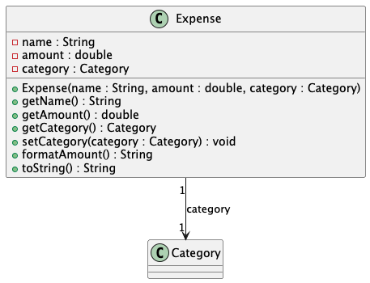
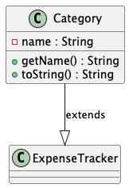
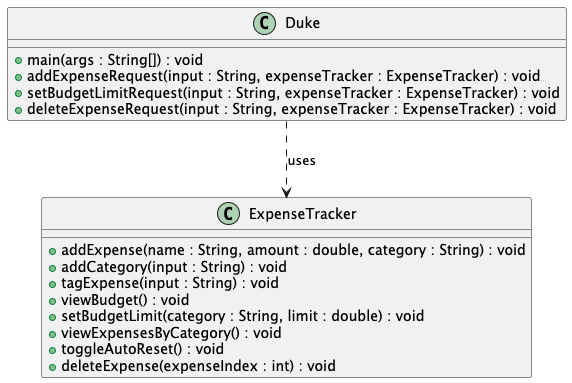

# Developer Guide for SpendSwift

## Acknowledgements
{List here sources of all reused/adapted ideas, code, documentation, and third-party libraries -- include links to the original source as well.}

## Design & Implementation
### Sequence Diagrams
#### add-expense

#### add-category

#### delete-expense

#### tag-expense

#### set-budget

#### view-budget

#### view-expenses

#### toggle-reset

### Class Diagrams
#### Budget class

#### Expense class

#### Category class

#### ExpenseTracker class

#### Duke class

**Version 2.0**

#### BudgetManager class

#### CategoryManager class

#### ExpenseManager class

#### TrackerData class

### UI Class

### Storage Class

### Format Class

### Category
#### Purpose
Represents a category for expenses.
#### Operations
- `getName()`: Returns the category name.
- `toString()`: Provides the string representation of the category.

### Expense
#### Purpose
Represents an individual expense within the system.
#### Operations
- `getName()`, `getAmount()`: Retrieve the expense's name and amount.
- `getCategory()`, `setCategory(Category)`: Manage the expense's category association.
- `formatAmount()`: Formats the expense amount for display.

### Budget
#### Purpose
Handle monetary constraints per category.
#### Operations
- `setLimit(double)`: Ensures limits are non-negative.
- `formatLimit(double)`: Formats the budget limit for display.

### ExpenseTracker
#### Purpose
Track and manage expenses and categories.
#### Operations
##### Adding Expenses and Categories
- `addExpense`: Adds an expense after verifying or creating the necessary category.
- `addCategory`: Adds a new category if it does not exist.

##### Monthly Budget Reset Functionality
- `toggleAutoReset`: Toggles automatic budget resets on or off.
- `checkAndResetBudgets`: Checks for a new month and triggers budget resets if enabled.
- `resetBudgets`: Resets all budgets to their predefined limits.

##### Viewing and Organizing Data
- `viewExpensesByCategory`: Displays expenses organized by categories.
- `viewBudget`: Displays budget limits and current expenditures for each category.

##### Modifying Data
- `deleteExpense`: Deletes an expense based on its index.
- `tagExpense`: Reassigns an expense to a different category based on user input.

### Duke
#### Purpose
Interface for command-line interactions.
#### Main flow
- The system starts and displays a greeting.
- Continuously processes user commands until "bye".
- Directly invokes methods from ExpenseTracker based on input.

## Product Scope
<!-- @@author glenda-1506 -->
### Target User Profile
SpendSwift is designed for budget-conscious individuals who prefer a simple, efficient way to track expenses and manage budgets using text commands.

### Value Proposition
SpendSwift provides a fast, text-based solution for managing finances, eliminating the complexity of traditional budgeting tools.

## User Stories
<!-- @@author glenda-1506 -->
| Version | As a... | I want to... | So that I can... |
|---------|---------|--------------|------------------|
| v1.0    | Budget-conscious user | Quickly log an expense using a typed command (e.g., add 50 groceries) | track my spending with easy input |
| v1.0    | Budget-conscious user | View my budget for all categories | see how much I could spend |
| v1.0    | Budget-conscious user | Set a monthly reset for my budget tracking | start each month fresh with my budgeting |
| v1.0    | Budget planner | View all my expenses | monitor what I have been spending on |
| v1.0    | Frequent user | Set a budget limit for each category (e.g., set budget 200 groceries) | limit my spending according to categories |
| v1.0    | Frequent user | Delete an expense entry (e.g., delete 5) | quickly correct mistakes |
| v1.0    | Frequent user | Categorize expenses (e.g., add category food) | customize my expense tracking to better manage my budget |

## Non-Functional Requirements
<!-- @@author mayfairmi6 -->
| ID  | Requirement      | Description                                          | Rationale                                             |
|-----|------------------|------------------------------------------------------|-------------------------------------------------------|
| 1   | Responsiveness   | The system should respond to user commands within 2 seconds. | Ensures efficient interaction and enhances user satisfaction. |
| 2   | Data Integrity   | The system must maintain accurate tracking and updating of financial entries. | Prevents discrepancies in financial reporting, ensuring reliability. |
| 3   | User Error Handling | The system should provide clear error messages and support easy correction of user inputs. | Facilitates management of entries and reduces user frustration. |
| 4   | Customizability  | Users should be able to easily add and modify expense categories. | Allows users to tailor the system to their specific needs. |
| 5   | Automated Tasks  | Support automated budget resets at the start of each month. | Minimizes user effort in maintaining accurate monthly tracking. |
| 6   | Accessibility    | The chat interface should be simple and intuitive.   | Ensures that all users can effectively interact with the system without extensive training. |

## Glossary
- **glossary item**: Definition

## Instructions for Manual Testing
{Provide instructions on how to conduct manual product testing, e.g., how to load sample data to be used for testing.}
