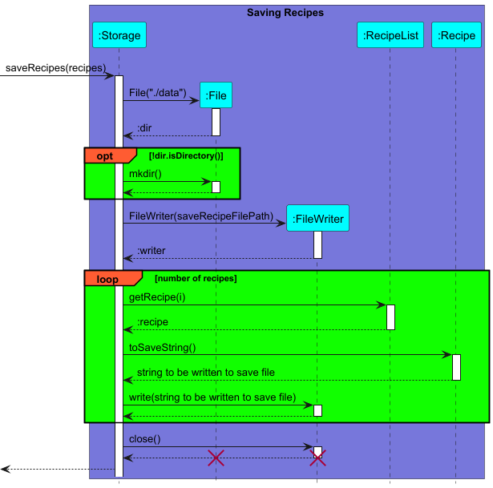
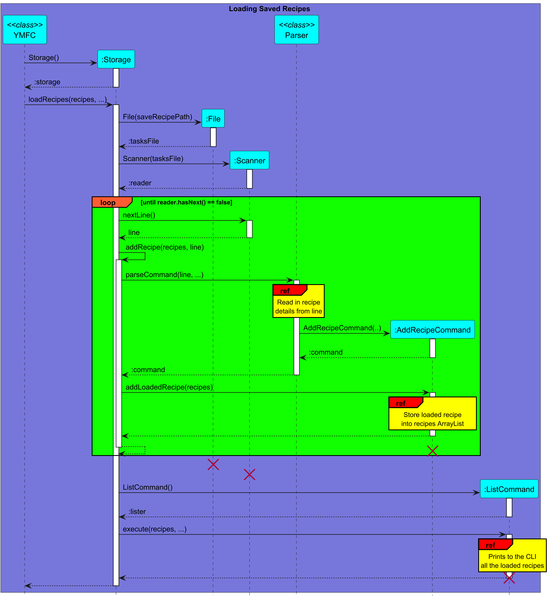

# Developer Guide

## Acknowledgements

{list here sources of all reused/adapted ideas, code, documentation, and third-party libraries -- include links to the original source as well}

## Design & implementation

{Describe the design and implementation of the product. Use UML diagrams and short code snippets where applicable.}

### Architecture

#### Main components of the architecture
`YMFC` (consisting of `YMFC` class) is in charge of app launch and shut down. 
- At app launch, it initialises the other components in the correct sequence, and connects them up with each other.

The bulk of the app's work is done by the following components:
- `UI`: The UI of the App. It handles user interaction, including reading commands and displaying responses.
- `Storage`: Reads data from, and writes data to, the hard disk. Responsible for loading and saving both recipes and ingredients.
- `Parser`: The command parser. It interprets user inputs, turning them into `Command` objects that are executed by the app. 
- `Command`: Represents actions that the user can perform, such as adding, deleting or listing recipes and ingredients.
- `RecipeList` and `IngredientList`: These manage collections of recipes and ingredients, respectively. 

Todo: Add sequence diagram to illustrate application start up flow and command execution flow. 

### Ui Class

### Recipe Class

### RecipeList Class

### Command Classes

### Parser Class
 
### Storage Class
The Storage class
- saves the User's added recipes to a .txt file
  - The following Sequence diagram shows how the saveRecipes() method in the Storage class
  saves all the created recipes into the .txt file

- reads the .txt save file to load in past saved recipes when app is launched
  - The following Sequence diagram shows how the loadRecipes() method in the Storage class
    loads in past saved recipes from the .txt file when the app is first launched
  

The Storage class also saves and loads the list of user's available ingredients to another .txt save file
The mechanisms with which it does so is highly similar to the 2 sequence diagrams above

## Product scope
### Target user profile

{Describe the target user profile}
Cooks who want to quickly search up recipes or get recipe suggestions based on their available ingredients

### Value proposition

{Describe the value proposition: what problem does it solve?}
Cooks these days have more recipes than they know how to handle, and our product will help them store, retrieve and search through their recipes with ease.
Prompts, tags and ingredients can be used to search a curated database, and recommend random recipes that closely match the criteria.

## User Stories

| Version | As a ...      | I want to ...                       | So that I can ...                                          |
|---------|---------------|-------------------------------------|------------------------------------------------------------|
| v1.0    | new user      | see list of available commands      | refer to them when I forget how to use the application     |
| v1.0    | constant user | see list of all my added recipes    | glance at all my recipes in one go                         |
| v2.0    | user          | sort my recipes by preparation time | find a recipe that I can cook within my current time limit |

## Non-Functional Requirements

{Give non-functional requirements}

## Glossary

* *glossary item* - Definition

## Instructions for manual testing

{Give instructions on how to do a manual product testing e.g., how to load sample data to be used for testing}
