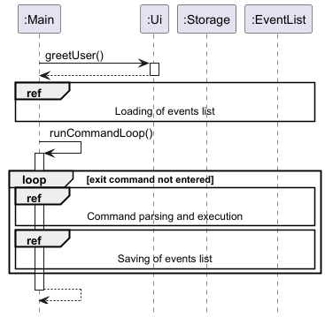

# Developer Guide

## Acknowledgements

{list here sources of all reused/adapted ideas, code, documentation, and third-party libraries -- include links to the original source as well}

## Design

The *Architecture Diagram* given above provides the high-level design of the application.

### Main components

The application comprises the following components:

* `Main`, which handles program startup and shutdown, and also interactions between other components.
* `UI`, which handles user input and showing messages to the user.
* `Storage`, which handles the loading and saving of data upon program startup and shutdown.
* `Parser`, which converts user input into commands.
* `Command`, which are executed to modify the data stored in the program.
* `EventList`, which stores the program's data.

### Interactions between components

The above *Sequence Diagram* shows how the different components of the system interact with one
another in the scenario when the command `add -e event -t 1200 -v venue` is executed.

## Implementation

This section describes some noteworthy details on how certain features are implemented.

### List feature[TBD]

The `list` feature allows users to view all scheduled events in the system. 
It is implemented in the `ListCommand` class, which extends the base `Command` class and formats the output to display all events. 
Internally, the `list` operation does not modify any data but simply retrieves and displays the information from `EventList`.

The `ListCommand` class performs the following key operations:

* ListCommand#execute() — Generates a formatted message displaying all events in the list.

These operations are accessible through the `Command` and can be invoked when the list command is entered by the user.

Given below is an example usage scenario and the behavior of the list feature at each step:

1. User Command Input:
The user enters the command `list` to view all scheduled events.

2. Command Recognition:
The `COMMAND_WORD` is set to "list", enabling the system to recognize the command input and invoke `ListCommand`.

3. Execution of ListCommand#execute():
The `execute()` method retrieves each event from `eventList` and appends it to a formatted output message.
It uses the `String.format` method with `LIST_MESSAGE` to include the total number of events in the message header.
Events are appended to `outputMessage` with numbered formatting for readability.

4. Output Generation:
The method stores the generated `outputMessage` in `this.message`, ready for display.

## Product scope
### Target user profile

The target user:

* has a need to organise a large number of events
* organises small-scale events, such that he is able to handle all matters on his own
* prefers typing to mouse interactions
* is comfortable using a command-line interface

### Value proposition

The user is able to organise and manage his events more quickly and efficiently than with a mouse/GUI app

## User Stories

| Version | As a ... | I want to ...            | So that I can ...                                      |
|---------|----------|--------------------------|--------------------------------------------------------|
| v1.0    | new user | see usage instructions   | refer to them when I forget how to use the application |
| v2.0    | user     | mark events as completed | easily track all past events                           |
| v2.0    | user     | mark participants present| know exactly who signed up but did not attend the event|

## Non-Functional Requirements

{Give non-functional requirements}

## Glossary

* *glossary item* - Definition

## Instructions for manual testing

{Give instructions on how to do a manual product testing e.g., how to load sample data to be used for testing}
