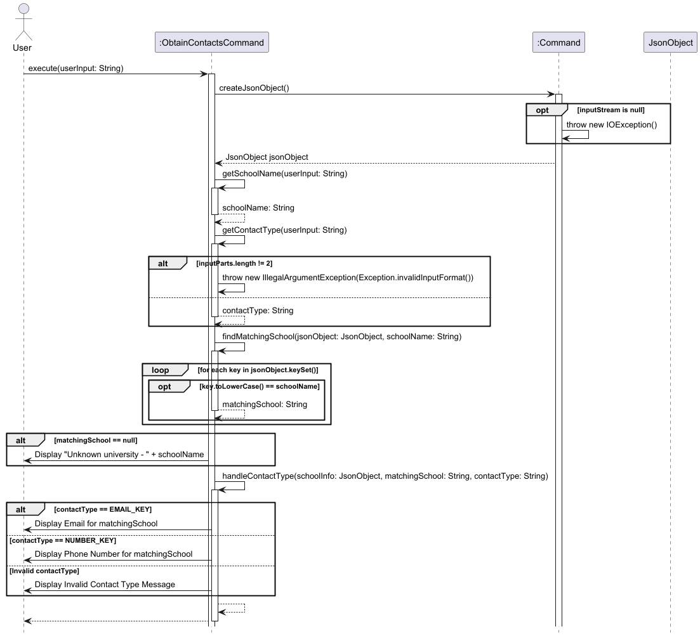
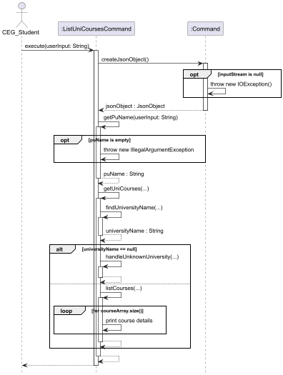

# Developer Guide

## Acknowledgements

### Database
* Adapted from NUS EduRec, data was collected manually as a collective effort from the team.

### Third Party Library Used

#### 'org.glassfish:javax.json:1.1.4'
* https://mvnrepository.com/artifact/org.glassfish/javax.json/1.1.4

#### 'javax.json:javax.json-api:1.1.4'
* https://mvnrepository.com/artifact/javax.json/javax.json-api/1.1.4

{list here sources of all reused/adapted ideas, code, documentation, and third-party libraries -- include links to the original source as well}
## Design

### Architecture
{TODO: Architecture Diagram}

### Class Diagrams
{TODO: Class Diagram}
{TODO: Object Diagram}

## Implementation

### 1. List Schools Command

#### Overview:
This command is responsible for displaying and retrieving the full list of universities
from `database.json` file. It helps the users to identify the possible choices in South East Asia
and Oceania.

#### How the feature is implemented:
* The `ListSchoolCommand` class extends `Command` class where it overrides the `execute` method for
  custom behaviour.
* The command first reads a JSON file to obtain the names via `createJsonObject()` method from the
  superclass.
* The `displaySchoolList()` method will iterate over the keys of the database which contains the University
  names, upon acquiring the keys, they will be printed over the CLI.
* There are also assertions and logging in place for error handling.
* Line Separator is used to ensure readability and ease of use for users.  

#### Why it is implemented that way:
* The `execute` method is essential and unique to every command class so inheritance was used. 
* Every method in the class remains maintainable and has one responsibility this allows easy debugging and
  refactoring.
* By using inheritance, new command classes can easily extend the functionality of existing ones
  which reducing redundancy in the code
* Logging and assertions helps the team of developers to follow through the command execution.

#### Alternatives considered:
* Reading of the `database.json` was tricky and other libraries were considered.
* Considered placing all the class methods inside the `execute` method but kept SLAP in mind to ensure 
  readability.

#### Sequence Diagram on PlantUML:

### 2. Filter Courses Command

#### Overview:
This command is responsible for displaying and retrieving the full list of mappable courses from the partner 
universities to a user specified NUS course from `database.json` file. It helps the users to identify whether
that NUS course is suitable to be mapped overseas in South East Asia and Oceania.

#### How the feature is implemented:
* The `FilterCoursesCommand` class extends `Command` class where it overrides the `execute` method for
  custom behaviour.
* The command first reads a JSON file to obtain the names via `createJsonObject()` method from the
  superclass.
* The `getNusCourseCode` method then extract out the user specified NUS course code from the input, which is in the
  format: `filter COURSE_CODE`.
* The NUS course code is then passed into the `displayMappableCourses()` method along with teh Json object. The method
  will iterate over the keys of the database which contains the University names, then obtain the array `courses`
  stored in the "courses" field. The `courses` array is then iterated over, for each course,
  if the value in the "nus_course_code" is equals to the NUS course code passed into the method, the university name and
  "pu_course_code" value of the course will be printed to the CLI.
* There are also assertions and logging in place for error handling.
* Line Separator is used to ensure readability and ease of use for users.

#### Sequence Diagram on PlantUML:

### 3. Obtain Partner University Email and Contact Number Command

#### Overview:
The command is responsible to retrieve the email contact and contact number data for a specified partner
university. It helps users to reach out to the partner universities for any enquiries about programs or
exchange opportunities.

#### How the feature is implemented:
* The `ObtainContactsCommand` class extends `Command` class where it overrides the `execute()` method for
  custom behaviour.
* The command first reads a JSON file to obtain the names via `createJsonObject()` method from the
  superclass.
* The `getSchoolName()` and `getContactType()` methods are used to parse the user input, extracting the requested 
  university name and contact type (email or phone number).
* After parsing, the `findMatchingSchool()` method identifies the correct university entry within the JSON data.
* The `handleContactType()` method retrieves and prints the requested contact information based on the input, 
  displaying either the university’s email address or phone number.
* There are also assertions and logging in place for error handling.

#### Why it is implemented that way:
* The `execute` method is essential and unique to every command class so inheritance was used.
* Every method in the class remains maintainable and has one responsibility this allows easy debugging and
  refactoring.
* By using inheritance, new command classes can easily extend the functionality of existing ones 
  which reducing redundancy in the code
* Logging and assertions helps the team of developers to follow through the command execution.

#### Alternatives considered:
* Reading of the `database.json` was tricky and other libraries were considered.
* Considered placing all the class methods inside the `execute` method but kept SLAP in mind to ensure
  readability.

#### Sequence Diagram on PlantUML:

### 4. List University Courses Command

#### Overview

This command is responsible for listing out all the mappable partner university’s (PU) courses and NUS courses. 
This allows users to plan their course mapping as it lists out all the possible courses they can map in a specified
partner university.

#### How the feature is implemented:
* The `ListUniCoursesCommand` class extends the `Command` class where it overrides the execute method for custom 
behaviour.
* The command first reads a JSON file to obtain the JsonObject containing the names of all the partner universities.
* The getPuName method then parses and extracts the PU name from the input (with the format of `set [PU_NAME]`.
* Next, the extracted PU name is passed into the `getUniCourses()` method which will search for the specified PU in the
JsonObject with `findUniversityName()`.
* If the university is not found, an exception `UnknownUniversityException` will be thrown.
* If the PU is found, the `listCourses()` will be called. Then `getUniversityObject()` and `getCourseArray()` methods
will be called to get the JsonObject containing the PU and the JsonArray containing the list of courses it offers.
* The two object will be passed into `iterateCourses()` method to iterate through the JsonArray `courseArray` which
contains the list of courses.
* It then prints out the course details such as PU course code and NUS course code through the `printCourseDetails()`
method.
* Assertions and logging are used for error handling.

#### Sequence on PlantUML:

{Describe the design and implementation of the product. Use UML diagrams and short code snippets where applicable.}

## Product scope
### Target user profile

* CEG students keen to go for SEP and need a clear and organised UI to see course mappings
* CEG students who want to plan their schools and courses to take 

### Value proposition

* CEG students can use ExchangeCourseMapper to expedite their for course mapping process by listing universities 
  and specific courses with their subject codes
* CEG students can easily filter by either NUS-coded modules or partner universities (PU) to quickly identify relevant course options.
* CEG students can easily load and save the saved courses in a data file for safekeeping
* The CLI interface provides an efficient experience for users focused on planning their SEP with precision.

## User Stories

| Version | As a ...     | I want to ...                                                   | So that I can ...                                |
|---------|--------------|-----------------------------------------------------------------|--------------------------------------------------|
| v1.0    | CEG students | see the possible Oceania and South East Asia partner university | see all my possible choices in those regions     |
| v1.0    | CEG student  | search for NUS courses to map                                   | search for related courses in PUs                |
| v1.0    | CEG student  | key in the school I want to go for exchange                     | view the available course offered by the school  |
| v2.0    | CEG student  | obtain the email address of the partner universities            | send an email should I have any queries          |
| v2.0    | CEG student  | obtain the contact number of the partner universities           | call the number should I have any urgent queries |

## Non-Functional Requirements

1. Access to a computer with Java 17 installed and an IDE that supports Java programming
2. A CEG Student in NUS planning to map out mainly BT/IS/EE/CS/CG-coded courses
{TODO: Add more} 

## Glossary

* *glossary item* - Definition

## Instructions for manual testing

{Give instructions on how to do a manual product testing e.g., how to load sample data to be used for testing}
