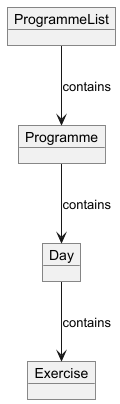
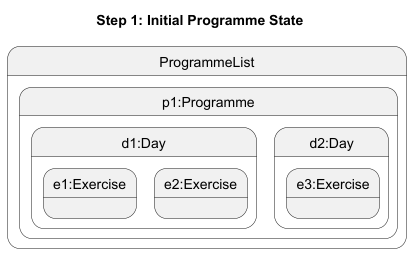
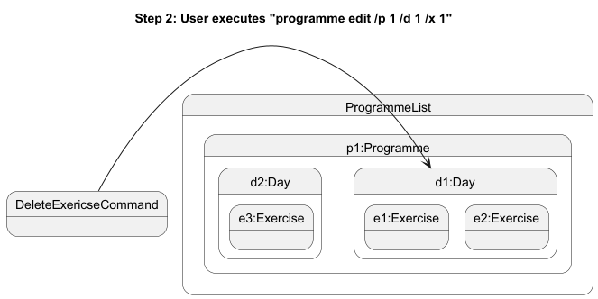
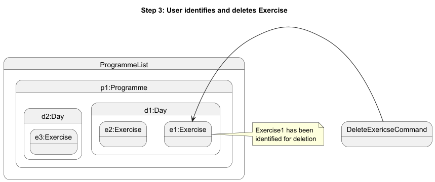
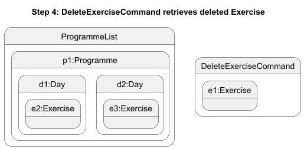

# Developer Guide

## Acknowledgements
We used these third party libraries to develop our application:
- Gson
- Mockito

## Design & implementation

### Edit Programme 
Edit Programme encompasses all functionality related to editing programme details. It is facilitated by the various
insert, delete and update functionality that is present in Programme, Exercise and Day respectively.

For reference, the following models how ProgrammeList and its various contained classes are structured.

Due to the nested nature of this data, all edit commands will traverse from ProgrammeList > Programme > Day > Exercise until
it reaches the necessary depth to accomplish the relevant operation.

These operations include:
- Adding or removing Days to the Programme
- Adding or removing Exercises to Days in the Programme
- Updating the details of Exercises in Days in the Programme

Given below is an example usage scenario for 'delete exercise' and how the edit programme functions at each step.

Step 1. The user creates a programme with a given number of Days with their respective Exercises. ProgrammeList will contain a reference to this programme after its creation.

Step 2. The user executes `programme edit /p 1 /d 1 /x 1` to delete the first exercise in the first day of the first programme. The programme first retrieves the given day with `ProgrammeList#getDay()`.

Step 3. With the Day object, it performs the `Day#deleteExercise()` with the given exercise ID

Step 4. The deleted Exercise object is then returned to the `DeleteExerciseCommand` to display as part of the CommandResult.

The overall design that enables this functionality is described generically by the following sequence diagram.

The 'Model' class in the above diagram is a generalization of the various data models that are being interacted with
to perform each specific edit command. For each edit command, the following sequence diagrams 
further break down how this interaction works.

#### Add/Remove day

#### Add/Remove exercise

#### Update exercise

## Product scope
BuffBuddy is a fitness tracking app that help you track workout, meals, water to aid you in achieving your body goals.
### Target user profile

Gym goers who need a quick way to create, manage and track their progress

### Value proposition

* Users will be able to quickly create, update and view their workout programmes
* Users will be able to track their progress as they progress on their fitness journey
* Users will be able to track water and calorie intake to better track their nutrition

## User Stories

| Version | As a ...               | I want to ...                                           | So that I can ...                                      |
|---------|------------------------|---------------------------------------------------------|--------------------------------------------------------|
| v1.0    | user                   | create a new workout plan/routine                       | tailor my workout to fit my needs                      |
| v1.0    | user                   | create a workout entry (input sets, weights, rep, time) | keep track of my progress                              |
| v1.0    | user                   | view my routine when I begin my workout                 | follow my plan more effectively                        |
| v1.0    | user                   | view their logged workout entry for a specific day      | see what they have done previously                     |
| v1.0    | user                   | delete a workout entry                                  | remove mistakenly created logs                         |
| v1.0    | user                   | delete a fitness routine if I no longer use it          | ensure my routines remain relevant and organized       |
| v1.0    | user                   | edit my existing fitness routine                        | further customize my routines after making them        |
| v2.0    | user                   | view a summary of my weekly workout activity            | measure my overall progress                            |
| v2.0    | user                   | track my personal bests for each exercise               | see improvements over time                             |
| v2.0    | user                   | log my body measurements                                | track calories burned/intake/gains more accurately     |
| v2.0    | nutrition-focused user | track calories burned during my workout                 | align my fitness routine with my dietary goals         |
| v2.0    | user                   | View body measurements over time                        | see the progress of their body                         |
| v2.0    | user                   | add a meal I just ate                                   | track my meals over time                               |
| v2.0    | user                   | delete a meal I ate                                     | delete a wrongly inputted meal                         |
| v2.0    | user                   | view my meals I ate on a certain date                   | see how much calories I have eaten                     |
| v2.0    | user                   | add my water intake                                     | track my water intake for each day                     |
| v2.0    | user                   | view my water intake                                    | see how much water I have consumed across days/week    |
| v2.0    | user                   | delete a water intake                                   | remove any mistakes made when inputting water intake   |
| v2.0    | user                   | set weekly/monthly exercise goals                       | to be accountable and motivate myself to stay on track |

## Non-Functional Requirements

* Java 11 or above installed
* Program built to support only single user

## Glossary

* *exercise* - Any exercise that can defined by a name, rep, set, weight and calories burned.
* *day* - A day is a collection of exercises meant to be done in one day
* *programme* - A programme is a weekly plan of workout days meant to be performed in rotation
 
## Instructions for manual testing

{Give instructions on how to do a manual product testing e.g., how to load sample data to be used for testing}
