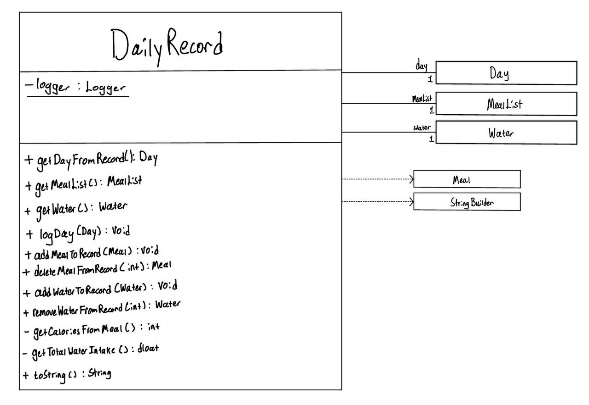
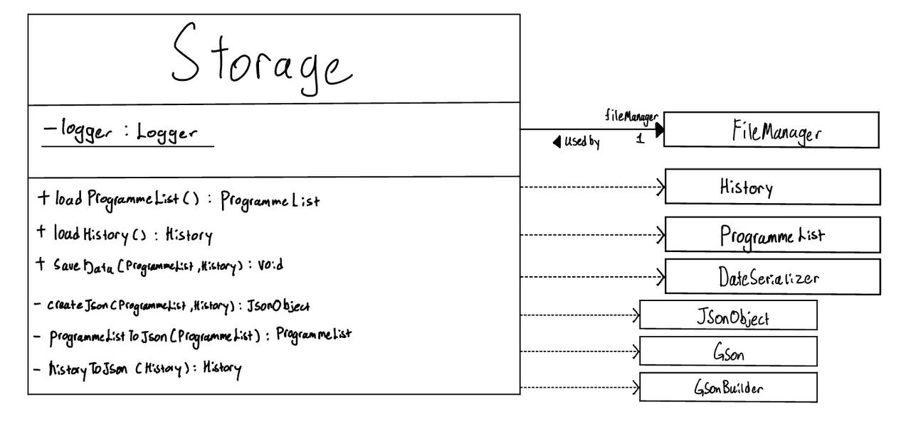
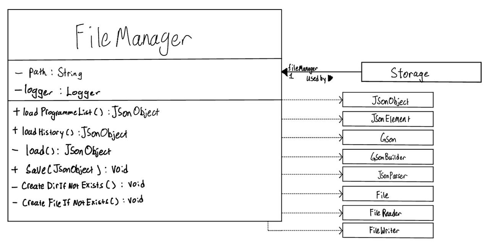
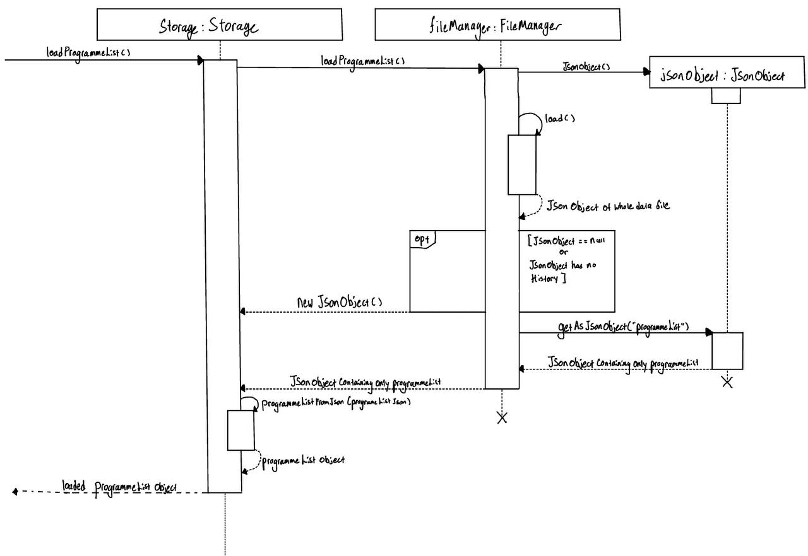
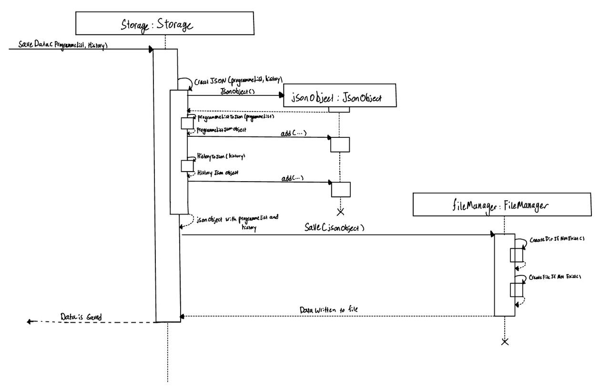

# Developer Guide

## Acknowledgements
We used these third party libraries to develop our application:
- Gson
- Mockito

## Design

### DailyRecord component
API: `DailyRecord.java`

The `DailyRecord` component,
- **Tracks daily workout, meals, and water intake:** The `DailyRecord` class maintains a log of the day’s activities, meals consumed,
  and water intake. It provides methods to add, update, and retrieve each of these records.
- **Encapsulates multiple data types:** `DailyRecord` works with various objects such as `Day` (for recording the workout programme),
  `MealList` (for managing a list of meals consumed), and `Water` (for tracking daily water intake). These components are stored and managed
  together within a single daily record.
- **Enables modification and deletion:** The class provides methods for adding meals and water to the record, updating the workout for the
  day, and removing items such as meals or water entries. Each modification is logged for traceability.
- **Calculates key daily statistics:** `DailyRecord` is capable of calculating the total calories burned from the recorded `Day` and the
  calories gained from the `MealList`. It can also sum the total water intake for the day.
- **Provides a comprehensive summary:** The class’s `toString()` method generates a detailed summary of the day’s activities, including
  calories burned, meals eaten, water consumed, and the caloric balance, making it easy to retrieve and display all relevant information in a readable format.


### Storage component
API: `Storage.java`

The `Storage` component,
- **Handles the saving and loading of both `ProgrammeList` and `History` data in JSON format:** The `Storage` component is responsible
  for serializing `ProgrammeList` and `History` objects into JSON format and passing them on to `FileManager`, as well as getting the
  data in Json format from `FileManager` and deserializing it into the appropriate objects when needed.
- **Serves as an adapter between `FileManager` and `BuffBuddy` classes:** `Storage` acts as an intermediary, translating between the JSON
  data handled by `FileManager` and the objects in the `BuffBuddy` application, ensuring seamless conversion between formats.
- **Relies on `ProgrammeList` and `History` from the Model component:** Since the `Storage` component is tasked with saving and retrieving
  the `ProgrammeList` and `History` objects, it ensures the data is accurately represented and stored.
- **Utilizes custom serializers:** To properly handle date formats and other specific needs, Storage makes use of custom serializers for
  objects like LocalDate from the `DateSerilazer` class, ensuring that these objects are correctly serialized to and deserialized from JSON.


### FileManager
API: `FileManager.java`

The `FileManager` component,
- **Manages the saving and loading of data:** The `FileManager` class is responsible for reading data from and writing data to the file
  specified by the user. It ensures that both the `ProgrammeList` and `History` data are stored in JSON format, and retrieves them when needed.
- **Handles file creation and directory management:** Before saving data, `FileManager` checks whether the necessary directories and
  files exist. If they do not, it creates them to ensure data can be stored correctly.
- **Leverages JSON for data structure:** `FileManager` uses `Gson` to serialize and deserialize JSON data, making it easy to work with
  structured data. It also ensures the data is formatted in a readable way using pretty printing for clarity.
- **Performs error handling and logging:** `FileManager` employs detailed logging to track the progress of saving and loading operations.
  If any issues arise during file operations (e.g., missing files, failed directory creation), they are logged, and exceptions are thrown to handle errors gracefully.


## Implementation

### Save/Load Feature

The save/load mechanism is handled by three main components: `Storage`, `FileManager`, and `DateSerializer`. `FileManager` manages file interactions, including reading from and writing to JSON data files, while `Storage` handles the conversion between JSON objects and `ProgrammeList`/`History` objects. The `DateSerializer` is used for converting `LocalDate` to/from JSON format.

#### FileManager implements the following key operations:
- **`FileManager#load()`**: Reads the data file into a `JsonObject`.
- **`FileManager#save(JsonObject data)`**: Writes the `JsonObject` containing all data back into the file.
- **`FileManager#createDirIfNotExist()`** and **`FileManager#createFileIfNotExist()`**: Ensure that the necessary directory and file exist before saving.

#### Storage converts JSON data into Java objects:
- **`Storage#loadProgrammeList()`**: Converts the `ProgrammeList` JSON data into a `ProgrammeList` object using `programmeListFromJson()`.
- **`Storage#loadHistory()`**: Converts the `History` JSON data into a `History` object using `historyFromJson()`.
- **`Storage#saveData()`**: Converts `ProgrammeList` and `History` into JSON using `createJSON()`, and passes it to `FileManager#save()`.

#### DateSerializer is responsible for:
- **`DateSerializer#serialize()`**: Converts `LocalDate` into `JsonElement`.
- **`DateSerializer#deserialize()`**: Converts `JsonElement` back into `LocalDate`.

These operations are exposed in the `Model` interface, allowing seamless saving and loading of `ProgrammeList` and `History` data.


### Flow of Operations
Given below is an example usage scenario and how the save/load mechanism behaves at each step.

**Step 1.** The user launches the application for the first time. A `Storage` object is initialized by `BuffyBuddy`, and it attempts to load data from
the file using `FileManager`. If no data file exists, `Storage` initializes an empty `ProgrammeList` and `History`.

**Step 2.** The user interacts with the application by adding programmes or logging workout activities and meals, modifying both the
`ProgrammeList` and `History`. These changes are stored temporarily in memory, but no data is saved to the file at this point.

**Step 3.** When the user chooses to exit the application, `Model#saveData()` is triggered, which in turn calls `Storage#saveData()`.
At this point, `Storage` converts the current `ProgrammeList` and `History` into JSON format using the `createJSON()` method and passes
the `JsonObject` to `FileManager#save()`.

**Step 4.** The `FileManager` saves the updated `JsonObject` to the data file, ensuring that the user's changes are preserved for the
next session. If necessary, `FileManager#createDirIfNotExist()` and `FileManager#createFileIfNotExist()` ensure that the correct directories
and files are in place before saving.

**Step 5.** The next time the user launches the application, `Storage#loadProgrammeList()` and `Storage#loadHistory()` are called, which
load the data from the file via `FileManager#load()`. The loaded data is then converted from JSON back into `ProgrammeList` and `History`
objects, restoring the user's previous session.

The following sequence diagram shows how a load operation for ProgrammeList goes through the Storage component:


The following sequence diagram shows how a save operation goes through the Storage component:



## WeeklySummary Feature

The Weekly Summary feature allows users to view a summary of their workouts for the current week. This functionality is achieved through a combination of several interconnected components, including `WeeklySummaryCommand`, `Parser`, `HistoryCommandFactory`, and `History`. Users can access this feature through the `history wk` command in the UI. The implementation follows a command pattern, combined with the factory pattern for command creation.

### Overview

The following components are crucial to the Weekly Summary feature:

1. **Parser Component**  
   The `Parser` interprets the initial command and directs the flow as follows:

    - **`Parser#parse(String)`**: Accepts the raw input string, splits it into the main command and arguments.
    - **`CommandFactory`**: Generates the appropriate command object based on the parsed input.
    - **`HistoryCommandFactory`**: Handles the creation of history-related commands, including `WeeklySummaryCommand`.

2. **WeeklySummaryCommand Component**  
   The `WeeklySummaryCommand` implements the `Command` interface and performs the following:

    - Extends the abstract `Command` class.
    - Uses the command word `"wk"`.
    - Executes by retrieving the weekly summary from the `History` object.
    - Returns a `CommandResult` that contains the formatted summary for display.

3. **History Component**  
   The `History` class manages workout data and provides:

    - **`getWeeklyWorkoutSummary()`**: Retrieves and formats the workout data for the current week.

### Flow of Operations

The following example illustrates the usage scenario and behavior of the Weekly Summary feature:

1. **Step 1**: The user enters the `"history wk"` command in the UI. The UI reads this command and passes it to the `Parser`.
2. **Step 2**: The `Parser` breaks down the command `"history wk"` into:
    - Main command: `"history"`
    - Subcommand: `"wk"`
3. **Step 3**: The `Parser` uses `CommandFactory`, which recognizes this as a history command and delegates to `HistoryCommandFactory`.
4. **Step 4**: `HistoryCommandFactory` identifies `"wk"` as the `WeeklySummaryCommand` trigger and creates a new `WeeklySummaryCommand` instance.
5. **Step 5**: The `WeeklySummaryCommand` is passed back through the chain to the UI, which then calls its `execute` method.
6. **Step 6**: During execution:
    - `WeeklySummaryCommand` calls `History`'s `getWeeklyWorkoutSummary()`.
    - The summary is formatted and wrapped in a `CommandResult`.
    - The UI displays the result to the user.

### Sequence Diagram


--- 


# Documentation, logging, testing, configuration, dev-ops
- Documentation guide (add link for these)
- Testing guide
- Logging guide


### Edit Programme 

#### Feature Implementation
Edit Programme encompasses all functionality related to editing programme details. It is facilitated by the various
insert, delete and update functionality that is present in Programme, Exercise and Day respectively.

For reference, the following models how ProgrammeList and its various contained classes are structured.


Due to the nested nature of this data, all edit commands will traverse from ProgrammeList > Programme > Day > Exercise until
it reaches the necessary depth to accomplish the relevant operation.

These operations include:
- Adding or removing Days to the Programme
- Adding or removing Exercises to Days in the Programme
- Updating the details of Exercises in Days in the Programme

Given below is an example usage scenario for 'delete exercise' and how the edit programme functions at each step.

Step 1. The user creates a programme with a given number of Days with their respective Exercises. ProgrammeList will contain a reference to this programme after its creation.


Step 2. The user executes `programme edit /p 1 /d 1 /x 1` to delete the first exercise in the first day of the first programme. The programme first retrieves the given day with `ProgrammeList#getDay()`.


Step 3. With the Day object, it performs the `Day#deleteExercise()` with the given exercise ID


Step 4. The deleted Exercise object is then returned to the `DeleteExerciseCommand` to display as part of the CommandResult.


The overall design that enables this functionality is described generically by the following sequence diagram.


The 'Model' class in the above diagram is a generalization of the various data models that are being interacted with
to perform each specific edit command. For each edit command, the following sequence diagrams 
further break down how this interaction works.


##### Add/Remove day


##### Add/Remove exercise


##### Update exercise


To summarize, the following activity diagram describes how the overall operation occurs.


#### Design Considerations

##### Chosen Approach: Hierarchical Command Pattern
The current implementation uses a hierarchical command pattern with factories where:
1. Commands traverse through ProgrammeList > Programme > Day > Exercise
2. Each level handles its own specific edit operations
3. Changes are propagated upwards through the hierarchy

**Key Benefits**
- **Encapsulation**: Each layer manages its own data and operations
- **Single Responsibility**: Each class handles only its specific level of edits
- **Extensibility**: Easy to add new edit operations at any level
- **Maintainability**: Changes to one level don't affect others

##### Alternative Approaches

**1. Direct Access Pattern**

Instead of traversing the hierarchy, directly access and modify the target object.

```java
class ProgrammeList {
    public Exercise getExercise(int progId, int dayId, int exerciseId) {
        return programmes.get(progId)
                        .getDays().get(dayId)
                        .getExercises().get(exerciseId);
    }
    
    public void editExercise(int progId, int dayId, int exerciseId, ExerciseDetails details) {
        Exercise exercise = getExercise(progId, dayId, exerciseId);
        exercise.update(details);
    }
}
```
Pros: 
- Simpler to implement
- Command calls will be "flattened" to only ProgrammeList class
- Fewer custom methods needed for edit operations

Cons:
- Violates encapsulation by exposing internal structure
- Complicates validation and error handling
- Reduces flexibility for future changes

**2. Visitor Pattern Approach**

Using a visitor pattern to traverse the hierarchy and perform edits.

```java
interface ProgrammeVisitor {
    void visitProgramme(Programme prog);
    void visitDay(Day day);
    void visitExercise(Exercise exercise);
}

class EditVisitor implements ProgrammeVisitor {
    private final EditDetails details;
    
    @Override
    public void visitExercise(Exercise exercise) {
        // Perform edit operation
    }
    // Other visit methods...
}
```
Pros:
- Reduces coupling between ProgrammeList components
- Easy to extend and maintain edit functionality
- Respects Separation of Concern by abstracting editing functionality to a separate file

Cons:
- Considered overkill for the fixed scope of the feature (unlikely to add any more types of edit operations)
- Complicates testing by requiring Mocks or Reflection
- Difficult to track operation flow 


# Create Programme Feature

## Feature Overview

The "Create Programme" feature enables users to build a structured fitness program with workout days, each containing specific exercises. This feature allows flexible customization, enabling users to plan their fitness goals in detail, including attributes such as the name, sets, reps, weight, and calories for each exercise.

## Programme Flow

1. **User Input and Command Handling**:
- Upon startup, BuffBuddy welcomes the user and continuously prompts for commands.
- The command input is read, parsed, and handled by `handleCommand`. If the user enters a valid command (e.g., `create`), it is executed, producing a `CommandResult`.

2. **Command Parsing and Execution**:
- `Parser.parse()` analyzes the user’s input to identify the command type and arguments.
- `CommandFactory.createCommand()` determines the specific command (e.g., `CreateCommand`) and forwards it to the relevant command factory (`ProgCommandFactory` for programme-related commands).

3. **Creating a Programme**:
- Within `ProgCommandFactory`, `prepareCreateCommand()` splits the input string by `/d` (indicating separate days) and `/e` (indicating exercises within each day).
- Each **Day** is parsed by `parseDay`, and each **Exercise** is created using `parseExercise`, which extracts details such as name, sets, reps, weight, and calories using flag parsing (`/n`, `/s`, `/r`, `/w`, and `/c` flags).
- The `CreateCommand` is then prepared with the programme name and its associated days.

4. **Inserting and Storing Programmes**:
- The `execute()` method of `CreateCommand` uses `ProgrammeList` to insert a new programme, which is then stored for future access and manipulation.
- `ProgrammeList.insertProgramme()` creates a `Programme` object and adds it to the list, ensuring it is available for subsequent commands (e.g., viewing, editing, or deleting).

5. **Execution Feedback**:
- A successful creation logs the programme details and returns a `CommandResult`, notifying the user of the new programme with its full structure.

This flow allows users to easily create structured workout routines, customizing their fitness journey directly within BuffBuddy.

The overall design that enables this functionality is described generically by the following sequence diagram.


## Implementation Details

### Architecture-Level Description

At the architecture level, this feature is part of the command-based structure in the BuffBuddy application, where user inputs are parsed into specific commands. Each command corresponds to a feature within the application. The "Create Programme" feature leverages several classes to manage nested structures (programmes, days, and exercises).

- **Classes Involved**:
  - `ProgrammeList`: Manages a collection of `Programme` objects.
  - `Programme`: Represents a complete fitness programme, containing multiple workout days.
  - `Day`: Represents a single workout day, which contains a list of exercises.
  - `Exercise`: Contains the properties of each exercise (name, sets, reps, weight, calories).

### Component-Level Description

The implementation is divided into several methods and classes to ensure modularity and separation of concerns. Key components include:

- **Command Handling**:
  - `handleCommand()`: Reads user input, determines the command type, and executes it.
  - `Parser.parse()`: Parses the user input string to identify the command and its arguments.
  - `CommandFactory.createCommand()`: Creates specific commands, such as `CreateCommand`, based on the parsed command string.

- **Creating a Programme**:
  - `ProgCommandFactory.prepareCreateCommand(String argumentString)`: Prepares a new programme by splitting the input string using `/d` as the delimiter for each day and `/e` for each exercise within a day.
  - `parseDay(String dayString)`: Parses each workout day and its exercises.
  - `parseExercise(String argumentString)`: Parses individual exercises with details (e.g., name, sets, reps, weight, calories) using flags (`/n`, `/s`, `/r`, `/w`, `/c`).

- **Programme Insertion and Execution**:
  - `ProgrammeList.insertProgramme(String programmeName, ArrayList<Day> days)`: Inserts the newly created programme into the list of existing programmes.
  - `CreateCommand.execute(ProgrammeList programmes, History history)`: Executes the programme creation command, adds the programme to the list, and logs the action.

## Reasoning for Implementation Choices

- **Modularity**: By separating the parsing logic into `parseDay` and `parseExercise`, the feature adheres to the single-responsibility principle. This modular design also makes it easier to maintain and test individual components.

- **Flag-Based Parsing**: The use of flags (e.g., `/n` for name, `/s` for sets) allows for flexible input handling and simplifies parameter extraction for each exercise. This approach enhances user input flexibility and reduces dependency on strict formatting.

- **Command Pattern**: The command pattern enables easy extension for other programme-related commands (e.g., `View`, `Edit`). This pattern allows BuffBuddy to handle multiple commands with minimal impact on other parts of the application, promoting scalability.

## Alternatives Considered

- **Flat Structure for Programme Details**: Initially, a flat structure was considered, where each exercise was directly tied to a programme without days. However, this approach lacked flexibility for users who may want to assign specific exercises to specific days. The current nested structure (Programme -> Day -> Exercise) was chosen for better organization.

- **JSON Input Parsing**: Another alternative was to use JSON format for user input, allowing for more complex data validation and structured parsing. However, this approach was deemed too complex for a command-line interface and would require users to follow strict formatting, reducing ease of use.

## Product scope
BuffBuddy is a fitness tracking app that help you track workout, meals, water to aid you in achieving your body goals.
### Target user profile

Gym goers who need a quick way to create, manage and track their progress

### Value proposition

* Users will be able to quickly create, update and view their workout programmes
* Users will be able to track their progress as they progress on their fitness journey
* Users will be able to track water and calorie intake to better track their nutrition

## User Stories

| Version | As a ...               | I want to ...                                           | So that I can ...                                      |
|---------|------------------------|---------------------------------------------------------|--------------------------------------------------------|
| v1.0    | user                   | create a new workout plan/routine                       | tailor my workout to fit my needs                      |
| v1.0    | user                   | create a workout entry (input sets, weights, rep, time) | keep track of my progress                              |
| v1.0    | user                   | view my routine when I begin my workout                 | follow my plan more effectively                        |
| v1.0    | user                   | view their logged workout entry for a specific day      | see what they have done previously                     |
| v1.0    | user                   | delete a workout entry                                  | remove mistakenly created logs                         |
| v1.0    | user                   | delete a fitness routine if I no longer use it          | ensure my routines remain relevant and organized       |
| v1.0    | user                   | edit my existing fitness routine                        | further customize my routines after making them        |
| v2.0    | user                   | view a summary of my weekly workout activity            | measure my overall progress                            |
| v2.0    | user                   | track my personal bests for each exercise               | see improvements over time                             |
| v2.0    | user                   | log my body measurements                                | track calories burned/intake/gains more accurately     |
| v2.0    | nutrition-focused user | track calories burned during my workout                 | align my fitness routine with my dietary goals         |
| v2.0    | user                   | View body measurements over time                        | see the progress of their body                         |
| v2.0    | user                   | add a meal I just ate                                   | track my meals over time                               |
| v2.0    | user                   | delete a meal I ate                                     | delete a wrongly inputted meal                         |
| v2.0    | user                   | view my meals I ate on a certain date                   | see how much calories I have eaten                     |
| v2.0    | user                   | add my water intake                                     | track my water intake for each day                     |
| v2.0    | user                   | view my water intake                                    | see how much water I have consumed across days/week    |
| v2.0    | user                   | delete a water intake                                   | remove any mistakes made when inputting water intake   |
| v2.0    | user                   | set weekly/monthly exercise goals                       | to be accountable and motivate myself to stay on track |


## Non-Functional Requirements

* Java 11 or above installed
* Program built to support only single user

## Glossary

* *exercise* - Any exercise that can defined by a name, rep, set, weight and calories burned.
* *day* - A day is a collection of exercises meant to be done in one day
* *programme* - A programme is a weekly plan of workout days meant to be performed in rotation
 
## Instructions for manual testing

{Give instructions on how to do a manual product testing e.g., how to load sample data to be used for testing}
