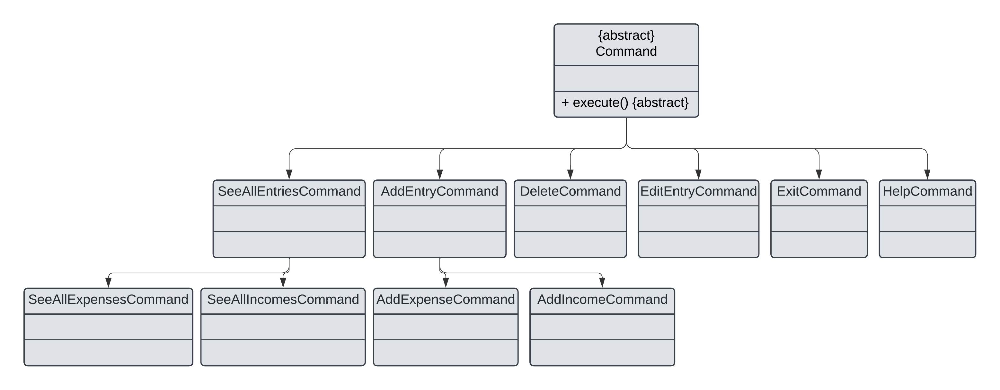

# Developer Guide

---
## Acknowledgements

No third-party code was used in this project.

---

## Design & implementation

The simplified UML class diagram below provides an overview of the classes and their interactions with each other. 


In the above diagram, Command and FinancialEntry are representative of the subclasses of 
the `Command` and `FinancialEntry` classes, which are elaborated on in their respective sections.

The high-level overview of the program is shown in the diagram below as well.


---
### Ui and Parser
<ins>Overview</ins>

The Ui component, `AppUi` manages user interactions by displaying messages and receiving input. 

The Parser component, comprising `DateParser` and `InputParser`, handles input parsing to interpret commands and dates entered by the user accurately

<ins>Implementation</ins>

- **Sequence Diagram**: Illustrates the flow of processing user input, from capturing input in `AppUi`, parsing it with `InputParser`, and validating date formats via `DateParser`.

Example when user starts the application and adds an expense


#### Ui Component

<ins>Overview</ins>

The `AppUi` class in the Ui component facilitates user interactions, including displaying start up messages, errors, and capturing input from users.

<ins>Class Structure</ins>

- **Attributes**:
  - `scanner`: `Scanner` — Reads user input from the console

<ins>Methods</ins>

- **AppUi()**: Constructor that initializes the `AppUi` instance and prepares the `Scanner` for reading user input.
- **displayWelcomeMessage()**: Outputs a startup message.
- **displaySetBudgetMessage()**:  Outputs set budget message.
- **getUserInput()**: Reads input from the user.
- **showUnknownCommandMessage()**: Notifies the user of an unrecognized command.
- **showErrorMessage(String message)**: Displays a specific error message.

<ins>Usage Example</ins>

```
AppUi ui = new AppUi();
ui.displayWelcomeMessage();
String userInput = ui.getUserInput();
ui.showUnknownCommandMessage();
```

<ins>Design Considerations</ins>

- **Future Extension**: Additional Ui features such as graphical interfaces or web-based interactions may be added to enhance user experience.

#### Parser Component
<ins>Overview</ins>

The Parser component includes `InputParser` and `DateParser`. `InputParser` processes user commands, while `DateParser` validates date string.

<ins>Class Structure</ins>

- **Attributes**:
  - `formatter`: `DateTimeFormatter` — Defines a date format for parsing.

<ins>Implementation Details</ins>

**InputParser**
- This method takes a raw input string, parses it, and returns a HashMap where keys represent the command and argument names, and values represent the argument contents.
- 

<ins>Methods</ins>

- **InputParser.parseCommands(String input)**: Breaks down commands and arguments.
- **DateParser.parse(String dateStr)**: Validates and converts date strings.

<ins>Usage Example</ins>

```
HashMap<String, String> commandArgs = InputParser.parseCommands("add /date 12/10/24 /amount 500");
LocalDate parsedDate = DateParser.parse("12/10/24");
```

<ins>Design Considerations</ins>

- **Future Extension**: To support more complex commands and argument parsing, the Parser component could introduce additional parsers, such as `CommandParser` and `ArgumentParser`, extending from an abstract base. Supporting alternative date formats in `DateParser` could enhance flexibility, accommodating user input from different locales or formats.

---
### Logic
<ins>Overview</ins>

The Logic component manages core functionalities in the application like adding, editing and deleting financial entries. 
It interacts with `FinancialList`, `AppUi` and `Storage`, and leverages command classes (`AddExpenseCommand`, `AddIncomeCommand`, etc.) to execute operations.

<ins>Class Structure</ins>

- **Attributes**:
  - `financialList`: `FinancialList` — Stores financial entries.
  - `ui`: `AppUi` - Manages user interactions.
  - `storage`: `Storage` - Handles data persistence

<ins>Class Structure</ins>

TThe Logic constructor initializes key components (FinancialList, AppUi, and Storage) to facilitate CRUD operations and manage interactions with users and stored data. 

<ins>Methods</ins>

- **Logic(FinancialList financialList, Storage storage, AppUi ui,  BudgetLogic budgetLogic)**: Constructor that initializes the `Logic` class with necessary components like financial list, storage, UI, and budget logic.
- **addExpense(double amount, String description, LocalDate date, Expense.Category category)**: Adds a new `Expense` to `FinancialList` specified or default category.
- **addIncome(double amount, String description, LocalDate date, Income.Category category)**: Adds a new `Income` to `FinancialList` specified or default category.
- **deleteEntry(int index)**: Removes an entry at a given index.
- **editEntry(int index, double amount, String description, String date, Enum<?> category)**: Updates an entry's amount, description, date and category.
- **listHelper(HashMap<String, String> commandArguments)**: Lists financial entries filtered by type (e.g., expenses, incomes) and date range based on command arguments.
- **printHelpMenu()**: Executes the help command to display the available commands and their usage to the user.
- **matchCommand(String command, HashMap<String, String> commandArguments)**: Matches a user command to the corresponding action, executes it, and determines if the application should continue running.
- **parseExpenseCategory(String categoryStr)**: Parses and returns the `Expense.Category` from a string, defaulting to `UNCATEGORIZED` if invalid.
- **parseIncomeCategory(String categoryStr)**: Parses and returns the `Income.Category` from a string, defaulting to `UNCATEGORIZED` if invalid.
- **parseCategory(String categoryStr, FinancialEntry entry)**: Determines the category type (Expense or Income) of a financial entry based on the category string and entry type.

<ins>Usage Example</ins>

```
FinancialList financialList = new FinancialList();
AppUi ui = new AppUi();
Storage storage = new Storage();

Logic logic = new Logic(financialList, ui, storage);
logic.addIncome(500.00, "Freelance Project", LocalDate.of(2023, 10, 27));
logic.seeAllEntries();

```

<ins>Design Considerations</ins>

- **Future Extension**: External APIs could be integrated in the future for features like currency conversion or market updates, making Logic an ideal candidate for adaptability.

---
### FinancialList and FinancialEntry
<ins>Overview</ins>

Managing financial entries through two main components:

- **FinancialList**: A centralized data structure that stores and manages entries. It provides CRUD (Create, Read, Update, Delete) operations to handle financial records, such as adding new entries and modifying or retrieving existing ones.
- **FinancialEntry**: An abstract base class representing a generic financial record. Subclasses include `Income` and `Expense`, which inherit shared attributes like `amount`, `description`, and `date`. Each with specific characteristics and categories that distinguish income from expenses.

<ins>Implementation</ins>
- **Class Diagram**: Displays the relationship between `FinancialList`, `FinancialEntry`, `Income`, and `Expense`. It highlights `FinancialList` as the main container managing `FinancialEntry` objects.
  - {Input Class diagram}
- **Sequence Diagram**: Illustrates the process of adding a new entry, from parsing user input to creating and adding the entry to `FinancialList`.
  - {input sequence Diagram}

#### FinancialList Component
<ins>Overview</ins>

The `FinancialList` component is the main data structure responsible for managing all financial entries, specifically `Income` and `Expense`.
It provides methods to **add**, **edit**, **delete**, and **retrieve** entries, serving as the application’s primary entry manager.

<ins>Class Structure</ins>

- **Attributes**:
  - `entries`: `ArrayList<FinancialEntry>` — Stores both `Income` and `Expense` instances.

<ins>Implementation Details</ins>

*Class Diagram*: Show `FinancialList` managing `FinancialEntry` objects (`Income` and `Expense` subclasses).

{input diagram here }

<ins>Class Structure</ins>

The `FinancialList` constructor initializes an empty list of entries to support CRUD operations. Key Arguments: None

<ins>Methods</ins>

- **addEntry(FinancialEntry entry)**: Adds a `FinancialEntry` object to `entries`.
- **deleteEntry(int index)**: Removes an entry at a specified index.
- **editEntry(int index, double amount, String description)**: Updates the `amount` and `description` of a specified entry.
- **getEntry(int index)**: Retrieves an entry by index.
- **getEntryCount()**: Returns the total count of entries.
- **getTotalExpenseByCategory()**: Calculates the total amount per expense category.
- **getHighestExpenseCategory()**: Retrieves the highest expense category and amount.


<ins>Usage Example</ins>

```
FinancialList financialList = new FinancialList();
Income income = new Income(500.00, "Freelance Project", LocalDate.of(2023, 10, 27), Income.Category.SALARY);
Expense expense = new Expense(50.00, "Groceries", LocalDate.of(2023, 10, 28), Expense.Category.FOOD);

financialList.addEntry(income);
financialList.addEntry(expense);

// Edit an entry
financialList.editEntry(1, 55.00, "Groceries & Snacks");

// Retrieve an entry
FinancialEntry entry = financialList.getEntry(0);
System.out.println("Description: " + entry.getDescription());
```

<ins>Design Considerations</ins>

- **Future Audit and History Management**: To improve traceability and accountability, `FinancialList` could maintain a history log of changes (e.g., edits, deletions, additions). This could support undo operations or provide users with an audit trail of modifications to their financial entries.
- **Security and Access Control**: Adding access control features to `FinancialList` could protect sensitive data. Methods for role-based access (e.g., view-only, edit permissions) could be introduced, along with data encryption for secure storage and retrieval.
---
#### FinancialEntry Component
<ins>Overview</ins>

`FinancialEntry` is an abstract base class that represents a generic financial record.
It defines shared attributes such as `amount`, `description`, and `date`, which are common across both `Income` and `Expense`.
`Income` and `Expense` inherit these properties and methods, each adding specific functionality related to its type.

<ins>Implementation</ins>

The class diagram above shows `FinancialEntry` as the base class with `Income` and `Expense` as specific implementations.
{input diagram here}

<ins>Class Structure</ins>
- **Attributes**:
  - `amount`: `double` — Represents the monetary value of the entry.
  - `date`: `LocalDate` — The date associated with the transaction.
  - `description`: `String` — A description identifying the entry.
  - `category`: An `Enum` - A value representing either Income.Category or Expense.Category, specifying the type of each entry.

<ins>Class Structure</ins>

The `FinancialEntry` constructor initializes `amount`, `description`, `date` and the subclasses setting their specific category. .

- **Key Arguments**:
  - `double amount`: Monetary value for the entry.
  - `String description`: Description or label for the entry.
  - `LocalDate date`: Date of the entry.
  - `Enum<?> category`: Represents the specific category for either income or expense.


<ins>Methods</ins>

- **Core Methods** (inherited by both `Income` and `Expense`):
  - `getAmount()`, `getDescription()`, `getDate()`, `getCategory()`: Accessor methods for each attribute.
  - `setAmount(double newAmount)`, `setDescription(String newDescription)`, `setDate(LocalDate newDate)`, `setCategory(Enum<?> category)`: Mutator methods for updating values.

- **Custom Methods for Income and Expense**:
  - **toString()**:
    - `Income`: Returns formatted string as `[Income] - description $amount (on date) [category]`.
    - `Expense`: Returns formatted string as `[Expense] - description $amount (on date) [category]`.
  - **toStorageString()**:
    - `Income`: Formats as `"I | amount | description | date | category"` for storage.
    - `Expense`: Formats as `"E | amount | description | date" | category` for storage.

<ins>Usage Example</ins>

The following code segment demonstrates the creation of `Income` and `Expense` entries:
```
Income income = new Income(500.00, "Freelance Project", LocalDate.of(2023, 10, 27), Income.Category.SALARY);
Expense expense = new Expense(50.00, "Groceries", LocalDate.of(2023, 10, 28),  Expense.Category.FOOD);

System.out.println(income.toString());
System.out.println(expense.toString());
```

<ins>Design Considerations</ins>
- **Abstract Base Class**: The design decision to make `FinancialEntry` abstract enables extensibility, allowing for new types of financial records without modifying `FinancialList` or existing subclasses.

---

### Commands

<ins>Overview</ins>

The abstract class `Command` has been implemented to introduce an additional layer
of abstraction between the `CommandHandler` class and command execution,
allowing for separation of handling command keywords and executing commands.

The diagram below shows the inheritance of the `Command` class. The diagram is only meant to show
the hierarchy of classes and have been greatly simplified.



<ins>Constructor</ins>

The `Command` constructor updates the attributes based on the input arguments.

<ins>Methods</ins>

The abstract `Command` class and its related children classes have the following method:

- *execute*: Effect the command based on the corresponding child class.

### Adding Entries

<ins>Overview</ins>

The feature to add entries is facilitated by the abstract class `AddEntryCommand`.
The `AddExpenseCommand` and `AddIncomeCommand` classes extend from the `AddEntryCommand`,
and are used to add expenses and incomes respectively.

<ins>Class Structure</ins>

The `AddEntryCommand` class has the following attributes:
- *amount*: An object representing the amount of money in the transaction.
- *description*: An object representing the description of the transaction.
- *date*: An object representing the date on which the transaction occurred.
- *category*: Specifies the category of the entry for income or expense.

The `AddExpenseCommand` and `AddIncomeCommand` classes inherit all attributes
from the `AddEntryCommand` class and have no additional attributes.

The `AddExpenseCommand` and `AddIncomeCommand` classes have the following method:
- *execute*

<ins>Implementation</ins>

The user invokes the command to add entries by entering the following commands:
- `expense [DESCRIPTION] /a AMOUNT [/d DATE] [/c CATEGORY]` for adding an expense
- `income [DESCRIPTION] /a AMOUNT [/d DATE] [/c CATEGORY]` for adding an income

This is parsed by the InputParser, returning a HashMap `commandArguments`, containing the
following arguments:
- `argument`: Represents the description of the entry. The value can be left blank.
- `/a`: Represents the amount of money in the transaction. This is a compulsory argument.
- `/d`: Represents the date on which the transaction occurred. If this argument is not used,
  the current date is used. An exception occurs if this argument is used but the value is left blank.
- `/c`: Category of the transaction, defaulting to UNCATEGORIZED if unspecified or invalid.

### Deleting Entries

<ins>Overview</ins>

The feature to delete entries is facilitated by the `DeleteCommand`. Both `Income` and `Expense`
entries can be deleted using this single command.

<ins>Class Structure</ins>

The `DeleteCommand` class has the following attribute:
- *index*: An integer representing the position of the entry in the financial list that is to be deleted.

The `DeleteCommand` class has the following method:
- *execute*: Removes the specified entry from the `FinancialList`.

<ins>Implementation</ins>

The user invokes the command to delete entries by entering the following command:
`delete INDEX`.

This command is parsed by the `InputParser`, returning a HashMap `commandArguments` containing the
following argument:
- `argument`: Represents the index of the entry in the financial list to be deleted.
  This is a compulsory argument.

When executed, the `DeleteCommand` removes the entry at the specified index from the `FinancialList`,
updating the list and storage.

### Editing Entries

<ins>Overview</ins>

The feature to add entries is facilitated by the `EditEntryCommand`. Both `Income` and `Expense`
can be edited using this one class.

<ins>Class Structure</ins>

The `EditEntryCommand` class has the following attributes:
- *index*: An object representing the index of the entry in the full financial list.
- *amount*: An object representing the amount of money used in the transaction.
- *description*: An object representing the description of the transaction.
- *date*: An object representing the date on which the transaction occurred.
- *category*: New category of the transaction.

The `EditEntryCommand` class has the following method:
- *execute*

<ins>Implementation</ins>

The user invokes the command to add entries by entering the following command:
`edit INDEX [/des DESCRIPTION] [/a AMOUNT] [/d DATE] [/c CATEGORY]`.

This is parsed by the InputParser, returning a HashMap `commandArguments`, containing the
following arguments:
- `argument`: Represents the index of the entry in the full financial list.
  This is a compulsory argument.
- `/des`: Represents the description of the transaction. This is an optional argument.
- `/a`: Represents the amount of money used in the transaction. This is an optional argument.
- `/d`: Represents the date on which the transaction occurred. This is an optional argument.
- `/c`: Represents the category used in the transaction. If an invalid category is provided, the entry will default to UNCATEGORIZED. This is an optional argument.

### Listing Entries
<ins>Overview</ins>

The list entries feature is facilitated by the `SeeAllEntriesCommand` class.
The classes `SeeAllExpensesCommand` and `SeeAllIncomesCommand` extend from `SeeAllEntriesCommand` 
and facilitate listing out expenses and incomes respectively.

<ins>Class Structure</ins>

The `SeeAllEntriesCommand` class has the following key attributes:

- _start_: The starting date from which Financial Entries are to be listed. `null` if there is no starting date.
- _end_: The ending date up to which Financial Entries should be listed. `null` if there is no ending date.

The `SeeAllExpensesCommand` and `SeeAllIncomesCommand` classes inherit these attributes from `SeeAllEntriesCommand`.

The `SeeAllEntriesCommand` class has the following key methods:

- `execute`: Executes the command, listing all entries/expenses/incomes between the start and end date,
calculating the total cashflow/expenditure/income during that interval and retrieving the category with the highest
expenses/income amount during that interval.
- `shouldBeIncluded`: determines if an entry in the Financial list should be listed out.
- `getHighestCategoryInfo`: retrieves the category with the highest expenses/income within the stipulated date range
and the amount of expense/income in that category.

The `SeeAllExpensesCommand` and `SeeAllIncomesCommand` classes inherit all the aforementioned methods, overriding
the following methods:

- `shouldBeIncluded` to further filter out incomes/expenses respectively

<ins>Implementation</ins>

The user invokes the command to list entries by entering the following command:
```list [income|expense] [/from START_DATE] [/to END_DATE]```.

`Logic` invokes the `listHelper` method to create and execute the command to list the financial entries
according to the following logic:


The above diagram details the parsing of the user command by InputParser, which returns a HashMap `commandArgumets`
containing the following optional arguments:
- `argument`: Represents the type of Financial Entries to be printed. Can take 3 possible values:
  - `expense`: List only Expenses
  - `income`: List only Incomes
  - `null`: List both Expenses and Incomes
- `/from`: Represents the starting date from which Financial Entries should be listed. If value is `null`,
  there is no defined starting date.
- `/to`: Represents the ending date by which Financial Entries should be listed. If value is `null`,
  there is no defined ending date.

The start/end dates, currently represented as strings, are parsed by `DateParser` to
obtain the start/end dates represented as `LocalDate`.

The diagram below then depicts the details of the execute command section in the previous diagram,
whereby `ListHelper` creates an instance of the corresponding command class, which then interacts with
the FinancialList to display the relevant entries.


The interaction between the command classes and `financialList` is as follows,
using `SeeAllEntriesCommand` as an example:


`SeeAllExpensesCommand` and `SeeAllIncomesCommand` work in a similar fashion,
but only marks `Expense`s and `Income`s respectively as to be included.

<ins>Usage Examples</ins>

```
// Listing all entries in the financial list
SeeAllEntriesCommand seeAllEntriesCommand = new SeeAllEntriesCommand(null, null);
seeAllEntriesCommand.execute(financialList);

// Listing all expenses starting from 12/10/24 in the financial list
SeeAllExpensesCommand seeAllExpensesCommand = new SeeAllExpensesCommand(DateParser.parse("12/10/24"), null);
seeAllExpensesCommand.execute(financialList);

// Listing all expenses starting from 12/10/24 until 24/10/24 in the financial list
SeeAllIncomesCommand seeAllIncomesCommand = new SeeAllIncomesCommand(DateParser.parse("12/10/24"), DateParser.parse("24/10/24"));
seeAllIncomesCommand.execute(financialList);
```

<ins>Design Considerations</ins>

Given that the logic for `SeeAllEntriesCommand`, `SeeAllExpensesCommand` and `SeeAllIncomesCommand` are very similar 
with the only difference being the criteria for printing the entries, we made `SeeAllExpensesCommand` and 
`SeeAllIncomesCommand` inherit `SeeAllEntriesCommand` to reduce the amount of duplicated code written.

### Exceptions and Logging

An exception class `FinanceBuddyException` is thrown when users use the product wrongly.
Exceptions are caught at the nearest instance that they occur.

Logging is handled by the `Logger` class. 

### Storage

<ins>Overview</ins>

The `Storage` class has been implemented to store the `FinancialList` into a file. 
Also, it's responsible for restoring users' progress even if they have terminated the program using the saved file.

<ins>Class Structure</ins>

 - Attributes:
   - `STORAGE_FILE_PATH`: `String` — Specifies the file path for storing financial data.

<ins>Implementation Details</ins>

The function `updateStorage` should be called whenever the `FinancialList` in an `AppUi` object. 
It will override the `data/FinancialList.txt` file with the up-to-date `FinancialList` that has been converted to string.
Note: if the `data/FinancialList.txt` file doesn't exist, the program should generate one.

The storage format of an `Expense` or `Income`, handled by `toStorageString()` method is different from the format generate by `toString()` method for CLS display.

EX:
For an `Income` entry with description "Lunch," amount "10.90," date "2024/10/25," and category `FOOD`:
- The `toString()` method returns `[Income] - Lunch $10.90 (on 25/10/24) [FOOD]`
- The `toStorageString()` method returns `I | 10.90 | Lunch | 25/10/24 | FOOD`

For an `Expense` entry with description "Transport," amount "5.00," date "2024/10/25," and category `TRANSPORT`:
- The `toString()` method returns `[Expense] - Transport $5.00 (on 25/10/24) [TRANSPORT]`
- The `toStorageString()` method returns `E | 5.00 | Transport | 25/10/24 | TRANSPORT`

<ins>Methods</ins>

 - **getStorageFile()**: Ensures the storage file and its parent directories exist. If not, they are created. Returns the storage file.
 - **update(FinancialList theList)**: Writes all entries from FinancialList to the storage file, creating or overwriting the file with current entries. Logs the update upon completion.
 - **parseExpense(String[] tokens)**: Parses a string array into an Expense object. Expects tokens to contain amount, description, date, and category information.
 - **parseIncome(String[] tokens)**: Parses a string array into an Income object. Similar to parseExpense, it requires tokens for amount, description, date, and category.
 - **loadFromFile()**: Loads financial entries from the storage file into a FinancialList. Interprets each line as either an Expense or Income based on its starting character and parses the details accordingly.

<ins>Useage Example</ins>

```
Storage storage = new Storage("data/FinancialList.txt");

// Save the current financial list to a file
storage.update(financialList);

// Load the financial list from the file
FinancialList restoredList = storage.loadFromFile();
```

<ins>Design Considerations</ins>

 - **Data Persistence**: Storage supports retention of records after application closure, aligning with needs for long-term financial tracking.
 - **Scalability**: Future improvements to Storage could incorporate encryption or remote storage options, enhancing data security and flexibility.


## Product scope

### Target user profile:
- University student who wants to manage their limited finances
- busy with academics and CCAs, wants to manage finances quickly
- prefer desktop apps over other types
- can type fast
- prefers typing to mouse interactions
- is reasonably comfortable using CLI apps

### Value proposition
Finance Buddy allows our target user profile to keep track of their income/expenditures
faster than a typical mouse/GUI driven app

## User Stories

| Version | As a ...                       | I want to ...                                                                       | So that I can ...                                              |
|---------|--------------------------------|-------------------------------------------------------------------------------------|----------------------------------------------------------------|
| v1.0    | new user                       | see usage instructions                                                              | remember how to use the app in case I forget the commands      |
| v1.0    | user                           | record my daily expenses                                                            | keep track on how much I spend and what I spend on             |
| v1.0    | user                           | delete my logging records                                                           | remove a wrong record                                          |
| v1.0    | user                           | edit my logs                                                                        | edit a wrong record                                            |
| v1.0    | user                           | see my cash flows                                                                   | have an overview of my cash flow                               |
| v2.0    | user                           | view my expenditure over a certain period                                           | see how much money I spent recently                            |
| v2.0    | user                           | keep a log of my data                                                               | retain memory of past transactions in previous runs of the app |
| v2.0    | user                           | set a monthly budget for myself                                                     | ensure that I am saving enough money                           |
| v2.0    | user                           | be alerted when I exceed my allocated budget                                        | know when I spend too much money                               |
| v2.0    | user                           | categorise my spendings                                                             | know my spending across different areas                        |
| v2.0    | user                           | view my expenditure over different categories                                       | see where I spend the most                                     |
| v2.0    | busy user                      | log my finances in the shortest possible time                                       | have more time for other activities                            |
| v2.1    | busy user                      | use shortcuts to log frequent and similar expenses                                  | save time logging expenses                                     |

## Use Cases

#### Use Case: Add an Expense

**Main Success Scenario (MSS)**

1. User requests to add an expense.
2. FinanceBuddy prompts the user to enter the description, amount, and date (optional).
3. User enters the required information.
4. FinanceBuddy saves the expense entry.

**Use case ends.**

**Extensions**

- 2a. User cancels the operation.
    - 2a1. FinanceBuddy aborts the addition of the expense.
    - **Use case ends.**

- 3a. The input format is invalid.
    - 3a1. FinanceBuddy shows an error message.
    - 3a2. FinanceBuddy prompts the user to re-enter the information.
    - **Use case resumes at step 2.**


#### Use Case: Edit an Expense

**MSS**

1. User requests to list all expenses.
2. FinanceBuddy shows a list of expenses.
3. User requests to edit a specific expense.
4. FinanceBuddy prompts the user to enter new values for the description, amount, and date (optional).
5. User enters the updated information.
6. FinanceBuddy updates the selected expense entry.

**Use case ends.**

**Extensions**

- 2a. The list is empty.
    - **Use case ends.**

- 3a. The given index is invalid.
    - 3a1. FinanceBuddy shows an error message.
    - **Use case resumes at step 2.**

- 4a. The input format is invalid.
    - 4a1. FinanceBuddy shows an error message.
    - 4a2. FinanceBuddy prompts the user to re-enter the information.
    - **Use case resumes at step 4.**

#### Use Case: Delete an Expense

**MSS**

1. User requests to list all expenses.
2. FinanceBuddy shows a list of expenses.
3. User requests to delete a specific expense.
4. FinanceBuddy deletes the selected expense entry.

**Use case ends.**

**Extensions**

- 2a. The list is empty.
    - **Use case ends.**

- 3a. The given index is invalid.
    - 3a1. FinanceBuddy shows an error message.
    - **Use case resumes at step 2.**

#### Use Case: Add Income

**MSS**

1. User requests to add income.
2. FinanceBuddy prompts the user to enter the description, amount, and date (optional).
3. User enters the required information.
4. FinanceBuddy saves the income entry.

**Use case ends.**

**Extensions**

- 2a. User cancels the operation.
    - 2a1. FinanceBuddy aborts the addition of the income.
    - **Use case ends.**

- 3a. The input format is invalid.
    - 3a1. FinanceBuddy shows an error message.
    - 3a2. FinanceBuddy prompts the user to re-enter the information.
    - **Use case resumes at step 2.**


## Non-Functional Requirements

 - Technical Requirements: Any mainstream OS, i.e. Windows, macOS or Linux, with Java 11 installed. Instructions for downloading Java 11 can be found [here](https://www.oracle.com/sg/java/technologies/javase/jdk11-archive-downloads.html).
 - Project Scope Constraints: The application should only be used for tracking. It is not meant to be involved in any form of monetary transaction.
 - Project Scope Constraints: Data storage is only to be performed locally.
 - Quality Requirements: The application should be able to be used effectively by a novice with little experience with CLIs.


## Glossary

* *FinancialEntry* - Refers to the base class for financial entries, containing common attributes such as description, amount, and date that define a financial transaction.
* *description* - A brief text that provides context or details about the financial transaction, such as what the expense or income relates to.
* *amount* - A numeric value representing the monetary value of the transaction. The amount must be a number greater than or equal to zero, with precision up to two decimal places.
* *date* - Represents the date of the financial entry, recorded in the format dd/MM/YY, indicating the day, month, and year when the transaction occurred.
* *Expense* - A subclass of FinancialEntry that represents a financial outflow or expenditure made by the user.
* *Income* - A subclass of FinancialEntry that represents a financial inflow or income received by the user.
* *FinancialList* - A class responsible for storing and managing all financial entries, including both expenses and incomes, allowing for the organization and manipulation of financial data.

## Instructions for manual testing

### Manual Testing

View the [User Guide](UserGuide.md) for the list of UI commands and their related use case and expected outcomes.
{Currently the link to the User Guide is not up yet}

### JUnit Testing

JUnit tests are written in the subdirectory `test` and serve to test the key methods part of the application.
