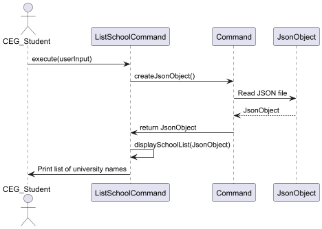

# Developer Guide

## Acknowledgements

{list here sources of all reused/adapted ideas, code, documentation, and third-party libraries -- include links to the original source as well}

## Design & implementation
{TODO: Class Diagram}
{TODO: Object Diagram}

### List Schools Command

#### Overview
This command is responsible for displaying and retrieving the full list of university
from `database.json` file. It helps the users to identify the possible choices in South East Asia
and Oceania.

#### How the feature is implemented
* The `ListSchoolCommand` class extends `Command` class where it overrides the `execute` method for
  custom behaviour.
* The command first reads a JSON file to obtain the names via `createJsonObject()` method from the
  superclass.
* The `displaySchoolList` method will iterate over the keys of the database which contians the University
  names, upon acquiring the keys, they will be printed over the CLI.
* There are also assertions and logging in place for error handling.
* Line Separator is used to ensure readability and ease of use for users.  

#### Why it is implemented that way
* The `execute` method is essential and unique to every command class so inheritance was used. 
* Every method in the class remains maintainable and has one responsibility this allows easy debugging and
  refactoring.
* Logging and assertions helps the team of developers to follow through the command execution.

#### Alternatives considered
* Reading of the `database.json` was tricky and other libraries were considered.
* Considered placing all the class methods inside the `execute` method but kept SLAP in mind to ensure 
  readability.

#### Sequence Diagram on PlantUML

### Obtain Partner University Email
### Obtain Partner University Contact Number
{Describe the design and implementation of the product. Use UML diagrams and short code snippets where applicable.}

## Product scope
### Target user profile

{Describe the target user profile}

### Value proposition

{Describe the value proposition: what problem does it solve?}

## User Stories

|Version| As a ...     | I want to ...                                                   | So that I can ...                                |
|--------|--------------|-----------------------------------------------------------------|--------------------------------------------------|
|v1.0| CEG students | see the possible Oceania and South East Asia partner university | see all my possible choices in those regions     |
|v2.0| CEG student  | obtain the email address of the partner university              | send an email should I have any queries          |
|v2.0| CEG student  | obtain the contact number of the partner university             | call the number should I have any urgent queries |

## Non-Functional Requirements

1. Access to a computer with Java 17 installed and a functional CLI
2. A CEG Student in NUS planning to map out mainly BT/IS/EE/CS/CG-coded courses
{TODO: Add more} 

## Glossary

* *glossary item* - Definition

## Instructions for manual testing

{Give instructions on how to do a manual product testing e.g., how to load sample data to be used for testing}
