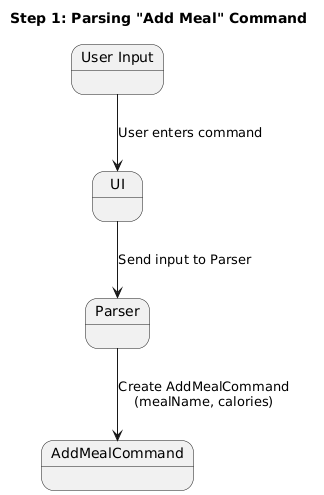
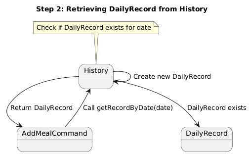
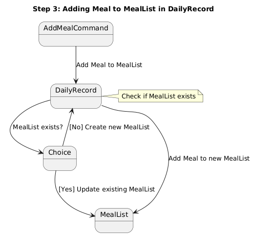
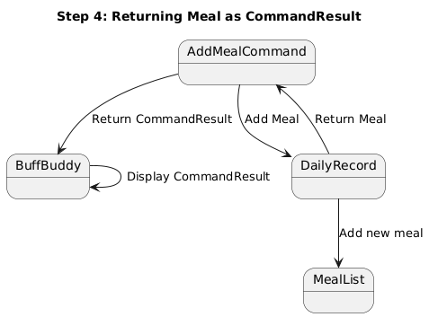
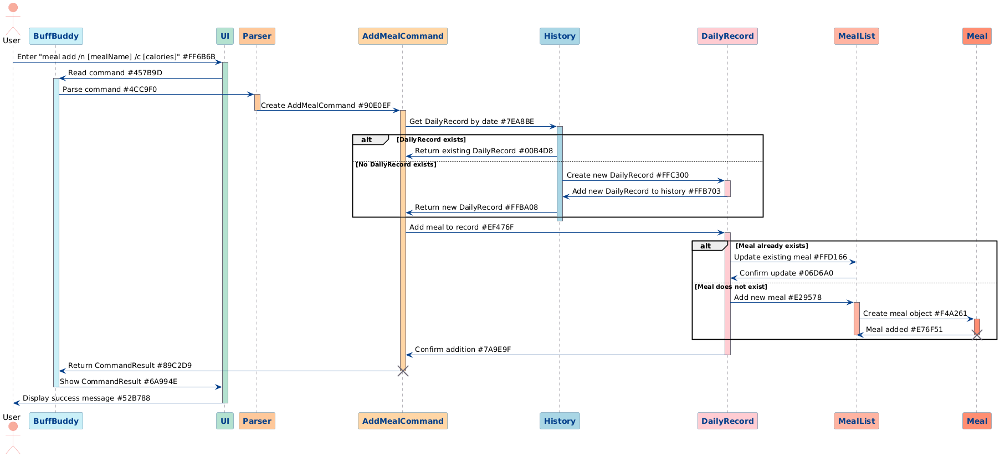
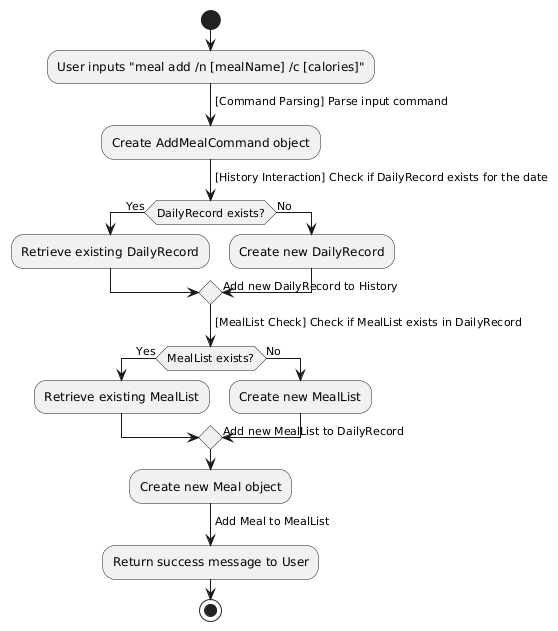

# Developer Guide

## Acknowledgements

{list here sources of all reused/adapted ideas, code, documentation, and third-party libraries -- include links to the original source as well}
We used these third party library
- Gson
- Mockito

## Design & implementation

### Add Meal

#### Feature Implementation
The **Add Meal** feature manages the functionality related to adding meals to a daily record. It interacts with various components such as `History`, `DailyRecord`, and `MealList` to ensure meals are added correctly.

The **Add Meal** command navigates through the following hierarchy:
- **History** → **DailyRecord** → **MealList**
- If a `DailyRecord` does not exist for a given date, it is created before adding the meal.
- Similarly, a new `Meal` object is created and added to the `MealList` if it doesn't already exist.

These operations include:
- Adding meals to a `DailyRecord` in the `History`.
- Updating existing meals in the `MealList` within a `DailyRecord`.
- Displaying the result of the command execution.

Given below is an example usage scenario for adding a meal and how the add meal command functions at each step.

#### Example Usage Scenario

**Step 1**: The user starts by adding a meal using the command:

meal add /n [mealName] /c [calories]

- The command is parsed and translated into an `AddMealCommand` object, which contains the necessary details.



**Step 2**: The command retrieves the `DailyRecord` for the specified date from the `History` using `History#getRecordByDate()`. If no record exists, a new one is created.



**Step 3**: The `AddMealCommand` adds the meal to the `MealList` of the `DailyRecord`. If the meallist already exists, it updates the existing meallist instead.



**Step 4**: The newly added `Meal` object is returned to the `AddMealCommand` to display as part of the `CommandResult`.



The overall design that enables this functionality is described generically by the following sequence diagram.

#### Sequence Diagram for "Add Meal" Command



The diagram shows the interactions among different classes and objects during the execution of the "Add Meal" command.

### Design Considerations

#### Chosen Approach: Hierarchical Command Pattern
The implementation of the "Add Meal" feature uses a hierarchical command pattern, where:
1. Commands traverse through the hierarchy from `History` → `DailyRecord` → `MealList`.
2. Each level handles its own operations, such as adding a meal or creating a new record.
3. Changes are managed within each layer to ensure separation of responsibilities.

**Key Benefits**:
- **Encapsulation**: Each class manages its own data and operations.
- **Single Responsibility**: Each class is responsible for handling specific aspects of meal addition.
- **Extensibility**: It is easy to add new meal-related operations (e.g., viewing or deleting meals).
- **Maintainability**: Changes at one level do not affect others, keeping the code clean and organized.

#### Alternative Approaches

1. **Command Handler Pattern**
    - In this approach, a **central command handler** class processes the command and delegates operations to the relevant models (`History`, `DailyRecord`, `MealList`).
    - This pattern separates the command handling logic from the execution logic, centralizing all command processing in a dedicated handler.
    - Example:
      ```java
      class CommandHandler {
          public void handleAddMeal(String mealName, int calories, LocalDate date) {
              History history = getHistory();
              DailyRecord record = history.getOrCreateRecordByDate(date);
              record.getMealList().addMeal(new Meal(mealName, calories));
          }
      }
      ```
    - **Pros**:
        - Centralizes command processing, making it easier to manage command flow.
        - Simplifies the addition of new commands, as they can be registered in the handler.
        - Provides clear separation between command parsing and execution logic.
    - **Cons**:
        - Introduces a single point of failure, as the command handler manages all command execution.
        - Requires additional routing logic to delegate commands, which can increase complexity.
        - Increases the coupling between command handling and model interaction.

2. **Chain of Responsibility Pattern**
    - This approach uses a **chain of handlers** to manage different meal-related operations, like adding or updating a meal.
    - Each handler in the chain checks whether it can process the command. If not, it forwards the request to the next handler.
    - Example:
      ```java
      interface MealCommandHandler {
          void setNext(MealCommandHandler handler);
          void handle(String command, String mealName, int calories, LocalDate date);
      }
 
      class AddMealHandler implements MealCommandHandler {
          private MealCommandHandler nextHandler;
 
          @Override
          public void setNext(MealCommandHandler handler) {
              this.nextHandler = handler;
          }
 
          @Override
          public void handle(String command, String mealName, int calories, LocalDate date) {
              if (command.equals("add")) {
                  DailyRecord record = history.getOrCreateRecordByDate(date);
                  record.getMealList().addMeal(new Meal(mealName, calories));
              } else if (nextHandler != null) {
                  nextHandler.handle(command, mealName, calories, date);
              }
          }
      }
      ```
    - **Pros**:
        - Decouples command handling, making it easier to manage different meal-related operations.
        - Simplifies adding new command handlers without modifying existing code.
        - Reduces the complexity of individual handlers by focusing only on specific operations.
    - **Cons**:
        - Introduces more classes and interfaces, increasing the overall codebase complexity.
        - Adds a bit of overhead due to the need to forward requests through the chain.
        - May be overkill if the number of meal-related operations is limited and well-defined.

### Summary of Design Considerations
- The **chosen approach** (Hierarchical Command Pattern) remains the best fit for the current implementation due to its **encapsulation**, **extensibility**, and **clear separation of concerns**.
- These alternative approaches offer other benefits like **centralization** or **decoupling**, but also come with their own trade-offs in terms of complexity and flexibility.

### Storage
The **Add Meal** feature ensures data persistence by saving changes to the `DailyRecord` and `MealList` in the `History`. The updated `History` object is saved using the `Storage` class.

### FileManager
The **FileManager** class handles the loading and saving of meals as part of the `History` data. It translates JSON data to Java objects and vice versa to maintain persistence across sessions.

### Activity Diagram for "Add Meal" Feature



The diagram shows the overall operation flow, including:
1. User input parsing.
2. Daily record retrieval or creation.
3. Meal addition.
4. Data persistence.

### Summary of Feature
The **Add Meal** feature uses a **hierarchical command pattern** to manage meal additions while maintaining good encapsulation and separation of concerns. The chosen design allows easy extensibility and maintainability.

This completes the developer guide for the **Add Meal** feature. Let me know if you need any additional diagrams or details!

## Product scope
BuffBuddy is a fitness tracking app that help you track workout, meals, water to aid you in achieving your body goals.
### Target user profile

{Describe the target user profile}

### Value proposition

{Describe the value proposition: what problem does it solve?}

## User Stories

| Version | As a ...               | I want to ...                                           | So that I can ...                                      |
|---------|------------------------|---------------------------------------------------------|--------------------------------------------------------|
| v1.0    | user                   | create a new workout plan/routine                       | tailor my workout to fit my needs                      |
| v1.0    | user                   | create a workout entry (input sets, weights, rep, time) | keep track of my progress                              |
| v1.0    | user                   | view my routine when I begin my workout                 | follow my plan more effectively                        |
| v1.0    | user                   | view their logged workout entry for a specific day      | see what they have done previously                     |
| v1.0    | user                   | delete a workout entry                                  | remove mistakenly created logs                         |
| v1.0    | user                   | delete a fitness routine if I no longer use it          | ensure my routines remain relevant and organized       |
| v1.0    | user                   | edit my existing fitness routine                        | further customize my routines after making them        |
| v2.0    | user                   | view a summary of my weekly workout activity            | measure my overall progress                            |
| v2.0    | user                   | track my personal bests for each exercise               | see improvements over time                             |
| v2.0    | user                   | log my body measurements                                | track calories burned/intake/gains more accurately     |
| v2.0    | nutrition-focused user | track calories burned during my workout                 | align my fitness routine with my dietary goals         |
| v2.0    | user                   | View body measurements over time                        | see the progress of their body                         |
| v2.0    | user                   | add a meal I just ate                                   | track my meals over time                               |
| v2.0    | user                   | delete a meal I ate                                     | delete a wrongly inputted meal                         |
| v2.0    | user                   | view my meals I ate on a certain date                   | see how much calories I have eaten                     |
| v2.0    | user                   | add my water intake                                     | track my water intake for each day                     |
| v2.0    | user                   | view my water intake                                    | see how much water I have consumed across days/week    |
| v2.0    | user                   | delete a water intake                                   | remove any mistakes made when inputting water intake   |
| v2.0    | user                   | set weekly/monthly exercise goals                       | to be accountable and motivate myself to stay on track |


## Non-Functional Requirements


{Give non-functional requirements}

## Glossary

* *glossary item* - Definition

## Instructions for manual testing

{Give instructions on how to do a manual product testing e.g., how to load sample data to be used for testing}
