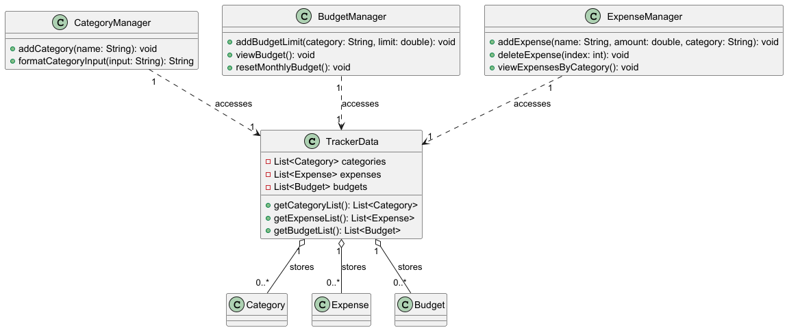
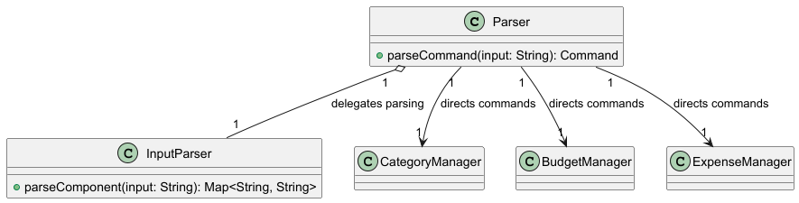
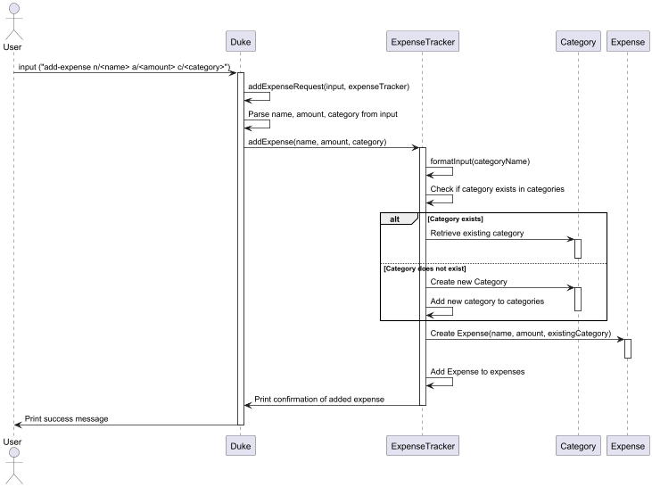
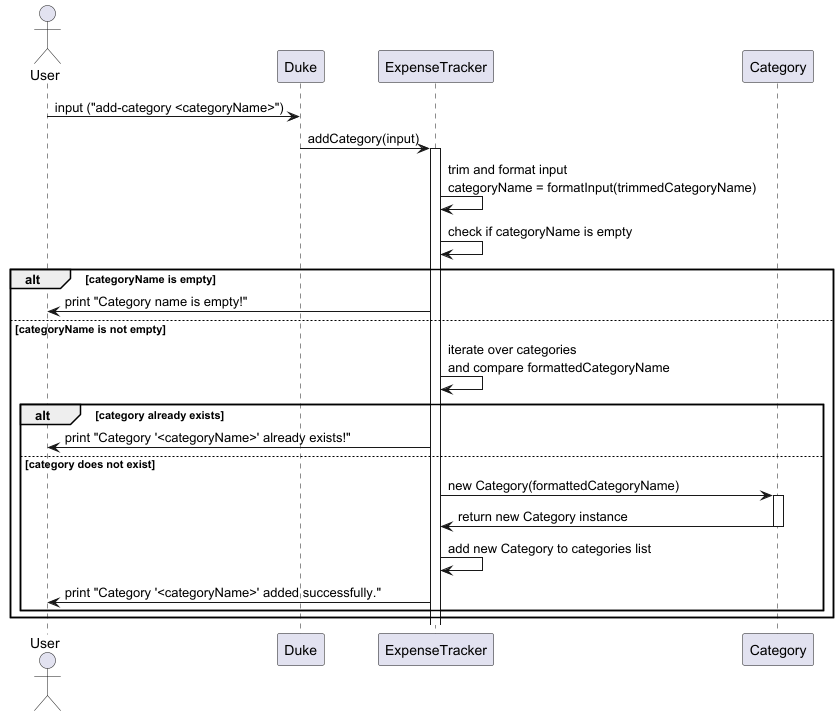
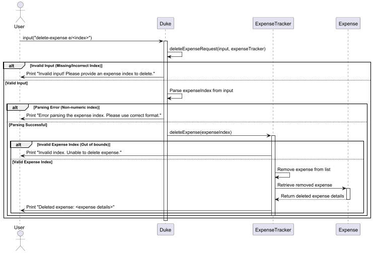
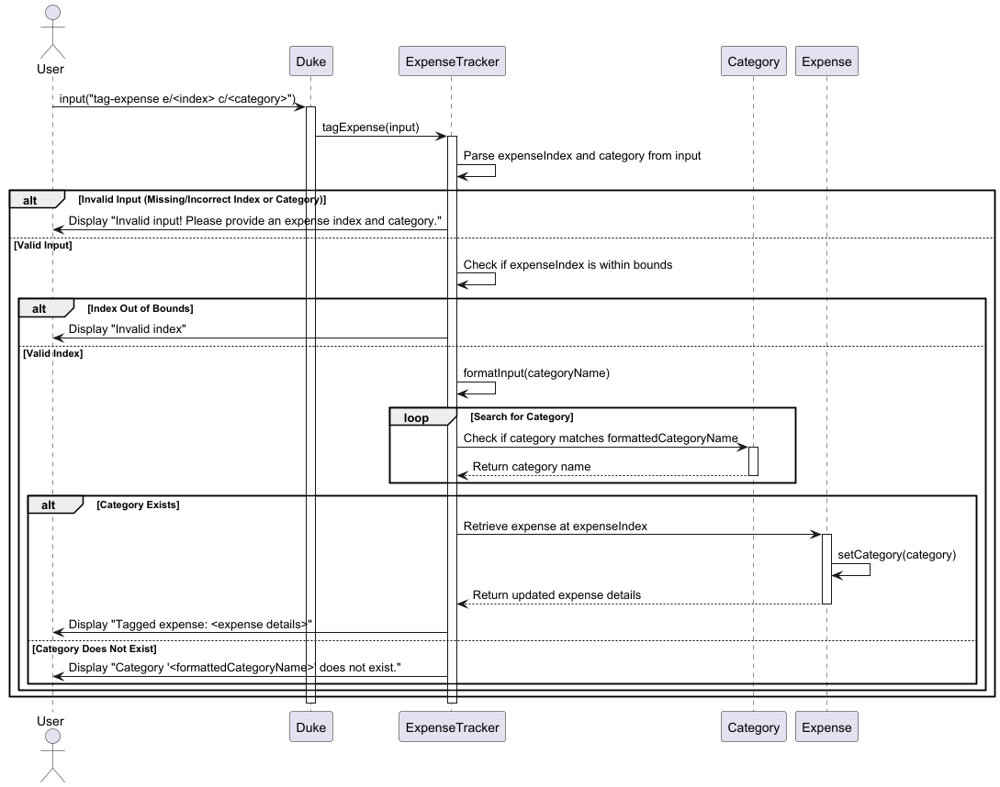
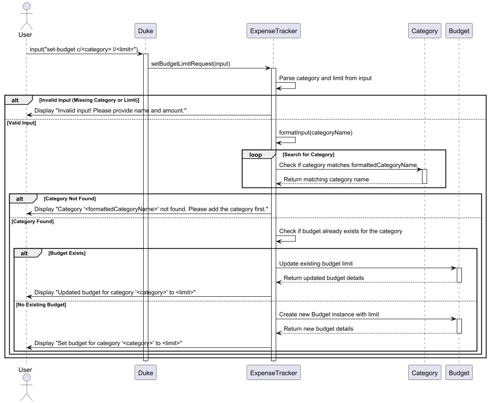
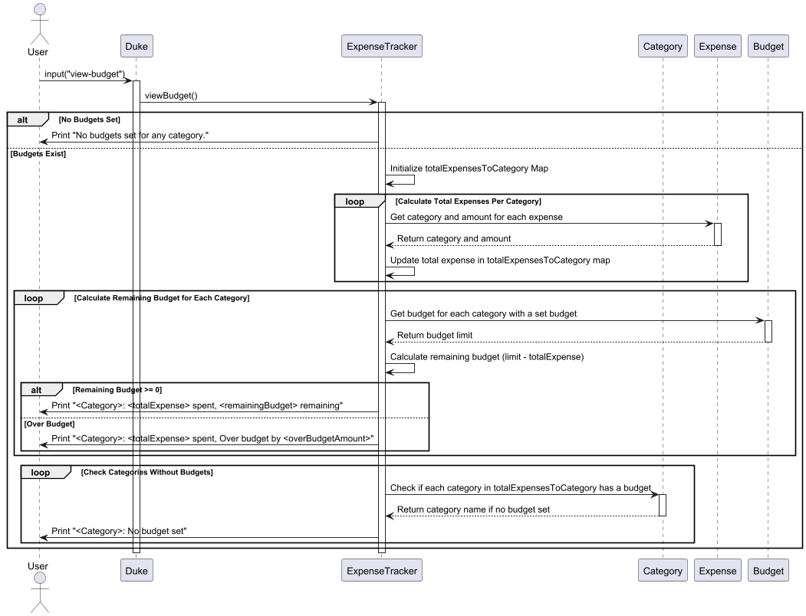
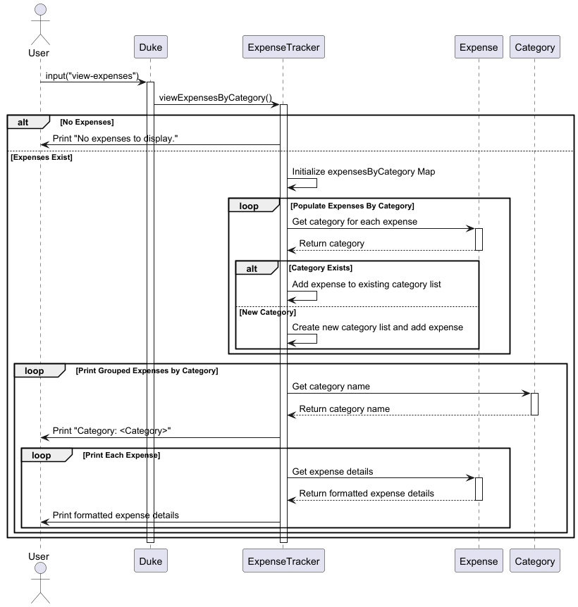

# Developer Guide for SpendSwift

<!-- ## Acknoledgements -->

## Design & Implementation
### Architecture
A high-level overview of the system is shown in the Architecture Diagram below.

### Main Components  
SpendSwift class is in charge of launching the program, 
and initialising the components that does the main execution of the program.
- UI: Prints messages
- Parser: Determines the command to execute and checks the logic 
- Command: Determines the feature the user wants to use
- Storage: Writes data to, and reads data from hard disk

### SpendSwift
#### Purpose
Interface for command-line interactions.

#### Main flow
- The system starts and displays a greeting.
- Continuously processes user commands until "bye".

### Core Classes Overview

#### TrackerData

TrackerData centralizes and manages the lists of categories, expenses, and budgets, 
providing a unified data source for other classes.

##### Usage
TrackerData is utilized by the manager classes to store and retrieve categorized data. 
Each manager accesses TrackerData to perform operations.

#### CategoryManager
Handles all category-related operations, including adding and formatting categories.

##### Operations

- `addCategory(String)`: Adds a new category.
- `formatCategoryInput(String)`: Formats category input, ensuring consistency.

##### Relationship
- Dependency: Accesses TrackerData to add and retrieve categories.

#### BudgetManager
Handles budget-related functionalities like setting and viewing budget limits for categories.

##### Operations
- `addBudgetLimit(String, double)`: Adds a budget limit for a specific category.
- `viewBudget()`: Views current budget limits and spending against them.
- `resetMonthlyBudget()`: Resets budgets at the start of each month.

##### Relationship
- Dependency: Accesses TrackerData to manage budget data associated with categories.

#### ExpenseManager
Manages expenses, including adding, deleting, and viewing expenses categorized by spending areas.

##### Operations
- `addExpense(String, double, String)`: Adds a new expense.
- `deleteExpense(int)`: Deletes an expense by index.
- `viewExpensesByCategory()`: Displays expenses grouped by category.

##### Relationship
- Dependency: Accesses TrackerData to add, delete, and view expenses categorized by spending areas.

### Command Parsing and Input Handling

#### Parser
The Parser class interprets user input commands, delegating them to appropriate manager classes for processing.

##### Operations
- `parseCommand(String)`: Parses the command and creates a Command object based on the input.

##### Relationship
- Composition: Uses InputParser for handling command-specific parsing.
- Dependency: Delegates tasks to CategoryManager, BudgetManager, and ExpenseManager.

#### InputParser
InputParser processes specific components within commands (such as names, amounts, categories) 
and breaks down inputs for more manageable handling.

##### Operations
- `parseComponent(String)`: Breaks down input components into a map for easy retrieval.

### Expense, Category, and Budget Entities

#### Expense
##### Purpose
Represents an expense with its name, amount, and associated category.

##### Operations
- `getName()`, `getAmount()`: Retrieve the expense's name and amount.
- `getCategory()`, `setCategory(Category)`: Manage the expense's category association.
- `formatAmount()`: Formats the expense amount for display.

#### Category
##### Purpose
Represents a category, allowing expenses and budgets to be organized under specific areas.

##### Operations
- `getName()`: Returns the category name.
- `toString()`: Provides the string representation of the category.

Attributes:
- String name: The name of the category.

#### Budget
##### Purpose
Represents a budget limit associated with a category, enabling users to track and manage spending.

##### Operations
- `setLimit(double)`: Ensures limits are non-negative.
- `formatLimit(double)`: Formats the budget limit for display.

- Each Expense is linked to exactly one Category, while each Budget is also associated with one Category.

### Sequence Diagrams
#### add-expense

#### add-category

#### delete-expense

#### tag-expense

#### set-budget

#### view-budget

#### view-expenses

#### toggle-reset

## Product Scope
<!-- @@author glenda-1506 -->
### Target User Profile
SpendSwift is designed for budget-conscious individuals who prefer a simple, efficient way to track expenses and manage budgets using text commands.

### Value Proposition
SpendSwift provides a fast, text-based solution for managing finances, eliminating the complexity of traditional budgeting tools.

## User Stories
<!-- @@author glenda-1506 -->  

| Version | As a...               | I want to...                                                          | So that I can...                                         |
|---------|-----------------------|-----------------------------------------------------------------------|----------------------------------------------------------|
| v1.0    | Budget-conscious user | Quickly log an expense using a typed command (e.g., add 50 groceries) | track my spending with easy input                        |
| v1.0    | Budget-conscious user | View my budget for all categories                                     | see how much I could spend                               |
| v1.0    | Budget-conscious user | Set a monthly reset for my budget tracking                            | start each month fresh with my budgeting                 |
| v1.0    | Budget planner        | View all my expenses                                                  | monitor what I have been spending on                     |
| v1.0    | Frequent user         | Set a budget limit for each category (e.g., set budget 200 groceries) | limit my spending according to categories                |
| v1.0    | Frequent user         | Delete an expense entry (e.g., delete 5)                              | quickly correct mistakes                                 |
| v1.0    | Frequent user         | Categorize expenses (e.g., add category food)                         | customize my expense tracking to better manage my budget |
| v2.0    | New user              | See commands easily                                                   | quickly familiarise myself with the program              |
| v2.0    | Frequent user         | Save my previous inputs                                               | Record over a period of time                             |

## Non-Functional Requirements
<!-- @@author mayfairmi6 -->  

| ID  | Requirement         | Description                                                                                | Rationale                                                                                   |
|-----|---------------------|--------------------------------------------------------------------------------------------|---------------------------------------------------------------------------------------------|
| 1   | Responsiveness      | The system should respond to user commands within 2 seconds.                               | Ensures efficient interaction and enhances user satisfaction.                               |
| 2   | Data Integrity      | The system must maintain accurate tracking and updating of financial entries.              | Prevents discrepancies in financial reporting, ensuring reliability.                        |
| 3   | User Error Handling | The system should provide clear error messages and support easy correction of user inputs. | Facilitates management of entries and reduces user frustration.                             |
| 4   | Customizability     | Users should be able to easily add and modify expense categories.                          | Allows users to tailor the system to their specific needs.                                  |
| 5   | Automated Tasks     | Support automated budget resets at the start of each month.                                | Minimizes user effort in maintaining accurate monthly tracking.                             |
| 6   | Accessibility       | The chat interface should be simple and intuitive.                                         | Ensures that all users can effectively interact with the system without extensive training. |

<!-- ## Glossary
- **glossary item**: Definition
-->

## Instructions for Manual Testing
### 1. Start SpendSwift
Follow the Quick Start instructions in the [User Guide](UserGuide.md).

Expected Outcome: Load data, if data file present, and welcome message on the terminal.

### 2. Test Cases
#### 2.1 Introduction to SpendSwift

Test Case: `help`

Expected Outcome: Prints a summarized list of possible commands in SpendSwift.

#### 2.2 Adding Expenses
- ##### 2.2.1 Add a Valid Expense
    
    Prerequisites: None
    
    Test Case: `add-expense n/Coffee a/5.50 c/Food`
    
    Expected Outcome: "Coffee" expense of $5.50 is added under "Food" category.

- ##### 2.2.2 Add an Expense Without Category (Defaults to 'Uncategorized')
    
    Prerequisites: None
    
    Test Case: `add-expense n/Book a/15`
    
    Expected Outcome: "Book" expense of $15 is added under "Uncategorized".

#### 2.3 Deleting Expenses
- ##### 2.3.1 Delete an Existing Expense by Index

    Prerequisites: At least one expense added.
    
    Test Case: `delete-expense e/1`
    
    Expected Outcome: The expense at index 1 is removed.

- ##### 2.3.2 Attempt to Delete a Non-Existing Index

    Prerequisites: None
    
    Test Case: `delete-expense e/100`
    
    Expected Outcome: Error message indicating an invalid index.

#### 2.4 Adding and Managing Categories
- ##### 2.4.1 Add a New Category

    Prerequisites: None
    
    Test Case: `add-category Transportation`
    
    Expected Outcome: "Transportation" category is created and available for tagging.

- ##### 2.4.2 Tag an Expense to an Existing Category
    
    Prerequisites: At least one expense and category added.
    
    Test Case: `tag-expense e/1 c/Transportation`
    
    Expected Outcome: Expense at index 1 is tagged to "Transportation".

- ##### 2.4.3 Tag an Expense to a Non-Existing Category
    
    Prerequisites: At least one expense added.
    
    Test Case: `tag-expense e/1 c/Luxury`
    
    Expected Outcome: Error message indicating category "Luxury" does not exist.

#### 2.5 Setting and Viewing Budget Limits
- ##### 2.5.1 Set Budget Limit for a Category
    
    Prerequisites: Category "Food" added.
    
    Test Case: `set-budget c/Food l/100.00`
    
    Expected Outcome: Budget of $100.00 is set for "Food", viewable in view-budget.

- ##### 2.5.2 Set Budget for a Non-Existing Category
    
    Prerequisites: None
    
    Test Case: `set-budget c/Luxury l/100.00`
    
    Expected Outcome: Error message indicating the category does not exist.

#### 2.6 Viewing Expenses and Budgets
- ##### 2.6.1 View All Expenses
    
    Prerequisites: None
    
    Test Case: `view-expenses`
    
    Expected Outcome: Displays a list of all recorded expenses, categorized.

- ##### 2.6.2 View Budget Summary for Each Category
    
    Prerequisites: Budget set for at least one category.
    
    Test Case: `view-budget`
    
    Expected Outcome: Displays summary of spending and remaining budget for categories with budget limits.

#### 2.7 Toggle Automatic Budget Reset
Prerequisites: None

Test Case: `toggle-reset`

Expected Outcome: Toggles the automatic monthly budget reset between "on" and "off".

### 3. End SpendSwift
Prerequisite: None

Test Case: `bye`

Expected Outcome: Application exits and data is saved in spendswift.txt.
