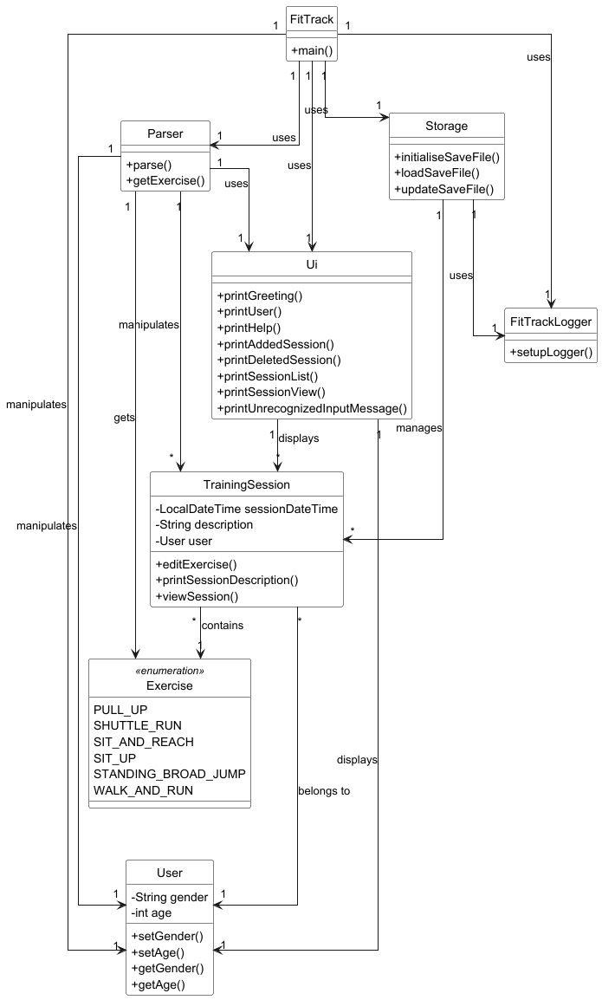

# Developer Guide

## Acknowledgements

{list here sources of all reused/adapted ideas, code, documentation, and third-party libraries -- include links to the original source as well}

## Design & implementation

# High Level Functionalities - Zackermax

**FitTrack** is the main class and entry point of the application.  
It manages high level functionalities by coordinating the `FitTrackLogger`, `Storage`, `User`, `Parser`, `Ui`, `TrainingSession`, and `Exercise` classes.

- **FitTrackLogger** manages logging for the application, ensuring errors and important events are properly recorded.
- **Storage** manages saving and loading data from a persistent storage file.
- **User** holds the user’s information, such as age and gender, and provides methods to modify or retrieve this data.
- **Parser** handles parsing of user input, converting it into commands and actions.
- **Ui** manages all output and user interaction, such as printing data and messages to the console.
- **TrainingSession** represents a single training session, including exercises and metadata (like date and description).
- **Exercise** represents different types of exercises available in the application, like pull-ups or shuttle runs.

{Describe the design and implementation of the product. Use UML diagrams and short code snippets where applicable.}

## Product scope
### Target user profile

{Describe the target user profile}

### Value proposition

{Describe the value proposition: what problem does it solve?}

## User Stories

|Version| As a ... | I want to ... | So that I can ...|
|--------|----------|---------------|------------------|
|v1.0|new user|see usage instructions|refer to them when I forget how to use the application|
|v2.0|user|find a to-do item by name|locate a to-do without having to go through the entire list|

## Non-Functional Requirements

{Give non-functional requirements}

## Glossary

* *glossary item* - Definition

## Instructions for manual testing

{Give instructions on how to do a manual product testing e.g., how to load sample data to be used for testing}
