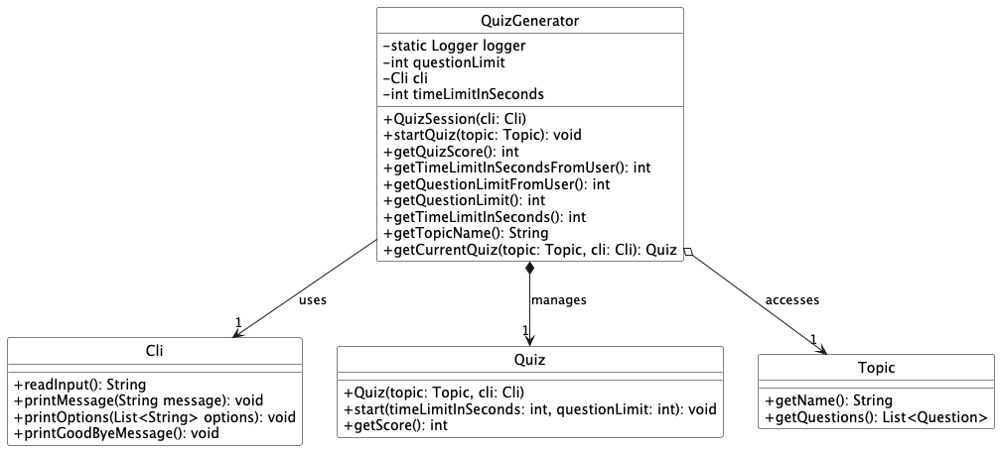

# JavaNinja Developer Guide
Java Ninja is a command-line interface (CLI) learning tool focused on helping beginner programmers enhance their understanding of fundamental programming concepts.

- [Design & implementation](#design-&-implementation)
- [Product scope](#product-scope)
    - [Target user profile](#target-user-profile)
    - [Value proposition](#value-proposition)
- [User Stories](#user-stories)
- [Non-Functional Requirements](#non-Functional-Requirements)
- [Glossary](#Glossary)
- [Instructions for manual testing](#Instructions-for-manual-testing)

## Acknowledgements

{list here sources of all reused/adapted ideas, code, documentation, and third-party libraries -- include links to the original source as well}
- [Apache Commons Lang Library](https://commons.apache.org/proper/commons-lang/) - Used for string utilities.
- [JUnit 5](https://junit.org/junit5/) - Used for testing.
- Code adapted from [AddressBook-Level3](https://github.com/se-edu/addressbook-level3).

JavaNinja uses the following tools for development:
- JUnit - Used for testing.
- Gradle - Used for build automation.

## Design & implementation
  
### Design

### Java-Ninja Implementation
`JavaNinja` serves as the main entry point for the command-line-based Java application, managing the initialization, control flow, and shutdown of the application. It composes of three core components:

1. `Cli` - Handles interactions with the user, including input and output operations.
2. `Parser` - Interprets user commands and delegates tasks to the appropriate component.
3. `QuizManager` - Manages quiz-related functions such as selecting quizzes, executing quiz sessions, and saving quiz results.

Here is the class diagram highlighting the structure of the `JavaNinja` class:

#### How `JavaNinja` works:
1. **Application Initialization**:
   - Upon instantiation, JavaNinja initializes the core components: `Cli`, `Parser`, and `QuizManager`. Bulk of the work is being done here
   - Cli is responsible for managing user input and output, while Parser interprets user commands and directs actions to QuizManager, which handles quiz operations.
2. **Application Flow**:
   - JavaNinja uses a loop in the run() method to keep the application active until the user decides to quit.
   - Inside the loop, Cli reads the user's input, and Parser interprets the command. Based on the command, Parser delegates tasks to QuizManager.
3. **Command Execution**:
   - Parser processes commands such as "view," "select," "review," "help," and "add." 
   - Each command invokes specific methods in QuizManager or Cli, such as displaying available quizzes, starting a quiz session, reviewing past results, or displaying help.
4. **Shutdown and Cleanup**:
   - Upon receiving the "quit" command, JavaNinja terminates the loop, triggering the shutdown sequence.
   - QuizManager saves any unsaved quiz results, and Cli displays a goodbye message and closes any open resources like the input scanner.

The `JavaNinja` class acts as a controller that organizes interactions between `Cli`, `Parser`, and `QuizManager`, ensuring a modular and maintainable structure where each component has distinct responsibilities.

Here is a simple sequence diagram that describes how the components interact with each other:

### `Cli` class: 
The `Cli` class is responsible for managing user interactions in the command-line interface.
It handles user input, displays messages, and provides guidance on available commands, making it the primary interface between the user and the application.

Here is a class diagram highlighting the structure of the `Cli` class:

#### How `Cli` works:
1. Initialization and Input Handling:
   - The Cli class can be instantiated with either the default system input (System.in) or a custom input stream for flexibility, especially useful for testing.
   - The readInput() method prompts the user with a > symbol, reads the input from the console, trims any whitespace, and returns the input as a string for further processing by other components.
2. Displaying Messages:
   - Start and Help Messages:
     - printStartMessage(): Prints a welcome message with available commands to help users get started.
     - printHelp(): Prints a detailed list of commands and their descriptions, helping users understand how to interact with the application.
   - Custom Messages:
     - printMessage(String message): Prints any custom message passed to it, allowing other components to display relevant feedback or information to the user.
     - printOptions(List<String> options): Prints a list of options (e.g., multiple-choice options in a quiz), making it easier for users to view and select options.
     - printPastResults(String results): Prints past quiz results, allowing users to review their performance history.
     - printEnclosure(): Prints a decorative line (ENCLOSURE) to visually separate sections, enhancing readability.
3. Application Shutdown:
     - Goodbye Message and Resource Cleanup:
       - printGoodByeMessage(): Prints a farewell message when the application is closing.
       - closeScanner(): Closes the Scanner instance to release system resources after the application terminates.

### `Parser` class:
The `Parser` class is responsible for interpreting and handling user commands. 
It processes input strings from the command-line interface and routes these commands to the appropriate methods within QuizManager or Cli to execute corresponding actions.

#### How `Parser` works:
- The determineCommand(String input) method is the main entry point for interpreting user commands. It first calls processCommand(input) to isolate the command keyword, then uses a switch statement to identify the corresponding action:
  - `view`: Invokes `quizManager.printTopics()` to display all available quiz topics.
  - `select`: Calls `quizManager.selectTopic(topic)` to initiate a quiz on the specified topic. If no topic is specified, prompts the user to enter one.
  - `review`: Fetches and displays past quiz results by calling `quizManager.getPastResults()`.
  - `help`: Calls `cli.printHelp()` to show a help message with available commands.
  - `add`: Uses `quizManager.addFlashcardByUser(input)` to add a new flashcard question created by the user.
  - Default case: Prints an error message for unrecognized commands, suggesting the "help" command for guidance. 
- Any IOException encountered during command execution is caught and logged

The sequence diagram below demonstrates the interactions within the `Parser` component when a user inputs the command `select Loops`:

### `QuizManager` class: 
The `QuizManager` class serves as the primary controller for quiz functionalities within the application. 
It manages quiz operations such as starting and tracking quizzes, handling topics, saving results, and providing feedback.

Below is the class diagram for the `QuizManager` class, illustrating its attributes and methods.

#### Firstly, the overarching class diagram:

#### Additional details about its methods and attributes:

####  How `QuizManager` Works
- Manage Topic and Questions:
  - Manages quiz topics through TopicManager, enabling easy addition, retrieval, and organization of topics and questions.
  - Loads questions and topics from a file at startup, ensuring data availability when the application begins.
- Quiz Execution:
  - Starts a quiz session on a specific topic selected by the user via QuizSession.
  - Tracks the quiz’s progress and calculates the score, providing feedback upon quiz completion through QuizResults.
- Persistence of Quiz Data:
  - Loads previously saved quiz data from files when the application starts, making past results and quiz content readily accessible.
  - Saves new quiz data, including quiz questions and results, ensuring all data is preserved across sessions.
- Review Past Results:
  - Allows users to review their scores and feedback from previous quiz attempts, offering insights into their progress and areas for improvement.

Over here is a continuation of `Select Loops` as a sequence diagram in a more detailed level:

### `TopicManager` class:
The `TopicManager` class is responsible for managing various topics within the application. It provides methods to add, retrieve, and organize topics, as well as handle loading and saving of question data. By interacting with `TopicManager`, users can create new topics, add questions to them, and persistently save or retrieve questions from an external storage file.

#### How `TopicManager` works:
- The `getOrCreateTopic(String topicName)` method allows users to retrieve an existing topic by name or create a new one if it doesn't exist, ensuring that topics are always unique.
- The `addTopic(Topic topic)` method adds a new topic to the list only if it’s not already present, ensuring uniqueness and avoiding duplication.
- The `printTopics()` method displays all topics currently managed by the application, logging each topic name to provide feedback to the user.
- The `addFlashcardByUser(String input)` method parses user input, creates a `Flashcard` question, adds it to the designated "Flashcards" topic, and saves it to the file.
- The `loadQuestions()` method reads questions from the specified file, parses each line, and adds the corresponding question to the appropriate topic by calling `parseTopic(String line)`.
- The `parseTopic(String line)` method interprets the content of each line in the questions file and creates appropriate question objects, such as `Flashcard`, `Mcq`, `TrueFalse`, or `FillInTheBlank`. It uses the first part of the line to assign the question to the right topic, creating the topic if necessary.

#### `TopicManager` class diagram:

### Topic Instantiation
When `loadQuestions()` reads each line from the storage file, `parseTopic()` is invoked to create or retrieve the correct topic. This ensures that each question in the file is organized within its corresponding topic. If the topic is already present, it is retrieved from the list of topics; if it does not exist, a new `Topic` instance is created and added to the list. This process ensures that topics and their associated questions are correctly structured, even if the file contains new topics or question types.

The following sequence diagram shows the interactions within `TopicManager` during topic initialisation from the storage file.

### `QuizSession` class: 
The `QuizSession` class is responsible for managing a single quiz session.
It interacts with the user through the Cli class to set up quiz parameters (time limit and question limit), initialises and starts the Quiz, and retrieves the final score.
The class maintains the current quiz, selected topic, and session limits for each session.

#### `QuizSession` class diagram:

#### How `QuizSession` works:
- `QuizSession(Cli cli)`: Constructor that initializes `QuizSession` with a `Cli` instance for user interaction.
- `startQuiz(Topic topic)`: Starts a quiz for the specified Topic, initializes Quiz, and prompts the user for time and question limits before starting the quiz.
- `QuizScore()`: Returns the final score from the current quiz.
- `TimeLimitInSecondsFromUser()`: Prompts the user to set the quiz time limit, either in minutes or seconds. Validates input to ensure it’s positive and non-zero.
- `QuestionLimitFromUser()`: Prompts the user for the number of questions they want to attempt. Validates the input to ensure it’s within the available questions for the selected topic.
- `QuestionLimit()`: Returns the question limit set for the current session.
- `TimeLimitInSeconds()`: Returns the time limit in seconds for the current session.
- `TopicName()`: Returns the name of the selected topic for display purposes.
- `CurrentQuiz(Topic topic, Cli cli)`: For testing purposes; returns the current `Quiz` instance or creates one if it doesn’t exist.

#### `QuizSession` sequence diagram with `select loops`: 

## Product scope
### Target user profile

This tool is designed for beginner programmers who want to enhance their skills in Java programming and command-line operations. Ideal for those who have a basic understanding of coding concepts but are looking for practical, hands-on experience to build confidence and proficiency in these areas.

### Value proposition

This tool will offer an interactive learning experience through a series of tasks and challenges designed to deepen users' understanding and proficiency in both command-line operations and Java language.

## User Stories

| Version | As a ...              | I want to ...                                      | So that I can ...                                         | Notes                              |
|---------|-----------------------|----------------------------------------------------|-----------------------------------------------------------|-------------------------------------|
| v1.0    | user                  | see usage instructions                             | learn how to use the app                                  | can be displayed on app open       |
| v1.1    | user                  | take quizzes on Java fundamentals                  | test my knowledge and practice programming concepts       |                                     |
| v1.2    | user                  | see my quiz score at the end of the quiz           | track my progress and improve                             |                                     |
| v2.0    | user                  | receive feedback after each quiz question          | understand the correct answer and learn from my mistakes  |                                     |
| v2.1    | user                  | access a review mode after completing a quiz       | go through all the questions again with detailed explanations |                         |
| v2.0    | user                  | practice different CS topics individually (e.g., OOP, data structures, algorithms) | focus on weak areas and strengthen my knowledge |               |
| v2.0    | user                  | keep track of my quiz history                      | monitor my improvement over time and revisit past mistakes |                                     |
| v2.0    | user                  | attempt timed quizzes                              | simulate real exam conditions and manage my time efficiently |                                |
| v2.0    | user                  | exit the quiz at any point                         | take a break or do something else                         |                                     |
| v2.1    | busy user on the move | save the progress of my quiz                       | revisit the quiz once more                                |                                     |
| v2.0    | user                  | see the correct answer to quiz questions           | learn and improve                                         |                                     |
| v1.0    | user                  | submit quiz                                        | complete the assessment                                   |                                     |
| v2.0    | user                  | take quizzes in MCQ or true/false format           | get used to typing out answers                            |                                     |
| v2.0    | user                  | take quizzes in FITB format                        | be exposed to multiple formats of assessment              |                                     |

## Non-Functional Requirements

1. Technical Requirements: Any mainstream OS, i.e. Windows, macOS or Linux, with Java 17 installed.
2. Project Scope Constraints: The application should only be used for practice and reviewing score progress
3. Project Scope Constraints: Data storage is only to be performed locally.
4. Quality Requirements: The application should be able to be used effectively by a novice with little experience with CLIs.

## Glossary

- All definitions are self explanatory

## Instructions for manual testing
> **Note**: These test cases provide a starting point. Testers are encouraged to perform additional exploratory testing.

---

### 1. Start Java Ninja Quiz Application
1. Launch the application by following the steps in the [Quick Start Guide](UserGuide.md#quick-start).
2. **Expected**: A welcome message appears on the terminal, prompting for user input.

---

### 2. Test Cases

#### 2.1 Initial Commands
* **2.1.1 View Commands List**
    * **Test Case**: `help`
    * **Expected**: Displays a list of available commands with brief descriptions.

* **2.1.2 View Topics**
    * **Test Case**: `view`
    * **Expected**: Lists all quiz topics available for selection, such as loops, conditionals, and data types.

---

#### 2.2 Select a Quiz Topic and Start Quiz
* **2.2.1 Start Quiz with Valid Topic**
    * **Prerequisites**: None
    * **Test Case**: `select loops`
    * **Expected**: Prompts the user to enter a time limit and number of questions for the quiz.

* **2.2.2 Start Quiz with Invalid Topic**
    * **Prerequisites**: None
    * **Test Case**: `select invalidtopic`
    * **Expected**: Error message indicating that the specified topic is not available.

---

#### 2.3 Taking a Quiz
* **2.3.1 Answer Quiz Questions**
    * **Prerequisites**: Quiz must be in progress.
    * **Test Case**: Respond to questions in the quiz with valid answers.
    * **Expected**: Each answer is processed, and the quiz proceeds to the next question.

* **2.3.2 Exit Quiz Early**
    * **Prerequisites**: Quiz must be in progress.
    * **Test Case**: `exit`
    * **Expected**: Quiz ends immediately with a message confirming the early exit.

* **2.3.3 Automatic Quiz End**
    * **Prerequisites**: Set a time limit and question limit.
    * **Test Case**: Allow the quiz to reach the time or question limit.
    * **Expected**: Quiz ends automatically when the limit is reached, and the score is displayed.

---

#### 2.4 Add a Custom Question
* **2.4.1 Add Valid Flashcard Question**
    * **Prerequisites**: None
    * **Test Case**: `add Flashcard /q What is the Java keyword to define a class? /a class`
    * **Expected**: Confirmation message indicating that the flashcard was added successfully.

* **2.4.2 Add Flashcard Question with Invalid Format**
    * **Prerequisites**: None
    * **Test Case 1**: `add Flashcard /q Invalid format`
    * **Test Case 2**: `add Flashcard`
    * **Expected**: Error message indicating that the correct format is required.

---

#### 2.5 Reviewing Past Results
* **2.5.1 View Past Quiz Results**
    * **Prerequisites**: At least one quiz completed in the session.
    * **Test Case**: `review`
    * **Expected**: Displays a summary of past quiz scores and feedback.

* **2.5.2 View Results with No Quiz History**
    * **Prerequisites**: No quizzes taken in the current session.
    * **Test Case**: `review`
    * **Expected**: Message indicating that no quiz history is available.

---

#### 2.6 Get Help Information
* **2.6.1 View Help for All Commands**
    * **Prerequisites**: None
    * **Test Case**: `help`
    * **Expected**: Displays descriptions of all available commands.

* **2.6.2 View Help for Specific Command**
    * **Prerequisites**: None
    * **Test Case**: `help select`
    * **Expected**: Displays detailed information about the `select` command.

---

#### 2.7 Exiting the Application
* **2.7.1 Exit the Application Mid-Session**
    * **Prerequisites**: None
    * **Test Case**: `quit`
    * **Expected**: Program terminates with a goodbye message.

* **2.7.2 Exit Application During Quiz**
    * **Prerequisites**: Quiz in progress.
    * **Test Case**: `quit`
    * **Expected**: Program terminates immediately, ending the quiz and returning to the command line.

---

### Additional Notes for Testers
- Test various scenarios for each command, including edge cases.
- Verify error handling for invalid input formats, such as incorrect command syntax or unsupported topics.
- Ensure that the feedback provided to users is clear, concise, and informative.

### JUnit Testing
JUnit tests are written in the subdirectory `test` and serve to test key methods part of the application.