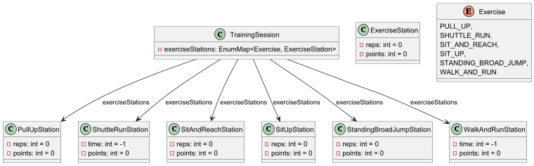
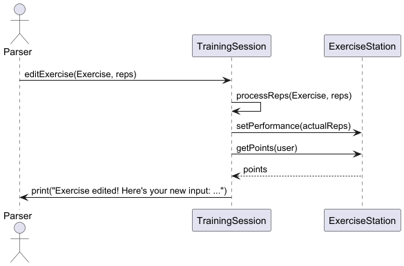
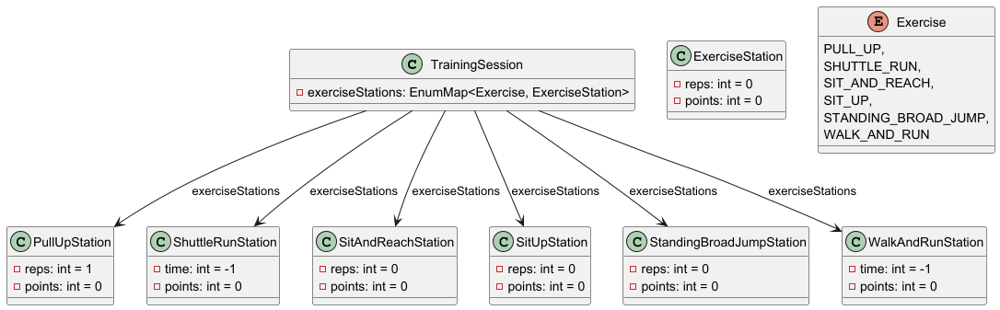

# Developer Guide

## Acknowledgements

{list here sources of all reused/adapted ideas, code, documentation, and third-party libraries -- include links to the original source as well}

## Design & implementation

# High Level Functionalities - Zackermax

**FitTrack** is the main class and entry point of the application.  
It manages high level functionalities by coordinating the `FitTrackLogger`, `Storage`, `User`, `Parser`, `Ui`, `TrainingSession`, and `Exercise` classes.

- **FitTrackLogger** manages logging for the application, ensuring errors and important events are properly recorded.
- **Storage** manages saving and loading data from a persistent storage file.
- **User** holds the user’s information, such as age and gender, and provides methods to modify or retrieve this data.
- **Parser** handles parsing of user input, converting it into commands and actions.
- **Ui** manages all output and user interaction, such as printing data and messages to the console.
- **TrainingSession** represents a single training session, including exercises and metadata (like date and description).
- **Exercise** represents different types of exercises available in the application, like pull-ups or shuttle runs.

{Describe the design and implementation of the product. Use UML diagrams and short code snippets where applicable.}

### Edit Exercise Feature

The **Edit Exercise** feature is managed by the `TrainingSession` class, and is primarily carried out by its 
`editExercise()` function. This feature utilizes the `setPerformance()`and `getReps()` methods from the 
`ExerciseStation` classes to edit the repetitions and timings for the user’s selected 
exercises. Additionally, it calculates the points the user will earn for each exercise based on the updated values.

#### Step 1: Logging a New Training Session

When the user logs a new training session, an instance of the `TrainingSession` class is created. This instance 
initializes an EnumMap, which populates the various `ExerciseStation` instances with their initial values. 
Below is a representation of how the `ExerciseStations` are initialized:

  

#### Step 2: Editing a Training Session

When the user wishes to edit a training session, they specify an `Exercise` Enum, and the reps/timing to be inputted,
which is passed to the`editExercise` function. This function calls the relevant methods to update the repetitions or 
timings and calculates the corresponding points for the specified exercise.

The following sequence diagram illustrates the function calls involved in this process:

Additionally, the state diagram below shows the end state of the `editExercise` function after execution of the command,
`editExercise(Exercise.PULL_UP, 1)`:

## Product scope
### Target user profile

{Describe the target user profile}

### Value proposition

{Describe the value proposition: what problem does it solve?}

## User Stories

|Version| As a ... | I want to ... | So that I can ...|
|--------|----------|---------------|------------------|
|v1.0|new user|see usage instructions|refer to them when I forget how to use the application|
|v2.0|user|find a to-do item by name|locate a to-do without having to go through the entire list|

## Non-Functional Requirements

{Give non-functional requirements}

## Glossary

* *glossary item* - Definition

## Instructions for manual testing

{Give instructions on how to do a manual product testing e.g., how to load sample data to be used for testing}
