# Developer Guide

## Acknowledgements

{list here sources of all reused/adapted ideas, code, documentation, and third-party libraries -- include links to the original source as well}

## Design


The above **Architecture Diagram** provides the high-level design of the application.

### Main components

The application comprises the following components:

* `Main`, which handles program startup and shutdown, and also interactions between other components.
* `UI`, which handles user input and showing messages to the user.
* `Storage`, which handles the loading and saving of data from and to a file upon program startup and shutdown.
* `Parser`, which converts user input into commands.
* `Command`, which are executed to modify the data stored in the program.
* `Event`, which stores the program's data.

### Interactions between components

The overall program execution is as follows:

1. Upon program startup, the `Ui` shows the user a welcome message.
2. `Storage` loads the event data from the saved file into `Event`
3. The program enters the command loop upon invocation of the `runCommandLoop()` method.
4. In the command loop, the program gets, parses and executes commands entered by the user.
5. `Storage` saves the event data in `Event` after the execution of each user command.
6. The program exits the command loop once `IsGettingCommands` is set to `false`.


The above **Sequence Diagram** shows how the different components of the system interact in the above operation. The components are represented by classes, as follows:

* `Main` refers to the `Main` class in `Main`.
* `Ui` refers to the `Ui` class in `Ui`.
* `Storage` refers to the `Storage` class in `Storage`.
* `EventList` refers to the list of events in `Event` which the program's event data is stored (see the _Event component_ section for more details).

### UI component


The `UI` component comprises an Ui class, as shown in the above **Class Diagram**.

The `UI` does the following:

* Show the user a welcome message upon program startup.
* Take in command input from the user and pass the input to `Main` (through the `getCommand()` method).
* Show output messages from `Command` to the user after command execution (through the `showOutputMessage()` method).
* Show error messages from any caught exceptions (through the `showErrorMessageToUser()` method).

### Storage component

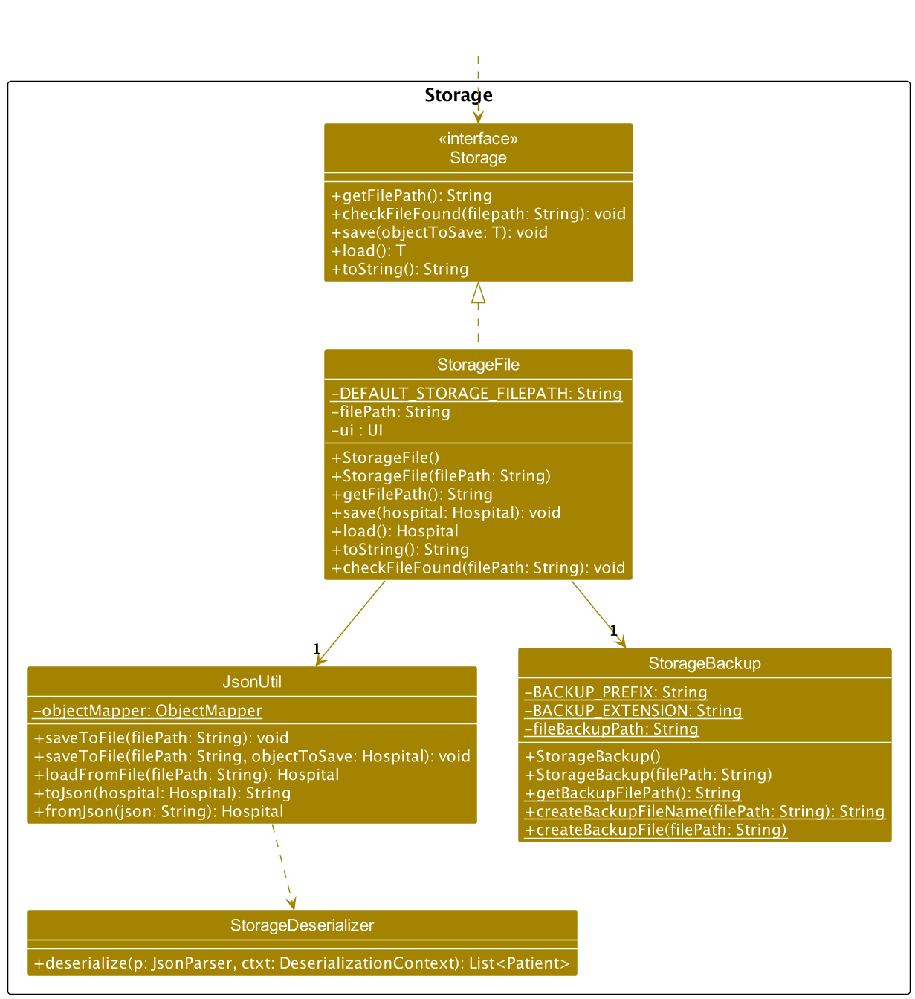

The `Storage` component comprises a Storage class, as shown in the above **Class Diagram**.

The `Storage` does the following:

* Load events and participants information from a text file and save it to `EventList` list.
* Save events from `EventList` list to a text file

### Parser component

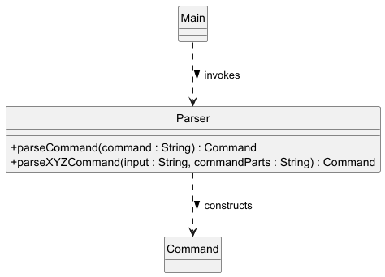

The `Parser` component comprises a `Parser` class, as shown in the above **Class Diagram**.

The `Parser` class takes in a user input string, and constructs an `XYZCommand` object with fields parsed from the input.

The logic of the `Parser` component is illustrated in the following use case:

1. Upon receiving a user command input, `Main` constructs a new `Parser`. This state is represented in the following **Object Diagram**:


2. `Main` passes the user command input to `Parser`, which parses the input and constructs an `XYZCommand` object, which is returned to `Main`. 
The `Parser` instance is no longer referenced. The current state is as shown in the **Object Diagram** below:


The interactions between `Parser` and the other components in the above procedure is shown in the sequence diagram in the _Command component_ section.

Further details regarding command parsing can be found under _Command parsing_ in _Implementation_.

### Command component

The `Command` component comprises multiple `XYZCommand` classes, which inherit from the abstract `Command` parent class.

In each `XYZCommand` class, command execution is done through the `execute()` method, which is implemented from an abstract method in `Command`.
After the command execution, `XYZCommand`'s output message is set depending on whether the execution was a success or a failure.

The `Command` component and its component classes are shown in the below **Component Diagram**:


The logic of the command parsing and execution in `Command` is as follows:

1. The `Ui` takes in a command input from the user, and passes the user command input to `Main`.
2. The `Parser` gets the user command input from `Main` and creates an `XYZCommand` instance.
The parameters of the `XYZCommand` instance are parsed from fields given in the user input.
3. The program's event data (in the form of `EventList`) is passed to `XYZCommand` by `Main`.
4. `XYZCommand` is executed with the invocation of the `execute()` method. 
5. The `Ui` gets `XYZCommand`'s output message, and shows it to the user. 

The interactions between `Command` and other components in the system for the above set of operations is shown in the following _Sequence Diagram_:


### Event component

The `Event` component comprises an `EventList` class that is composed of multiple `Event`s. Each `Event` contains event participant data, represented by multiple `Participant` objects.

The `Event` component and its component classes are shown in the below **Class Diagram**:


The `Event` component does the following:

* Handle the addition, removal and marking of events stored in `EventList`.
* Add, remove and mark participants for a specific `Event` in `EventList`.

## Implementation

This section describes some noteworthy details on how certain features are implemented.

### Command parsing ###

The user command input for the program is in the following format:

* `COMMAND_WORD FLAG PARAMETER FLAG_2 PARAMETER_2 ...`

where `COMMAND_WORD` determines the command type, `FLAG` is a command flag demarcating a parameter, and `PARAMETER` is a parameter value.

The above input is parsed into `Command`s by the `Parser` by the `Parser#parseCommand` operation, which, based upon the value of `COMMAND_WORD`, does the following:  

* If the command does not take in any parameters, the `Parser` constructs the corresponding `XYZCommandObject`.
* Otherwise, the `Parser` invokes a `Parser#parseXYZCommand` operation.

The `Parser#parseXYZCommand` operation then does the following:
* If `XYZCommand` has multiple possible operations, the `Parser`, based on the value of the first command flag, constructs the
`XYZCommand` object for one of these operations. An example from `parseAddCommand` (where `commandFlag` is the first flag) is shown in the code snippet below:

```
switch (commandFlag) {
    case EVENT_FLAG:
        return getAddEventCommand(input);
    case PARTICIPANT_FLAG:
        return getAddParticipantCommand(input);
    case ITEM_FLAG:
        return getAddItemCommand(input);
    default:
        logger.log(WARNING, "Invalid command format");
        throw new InvalidCommandException(INVALID_ADD_MESSAGE);
    }
```

* Otherwise, the `Parser` parses the user command input based on the values of the `FLAG`s in the input.
* If any of the `FLAG`s in the user command input are not present or invalid, the `Parser` throws an `InvalidCommandException`.

The interactions between classes for the parsing of a command with parameters is shown in the following **Sequence Diagram**:

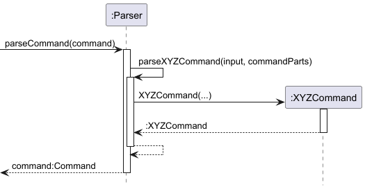

### List feature

The `list` feature allows users to view all scheduled events in the system. 
It is implemented in the `ListCommand` class, which extends the base `Command` class and formats the output to display all events. 
Internally, the `list` operation does not modify any data but simply retrieves and displays the information from `EventList`.

The `ListCommand` class performs the following key operations:

* ListCommand#execute() — Generates a formatted message displaying all events in the list.

These operations are accessible through the `Command` and can be invoked when the list command is entered by the user.

#### Feature Implementation

Given below is an example usage scenario and the behavior of the list feature at each step:

1. User Command Input:
The user enters the command `list` to view all scheduled events.

2. Command Recognition:
The `COMMAND_WORD` is set to "list", enabling the system to recognize the command input and invoke `ListCommand`.

3. Execution of ListCommand#execute():
The `execute()` method retrieves each event from `eventList` and appends it to a formatted output message.
It uses the `String.format` method with `LIST_MESSAGE` to include the total number of events in the message header.
Events are appended to `outputMessage` with numbered formatting for readability.

4. Output Generation:
The method stores the generated `outputMessage` in `this.message`, ready for display.

### Add feature

The `add` feature allows users to remove `Event`s from the `EventList`, `Participant`s or `Item`s from an `Event`.
It is implemented in the `AddCommand` class which extends the base `Command` class, and in the `EventList`.

The feature has three operations, namely:

1. `EventList#AddParticipantToEvent()`, which adds a `Participant` to an `Event` in the `EventList`.
2. `EventList#AddItemFromEvent()`, which adds an `Item` to an `Event` in the `EventList`.
3. `EventList#AddEvent()`, which adds an `Event` to the `EventList`.

These three operations are invoked from `AddCommand` through `AddCommand#execute()`. This overrides the `Command#execute()` operation in `Command`,
and is invoked when the latter operation is called.

In `AddCommand#execute()`, one operation is selected based on the values stored in several members of the `AddCommand` instance, namely:

* `participantName`, the name of the `Participant` to be added to the specified `Event`,
* `itemName`, the name of the `Item` to be added to the specified `Event`,
* `eventName`, the name of the specified `Event`.

The operation selection logic is as follows:

1. If `participantName` is not `null`, `EventList#AddParticipantToEvent()` will be invoked.
2. Otherwise, if `itemName` is not `null`, `EventList#AddItemToEvent()` will be invoked.
3. Otherwise, `EventList#AddEvent()` will be invoked.

This operation selection logic is executed upon the invocation of `AddCommand#execute()`.

The interactions between components during the operation selection in `AddCommand#execute()` are show in the **Sequence Diagram** below:

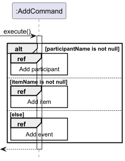

The `EventList#AddParticipantToEvent()` operation works as follows:

1. `EventList` gets the `Event` with the event name `eventName` from the list of `Event`s stored within it.
2. In the selected `Event`, `Event` checks if there is a `Participant` with the name in `participantName` in the list of `Participant`s. If there is one, it throws a `DuplicateDataException`.
3. Otherwise, `Event` creates a new `Participant` object with the parameters passed to it, and adds it to the `Participant` list.

If an `Event` with a name matching `eventName` is not found, the operation returns `false` to indicate that the operation was unsuccessful. Otherwise, the operation returns `true`.

The interactions between components during the execution of the `EventList#AddParticipantToEvent()` operation are show in the **Sequence Diagram** below:

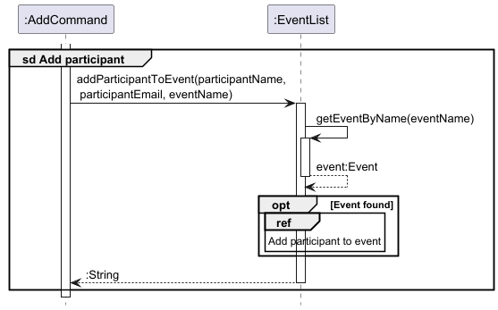
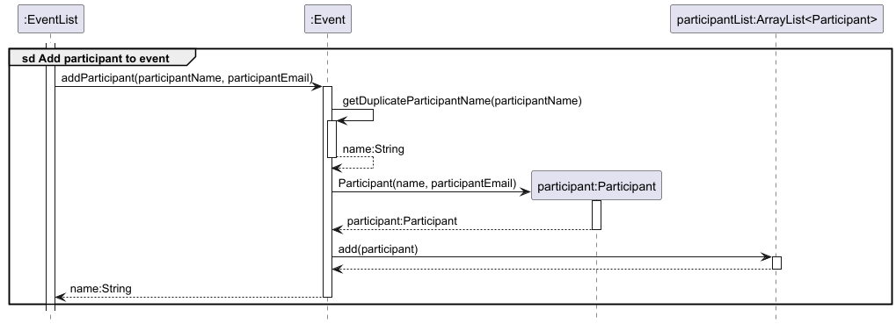

The operation logic for `EventList#AddItemToEvent()` is similar to that for `EventList#AddParticipantToEvent()`, and will not be elaborated upon.

The interactions between components during the execution of the `EventList#AddEvent()` operation are show in the **Sequence Diagram** below:

1. `EventList` checks if there is a `Event` with the name in `eventName` in its list of `Events`s. If there is one, it throws a `DuplicateDataException`.
3. Otherwise, `EventList` creates a new `Event` object with the parameters passed to it, and adds it to the `Event` list.

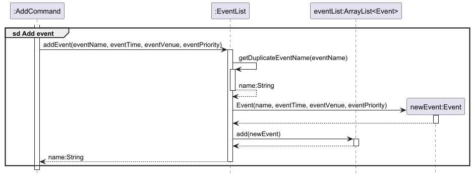

Upon the execution of the above operations, the output message is set based on the operation's return value, to indicate if the removal was successful.

The `Parser` assigns the values of the parameters directly to their respective members, depending on the first command flag in the user input, as follows:

* If the first command flag is the event flag (`-e`), the `Parser` only assigns values to `eventName`.
* If the first command flag is the participant flag (`-p`), the `Parser` assigns values to `eventName` and `participantName`.
* If the first command flag is the item flag (`-m`), the `Parser` assigns values to `eventName` and `itemName`.

### Remove feature

The `remove` feature allows users to remove `Event`s from the `EventList`, `Participant`s or `Item`s from an `Event`.
It is implemented in the `RemoveCommand` class which extends the base `Command` class, and in the `EventList`.

The feature has three operations, namely:

1. `EventList#RemoveParticipantFromEvent()`, which removes a `Participant` from an `Event` in the `EventList`.
2. `EventList#RemoveItemFromEvent()`, which removes an `Item` from an `Event` in the `EventList`.
3. `EventList#RemoveEvent()`, which removes an `Event` from the `EventList`.

These three operations are invoked from `RemoveCommand` through `RemoveCommand#execute()`. This overrides the `Command#execute()` operation in `Command`,
and is invoked when the latter operation is called.

In `RemoveCommand#execute()`, one operation is selected using a logic similar to that for `AddCommand#execute()`. For more details, refer to _Add feature_.

The interactions between components during the operation selection in `RemoveCommand#execute()` are show in the **Sequence Diagram** below:

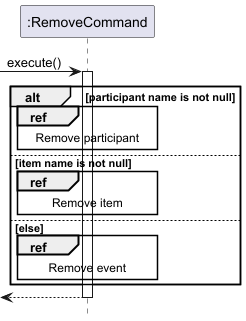

The `EventList#RemoveParticipantFromEvent()` operation works as follows:

1. `EventList` gets the `Event` with the event name `eventName` from the list of `Event`s stored within it.
2. The selected `Event` compares the names of the `Participant`s in its list of `Participant`s with `participantName`.
3. If a `Participant` with a matching name is found, the `Participant` is removed from the `Participant` list of the `Event`.

If an `Event` with a name matching `eventName` or a `Participant` with name matching `participantName` is not found, the operation returns `false`
to indicate that the operation was unsuccessful. Otherwise, the operation returns `true`.

The interactions between components during the above operation are shown in the **Sequence Diagram** below:

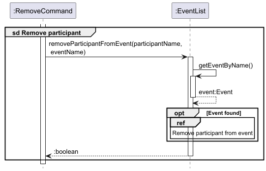


The operation logic for `EventList#RemoveItemFromEvent()` is similar to that for `EventList#RemoveParticipantFromEvent()`.

The `EventList#RemoveEvent()` operation works as follows:

1. `EventList` compares the names of the `Event`s in its list of `Event`s with `eventName`.
2. If an `Event` with a matching name is found, the `Event` is removed from the `Event` list of the `EventList`.

If an `Event` with a name matching `eventName` is not found, the operation returns `false` to indicate that the operation was unsuccessful. Otherwise, the operation returns `true`.

The interactions between components during the above operation are shown in the **Sequence Diagram** below:

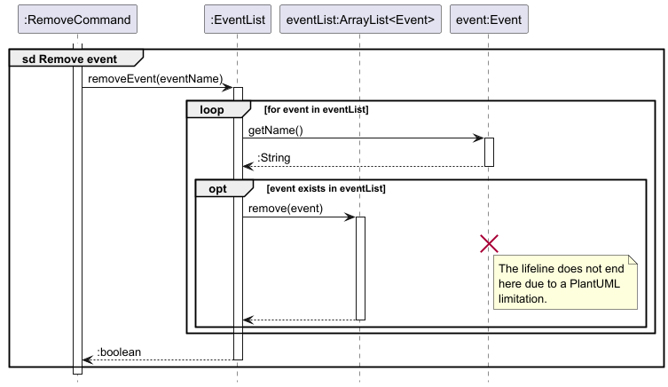

Upon the execution of the above operations, the output message is set based on the operation's return value, to indicate if the removal was successful.

The members in `RemoveCommand`  are similar to those in `AddCommand`, and are set from parameters in the `remove` command by the `Parser` in a similar way.

### View feature

The `view` feature allows users to view the participants or items for a selected event.
The feature comprises `ViewCommand`, which extends `Command`, and has one operation, which shows the user a list of all participants or items for an event.

The above operation is implemented as `ViewCommand#execute()`. This overrides the `Command#execute()` operation in `Command`,  
and is invoked when the latter operation is called.

The output of the operation depends on two variables: 
* `eventName`, the name of the selected event.
* `isViewingParticipants`, which is true if a list of participants is to be shown, and false otherwise.

The `ViewCommand#execute()` operation works as follows:

1. `ViewCommand` gets the `Event` with name `eventName` from `EventList`. If the event is not found, the command's output message will be set to an error message.
2. Depending on the value of `isViewingParticipants`, `ViewCommand` either gets a list of `Participant`s or `Item`s from `Event`.
3. `ViewCommand` constructs an output message of formatted strings that it gets from the `Participant`s or `Item`s in the list.

The interactions between components during the execution of the `view` command are show in the **Sequence Diagrams** below:


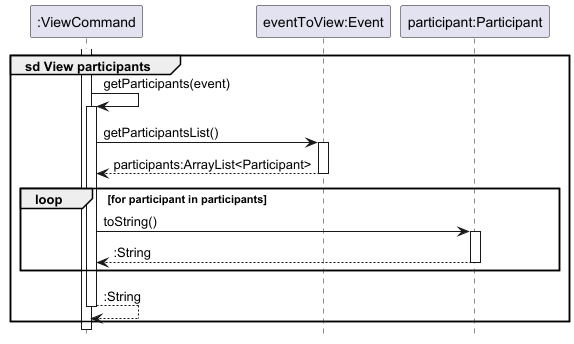


The values of `eventName` and `isViewingParticipants` are set by the user through the event and type parameters in the `view` command respectively.

The `Parser` assigns the event parameter directly to `eventName`. Conversely, it sets `isViewingParticipants` to true if the type parameter value is `participant`, 
to false if the type parameter value is `item`, and treats any other value entered as invalid.

### Mark/unmark feature

The `mark/unmark` feature allows users to mark and unmark `Event`s in the `EventList`, or `Participant`s or `Item`s stored in an `Event`. The feature comprises the abstract `MarkCommand` class,
which extends `Command`, and three child classes, `MarkEventCommand`, `MarkParticipantCommand`, and `MarkItemCommand`.

The feature comprises three operations, namely:
* `MarkEventCommand#execute`, which marks an event as done or not done.
* `MarkParticipantCommand#execute`, which marks a participant as present or absent.
* `MarkItemCommand#execute`, which marks an item as accounted or unaccounted.

The above three operations override the `Command#execute()` operation in `Command`,
and is invoked when the latter operation is called.

#### Feature implementation

Given below is an example usage scenario for `MarkEventCommand#execute`, and how it behaves at each step.

1. The user adds an event `Event 1` to the event list. The mark status for `Event 1` is initially `false` or not done, as shown in the **Object Diagram** below:


2. The user enters the command `mark -e Event 1 -s done` to mark `Event 1` as done. `MarkEventCommand` calls `MarkEventCommand#execute`,
in which it gets the event `Event 1` from the event list, and sets its mark status to `true` or done, as shown in the **Object Diagram** below.


3. The user then enters the command `mark -e Event 1 -s undone` to mark `Event 1` as not done. The `MarkEventCommand` again calls `MarkEventCommand#execute`,
in which it gets the event `Event 1` from the event list, and sets its mark status to `false` or not done.

The interactions between components during the execution of `MarkEventCommand#execute` are shown in the **Sequence Diagram** below:


Upon execution of the command, the output message of `MarkEventCommand` is set to inform the user if the event has been marked done or not done,
or if the operation was unsuccessful (e.g. if the event specified is not present in the event list).

The `MarkParticipantCommand#execute` operation is executed as follows:

1. `EventList` gets the `Event` with the specified event name from its list of `Event`s.
2. The selected `Event` then gets the `Participant` with the specified participant name from its list of `Participant`s.
3. The selected `Participant` is marked present or absent.

The operation would be unsuccessful if the specified `Event` in `EventList`, or the specified `Participant` in `Event` is not found.

The interactions between components during the execution of `MarkParticipantCommand#execute` are shown in the **Sequence Diagram** below:

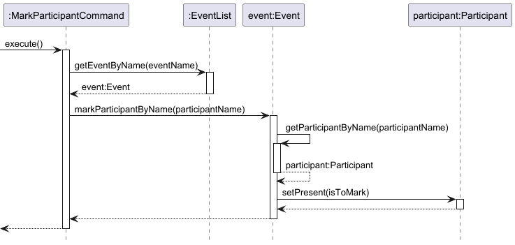

The output message of `MarkParticipantCommand` is set in a similar way as `MarkEventCommand`.

The operation logic for `MarkItemCommand#execute()` is similar to that for `MarkParticipantCommand#execute()`.

The user determines if the `MarkCommand` is to mark or to unmark through the status parameter (indicated by the `-s` flag) in the `mark` command.
The `Parser` then checks this parameter for two possible values and constructs the `MarkCommand` object accordingly.

These two values are as follows:
* For `MarkEventCommand`, `done` to mark, `undone` to unmark,
* For `MarkParticipantCommand`, `present` to mark, `absent` to unmark,
* For `MarkItemCommand`, `accounted` to mark, `unaccounted` to unmark.

Any other values entered for the status parameter will be treated as invalid.

## Product scope
### Target user profile

The target user:

* has a need to organise a large number of events
* organises small-scale events, such that he is able to handle all matters on his own
* prefers typing to mouse interactions
* is comfortable using a command-line interface

### Value proposition

The user is able to organise and manage his events more quickly and efficiently than with a mouse/GUI app

## User Stories

| Version | As a ... | I want to ...                                                   | So that I can ...                                                                         |
|---------|----------|-----------------------------------------------------------------|-------------------------------------------------------------------------------------------|
| v1.0    | new user | see the list of commands                                        | know how to format my input                                                               |
| v1.0    | user     | add new events                                                  | manage future events                                                                      |
| v1.0    | user     | remove events from the events list                              | maintain the event list with events that are relevant and current                         |
| v1.0    | user     | list all current events                                         | know which events are currently ongoing                                                   |
| v1.0    | user     | add participants to a specific event                            | ensure all relevant individuals are included in that event's participant list efficiently |
| v1.0    | user     | remove participants who are no longer coming to specific events | efficiently keep the participant list for that event up-to-date and relevant              |
| v1.0    | user     | view the participant list of an event                           | know who is involved                                                                      |
| v2.0    | user     | mark events as completed                                        | easily track all past events                                                              |
| v2.0    | user     | mark participants present                                       | know exactly who signed up but did not attend the event                                   |
| v2.0    | user     | save events info                                                | still access the information if the program terminates                                    |
| v2.0    | user     | filter events by keywords                                       | find relevant information efficiently                                                     |
| v2.0    | user     | edit event details                                              | update latest changes to events                                                           |
| v2.0    | user     | add items to a specific event                                   | keep track of what I need for that event                                                  |
| v2.0    | user     | mark items as accounted for                                     | make sure I do not prepare excess items for an event                                      |

## Non-Functional Requirements

* Should work for any **mainstream OS** as long as Java 17 is installed.
* Should be able to store data for up to 1000 events without any loss in performance.

## Glossary

* *glossary item* - Definition

## Instructions for manual testing

{Give instructions on how to do a manual product testing e.g., how to load sample data to be used for testing}
