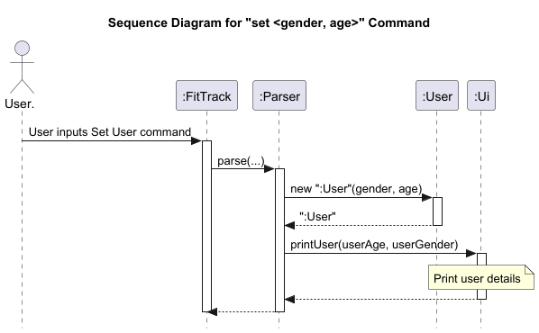
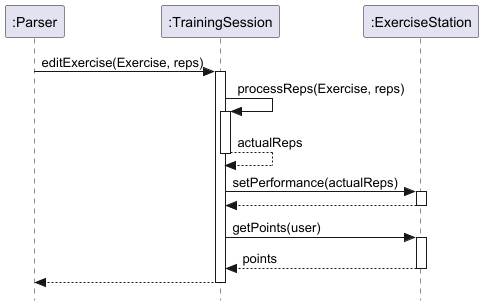
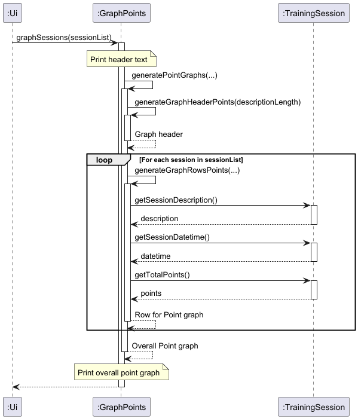
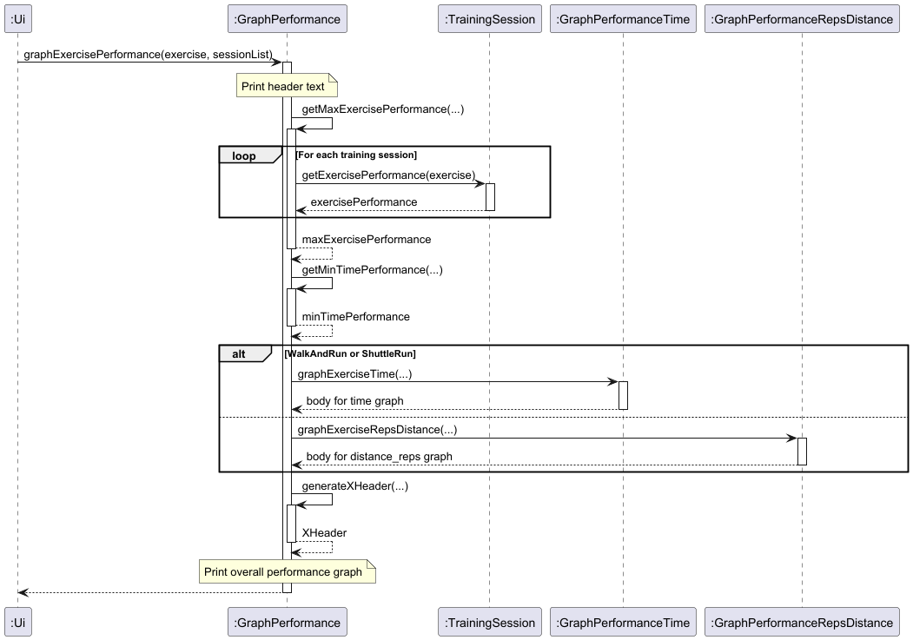
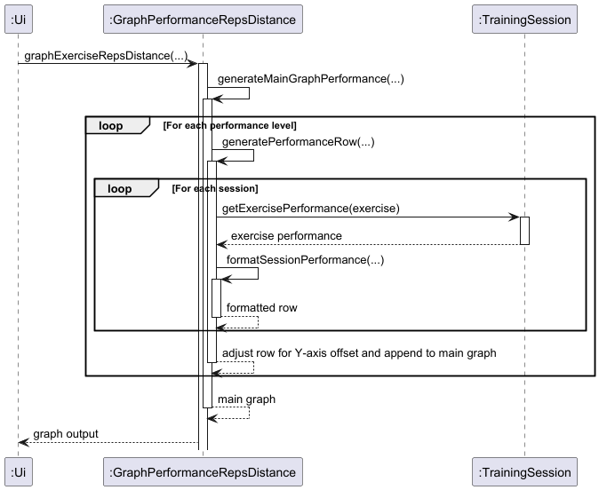

# Developer Guide

## Acknowledgements
* The structure of this Developer Guide is inspired by [AB-3](https://se-education.org/addressbook-level3/DeveloperGuide.html).

## Setting up, getting started
First , **fork** this repo, and clone the fork into your computer.
1. **Configure the JDK**: Follow the guide [se-edu/guides] IDEA: Configuring the JDK to ensure Intellij is configured 
   to use **JDK 17**.
2. **Import the project as a Gradle project**: Follow the guide [se-edu/guides] IDEA: Importing a Gradle project
   to import the project into IDEA.
3. Verify the setup:
   (i) Run the FitTrack.Main and try a few commands like `help`.
   (ii) Run the tests to ensure that all of it pass.

## Design & implementation

### Software Architecture

The Architecture Diagram shown above depicts the high-level design of the FitTrack CLI application.

**FitTrack** is the main class and entry point of the application. It manages high level functionalities by coordinating the four main classes:

| Class           | Functionality                                                                                                |
|-----------------|--------------------------------------------------------------------------------------------------------------|
| Storage         | Manages saving and loading data from a persistent storage file                                               |
| User            | Records the user’s information, such as age and gender, and provides methods to modify or retrieve this data |
| Parser          | Handles parsing of user input, converting it into commands and actions                                       |
| Ui              | Handles user interaction and CLI output, printing messages and data to the console                           |

**Commons** and **Exceptions** represent a collection of lower level Classes and Exceptions used by the main classes above.
**Commons** classes are as follows:

| Class             | Functionality                                                                                                   |
|-------------------|-----------------------------------------------------------------------------------------------------------------|
| FitTrackLogger    | Manages logging for the application, ensuring errors and important events are properly recorded                 |
| TrainingSession   | Represents a single training session, including exercises and metadata (e.g. date and description)              |
| Exercise          | Represents different types of exercises available in the application, like pull-ups or shuttle runs             |
| Calculator        |                                                                                                                 |
| GraphPoints       | Illustrates the cumulative points earned across sessions, showcasing overall fitness progress and achievements. |
| GraphPerformance  | Visualises performance metrics for a specific exercise, adapting for time-based or rep-based tracking.          |
| Reminder          |                                                                                                                 |
| Goal              | Allows users to set, list, and delete specific goals related to fitness and overall well-being                  |
| DailyIntake       | Allows users to add, view, and delete water and food intake logs to monitor daily hydration levels              |

The following Class Diagram elaborates on the interactions between all the classes and their multiplicities.

### Overall Class Diagram

## Features

### Storage
# TO BE UPDATED

[//]: # (![Class_Storage.png]&#40;Images/Class_Storage.png&#41;)

### Set User
When the application starts up, it will prompt the user for their gender and age via the Set User feature.
Their input is processed by Parser and stored in a newly created instance of the User class, which is assigned to the object "user".
Upon successful setting of the gender and age fields, a confirmation of the user's gender and age will be printed in the CLI via the Ui class.

If the user wants to update their age or gender after the initialization process, they can set it again at any time by calling the "set" command.
This performs the same operations, re-instantiating the "user" object with a new User instance with the updated details.

The sequence diagram for this process is shown below. 

[//]: # (![Class_SetUser.png]&#40;Images/Class_SetUser.png&#41;)

### Add Training Session

[//]: # (![Class_AddTrainingSession.png]&#40;Images/Class_AddTrainingSession.png&#41;)

#### 1. Class Interaction Overview
When the user adds a new training session, an instance of the `TrainingSession` class is created. 
This instance initializes an EnumMap, which instantiates the 6 `ExerciseStation` child classes with 
their initial values.
Below is a class diagram showing the EnumMap after an instance of `TrainingSession` is created.

#### 2. Sequence of Event 

1) **User Inputs Add command**:The User initiates the "add <name of the training session>" command by 
   calling Parser with the input.
2) **Instantiation of TrainingSession**: The Parser creates a new TrainingSession object with the 
   current time, description, and user.
3) **Instantiation of Exercise Stations**: Within TrainingSession class, all 6 subclasses of exercise
   stations are instantiated.
4) **UI Interaction**: The Parser calls Ui.printAddedSession(sessionList), which:
   (i) Begins a UI segment
   (ii) Prints a session message
   (iii) Prints the description of the last added session
   (iv) Calls printSessionCount to show the total count
   (v) Ends the segment.
4) Refer to Section on Edit Exercise and Point Calculation for specific implementation of 
   performance metric and point conversion.

### Delete Training Session
When Parser detects the "delete" command, the TrainingSession instance at the user's specified index in sessionList will be 
copied into a new private TrainingSession instance called sessionToDelete. The original instance in sessionList will 
then be deleted. The new private instance is used to print the details of the deleted session, giving the user 
confirmation that the TrainingSession they wished to delete has been successfully deleted. The new TrainingSession
instance is then disposed of.

[//]: # (![Class_DeleteTrainingSession.png]&#40;Images/Class_DeleteTrainingSession.png&#41;)

### List Training Sessions
When Parser detects the "list" command, it calls printSessionList() followed by printSessionCount().
printSessionList() first checks if sessionList is empty. If sessionList is empty, it prints a message saying so.
If sessionList is not empty, it will be iterated through. 
For each TrainingSession in sessionList, getSessionDescription will be called, returning its details as a String.
The TrainingSession's index will be printed, followed by the session description before iterating to the next index.
When all the TrainingSessions have been printed, Ui calls printSessionCount() to display the total number of TrainingSessions in sessionList.

[//]: # (![Class_ListTrainingSessions.png]&#40;Images/Class_ListTrainingSessions.png&#41;)

### View Training Session
When Parser detects the "view" command, it calls printSessionView() on the user's specified session index.
This in turn calls viewSession(), which outputs the details of the TrainingSession instance in the CLI.
This process fetches the details of each of the 6 ExerciseStation classes, which fetch details from the Calculator classes.
These details are then printed to the CLI.

[//]: # (![Class_ViewTrainingSession.png]&#40;Images/Class_ViewTrainingSession.png&#41;)

### Edit Exercise

The **Edit Exercise** feature is managed by the `TrainingSession` class, and is primarily carried out by its 
`editExercise()` function. This feature utilizes the `setPerformance()`and `getReps()` methods from the 
`ExerciseStation` classes to edit the repetitions and timings for the user’s selected 
exercises. Additionally, it calculates the points the user will earn for each exercise based on the updated "rep" or
"timing" values.

When the user wishes to edit a training session, they specify an `Exercise` Enum, and the reps/timing to be inputted.
These variables are then passed to the`editExercise` function. This function calls the relevant methods to update the 
repetitions or timings and calculates the corresponding points for the specified exercise.

The following sequence diagram illustrates the function calls involved in this process:

Additionally, the state diagram below shows the end state of the `editExercise` function after execution of the command,
`editExercise(Exercise.PULL_UP, 1)` and `editExercise(Exercise.SHUTTLE_RUN, "16.0")`:

### Goals

Goals allow users to set specific objectives within the application. Users can add goals using the
`add-goal <description> <date> <time>` command and view a list of all current goals via list-goal. 
Goals can also be deleted by their unique IDs using the `delete-goal <goal ID>` command. 
This feature provides users with a clear structure for setting, tracking, and managing their fitness objectives. 
Goals are stored separately from training sessions and are accessible as a distinct list.

### Mood Log

The Mood Log feature allows users to record and monitor their emotional well-being over time. 
Users can add a mood entry with a description and view a list of all mood logs. Mood entries can be 
deleted to allow for privacy or to remove outdated logs. This feature helps users maintain a mental
health record alongside their physical fitness data.

### Food Intake

The FoodTracker class enables users to log, view, and delete food entries. Each entry records a 
food item's name, quantity, and calorie count. This data is used to calculate total calorie intake,
which can be viewed as a summary. The functionality supports daily nutritional monitoring, helping 
users align their diet with fitness goals.

### Water Intake

Water intake tracking helps users monitor their daily hydration. Users can add entries with the 
amount of water consumed, view a list of past entries, and delete specific records if needed. 
This feature aids in maintaining a balanced hydration level, which is essential for overall health 
and fitness performance.

### Points Calculation

The **points calculation feature** is a significant part of the `ExerciseStation` system. It allows for the calculation
of user-specific points based on their performance in various exercises (e.g., pull-ups, sit-ups). This process 
involves interaction between the `ExerciseStation` and the `Calculator` classes, ensuring that the correct points are
assigned based on predefined lookup tables.

#### 1. Class Interaction Overview

Each `ExerciseStation` subclass (e.g., `PullUpStation`, `SitUpStation`) has its own implementation of the `getPoints()` 
method. The main responsibility of this method is to invoke the `calculatePoints()` function from the 
respective **calculator** class (e.g., `PullUpCalculator`, `SitUpCalculator`), which holds the points calculation logic.

#### 2.  Sequence of Events:

1. **User Inputs Performance**: The user’s performance (e.g., number of pull-ups) is passed to the
   `setPerformance()` method in the exercise station.

2. **Invoke Points Calculation**: Once the performance is set, the `getPoints()` method is called. 
   This method interacts with the calculator class (e.g., `PullUpCalculator`) to compute the points.

3. **Calculator Logic**: The calculator class uses a lookup table, which maps the user's performance 
   to points based on their age and gender. The points are returned to the exercise station, where they are stored.

### Training Data Visualisation (Points/Performance)

This **visualisation feature** called from the `Ui` class enables users to generate various visualisations of training 
session data, providing insights into progress and performance. This feature, due to its size and complexity, is 
implemented in helper classes (expanded below) instead of directly within `Ui`.

The `GraphPerformance` and `GraphPoints` classes handle data visualisation for training sessions, each designed to offer 
targeted graphing capabilities:
   - `GraphPoints`: Displays points accumulated across training sessions.
   - `GraphPerformance`: Focuses on visualising performance metrics (reps or timings) for specific exercises.

These classes inherit from the abstract `GraphBase` class, which consolidates shared methods for both subclasses.
A class diagram is provided below to illustrate the structure and inheritance of the these classes:

#### 1. `GraphPoints` Class

The `GraphPoints` class provides two main functions to visualise points across training sessions, as outlined below:

   1. `graphSessions(ArrayList<TrainingSession> sessionList)`
      - Purpose: Display the total points achieved in each training session.
      - Usage: Takes a list of `TrainingSession` objects and outputs a graph showing cumulative points per session.
      
   2. `graphExercisePoints(Exercise exercise, ArrayList<TrainingSession> sessionList)`
      - Purpose: Visualise points progression for a specified exercise over multiple sessions.
      - Usage: Takes an `Exercise` object and a list of `TrainingSession` objects, displaying a points graph focused on 
the specified exercise.

##### Workflow of the graph points functions

   1. **Header Generation**:
      - The header string is generated for each column in the visualisation.

   2. **Row Generation**:
      - Each row, representing a training session, is iteratively generated.
      - Rows are appended to the a `StringBuilder`, which accumulates the entire graph's content.

   3. **CLI Output**:
      - The accumulated graph string is printed to the CLI.

A sequence diagram is shown below to illustrate the workflow:

> Note: The primary difference between `graphSessions` and `graphExercisePoints` lies in the initial header string and 
> the calculation method called. (`getTotalPoints` for sessions, `getExercisePoints` for specific exercises).
   
#### 2. `GraphPerformance` Class

The `GraphPerformance` class is an abstract base for generating visual representations of exercise performance across 
multiple training sessions. Given the need for varied visualisation styles based on exercise type, `GraphPerformance` is 
extended by two specific subclasses:

   - `GraphPerformanceTime`: Handles time-based exercises. 
   - `GraphPerformanceRepsDistance`: Manages rep-based and distance-based exercises.

Each subclass customises the graph body content generation to reflect the nature of the exercise data.
The shared aspects, including headers and basic layout, are handled in `GraphPerformance` to avoid repetitive code.
The primary method of `GraphPerformance` is `graphExercisePerformance` which handles both time based and rep based 
visualisations for performance. Its workflow is described below. 

##### Workflow of `graphExercisePerformance` 

   1. **Generate X-Axis Headers**
      - Create a String for X-Axis headers, including session descriptions and dates.

   2. **Generate Graph Body Content**
      - Subclasses `GraphPerformanceTime` and `GraphPerformanceRepsDistance` generate their respective row content for 
time or reps data, represented by asterisks. This row content is compiled in a String.

   3. **Display Output to CLI** 
      - Compiles the X-Axis headers, and body content in a String to display a complete graph. This is directly output 
to the command line, allowing users to visualize exercise progress.       

#### Static Design Rationale

> All methods within `GraphPoints and `GraphPerformance` are static as they work independently of instance-specific
> data. 

#### `GraphPerformanceRepsDistance` Class

This class is responsible for visualising reps or distance, over time. It generates a **bar** graph where the y-axis 
represents the units of performance (reps or distance), and each training session is represented by a column on the 
x-axis. Each row within a column contains asterisks (`*`), where each asterisks represents one unit of performance.
In addition, the total points for each session displayed at the top of the column. 

##### Workflow 
   1. **Building the String for a row**
      - For each level of performance (row), iterate through each training session.
      - If that session's performance is greater than or equal to the current level, an asterisk (`*`) is placed in that 
column.
      - If that session's performance is greater than the current level by 1 performance metric, append the points 
achieved for that exercise in that particular training session.
      
   2. **Repeat for all performance levels**
      - Iteratively place asterisks for each level of performance, starting from the maximum, 
until the minimum level is reached.

Below is a sequence diagram detailing the above workflow:

#### `GraphPerformanceTime` Class
##### Purpose
The `GraphPerformanceTime` class is a specialized subclass of `GraphPerformance`, designed to handle the visual 
representation of time-based performance data for *Shuttle Run* and *Walk and Run* stations. This class formats 
and prints a scatter graph of normalized time data against sessions to the command line. Normalized data points
are represented with an asterisk (`*`).

##### Normalization Process
The class uses a normalization technique to represent the data points on a scale from 0 to 1, ensuring that the
graph maintains a consistent appearance regardless of the raw performance range. This scaling allows for a 
uniform distribution of data across the graph, enhancing readability.

**$ \text{Normalized Performance} = \frac{\text{Performance} - \text{Min Performance}} 
{\text{Max Performance} - \text{Min Performance}}$**

##### Implementation Details of graph body
1. **Generating Main Graph Content**:
   - The `buildMainContents` method is responsible for constructing the main body of the graph. It iterates through a
     range of normalized values, decrementing by 0.05 to create rows representing performance levels from 1.00 to 0.00.
   - For each row, the `processResultToPoint` method checks whether the normalized performance of each training session
     aligns with the current level. If it matches within a tolerance (e.g., 0.025), an asterisk (`*`) is placed on the 
     graph.

2. **Formatting Display Time**:
   - The `processDisplayTime` method formats the raw time data depending on the type of exercise. 
   -  (i) For *Shuttle Run*, the time is shown in seconds to one decimal place.
   - (ii) For *Walk and Run* exercises are displayed in `mm:ss` format, with leading zeros added for consistency.
   - If there are no time data found in a specfic session, `NIL` is displayed.

##### Edge Cases Handled
- **No Data Available**: If no valid performance time data exists, the graph will not display any asterisk (`*`) for 
  that session.
- **Consistent Performance**: When all performance values are the same, the class ensures that a line of points is 
  printed at the top of the graph to indicate uniformity.

## Product scope
### Target user profile

FitTrack is made for students who are training for NAPFA, who should not be distracted by a GUI interface.

### Value proposition

FitTrack provides a convenient way of recording and tracking their NAPFA performance. 
It automatically computes their scores and awards, saving them time and hassle. 
It is optimized to be simple, lightweight and minimalistic so that students do not have to exit their study environment.

## User Stories

Priorities: High (must have) - * * *, Medium (nice to have) - * *, Low (unlikely to have) - *

| Priority | As a ... | I want to ...                          | So that I can ...                                   |
|----------|----------|----------------------------------------|-----------------------------------------------------|
| ***      | new user | see usage instructions                 | refer to them when I forget how to use the app      |
| ***      | user     | add a new training session             | record my NAPFA training progress                   |
| ***      | user     | edit my new training session           | record the reps/time I attained for each exercise   |
| ***      | user     | delete a training session              | remove a session that was added by mistake          |
| ***      | user     | view a list of past training sessions  | track the number of training sessions I have done   |
| ***      | user     | view the details of a training session | have an overview of my performance for that session |
| ***      | user     | store my training sessions             | keep a record of my sessions when the app is closed |
| **       | user     | calculate my NAPFA points per exercise | conveniently view my standing for each station      |
| *        | user     | know my NAPFA achievement level        | know my NAPFA standard at a glance                  |
| ***      | user     | add, view, and delete goals            | keep track of my fitness objectives                 |
| ***      | user     | log my mood regularly                  | monitor and improve my mental well-being            |
| ***      | user     | log food intake and calorie count      | manage my diet alongside my fitness regimen         |

## Non-Functional Requirements

Any mainstream OS with Java 17 installed

## Glossary

* NAPFA: National Physical Fitness Award
* Mainstream OS: Windows, Linux, Unix, macOS

## Instructions for manual testing

**Help Function**
1. Prerequisites: None.    

2. Test case 1: `help` 
   Expected: The help message will be printed, guiding the user on valid commands.    

   Test case 2: `help blah` 
   Expected: The help message will be printed, guiding the user on valid commands.  

**Set User**
1. Prerequisites: None.    

2. Test case 1: `set male 12` 
   Expected: The user's gender and age will be set to `male` and `12`.    

   Test case 2: `set female 15` 
   Expected: The user's gender and age will be set to `female` and `15`.

**Add Training Session**
1. Prerequisites: User's gender and age must be valid.    

2. Test case 1: `add session1` 
   Expected:  
   `Got it. I've added a new training session:`  
   `1. session1` 
   `There are 1 sessions in the list.`   

   Test case 2: `add session2 blah` 
   Expected:  
   `Got it. I've added a new training session:`  
   `2. session2 blah` 
   `There are 2 sessions in the list.`   

   Test case 3: `add 07/11/2024` 
   Expected:  
   `Got it. I've added a new training session:`  
   `3. 07/11/2024` 
   `There are 3 sessions in the list.`   

   Test case 4: `add ` 
   Expected: `Please provide a valid session name`.

**List all Training Sessions**
1. Prerequisites: None.    

2. Test case 1: `list` (sessionList is empty)  
   Expected: `Your session list is currently empty.`    
   
   Test case 2: `list` (sessionList has 2 TrainingSessions)  
   Expected:  
   `Here are your training sessions:`  
   `session1 | 29/10/2024 12:40` 
   `session2 | 29/10/2024 12:41` 
   `There are 2 sessions in the list.` 

**View a Training Session**
1. Prerequisites: None.    

2. Test case 1: `view 1` (sessionList is empty)  
   Expected: `Please provide a valid session index.`    

   Test case 2: `view 1` (sessionList contains at least 1 TrainingSession) 
   Expected:  
   `Training Session: session1` 
   `Training Datetime: 07/11/2024 12:40` 
   `Pull Up Station | Reps: 0 | 0 points` 
   `Shuttle Run Station | Time: NA | 0 points` 
   `Sit and Reach Station | Distance: 0cm | 0 points` 
   `Sit Up Station | Reps: 0 | 0 points` 
   `Standing Broad Jump Station | Distance: 0cm | 0 points` 
   `Walk and Run Station | Time: NA | 0 points` 
   `Total points: 0` 
   `Overall Award: No Award` 

**Edit a Training Session**
1. Prerequisites: None.    

2. Test case 1: `edit 1 PU 30` (sessionList is Empty)  
   Expected: `Please provide a valid session index, station and reps.`    

   Test case 2: `edit 1 PU 30` (sessionList contains at least 1 TrainingSession)  
   Expected: 
   `Training Session: session1`  
   `Training Datetime: 07/11/2024 12:40`  
   `Pull Up Station | Reps: 30 | 5 points`  
   `Shuttle Run Station | Time: NA | 0 points`  
   `Sit and Reach Station | Distance: 0cm | 0 points`  
   `Sit Up Station | Reps: 30 | 0 points`  
   `Standing Broad Jump Station | Distance: 0cm | 0 points`  
   `Walk and Run Station | Time: NA | 0 points`  
   `Total points: 5`  
   `Overall Award: No Award`  

**Delete a Training Session**
1. Prerequisites: None.    

2. Test case 1: `delete` (No session index is inputted)  
   Expected: `Please provide a valid session index.`    

   Test case 2: `delete -1` (Invalid session inputted)  
   Expected: `Please provide a valid session index.`    

   Test case 3: `delete 1` (Input session index is valid)  
   Expected:
   `Got it. I've deleted this training session:session1`  
   `There are 1 sessions in the list.`  

**Exit FitTrackCLI**
1. Prerequisites: None.    

2. Test case 1: `exit 1` (User's exit input contains extraneous non-empty characters)  
   Expected: `I'm sorry, I don't know what that means.`    

   Test case 2: `exit` (User's exit input only contains the exit command.)  
   Expected:
   `Bye! Hope to see you again soon!`  
