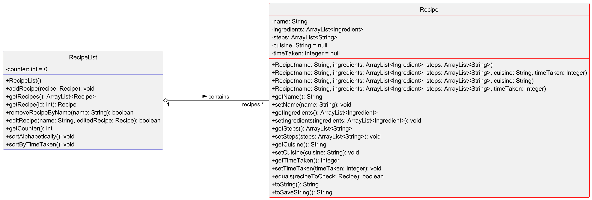
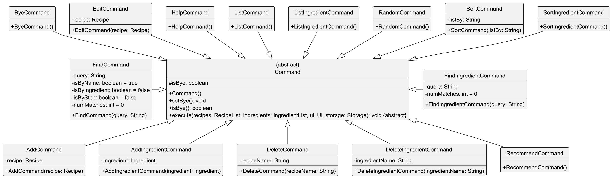
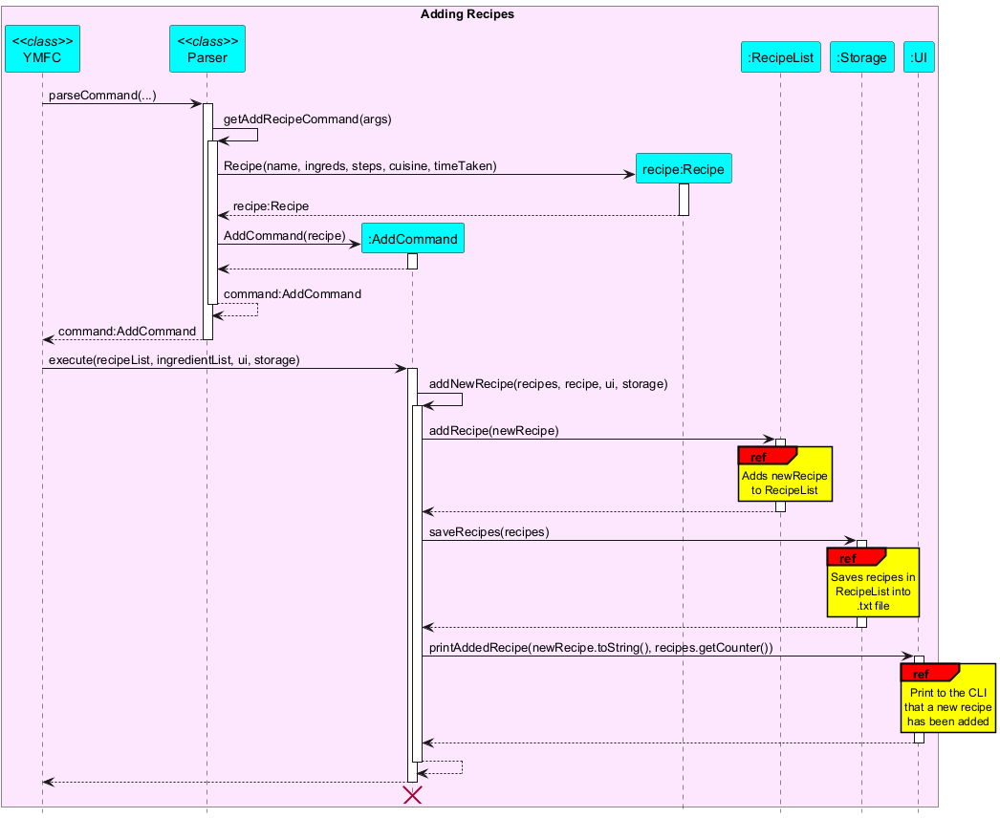

# Developer Guide

# Developer Guide

----------------------------------
## Table of Contents
1. [Acknowledgements](#acknowledgements)
2. [Design & Implementation](#design--implementation)
    - [Architecture](#architecture)
      - [Main Components of the Architecture](#main-components-of-the-architecture)
      - [How the Architecture Components Interact](#how-the-architecture-components-interact-with-each-other)
    - [Ui Class](#ui-class)
    - [Recipe Class](#recipe-class)
    - [RecommendedRecipe Class](#recommendedrecipe-class)
      - [SortByPercentMatch Class](#sortbypercentmatch-class)
    - [RecipeList Class](#recipelist-class)
    - [Ingredient Class](#ingredient-class)
    - [IngredientList Class](#ingredientlist-class)
    - [Command Classes](#command-classes)
        - [Command Base Class](#1-the-command-base-class)
        - [Command Flow](#2-command-flow-using-command-classes)
        - [Adding New Command Classes](#3-adding-new-command-classes)
    - [Command Child Classes](#command-child-classes)
        - [AddCommand](#1-addcommand-class)
        - [EditCommand](#2-editcommand-class)
        - [AddIngredientCommand](#3-addingredientcommand-class)
        - [ByeCommand](#4-byecommand-class)
        - [DeleteCommand](#5-deletecommand)
        - [DeleteIngredientCommand](#6-deleteingredientcommand-class)
        - [FindCommand](#7-findcommand-class)
        - [FindIngredientCommand](#8-findingredientcommand-class)
        - [HelpCommand](#9-helpcommand-class)
        - [ListCommand](#10-listcommand-class)
        - [ListIngredientCommand](#11-listingredientcommand-class)
        - [RandomCommand](#12-randomcommand-class)
        - [RecommendCommand](#13-recommendcommand-class)
        - [SortCommand](#14-sortcommand-class)
        - [SortIngredientCommand](#15-sortingredientcommand-class)
    - [Parser Class](#parser-class)
    - [Storage Class](#storage-class)
    - [Exception Class](#exception-class)
3. [Appendix: Requirements](#appendix-requirements)
    - [Product Scope](#product-scope)
    - [User Stories](#user-stories)
    - [Non-Functional Requirements](#non-functional-requirements)
    - [Glossary](#glossary)
4. [Appendix: Instructions for manual testing](#appendix-instructions-for-manual-testing)
----------------------------------

## Acknowledgements

Certain aspects of YMFC's code was inspired from the following member(s) IPs:

[Sanjith](http://github.com/KSanjith/ip) : Referenced to develop the working mechanisms of YMFC's storage class and save load system

[Luyang](http://github.com/3CCLY/ip) : Referenced to develop the working mechanisms of YMFC's storage class

[Sze Kang](https://github.com/gskang-22/ip) : Referenced to develop the working mechanisms of YMFC's command classes

## Design & implementation

<!-- @@author seanngja -->

### Architecture

The **_Architecture Diagram_** given above explains the high-level design of the YMFC App.

Given below is a quick overview of main components and how they interact with each other.

#### Main components of the architecture
`YMFC` (consisting of `YMFC` class) is in charge of app launch and shut down. 
- At app launch, it initialises the other components in the correct sequence, and connects them up with each other.

The bulk of the app's work is done by the following components:
- `UI`: The user interface of the App. It handles user interaction, namely reading user input and displaying messages.
- `Storage`: Reads data from, and writes data to, the hard disk. 
Responsible for loading and saving both recipes and ingredients.
- `Parser`: The command parser. It interprets user inputs,
turning them into `Command` objects that are executed by the app. 
- `Command`: Represents actions that the user can perform, such as adding, deleting or listing recipes and ingredients.
- `RecipeList` and `IngredientList`: These manage collections of recipes and ingredients, respectively. 

#### How the architecture components interact with each other
The sequence diagram below shows how the components interact with each other when the application is first launched.

<!-- @@author 3CCLY -->

### Ui Class
The Ui class deals with taking in inputs from an input stream (in this case, the user input through `System.in`), 
and then printing messages read-able by the user (through `System.out`).

### Recipe Class
The Recipe class represents a singular recipe added by the user or loaded from the storage database. 
A valid recipe object contains the following fields:
+ Name
+ List of Ingredients
+ List of Steps
+ Cuisine (optional)
+ Time taken (optional)

The formatting of how a recipe is displayed and saved is handled by this class.

### RecommendedRecipe Class
The RecommendedRecipe class represents a recipe to recommend to the user with relevant statistics.
A RecommendedRecipe object contains the following:
+ Recipe (The Recipe being recommended)
+ Percentage Match (The percentage of the recipe's ingredients that the user has in their list of ingredients)
+ Missing Ingredients (A list of the recipe's ingredients that the user lack)

#### SortByPercentMatch Class
The SortByPercentMatch class inherits from the Java Comparator class to overload its compare method. 
This is used to allow Java methods like sort which uses this method to know how to compare two RecommendedRecipe 
objects based on their percentage match attribute. The compare method is implemented such that when used to sort 
a list of RecommendedRecipe objects, they are sorted in descending order based on their percentage match attribute.

### RecipeList Class
The RecipeList class represents a list of recipes. 
This class handles the addition, deletion and editing of recipes.

<!-- @@author -->

Shown below is a class diagram detailing the interaction between `RecipeList` and `Recipe`:

### Ingredient Class
The 'Ingredient' class represents an individual ingredient added by the user or loaded from the storage database.

#### Implementation Details

1. Attributes:
   - String Name
     - Stores the name of the ingredient, which serves as its unique identifier
2. Constructor:
   - Ingredient(String name): 
     - Initializes an Ingredient instance with the specified name
3. Methods:
   - boolean equals(Ingredient ingredientToCheck):
     - Compares the current Ingredient with another Ingredient based on their names
   - @Override boolean equals(Object object):
     - An overridden method that supports Java collection operations like retainAll and removeAll, allowing ingredients 
to be compared based on name alone in collections
   - String toString():
     - Returns the ingredient's name
   - String toSaveString():
     - Returns a formatted string for saving ingredient data to a text file
     - Follows the format "new n/<ingredient_name>"

The formatting of how an ingredient is displayed and saved is handled by this class.

### IngredientList Class
The IngredientList class represents a list of ingredients.
This class handles the addition, deletion and editing of ingredients.

#### Implementation Details
1. Attributes: 
   - ArrayList<Ingredient> ingredients: Holds a list of Ingredient objects, representing the ingredients in the list
2. Constructor:
   - IngredientList():
   Initializes an empty list of ingredients.
3. Methods:
   - void addIngredient(Ingredient ingredient):
     - Adds an Ingredient to the list 
   - ArrayList<Ingredient> getIngredients():
     - Returns the current list of ingredients
   - Ingredient getIngredient(int id):
     - Retrieves an ingredient by its index in the list
   - boolean removeIngredientByName(String name):
     - Removes an Ingredient by name
     - Returns true if the ingredient was found and removed, otherwise false
   - int getCounter():
     - Returns the number of ingredients in the list
   - void sortAlphabetically():
     - Sorts the ingredients list alphabetically by ingredient name

Shown below is a class diagram detailing the interaction between `IngredientList` and `Ingredient`:

### Command Classes
The command class deals with all the possible commands accepted by YMFC, with each command representing a specific 
recognised user input (E.g. ListCommand representing the command to list all the recipes in the recipeList).

#### 1. The `Command` base class
- Serves as the abstract parent class for all specific commands
- Defines the basic structure and contract that each command class must follow
- Each command performs a unique operation and can be expanded to include more functionality as required by YMFC
- Standardises command behavior and establishes an inheritance hierarchy, allowing for the seamless addition and usage 
of command functionalities
- Core Elements:
  - `isBye`: A flag that tracks if an exit command has been issued, following which programme should be terminated
    - Set by calling `setBye() `
    - Checked with `isBye()`
  - `execute()`: An abstract method that must be implemented by all subclasses
    - Defines the primary action performed by the command (E.g. add new recipe to `recipeList` for `AddRecipeCommand`)

Shown below is a class diagram detailing the interaction between the parent `Command` class and it's child classes:

#### 2. Command Flow (Using `Command` Classes)
1. Initialisation: Instantiate a `Command` subclass by passing user input through the `parseCommand()` of `Parser`
2. Exit signal: If a command is meant to terminate the app (E.g. `ByeCommand`), set `isBye` to true
3. Execution: Call `execute()`, performing the desired action and interacting with YMFC's data and UI components

#### 3. Adding new `Command` Classes
- Create a `Command` class:
  1. Inherit from `Command`: Each new command class extends `Command`, inheriting its structure and providing a specific 
implementation of the `execute()` method
  2. Override `execute()`: Implement `execute()` to define how the command should interact with `RecipeList`,
`IngredientList`, `Ui`, and `Storage`
  3. Additional methods (Optional): You may add helper methods within the class if necessary
- Register the command
  1. Update the `parseCommand()` method in `Parser` to recognise and instantiate the new command

### `Command` Child Classes

#### 1. `AddCommand` Class
- The `AddCommand` class adds a newly created Recipe object to the current RecipeList object's ArrayList of Recipes
 
Shown below is a sequence diagram detailing how a new recipe is added using the AddCommand object,
starting from parsing the user input to the addition of the recipe to the recipeList object,
to finally printing the "recipe added" message to the User on the CLI:

<!-- @@author 3CCLY -->

#### 2. `EditCommand` Class

- The EditCommand class finds an existing recipe in RecipeList by name, and then replaces its parameter
with the new parameters that the user inputted.

Shown below is a sequence diagram detailing how an existing recipe is modified using the EditCommand object,
starting from parsing the user input to finding the exiting recipe in the RecipeList object,
to finally modifying and saving the recipe in the RecipeList:

<!-- @@author -->

<!-- @@author gskang-22 -->
#### 3. `AddIngredientCommand` Class
- The `AddIngredientCommand` class is responsible for adding a new ingredient to `IngredientList`
- When executed, it takes an `Ingredient` object, adds it to the `IngredientList`, saves the updated list to the storage, and 
notifies the user of the addition through the `Ui` component.

#### 4. `ByeCommand` Class
- The `ByeCommand` class represents the command to terminate the application
- When executed, it signals the application to exit by setting a flag (`isBye`) 
and displays a farewell message to the user

#### 5. `DeleteCommand`
- The `DeleteCommand` class represents the command to delete a recipe by its name from `RecipeList` 
- When executed, this command searches `RecipeList` for the recipe, removes it if found, saves the updated list to the
storage, and informs the user of the successful deletion or an error if the recipe is not found

#### 6. `DeleteIngredientCommand` Class
- The `DeleteIngredientCommand` class is responsible for deleting an `Ingredient` from the `IngredientList` based on 
its name
- Upon execution, it removes the specified `Ingredient`, updates the `Ingredientlist` in the storage, and notifies 
the user about the deletion
<!-- @@author -->
#### 7. `FindCommand` Class
- The `FindCommand` class is used to find recipes based on user's query and options
- When executed, a list of matching recipes extracted from `RecipeList` will be printed out using the 
`printFind()` method from the `Ui` class
- If no matching recipe is found, method `printEmptyFind()` will be used instead

<!-- @@author seanngja -->

#### 8. `FindIngredientCommand` Class
- The `FindIngredientCommand` attempts to find an existing `Ingredient` in `IngredientList` by name
- When executed, it calls the `printFindIngred()` method of the `Ui` to display the matching ingredients found
- If no matching ingredient is found, the `printEmptyFindIngred()` of `Ui` method is called instead

<!-- @@author -->
<!-- @@author gskang-22 -->
#### 9. `HelpCommand` Class
- The `HelpCommand` class is designed to provide the user with a list of available commands and detailed instructions 
on how to use them
- When executed, it calls the `printHelp()` method of the `Ui` to display help information

#### 10. `ListCommand` Class
- The `ListCommand` class is designed to list all the recipes present in the `RecipeList`
- When executed, it retrieves the list of recipes and displays them to the user through the UI

#### 11. `ListIngredientCommand` Class
- The `ListIngredientCommand` class is responsible for listing all the ingredients currently stored in the 
`IngredientList`
- When executed, it retrieves the list of ingredients and displays them to the user through the UI
<!-- @@author -->
<!-- @@author 3CCLY -->

#### 12. `RandomCommand` Class
- The `RandomCommand` class is designed to show the user a randomly selected recipe from their recipeList
- When executed, it retrieves the list of recipes, pick a random valid index for the list, and display that recipe 
through the `Ui`

#### 13. `RecommendCommand` Class
- The `RecommendCommand` class selects all recipes from the RecipeList and displays those that share common 
ingredients with what is found in IngredientList. The percentage of the recipe's ingredients that are shared, as well 
as the missing ingredients are also determined
- When executed, it retrieves the list of ingredients, and search through the list of recipes for those that meet the 
criteria. These recipes are then displayed through `Ui` with their accompanying statistics, listed by descending order 
of their percentage match

<!-- @@author -->

<!-- @@author KSanjith -->

#### 14. `SortCommand` Class
- The `SortCommand`class is designed to sort all the existing recipes in the `RecipeList`
- When executed, depending on the user's input parameter, it will either sort the recipes alphabetically by name,
or in ascending numerical order of time taken
- It will then list out the newly ordered recipes to the user, and update the save file with the new order of recipes

#### 15. `SortIngredientCommand` Class
- The `SortIngredientCommand`class is designed to sort all the existing ingredients in the `IngredientList`
- When executed, it will sort the ingredients alphabetically by name
- It will then list out the newly ordered ingredients to the user, and update the save file with the new order of ingredients

<!-- @@author -->

### Parser Class
Self-explanatory, made for parsing user's input command. This class only consist of one public static method 
`parseCommand()` in order to process input commands.
The remaining private methods represent separated cases for different commands.

Shown below is a sequence diagram detailing how the Parser class interprets the user's CLI input
and returns the appropriate command object containing the user's input parameters.

Note: The getXYZCommand(args) method is used for commands that further need to extract parameters from the user's input
beyond just the command name, such as for the sort command which needs to extract from the input, the type of sort that
is requested. In the example of the sort command, the getXYZCommand(args) method is called `getSortCommand()`.

<!-- @@author KSanjith -->

### Storage Class
The Storage class 
1. Saves the User's added recipes to a .txt file
  - Empty save files are created immediately once YMFC is launched for the first time
    - New empty save files are also created upon launch if the previous ones were deleted by the user
  - Saving recipes is done every time the recipes are modified in any way (such as added, deleted, sorted or edited)
  - The following Sequence diagram shows how the saveRecipes() method in the Storage class
    saves all the created recipes into the .txt file

2. reads the .txt save files to load in past saved recipes immediately when app is launched
  - If the user had modified the save files to contain irregular lines of text, then they are simply ignored.
    - A message is printed to the CLI to alert user of the irregular lines within the save file
    - The irregular lines are immediately deleted from the save files
  - The following Sequence diagram shows how the loadRecipes() method in the Storage class
    loads in past saved recipes from the .txt file when the app is first launched
    - The sequence diagram does not show how irregular lines within save files are handled, 
and only describes how regular, properly formatted save files are loaded in

The Storage class also saves and loads the list of user's available ingredients to another .txt save file.
The mechanisms with which it does so is highly similar to the 2 sequence diagrams above.

### Exception Class
There is a main YMFCException class that extends the Exception class.
There are then 4 child exception classes that inherit from the YMFCException class.
* EmptyListException
  * This exception is thrown mainly in the Parser class whenever the user inputs a command that would not work 
  with an empty list of recipes or ingredients
    * e.g. If the recipe cookbook is empty, and the user inputs the edit command, then this exception will be thrown. 
      * Because there are no recipes in the empty cookbook that can be editted
* InvalidArgumentException
  * This exception is mainly thrown in the Parser class whenever the user's input command has invalid arguments
* InvalidCommandException
  * This exception is mainly thrown in the Parser class whenever the user's input does not match the available commands
* InvalidSaveLineException
  * This exception is thrown whenever the save-load system encounters lines within the save file that 
  are not of the proper syntax

<!-- @@author -->

## Appendix: Requirements

### Product scope

#### Target user profile:
Cooks who want to quickly search up recipes or get recipe suggestions based on their available ingredients

#### Value proposition:
Cooks these days have more recipes than they know how to handle, and our product will help them store, retrieve and
search through their recipes with ease. Users can also store their available inventory of ingredients. 
Prompts, tags and ingredients can be used to search a curated database, and even recommend recipes that contain 
whatever ingredients the user has on hand.

### User Stories

| Version | As a ...              | I want to ...                                              | So that I can ...                                                 |
|---------|-----------------------|------------------------------------------------------------|-------------------------------------------------------------------|
| v1.0    | user                  | start and close the application                            | use it only when I need to                                        |
| v1.0    | new user              | see list of available commands                             | refer to them when I forget how to use the application            |
| v1.0    | constant user         | see list of all my added recipes                           | glance at all my recipes in one go                                |
| v1.0    | picky user            | remove recipes from database                               | remove recipes that do not fit my changing taste buds             |
| v1.0    | forgetful user        | store information about my recipes in a database           | have a tool to track organise my recipes                          |
| v2.0    | heavy user            | find specific recipes by name/ingredients/steps            | filter through my huge list of recipes easily to find what I want |
| v2.0    | unimaginative cook    | get random recipe suggestions                              | find and cook recipes that I have not cooked recently             |
| v2.0    | broke college student | get recipe suggestions based on my current ingredient list | get recipes that I can currently cook with my limited ingredients |
| v2.0    | user                  | sort my recipes alphabetically                             | glance through my recipes more easily                             |
| v2.0    | busy user             | sort my recipes by preparation time                        | find a recipe that I can cook within my current time limit        |
| v2.0    | picky user            | edit the recipes inside my database                        | update and improve on my existing recipes                         |
| v2.0    | forgetful user        | store information about my ingredients in a database       | have a tool to track and organise my ingredients                  |
| v2.0    | user                  | remove ingredients from database                           | remove ingredients that I have used/expired                       |
| v2.0    | forgetful user        | find specific ingredients by name                          | check if I have the specific ingredient in my inventory           |
| v2.0    | user                  | sort the ingredients in my inventory list                  | glance through my inventory list more easily                      |
| v2.0    | constant user         | see list of all the ingredients in my inventory list       | glance at all my ingredients in one go                            |

<!-- @@author KSanjith -->

### Non-Functional Requirements

1. Should work on any Windows, MacOS or Linux computers as long as Java 17 is installed
2. Should be easy to move data between different devices
   - Only 2x .txt files need to be moved over
3. Should be easy to search, find and sort recipes in the list
   - There is the extensive ability to search for matching recipes by name, ingredients or steps
   - There is also the ability to sort recipes by name or by time taken

### Glossary

* *Recipe* - A plan on cooking a meal that contains various attributes such as name, ingredients needed,
steps to take, cuisine and time taken to cook
* *RecipeList* - The collection of Recipes added by the user
* *Ingredient* - A specific cooking item that the user currently has in their inventory
* *IngredientList* - The collection of Ingredients available to the user

## Appendix: Instructions for manual testing

**Here is a sample list of inputs that can be used to test the available features:**

At any point in the following sequence (after the current command has fully executed), you can close YMFC and reopen it,
and your database of recipes and ingredients would have been saved and loaded in fully.

1. `help`
   - Lists out all available commands
2. `add n/Omelette i/eggs i/salt s1/crack eggs in pan s2/add salt t/4`
3. `add n/Pasta i/pasta i/tomato paste s1/boil pasta s2/mix pasta with tomato paste c/Italian t/15`
4. `add n/Apple Juice i/apples i/sugar i/water s1/throw apples, sugar and water into a blender and blend t/2`
   - Steps 2 to 4 adds three new recipes to the recipe list
5. `list`
   - Lists out all the added recipes
6. `sort s/name`
   - Sorts and lists the added recipes alphabetically by name
7. `sort s/time`
   - Sorts and lists the added recipes by time, in ascending order
8. `find i/sugar`
   - Lists out all recipes that have an ingredient called sugar
9. `edit e/Pasta i/pasta i/olive oil i/garlic s1/saute garlic in oil s2/boil paste s3/add pasta to garlic and mix`
   - Edits the existing recipe called Pasta and replaces it's ingredients and steps to the ones above
   - Since n/NAME and c/CUISINE and t/TIME parameters are not entered, they will remain UNCHANGED
10. `random`
    - Picks an added recipe at random and displays it
11. `delete n/Apple Juice`
    - Deletes the recipe named "Apple Juice"
12. `new n/eggs`
13. `new n/garlic`
14. `new n/salt`
    - Steps 12 to 14 adds three new ingredients to the ingredient list
15. `listI`
    - Lists out all the added ingredients
16. `sortI`
    - Sorts and lists the added ingredients alphabetically by name
17. `findI salt`
    - Lists out all ingredients that contain the word 'salt'
18. `recommend`
    - Ranks recipes based on how many of the ingredients it needs are available in the ingredient list
19. `deleteI n/eggs`
    - Deletes the ingredient named "eggs"
20. `bye`
    - Ends the app

Refer to the [UserGuide](https://ay2425s1-cs2113-w13-1.github.io/tp/UserGuide.html) 
for the full list of available commands, their syntax, and their expected behaviour.

<!-- @@author -->
