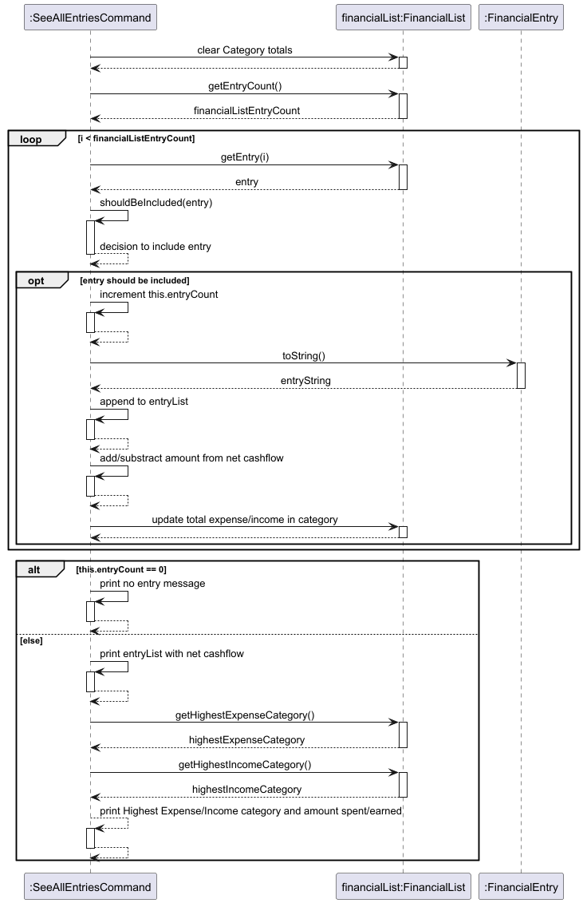

# Developer Guide

## Acknowledgements

{list here sources of all reused/adapted ideas, code, documentation, and third-party libraries -- include links to the original source as well}

## Design & implementation

{Describe the design and implementation of the product. Use UML diagrams and short code snippets where applicable.}

---

### FinancialList Component

#### Overview

The `FinancialList` class is responsible for storing and managing all financial entries in the application,
including both `Expense` and `Income`. The `FinancialEntry` class acts as the base class, with `Expense` and `Income` 
classes extending it to represent specific types of transactions.

#### Class Structure

The `FinancialList` class contains the following attributes:
- entries: A list of FinancialEntry objects representing all stored transactions.

The `FinancialEntry` class contains the following attributes:
- **description**: A string describing the transaction.
- **amount**: A double representing the amount of the transaction.
- **date**: A LocalDate object representing the date of the transaction.

The Expense and Income classes extend FinancialEntry, each maintaining the base attributes while
adding context to the type of financial entry.

### Implementation Details

#### FinancialList Class Diagram
- The FinancialList stores and manages FinancialEntry objects, including Expense and Income.
---

### Commands

#### Overview

The abstract class `Command` has been implemented to introduce an additional layer
of abstraction between the `AppUi` class and command execution,
allowing for separation of handling command keywords and executing commands.

The diagram below shows the inheritance of the `Command` class.

#### Listing Entries
Overview

The list entries feature is facilitated by the `SeeAllEntriesCommand` class.
Similarly, classes `SeeAllExpensesCommand` and `SeeAllIncomesCommand` facilitate 
listing out expenses and incomes respectively.

The user invokes the command to list entries by entering the following command:
```list [income|expense] [/from START_DATE] [/to END_DATE]```.

This is parsed by the InputParser, returning a HashMap `commandArgumets`, containing the following optional arguments:
- `argument`: Represents the type of Financial Entries to be printed. Can take 3 possible values:
  - `expense`: List only Expenses
  - `income`: List only Incomes
  - `null`: List both Expenses and Incomes
- `/from`: Represents the starting date from which Financial Entries should be listed. If value is `null`,
there is no defined starting date.
- `/to`: Represents the ending date by which Financial Entries should be listed. If value is `null`,
  there is no defined ending date.

`CommandHandler` invokes the `listHelper` method to create and execute the command to list the financial entries
according to the following logic.

{add in diagram}

The interaction between the command classes and the `FinancialList` is as follows,
using `SeeAllEntriesCommand` as an example:



The `shouldBeIncluded()` method marks Financial Entries as "should be included" if their
dates fall between the start and end dates passed into the command object.

`SeeAllExpensesCommand` and `SeeAllIncomesCommand` interact with the `FinancialList` in a 
similar manner, with the only difference being that the `shouldBeIncluded()` methods of
`SeeAllExpensesCommand` and `SeeAllIncomesCommand` only mark `Expenses` and `Incomes` as "should be included".

### Exceptions and Logging

An exception class `FinanceBuddyException` is thrown when users use the product wrongly.
Exceptions are caught at the nearest instance that they occur.

*Insert code snippet here.*

### Storage
The `Storage` class has been implemented to store the `FinancialList` into a file. 
In that case, user can restore his/her progress even if they have terminate the program.

The function `updateStorage` should be called whenever the `FinancialList` in an `AppUi` object. 
It will overide the file with the up-to-date `FinancialList` that has been converted to string.

*more guid coming up*

## Product scope
### Target user profile

{Describe the target user profile}

### Value proposition

{Describe the value proposition: what problem does it solve?}

## User Stories

|Version| As a ... | I want to ... | So that I can ...|
|--------|----------|---------------|------------------|
|v1.0|new user|see usage instructions|refer to them when I forget how to use the application|
|v2.0|user|find a to-do item by name|locate a to-do without having to go through the entire list|

## Non-Functional Requirements

{Give non-functional requirements}

## Glossary

* *glossary item* - Definition

## Instructions for manual testing

{Give instructions on how to do a manual product testing e.g., how to load sample data to be used for testing}
