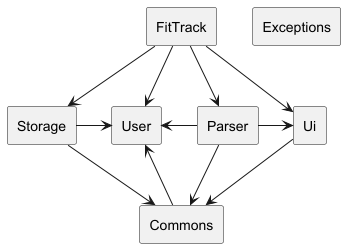
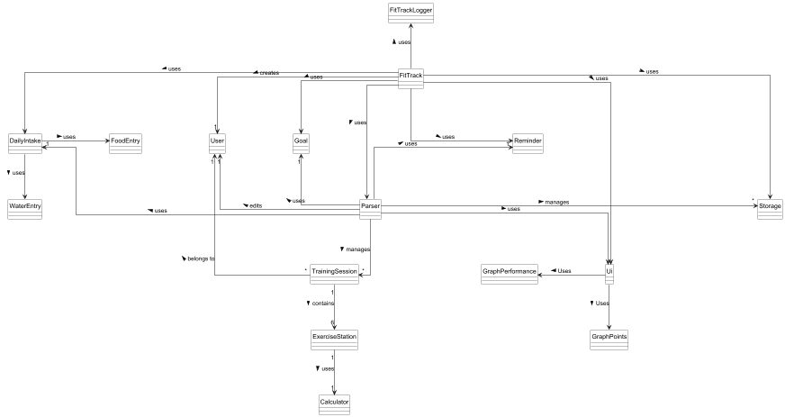
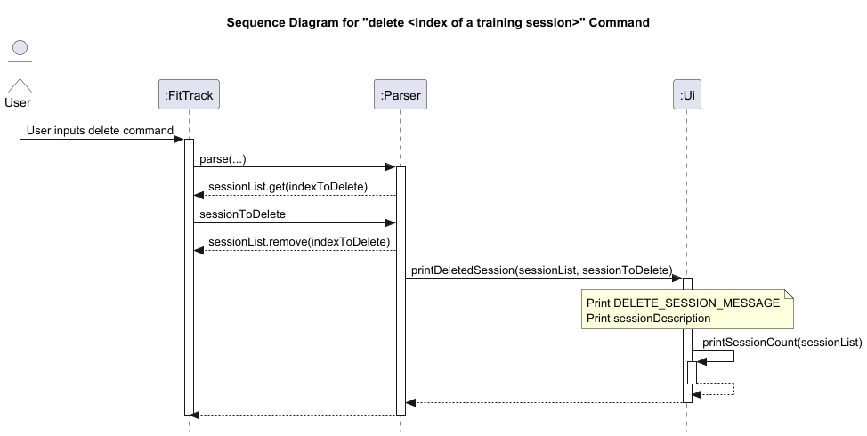
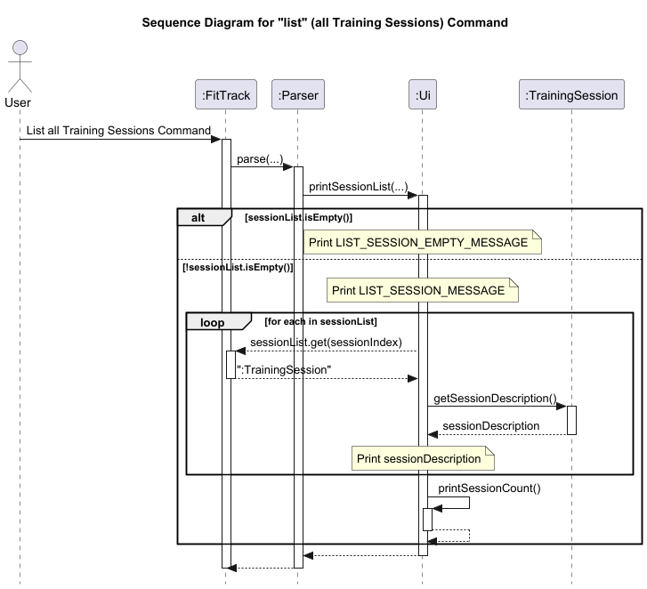
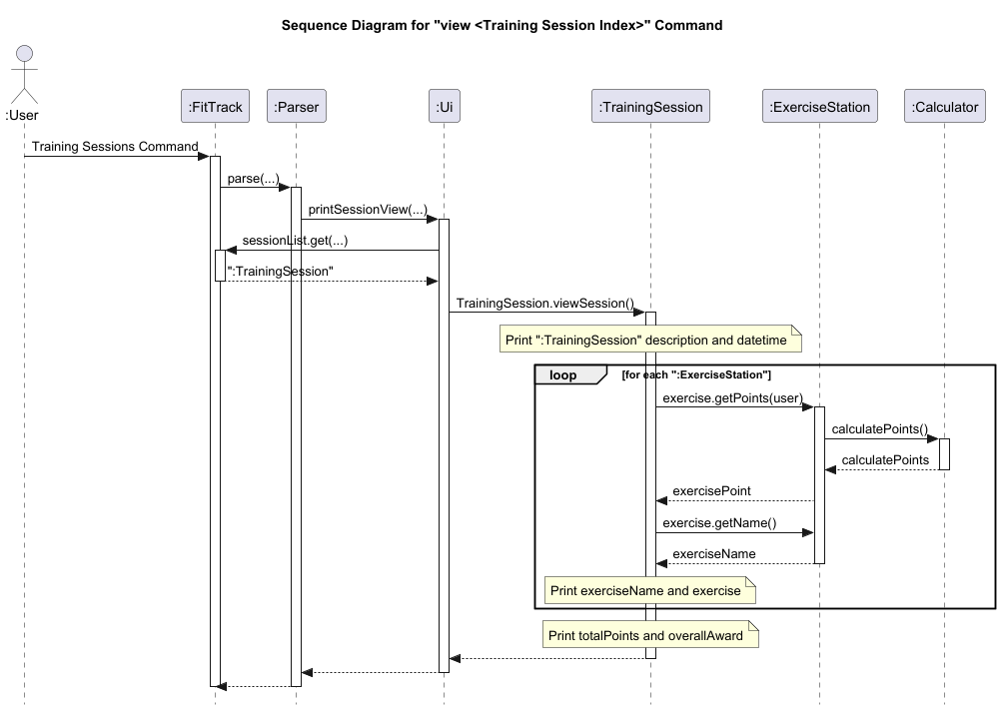

# Developer Guide

## Acknowledgements

{list here sources of all reused/adapted ideas, code, documentation, and third-party libraries -- include links to the original source as well}

## Setting up, getting started
First , **fork** this repo, and clone the fork into your computer.
1. **Configure the JDK**: Follow the guide [se-edu/guides] IDEA: Configuring the JDK to ensure Intellij is configured 
   to use **JDK 17**.
2. **Import the project as a Gradle project**: Follow the guide [se-edu/guides] IDEA: Importing a Gradle project
   to import the project into IDEA.
3. Verify the setup:
   (i) Run the FitTrack.Main and try a few commands like `help`.
   (ii) Run the tests to ensure that all of it pass.

## Design & implementation

### Software Architecture

The Architecture Diagram shown above depicts the high-level design of the FitTrack CLI application.

**FitTrack** is the main class and entry point of the application. It manages high level functionalities by coordinating the four main classes:

| Class           | Functionality                                                                                                |
|-----------------|--------------------------------------------------------------------------------------------------------------|
| Storage         | Manages saving and loading data from a persistent storage file                                               |
| User            | Records the user’s information, such as age and gender, and provides methods to modify or retrieve this data |
| Parser          | Handles parsing of user input, converting it into commands and actions                                       |
| Ui              | Handles user interaction and CLI output, printing messages and data to the console                           |

**Miscellaneous** and **Exceptions** represent a collection of lower level Classes and Exceptions used by the main classes above.
**Miscellaneous** classes are as follows:

| Class           | Functionality                                                                                                |
|-----------------|--------------------------------------------------------------------------------------------------------------|
| FitTrackLogger  | Manages logging for the application, ensuring errors and important events are properly recorded              |
| TrainingSession | Represents a single training session, including exercises and metadata (e.g. date and description)           |
| Exercise        | Represents different types of exercises available in the application, like pull-ups or shuttle runs          |
| MoodLog         | Allows users to add, view, and delete mood entries, tracking mental health progress over time                |
| FitnessGoal     | Allows users to set, list, and delete specific goals related to fitness and overall well-being               |
| FoodTracker     | Enables users to log, view, and delete food items, with calorie tracking for nutritional monitoring          |
| WaterTracker    | Allows users to add, view, and delete water intake logs to monitor daily hydration levels                    |
|-----------------|--------------------------------------------------------------------------------------------------------------|

The following Class Diagram elaborates on the interactions between all the classes and their multiplicities.

### Overall Class Diagram

## Features

### Storage
# TO BE UPDATED

[//]: # (![Class_Storage.png]&#40;Images/Class_Storage.png&#41;)

### Set User
When the application starts up, it will prompt the user for their gender and age via the Set User feature.
Their input is processed by Parser and stored in a newly created instance of the User class, which is assigned to the object "user".
Upon successful setting of the gender and age fields, a confirmation of the user's gender and age will be printed in the CLI via the Ui class.

If the user wants to update their age or gender after the initialization process, they can set it again at any time by calling the "set" command.
This performs the same operations, re-instantiating the "user" object with a new User instance with the updated details.

The sequence diagram for this process is shown below. 

[//]: # (![Class_SetUser.png]&#40;Images/Class_SetUser.png&#41;)

### Add Training Session

[//]: # (![Class_AddTrainingSession.png]&#40;Images/Class_AddTrainingSession.png&#41;)

#### 1. Class Interaction Overview
When the user adds a new training session, an instance of the `TrainingSession` class is created. 
This instance initializes an EnumMap, which instantiates the 6 `ExerciseStation` child classes with 
their initial values.
Below is a class diagram showing the EnumMap after an instance of `TrainingSession` is created.

#### 2. Sequence of Event 

1) **User Inputs Add command**:The User initiates the "add <name of the training session>" command by 
   calling Parser with the input.
2) **Instantiation of TrainingSession**: The Parser creates a new TrainingSession object with the 
   current time, description, and user.
3) **Instantiation of Exercise Stations**: Within TrainingSession class, all 6 subclasses of exercise
   stations are instantiated.
4) **UI Interaction**: The Parser calls Ui.printAddedSession(sessionList), which:
   (i) Begins a UI segment
   (ii) Prints a session message
   (iii) Prints the description of the last added session
   (iv) Calls printSessionCount to show the total count
   (v) Ends the segment.
4) Refer to Section on Edit Exercise and Point Calculation for specific implementation of 
   performance metric and point conversion.

### Delete Training Session
When Parser detects the "delete" command, the TrainingSession instance at the user's specified index in sessionList will be 
copied into a new private TrainingSession instance called sessionToDelete. The original instance in sessionList will 
then be deleted. The new private instance is used to print the details of the deleted session, giving the user 
confirmation that the TrainingSession they wished to delete has been successfully deleted. The new TrainingSession
instance is then disposed of.

[//]: # (![Class_DeleteTrainingSession.png]&#40;Images/Class_DeleteTrainingSession.png&#41;)

### List Training Sessions
When Parser detects the "list" command, it calls printSessionList() followed by printSessionCount().
printSessionList() first checks if sessionList is empty. If sessionList is empty, it prints a message saying so.
If sessionList is not empty, it will be iterated through. 
For each TrainingSession in sessionList, getSessionDescription will be called, returning its details as a String.
The TrainingSession's index will be printed, followed by the session description before iterating to the next index.
When all the TrainingSessions have been printed, Ui calls printSessionCount() to display the total number of TrainingSessions in sessionList.

[//]: # (![Class_ListTrainingSessions.png]&#40;Images/Class_ListTrainingSessions.png&#41;)

### View Training Session
When Parser detects the "view" command, it calls printSessionView() on the user's specified session index.
This in turn calls viewSession(), which outputs the details of the TrainingSession instance in the CLI.
This process fetches the details of each of the 6 ExerciseStation classes, which fetch details from the Calculator classes.
These details are then printed to the CLI.

[//]: # (![Class_ViewTrainingSession.png]&#40;Images/Class_ViewTrainingSession.png&#41;)

### Edit Exercise

The **Edit Exercise** feature is managed by the `TrainingSession` class, and is primarily carried out by its 
`editExercise()` function. This feature utilizes the `setPerformance()`and `getReps()` methods from the 
`ExerciseStation` classes to edit the repetitions and timings for the user’s selected 
exercises. Additionally, it calculates the points the user will earn for each exercise based on the updated "rep" or
"timing" values.

When the user wishes to edit a training session, they specify an `Exercise` Enum, and the reps/timing to be inputted.
These variables are then passed to the`editExercise` function. This function calls the relevant methods to update the 
repetitions or timings and calculates the corresponding points for the specified exercise.

The following sequence diagram illustrates the function calls involved in this process:

Additionally, the state diagram below shows the end state of the `editExercise` function after execution of the command,
`editExercise(Exercise.PULL_UP, 1)` and `editExercise(Exercise.SHUTTLE_RUN, "16.0")`:

### Goals

Goals allow users to set specific objectives within the application. Users can add goals using the
`add-goal <description> <date> <time>` command and view a list of all current goals via list-goal. 
Goals can also be deleted by their unique IDs using the `delete-goal <goal ID>` command. 
This feature provides users with a clear structure for setting, tracking, and managing their fitness objectives. 
Goals are stored separately from training sessions and are accessible as a distinct list.

### Mood Log

The Mood Log feature allows users to record and monitor their emotional well-being over time. 
Users can add a mood entry with a description and view a list of all mood logs. Mood entries can be 
deleted to allow for privacy or to remove outdated logs. This feature helps users maintain a mental
health record alongside their physical fitness data.

### Food Intake

The FoodTracker class enables users to log, view, and delete food entries. Each entry records a 
food item's name, quantity, and calorie count. This data is used to calculate total calorie intake,
which can be viewed as a summary. The functionality supports daily nutritional monitoring, helping 
users align their diet with fitness goals.

### Water Intake

Water intake tracking helps users monitor their daily hydration. Users can add entries with the 
amount of water consumed, view a list of past entries, and delete specific records if needed. 
This feature aids in maintaining a balanced hydration level, which is essential for overall health 
and fitness performance.

### Points Calculation

The **points calculation feature** is a significant part of the `ExerciseStation` system. It allows for the calculation
of user-specific points based on their performance in various exercises (e.g., pull-ups, sit-ups). This process 
involves interaction between the `ExerciseStation` and the `Calculator` classes, ensuring that the correct points are
assigned based on predefined lookup tables.

#### 1. Class Interaction Overview

Each `ExerciseStation` subclass (e.g., `PullUpStation`, `SitUpStation`) has its own implementation of the `getPoints()` 
method. The main responsibility of this method is to invoke the `calculatePoints()` function from the 
respective **calculator** class (e.g., `PullUpCalculator`, `SitUpCalculator`), which holds the points calculation logic.

#### 2.  Sequence of Events:

1. **User Inputs Performance**: The user’s performance (e.g., number of pull-ups) is passed to the
   `setPerformance()` method in the exercise station.

2. **Invoke Points Calculation**: Once the performance is set, the `getPoints()` method is called. 
   This method interacts with the calculator class (e.g., `PullUpCalculator`) to compute the points.

3. **Calculator Logic**: The calculator class uses a lookup table, which maps the user's performance 
   to points based on their age and gender. The points are returned to the exercise station, where they are stored.

### Points/Performance Visualisation 
The `Graph` class is responsible for creating and displaying various visualizations of training session data. 
It supports three types of graphing functions:

   1. `graphSessions(ArrayList<TrainingSession> sessionList)`
      - Displays the total points achieved per session, across training sessions.
      
   2. `graphExercisePoints(Exercise exercise, ArrayList<TrainingSession> sessionList)`
      - Show points progression for a specific exercise across training sessions.
      
   3. `graphExercisePerformance(Exercise exercise, ArrayList<TrainingSession> sessionList)`
      - Visualizes the reps or timings achieved for a specific exercise over training sessions.
   
> These functions are designed as static class methods because they work independently of instance-specific data, 
> focusing on session data passed as parameters. Helper functions are primarily used to format and build graph strings, 
> with the final output displayed directly to the CLI within these main functions.

#### Displaying point graphs (Function 1 and 2)
The functions `graphSessions` and `graphExercisePoints` follow a similar workflow to visualize points across sessions. 
Only `graphSessions` will be explained/shown for clarity. The core steps in the workflow are as follows:

1. **Header Generation**:
   - The header string is generated first to provide context for each column in the visualization.

2. **Row Generation**:
   - Each row, representing a training session, is progressively generated.
   - Rows are appended to the main `StringBuilder`, which accumulates the entire graph's content.

3. **CLI Output**:
   - The accumulated graph string is printed to the CLI,

> Note: The difference between graphSessions and graphExercisePoints lies in the initial printed string and whether 
> getTotalPoints or getExercisePoints is called within each row.

#### Displaying performance graphs (Function 3)
The `graphExercisePerformance` function visualizes specific performance levels (like reps or timing) achieved for an 
exercise across multiple sessions. The core steps in the workflow are as follows:

1. **Identify Maximum Performance Level**:
   - Locate the highest performance level recorded for the specified exercise across all sessions.
   - This directly corresponds to the upper range of the Y axis.

2. **Generate Headers and Graph Content**:
   - Format the X-axis headers with session descriptions and dates.
   - Build rows iteratively based on session performance, with asterisks indicating reps/timings for each session.

3. **Display Graph Output**:
   - Print the final performance graph to the CLI, providing a visual representation of the user's progress over time.

## Product scope
### Target user profile

{Describe the target user profile}

### Value proposition

{Describe the value proposition: what problem does it solve?}

## User Stories

Priorities: High (must have) - * * *, Medium (nice to have) - * *, Low (unlikely to have) - *

| Priority | As a ... | I want to ...                          | So that I can ...                                   |
|----------|----------|----------------------------------------|-----------------------------------------------------|
| ***      | new user | see usage instructions                 | refer to them when I forget how to use the app      |
| ***      | user     | add a new training session             | record my NAPFA training progress                   |
| ***      | user     | edit my new training session           | record the reps/time I attained for each exercise   |
| ***      | user     | delete a training session              | remove a session that was added by mistake          |
| ***      | user     | view a list of past training sessions  | track the number of training sessions I have done   |
| ***      | user     | view the details of a training session | have an overview of my performance for that session |
| ***      | user     | store my training sessions             | keep a record of my sessions when the app is closed |
| **       | user     | calculate my NAPFA points per exercise | conveniently view my standing for each station      |
| *        | user     | know my NAPFA achievement level        | know my NAPFA standard at a glance                  |
| ***      | user     | add, view, and delete goals            | keep track of my fitness objectives                 |
| ***      | user     | log my mood regularly                  | monitor and improve my mental well-being            |
| ***      | user     | log food intake and calorie count      | manage my diet alongside my fitness regimen         |

## Non-Functional Requirements

{Give non-functional requirements}

## Glossary

* *glossary item* - Definition

## Instructions for manual testing

{Give instructions on how to do a manual product testing e.g., how to load sample data to be used for testing}
