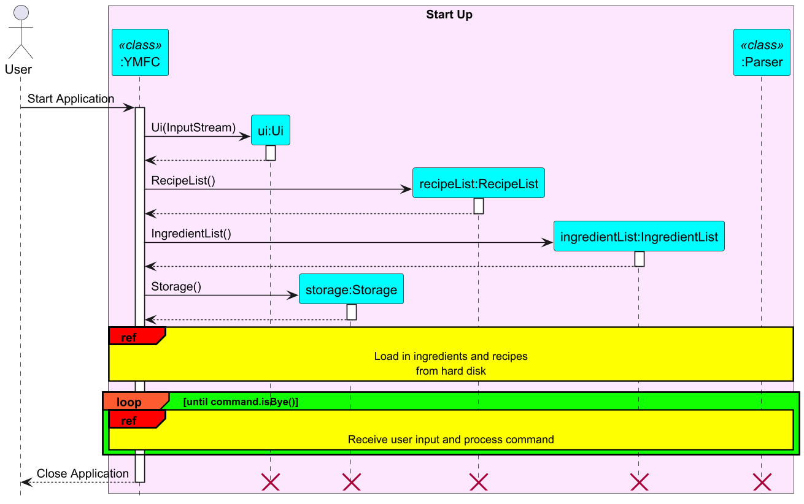
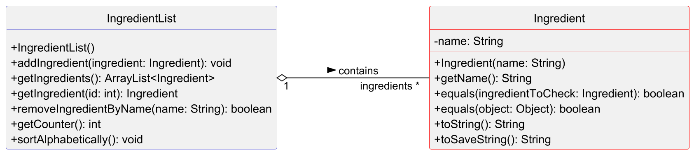
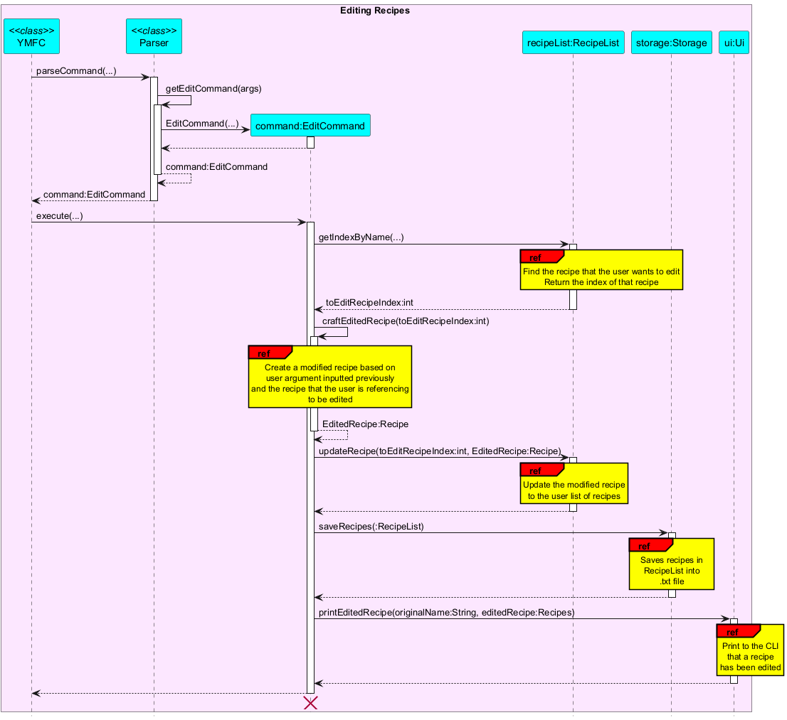

# Developer Guide

## Acknowledgements

{list here sources of all reused/adapted ideas, code, documentation, and third-party libraries 
-- include links to the original source as well}

## Design & implementation

{Describe the design and implementation of the product. Use UML diagrams and short code snippets where applicable.}

### Architecture

The **_Architecture Diagram_** given above explains the high-level design of the App.

Given below is a quick overview of main components and how they interact with each other.

#### Main components of the architecture
`YMFC` (consisting of `YMFC` class) is in charge of app launch and shut down. 
- At app launch, it initialises the other components in the correct sequence, and connects them up with each other.

The bulk of the app's work is done by the following components:
- `UI`: The user interface of the App. It handles user interaction, namely reading user input and displaying messages.
- `Storage`: Reads data from, and writes data to, the hard disk. 
Responsible for loading and saving both recipes and ingredients.
- `Parser`: The command parser. It interprets user inputs,
turning them into `Command` objects that are executed by the app. 
- `Command`: Represents actions that the user can perform, such as adding, deleting or listing recipes and ingredients.
- `RecipeList` and `IngredientList`: These manage collections of recipes and ingredients, respectively. 

### How the architecture components interact with each other
The sequence diagram below shows how the components interact with each other when the application is launched.

### Ui Class
The ui class deals with taking in inputs from an input stream (in this case, the user input through `System.in`), 
and then printing messages read-able by the user (through `System.out`). 

### Recipe Class
The recipe class represents a singular recipe added by the user or loaded from the storage database. 
A valid recipe object contains the following fields:
+ Name
+ List of Ingredients
+ List of Steps
+ Cuisine (optional)
+ Time taken (optional)

The formatting of how a recipe is displayed and saved is handled by this class.

### RecipeList Class
The recipelist class represents a list of any non-negative integer number of recipes. 
This class handles the addition, deletion and editing of recipes.

Below is the interaction between `RecipeList` and `Recipe`:

### Ingredient Class
The ingredient class represents a singular ingredient added by the user or loaded from the storage database.
A valid recipe object contains the following field:
+ Name

The formatting of how a recipe is displayed and saved is handled by this class.

### IngredientList Class
The Ingredientlist class represents a list of any non-negative integer number of ingredients.
This class handles the addition, deletion and editing of ingredients.

Shown below is a class diagram detailing how it interacts with the Ingredient class.

### Command Classes
The command class deals with all the possible commands accepted by YMFC, with each command representing a specific 
recognised user input (Eg. ListCommand representing the command to list all the recipes in the recipeList).

#### 1. The `Command` base class
- Serves as the abstract parent class for all specific commands
- Defines the basic structure and contract that each command class must follow
- Each command performs a unique operation and can be expanded to include more functionality as required by YMFC
- Standardises command behavior and establishes an inheritance hierarchy, allowing for the seamless addition and usage 
of command functionalities
- Core Elements:
  - `isBye`: A flag that tracks if an exit command has been issued, following which programme should be terminated
    - Set by calling `setBye() `
    - Checked with `isBye()`
  - `execute()`: An abstract method that must be implemented by all subclasses
    - Defines the primary action performed by the command (E.g. add new recipe to `recipeList` for `AddRecipeCommand`)

#### 2. Command Flow (Using `Command` Classes)
1. Initialisation: Instantiate a `Command` subclass by passing user input through the `parseCommand()` of `Parser`
2. Exit signal: If a command is meant to terminate the app (E.g. `ByeCommand`), set `isBye` to true
3. Execution: Call `execute()`, performing the desired action and interacting with YMFC's data and UI components

#### 3. Adding new `Command` Classes
- Create a `Command` class:
  1. Inherit from `Command`: Each new command class extends `Command`, inheriting its structure and providing a specific 
implementation of the `execute()` method
  2. Override `execute()`: Implement `execute()` to define how the command should interact with `RecipeList`,
`IngredientList`, `Ui`, and `Storage`
  3. Additional methods (Optional): You may add helper methods within the class if necessary
- Register the command
  1. Update the `parseCommand()` method in `Parser` to recognise and instantiate the new command

#### Example of `Command` Child Classes
1. `EditCommand` Class

The EditCommand class finds an existing recipe in recipelist by name, and then replaces its parameter 
with the new parameters that the user inputted.

### Parser Class
Self-explanatory, made for parsing user's input command. This class only consist of one public static method 
`parseCommand()` in order to process input commands.
The remaining private methods represent separated cases for different commands.

### Storage Class
The Storage class 
- saves the User's added recipes to a .txt file
  - The following Sequence diagram shows how the saveRecipes() method in the Storage class
  saves all the created recipes into the .txt file

- reads the .txt save file to load in past saved recipes when app is launched
  - The following Sequence diagram shows how the loadRecipes() method in the Storage class
    loads in past saved recipes from the .txt file when the app is first launched

The Storage class also saves and loads the list of user's available ingredients to another .txt save file
The mechanisms with which it does so is highly similar to the 2 sequence diagrams above.

## Product scope
### Target user profile

Cooks who want to quickly search up recipes or get recipe suggestions based on their available ingredients

### Value proposition

Cooks these days have more recipes than they know how to handle, and our product will help them store, retrieve and
search through their recipes with ease. Prompts, tags and ingredients can be used to search a curated database,
and recommend random recipes that closely match the criteria.

## User Stories

| Version | As a ...      | I want to ...                                    | So that I can ...                                          |
|---------|---------------|--------------------------------------------------|------------------------------------------------------------|
| v1.0    | new user      | see list of available commands                   | refer to them when I forget how to use the application     |
| v1.0    | constant user | see list of all my added recipes                 | glance at all my recipes in one go                         |
| v1.0    | picky user    | remove recipes from database                     | remove recipes that do not fit my changing tastebuds       |
| v1.0    | busy user     | store information about my recipes in a database | have a tool to organise my recipes                         |
| v2.0    | user          | sort my recipes by preparation time              | find a recipe that I can cook within my current time limit |

## Non-Functional Requirements

{Give non-functional requirements}

## Glossary

* *glossary item* - Definition

## Instructions for manual testing

{Give instructions on how to do a manual product testing e.g., how to load sample data to be used for testing}
