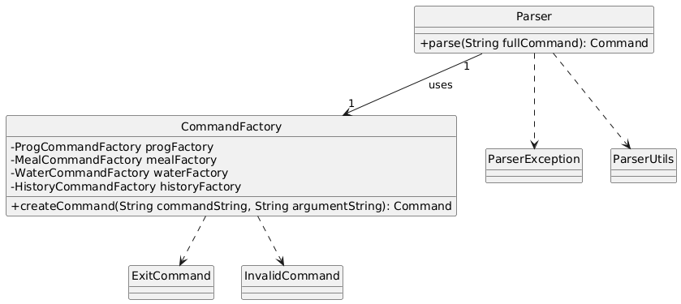
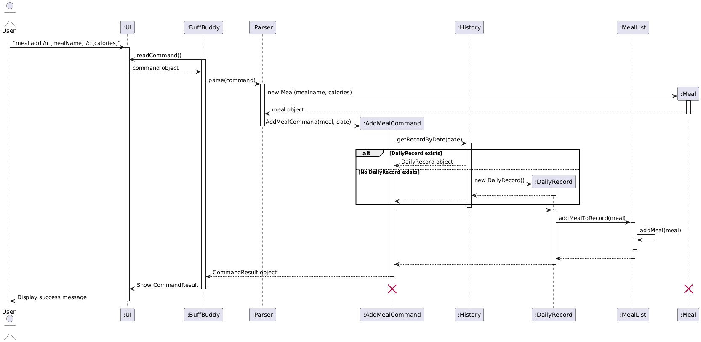
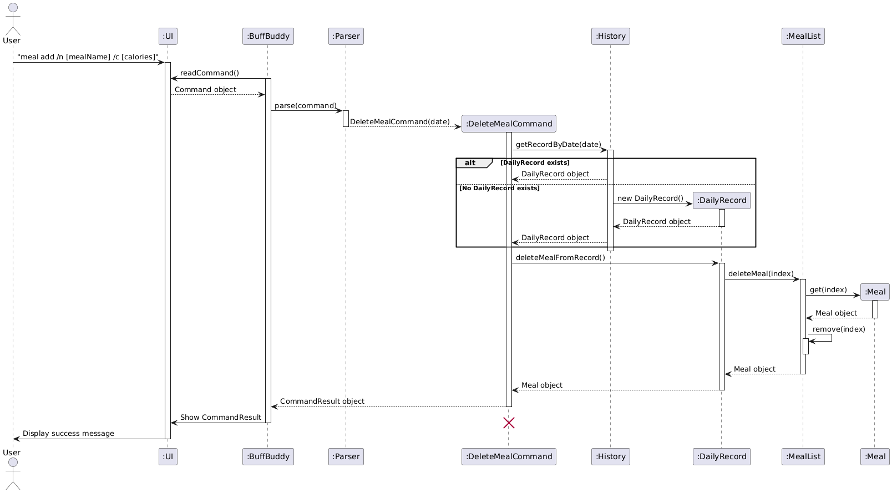
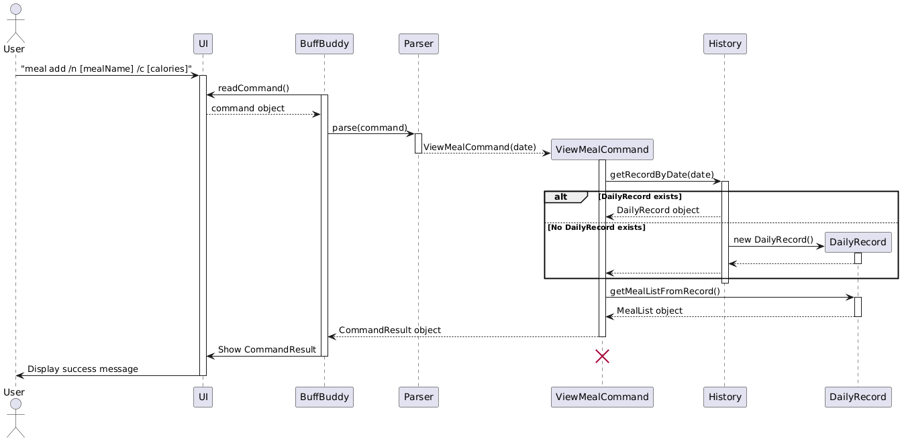
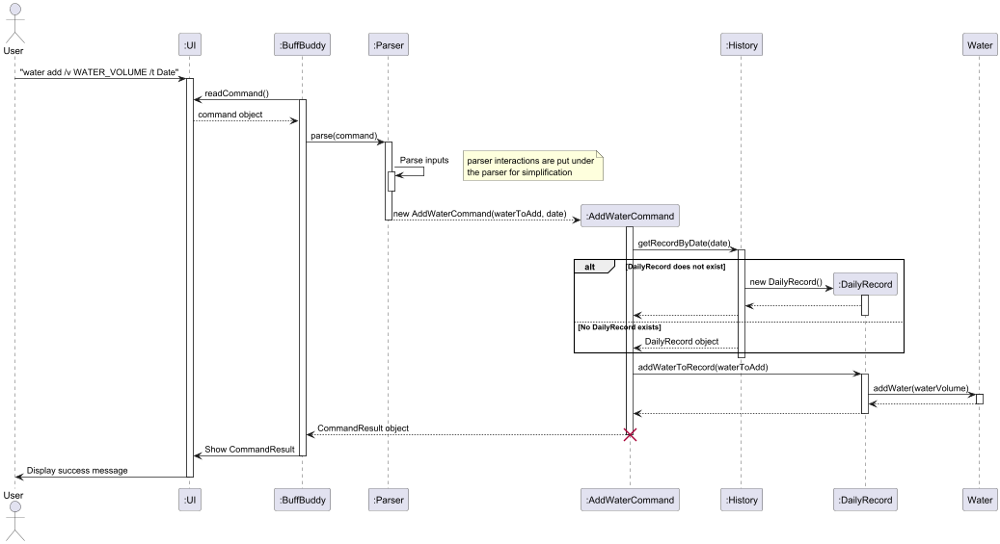

# Developer Guide

## Acknowledgements

<!-- @@author Bev-low -->

We used these third party libraries to develop our application:

- Gson
- Mockito
<!-- @@author -->

## Design

### UI Component

The `UI` component manages the input and output interface between the user and the system, allowing interaction through command input and message displays. It enables seamless communication of user requests and system feedback in an organized and formatted manner.

- **Handles user inputs and outputs**: The `UI` component relies on `Scanner` for capturing user input and `PrintStream` for outputting messages to the console. The `readCommand()` method reads a line of text, typically representing a user command, and returns it for processing.
- **Displays feedback messages**: The component provides `showMessage(String msg)`, `showMessage(Exception e)`, and `showMessage(CommandResult result)` methods to present different types of feedback to users, including general messages, error messages, and results of command executions. These methods ensure messages are formatted and include consistent visual separators.
- **Shows program start and end messages**: The component features `showWelcome()` and `showFarewell()` methods to display welcome and farewell messages, respectively, creating a friendly user experience from start to finish.
- **Ensures consistency with static properties**: The class defines constants for formatting, including `ERROR_HEADER`, `LINE_CHAR`, and `LINE_LENGTH`, used to standardize message presentation throughout the application.
- **Keeps input and output streams flexible for testing**: The `UI` component is constructed with a `Scanner` and `PrintStream`, which can be replaced or redirected as needed, allowing easy adaptability for testing and debugging purposes.

<!-- @@author Bev-low -->

### Programme Component

The `ProgrammeList` component,

- **Manages a collection of programmes**: The `ProgrammeList` class is designed to manage a list of `Programme` objects, supporting easy addition, retrieval, and deletion of programmes. It also allows tracking and setting an active programme.
- **Provides collection-based functionality**: The class includes essential methods for operations such as retrieving the current list size, adding a new programme, and deleting or retrieving a programme by index. All key actions are logged for better traceability and debugging.
- **Supports programme activation and management**: The `startProgramme()` method sets a specific `Programme` as the active programme, enabling users to track which programme is currently in use. This ensures a seamless way to handle active programme operations.
- **Handles edge cases and maintains data integrity**: The `ProgrammeList` class checks for out-of-bounds access and throws appropriate exceptions when invalid indexes are provided. This helps maintain data consistency and prevents runtime errors.
- **Detailed representation**: The `toString()` method returns a comprehensive representation of the programme list, indicating the active programme for better user interface display and reporting.

The `Programme` component,

- **Manages a collection of days**: The `Programme` class consists of multiple day objects, supporting easy addition, retrieval and deletion of days.
- **Ensures data consistency and error handling**: The `Programme` class includes validations to handle cases such as null programme names or invalid indexes when accessing days. These validations help maintain data integrity and prevent unexpected runtime issues. Methods that attempt to access invalid indexes throw appropriate exceptions, maintaining robust error handling.
- **Detailed representation**: The `toString()` method returns a formatted string that includes the programme name and all the days in the programme, making it suitable for displaying programme information in user interfaces or summaries.
- **Maintains programme organization**: The class structure, with methods for inserting, retrieving, and deleting days, supports seamless organization and updates within a `Programme`, ensuring that users can easily manage the content and structure of their training schedules.

The `Day` component,

- **Represents a single day of exercises**: The `Day` class models a day that can contain multiple exercises. It serves as a building block for a structured workout or training programme.
- **Manages exercises within a day**: The class supports adding, retrieving, and deleting exercises through methods like `insertExercise()`, `getExercise()`, and `deleteExercise()`. This makes it easy to modify the list of exercises for a particular day.
- **Ensures data consistency and error handling**: The `Day` class checks for edge cases, such as invalid indexes when accessing or deleting exercises, and throws appropriate exceptions. Assertions are used to enforce that the day name and exercises are not null or empty upon initialization.
- **Calculates total calories burnt**: The `getTotalCaloriesBurnt()` method sums up the calories from all exercises in the day's list, providing a quick overview of the total effort for that day.
- **Detailed representation**: The `toString()` method returns a formatted string listing the day's name and each exercise, making it convenient for displaying in user interfaces or summaries.
- **Enables object comparison and usage in collections**: The `equals()` and `hashCode()` methods are overridden to facilitate comparisons between `Day` objects and to support their use in collections, ensuring that days can be managed accurately.

The `Exercise` component,

- **Models an individual exercise**: The `Exercise` class represents a specific exercise, detailing its sets, reps, weight, calories burned, and name. It provides a structured way to encapsulate exercise data within a day.
- **Allows for detailed updates**: The `updateExercise()` method accepts an `ExerciseUpdate` object and selectively updates fields of the `Exercise` based on the non-null values in the `ExerciseUpdate`. This ensures flexibility in modifying only the required fields without affecting the others.
- **Includes validation**: Each update method validates inputs, ensuring that null values do not update existing fields.
- **Facilitates data retrieval**: The class provides getters such as `getCalories()`, `getWeight()`, and `getName()` for accessing specific details of the exercise.
- **Detailed representation**: The `toString()` method returns a formatted string summarizing the exercise, including its name, number of sets, reps, weight used, and calories burned. This makes it easy to display exercise details in user interfaces or reports.
- **Enables object comparison and consistent storage**: The `equals()` and `hashCode()` methods are overridden to allow for the comparison of `Exercise` objects and ensure consistency when storing them in collections. This helps in managing and tracking unique exercises within larger structures like days or programmes.

The `ExerciseUpdate` component,

- **Facilitates partial updates to Exercise objects**: The `ExerciseUpdate` class is designed to enable the modification of specific fields in an `Exercise` object. Each field in the `ExerciseUpdate` can be null, indicating that the corresponding attribute in the target `Exercise` should not be updated.
- **Holds update data for exercises**: The class includes fields such as `sets`, `reps`, `weight`, `calories`, and `name`, which can be used to selectively update an `Exercise`. This enables targeted updates without altering other unchanged fields.
- **Ensures flexibility in exercise management**: By accepting nulls for unmodified fields, the `ExerciseUpdate` class provides a flexible way to update only the required attributes of an `Exercise`, streamlining the process of making changes to specific exercise details.
- **Supports integration with update methods**: The `ExerciseUpdate` class can be passed as a parameter to methods in the `Exercise` class (e.g., `updateExercise()`), facilitating a seamless process for applying partial updates based on provided non-null values.
- **Simplifies exercise modification logic**: With this class, the logic for updating exercises is consolidated, simplifying the code and ensuring consistency when modifying `Exercise` objects in various contexts.

<!-- @@author -->

### Meal Component

The `Meal` component,

- **Represents individual meals with nutritional information:** The `Meal` class encapsulates details about a meal, specifically its name and calorie count. This allows easy tracking of individual meals within a day.
- **Attributes:** Each `Meal` object has two main attributes: `name` (the name of the meal) and `calories` (the calorie content of the meal).
- **Validation:** The class enforces constraints during instantiation, ensuring that the `name` cannot be null or empty and that the calorie count is non-negative, reducing errors in meal tracking.
- **Supports equality checks and hashing:** The `Meal` class overrides `equals()` and `hashCode()` methods to ensure that meals with identical names and calorie counts are considered equal, which is useful for meal comparison and for storing in collections like sets.
- **Detailed representation:** The `toString()` method of `Meal` provides a concise, readable summary of the meal’s details, including the name and calorie count in the format `"[Meal Name] | [Calories] kcal"`. This makes it easy to display meal information in logs, summaries, or user interfaces.

The `MealList` component,

- **Manages a collection of meals:** The `MealList` class provides functionality for managing a list of `Meal` objects, allowing for easy addition, deletion, and retrieval of meals throughout the day.
- **Provides collection-based functionality:** The class includes methods for common operations, such as checking if the list is empty, getting the total number of meals, and adding or deleting meals from the list. Each action is logged for traceability.
- **Supports detailed retrieval and representation:** The `getMeals()` method returns the list of all meals, and the `toString()` method generates a formatted string that lists each meal with its index, making it convenient for displaying meal information in a user interface or summary.
- **Ensures data consistency:** The `MealList` class handles edge cases, such as attempts to delete meals at invalid indexes, by throwing appropriate exceptions. This helps maintain data integrity within the list.
- **Facilitates efficient comparisons and storage:** The class overrides `equals()` and `hashCode()` methods, which enables comparison of two `MealList` objects and allows it to be used in collections, ensuring that meal tracking remains accurate and consistent.

### Water Component

The `Water` component,

- **Tracks daily water intake:** The `Water` class allows for recording individual water consumption entries throughout the day, stored in liters. Each entry is logged, providing a detailed trace of daily water consumption.
- **Attributes:** The main attribute of the `Water` class is waterList, a list of Float values representing individual water intake entries in liters.
- **Validation and error handling:** When adding water entries, the `Water` class enforces that the water amount is positive. Deletion attempts with invalid indexes are handled with exceptions, ensuring safe and predictable usage.
- **Supports collection-based functionality:** The `Water` class includes methods for adding and deleting water entries, checking if the list is empty, and retrieving the entire list of entries. Each action is logged, allowing developers to track and troubleshoot any changes to the water intake log.
- **User-friendly representation:** The toString() method formats and returns a string representation of all water entries. Each entry is listed with an index, making it easy to display in user interfaces and summaries.
- **Efficient storage and retrieval:** The getWaterList() method returns the full list of water intake entries, while the class’s clear and consistent data structure facilitates straightforward water consumption tracking and data retrieval.

### History Component

- **Chronologically stores workout records**: The `History` class uses a `LinkedHashMap<LocalDate, DailyRecord>` to store workout records, where each `LocalDate` key maps to a `DailyRecord` for that day. This data structure preserves insertion order, making it ideal for managing and viewing records in a sequential, date-based manner.

- **Attributes**:

  - `logger`: A `Logger` instance for tracking actions within the class. This attribute logs key operations such as record creation, deletion, and retrieval.
  - `history`: A `LinkedHashMap<LocalDate, DailyRecord>` that stores the workout history. Each entry corresponds to a specific date (`LocalDate`) and contains a `DailyRecord` detailing the workout, meals, and water intake for that day. This attribute is central to the `History` class, as it maintains the entire workout log.

- **Methods**:

  - **`getRecordByDate(LocalDate date): DailyRecord`**: Retrieves the `DailyRecord` for a given date. If a record does not exist for the specified date, it creates a new `DailyRecord`, adds it to `history`, and returns it. This method ensures that any requested date has an associated `DailyRecord`, thus providing consistency in record-keeping.

  - **`getHistory(): LinkedHashMap<LocalDate, DailyRecord>`**: Returns the complete `history` map, enabling access to all stored workout records. This method is useful for displaying or analyzing the entire workout log.

  - **`getWeeklyWorkoutSummary(): String`**: Compiles a summary of workout data from the past seven days, iterating over entries in `history` and formatting each day’s activities. If no records are found within the past week, it returns a message indicating the absence of data. This method helps users quickly assess their weekly workout progress.

  - **`logRecord(LocalDate date, DailyRecord record): void`**: Adds or updates a `DailyRecord` for the specified date in `history`. This method supports adding new records and updating existing ones, offering flexibility in managing daily workout data.

  - **`deleteRecord(LocalDate date): DailyRecord`**: Deletes and returns the `DailyRecord` for a given date. If no record exists, it returns `null`. This method is useful for users who need to remove specific workout entries.

  - **`hasRecord(LocalDate date): boolean`**: Checks if a workout record exists for a specific date. This method is helpful for validating the existence of records before performing operations like deletion or retrieval.

  - **`getHistorySize(): int`**: Returns the number of entries in the `history`. This method provides quick access to the total count of workout records, which can be useful for summary statistics.

  - **`getFormattedPersonalBests(): String`**: Generates a formatted summary of personal bests across all exercises. It retrieves the highest weight or best performance for each exercise type, helping users track their progress in specific workouts.

  - **`getPersonalBestForExercise(String exerciseName): String`**: Retrieves the personal best performance for a specific exercise, based on weight lifted. If no record is found, it returns a message indicating the absence of a personal best for that exercise. This method is useful for users focused on improving their personal records.

  - **`getPersonalBestsMap(): Map<String, Exercise>`** (private): Builds a map of the best performance for each exercise type by iterating through `DailyRecord` entries. This helper method supports the `getFormattedPersonalBests()` functionality.

  - **`isBetter(Exercise current, Exercise best): boolean`** (private): Compares two `Exercise` instances to determine if the current one has a better performance (higher weight). This method supports the evaluation of personal bests.

  - **`toString(): String`**: Converts the `history` map to a readable string format, displaying each `DailyRecord` entry by date with clear dividers between records. If `history` is empty, it returns a message indicating no records are available. This method is useful for summarizing all workout data for display.

- **Interacts with `DailyRecord`, `Day`, and `Exercise` classes**: The `History` component accesses related classes for comprehensive tracking:
  - **`DailyRecord`**: Each `DailyRecord` represents a single day’s workout, meals, and water intake.
  - **`Day`**: Inside each `DailyRecord`, `Day` stores workout program details.
  - **`Exercise`**: Used to represent individual exercises within a `Day`, allowing for detailed tracking and comparison of workout data.

<!-- @@author Bev-low -->

The `DailyRecord` component,

- **Tracks daily workout, meals, and water intake:** The `DailyRecord` class maintains a log of the day’s activities, meals consumed,
  and water intake. It provides methods to add, update, and retrieve each of these records.
- **Encapsulates multiple data types:** `DailyRecord` works with various objects such as `Day` (for recording the workout programme),
  `MealList` (for managing a list of meals consumed), and `Water` (for tracking daily water intake). These components are stored and managed
  together within a single daily record.
- **Enables modification and deletion:** The class provides methods for adding meals and water to the record, updating the workout for the
  day, and removing items such as meals or water entries. Each modification is logged for traceability.
- **Calculates key daily statistics:** `DailyRecord` is capable of calculating the total calories burned from the recorded `Day` and the
  calories gained from the `MealList`. It can also sum the total water intake for the day.
- **Provides a comprehensive summary:** The class’s `toString()` method generates a detailed summary of the day’s activities, including
  calories burned, meals eaten, water consumed, and the caloric balance, making it easy to retrieve and display all relevant information in a readable format.

In summary, the `History` component manages a comprehensive log of workout records, enabling users to view, update, and delete daily entries, track personal bests, and generate weekly summaries. Its methods and attributes work together to provide a structured, accessible history of the user's fitness activities.

### Storage Component

The `Storage` component,

- **Handles the saving and loading of both `ProgrammeList` and `History` data in JSON format:** The `Storage` component is responsible
  for serializing `ProgrammeList` and `History` objects into JSON format and passing them on to `FileManager`, as well as getting the
  data in Json format from `FileManager` and deserializing it into the appropriate objects when needed.
- **Serves as an adapter between `FileManager` and `BuffBuddy` classes:** `Storage` acts as an intermediary, translating between the JSON
  data handled by `FileManager` and the objects in the `BuffBuddy` application, ensuring seamless conversion between formats.
- **Relies on `ProgrammeList` and `History` from the Model component:** Since the `Storage` component is tasked with saving and retrieving
  the `ProgrammeList` and `History` objects, it ensures the data is accurately represented and stored.
- **Utilizes custom serializers:** To properly handle date formats and other specific needs, Storage makes use of custom serializers for
  objects like LocalDate from the `DateSerilazer` class, ensuring that these objects are correctly serialized to and deserialized from JSON.

The `FileManager` component,

- **Manages the saving and loading of data:** The `FileManager` class is responsible for reading data from and writing data to the file
  specified by the user. It ensures that both the `ProgrammeList` and `History` data are stored in JSON format, and retrieves them when needed.
- **Handles file creation and directory management:** Before saving data, `FileManager` checks whether the necessary directories and
  files exist. If they do not, it creates them to ensure data can be stored correctly.
- **Leverages JSON for data structure:** `FileManager` uses `Gson` to serialize and deserialize JSON data, making it easy to work with
  structured data. It also ensures the data is formatted in a readable way using pretty printing for clarity.
- **Performs error handling and logging:** `FileManager` employs detailed logging to track the progress of saving and loading operations.
  If any issues arise during file operations (e.g., missing files, failed directory creation), they are logged, and exceptions are thrown to handle errors gracefully.

The `DateSerializer` component,

- **Custom serialization and deserialization for `LocalDate`**: The `DateSerializer` class provides a way to serialize and deserialize `LocalDate` objects to and from JSON strings formatted as `dd-MM-yyyy`. This ensures that date data in JSON format remains consistent and human-readable.
- **Implements `JsonSerializer` and `JsonDeserializer` interfaces**: The class implements both `JsonSerializer<LocalDate>` and `JsonDeserializer<LocalDate>` from the Gson library, allowing it to handle JSON conversion for `LocalDate` objects.
- **Uses a standardized date format**: The `DateTimeFormatter` is configured with the pattern `dd-MM-yyyy`, which ensures that all serialized and deserialized dates conform to this format.

<!-- @@author -->

### Parser Component

#### Overview

The Parser Component is a key part of the application, responsible for interpreting user input and creating appropriate command objects for execution.
It handles the delegation of command creation to specialized factories and manages flag parsing for a range of commands related to program management, meals, water intake, and history.
This component includes several classes and factories to ensure organized and efficient parsing and command generation.

#### Parser Component

The `Parser` class serves as the main entry point for parsing user input.
It splits the command string into a main command and arguments, identifies the appropriate factory, and delegates the command creation process.
It uses the CommandFactory to create command objects based on user input.

#### FlagParser

The `FlagParser` is a utility class for parsing flagged arguments within commands. It simplifies the extraction of specific values from arguments, supporting formats like integer, date, string, and index.
This class also manages alias mapping to provide flexibility in flag usage, allowing different aliases for the same flag.

#### ParserUtils

`ParserUtils` is a utility class that contains common parsing methods used across the parser classes, including methods for splitting arguments, parsing integers, floats, indices, and dates.
It provides standardized parsing functionality to avoid redundancy.

#### CommandFactory

The `CommandFactory` class acts as a central factory that distributes command creation requests to specific factories such as `ProgCommandFactory`, `MealCommandFactory`, `WaterCommandFactory`, and `HistoryCommandFactory`.
If an unrecognized command is provided, it returns an `InvalidCommand`.

#### ProgCommandFactory

The `ProgCommandFactory` is responsible for creating program-related commands.
It supports commands for creating, viewing, starting, deleting, logging, and editing programs, as well as adding or removing days and exercises from programs.
It relies on helper methods like `parseDay` and `parseExercise` to streamline parsing of day and exercise arguments.

#### MealCommandFactory

The `MealCommandFactory` handles commands related to meal management, including adding, deleting, and viewing meals. It uses flags to parse meal details such as the meal name, calories, and date.
The factory generates specific commands like `AddMealCommand`, `DeleteMealCommand`, and `ViewMealCommand` based on the parsed input.

#### WaterCommandFactory

The `WaterCommandFactory` is responsible for water-related commands. It parses arguments to identify commands for adding, deleting, and viewing water intake entries.
This factory ensures that water logs can be managed with commands such as `AddWaterCommand`, `DeleteWaterCommand`, and `ViewWaterCommand`.

#### HistoryCommandFactory

The `HistoryCommandFactory` manages history-related commands. It supports viewing, listing, deleting history entries, and managing personal bests and weekly summaries.
The factory can generate commands such as `ViewHistoryCommand`, `DeleteHistoryCommand`, `WeeklySummaryCommand`, and `ViewPersonalBestCommand` depending on the parsed input.

#### FlagDefinitions

The `FlagDefinitions` class contains predefined constants for the various flags used across commands, such as flags for dates, programs, days, exercises, names, sets, reps, weights, and calories.
It standardizes flag usage throughout the component, ensuring consistency in flag names.

<!-- @@author TVageesan -->

### Command Component

The `Command` component,

- **Transforms parsed user input into executable tasks:** The `Command` component is responsible for converting user commands into specific actions within BuffBuddy. It ensures that each command is executed with the appropriate data and context, allowing users to interact effectively with the application.
- **Defines a hierarchy of command types:** The `Command` class serves as the base class for all command types, with each subclass implementing specific command logic. This structure allows for a wide range of commands, each tailored to different functionalities within BuffBuddy.
- **Includes specialized command categories:** The component is divided into several categories, each focusing on a specific aspect of the application, such as `ProgrammeCommand`, `MealCommand`, `WaterCommand`, and `HistoryCommand`. Each category contains commands that manage related data and operations.
- **Utilizes abstract classes for command generalization:** Abstract subclasses like `ProgrammeCommand`, `MealCommand`, `WaterCommand`, and `HistoryCommand` provide a framework for implementing specific commands. These classes define common behaviors and interfaces for their respective command types.

#### ProgrammeCommand

The `ProgrammeCommand` component,

- **Manages operations related to `ProgrammeList`:** The `ProgrammeCommand` class handles tasks such as creating, viewing, editing, and deleting programs. It interacts directly with the `ProgrammeList` to perform these operations.
- **Bridges the gap between ProgrammeList and History:** The `LogProgrammeCommand` class interacts with both `ProgrammeList` and `History` to log the programme into history.

#### EditProgrammeCommand

The `EditProgrammeCommand` component,

- **Specializes in editing program data:** The `EditProgrammeCommand` class is a subset of `ProgrammeCommand` that focuses on modifying `ProgrammeList` data.
- **Only interacts with ProgrammeList:** It overrides the `execute()` method to specifically handle `ProgrammeList` as a parameter, ensuring precise data manipulation.

#### MealCommand

The `MealCommand` component,

- **Handles meal-related data management:** The `MealCommand` class provides functionality for logging, editing, and viewing meal entries. It ensures that users can accurately track and update their dietary information within the application.
- **Only interacts with History:** It overrides the `execute()` method to specifically handle `History` as a parameter, ensuring precise data manipulation.

#### WaterCommand

The `WaterCommand` component,

- **Facilitates water intake tracking:** The `WaterCommand` class allows users to log, edit, and view water entries. It supports effective hydration tracking by managing water-related data within BuffBuddy.
- **Only interacts with History:** It overrides the `execute()` method to specifically handle `History` as a parameter, ensuring precise data manipulation.

#### HistoryCommand

The `HistoryCommand` component,

- **Interacts with historical data:** The `HistoryCommand` class includes commands for viewing summaries, personal bests, and recorded data. It provides insights into user progress by managing historical data within the application.

### Common Component

`common` package contains utility classes that are used across the multiple packages.

---

## Implementation

### Create Programme

#### Overview

The **Create Programme** feature allows users to create a new workout programme, which can be either empty (with only a name)
or contain multiple days with specific exercises.

### Example Usage

1. **User Starts BuffBuddy**:

   - The user initiates the BuffBuddy application.
   - `BuffBuddy` begins by calling `Ui` to read a command.

2. **User Inputs Command**:

   - `Ui` reads the command from the user and returns it to `BuffBuddy` as `fullCommand`.

3. **Parsing the Command**:

   - `BuffBuddy` calls `Parser.parse(fullCommand)` to interpret the command.
   - `Parser` calls `CommandFactory.createCommand(commandString, argumentString)` to create an appropriate command based on `commandString`.

4. **Delegating to Specific Command Factory**:

   - `CommandFactory` checks if `commandString` is related to program commands. If it is, `CommandFactory` calls `ProgCommandFactory.parse(argumentString)`.

5. **Handling Create Subcommand**:

   - `ProgCommandFactory` checks if the subcommand is "create" and calls `prepareCreateCommand(arguments)` if it is.

6. **Parsing Program Details**:

   - In `prepareCreateCommand`, `ProgCommandFactory` iterates through each day specified in the `arguments`:

     - For each day:

       - `ProgCommandFactory.parseDay(dayString)` is called to parse details of the day.
       - A new `Day` object is created.
       - The parsed `Day` object is returned to `ProgCommandFactory`.

       - For each exercise within the day:
         - `ProgCommandFactory.parseExercise(exerciseString)` is called to parse exercise details.
         - A new `Exercise` object is created.
         - The parsed `Exercise` is inserted into the `Day` object.

     - The fully populated `Day` object, containing all exercises, and the programme name is returned.

7. **Creating `CreateProgrammeCommand`**:

   - After parsing the program structure, `ProgCommandFactory` creates a new `CreateProgrammeCommand` object with `progName` and parsed `days`.

8. **Returning to `CommandFactory`**:

   - `ProgCommandFactory` returns the `CreateProgrammeCommand` object to `CommandFactory`, which then passes it back to `Parser`.
   - `Parser` returns the command object to `BuffBuddy`.

9. **Executing `CreateProgrammeCommand`**:

   - `BuffBuddy` calls `CreateProgrammeCommand.execute()` to perform the action.
   - Inside `execute()`, `CreateProgrammeCommand` calls `ProgrammeList.insertProgramme(programmeName, programmeContents)` to add the new program to the list.

10. **Creating Program in `ProgrammeList`**:

    - `ProgrammeList` creates a new `Programme` object with the provided name and content.
    - The `Programme` object is added to the `ProgrammeList`.

11. **Generating Command Result**:

    - `CreateProgrammeCommand` creates a new `CommandResult` object, containing the result message of the operation.

12. **Returning the Result**:

    - `CreateProgrammeCommand` returns the `CommandResult` to `BuffBuddy`.

13. **Displaying the Result to the User**:
    - `BuffBuddy` calls `Ui.showMessage(result)` to display the result message.
    - `Ui` formats and displays the result to the user, completing the flow of operations for the "Create Programme" feature.

This process illustrates how BuffBuddy handles the creation of a workout program, from parsing user input to structuring program details and finally displaying the result back to the user.

#### Sequence Diagram

### Edit Programme

#### Overview

The **Edit Programme** feature allows for in-depth management of programme structures, supporting operations to add, remove, and update days and exercises within each programme.
Due to the nature of modelling a Workout Programme, a hierarchical data structure is used to represent workout data.

To perform an edit to any aspect of this data, the EditCommand will traverse the hierarchy until it reaches the necessary depth to perform its edit operation.

These operations include:

- Adding or removing Days to the Programme
- Adding or removing Exercises to Days in the Programme
- Updating the details of Exercises in Days in the Programme

#### Sequence Diagram

The overall design that enables this functionality is described generically by the following sequence diagram.

The 'Model' class in the above diagram is a generalization of the various data models that are being interacted with
to perform each specific edit command. For each edit command, the following sequence diagrams
further break down how this interaction works.

In each diagram, error handling has been simplified to keep the diagram brief.
Generally, if a conditional check fails (i.e. if the selected Programme does not exist), a ProgrammException will be thrown and interrupt the command exeuction. BuffBuddy will print the appropiate error message based on the Exception and then wait for the next command.

##### Add day

#### Delete Day

##### Add Exercise

##### Delete Exercise

##### Update Exercise

##### Example Usage

Given below is an example usage scenario for 'delete exercise' and how the edit programme functions at each step.

Step 1. The user creates a programme with a given number of Days with their respective Exercises. ProgrammeList will contain a reference to this programme after its creation.

Step 2. The user executes `programme edit /p 1 /d 1 /x 1` to delete the first exercise in the first day of the first programme.

Step 3. After parsing this input, a `DeleteExerciseCommand` (inheriting from the generic `EditProgrammeCommand`) is created and executed.

Step 4. The command first retrieves the chosen Programme with `ProgrammeList#getProgramme()`.

Step 5. The command then retrieves the chosen Day with `Programme#getDay()`.

Step 6. With the Day object, it performs the `Day#deleteExercise()` with the given exercise ID

Step 7. The deleted Exercise object is then returned to the `DeleteExerciseCommand` to display as part of the returned `CommandResult`.

#### Activity Diagram

To summarize, the following activity diagram describes how the overall operation occurs.

### Add Meal

#### Feature Implementation

The **Add Meal** feature manages the functionality related to adding meals to a daily record. It interacts with various components such as `History`, `DailyRecord`, and `MealList` to ensure meals are added correctly.

The **Add Meal** command navigates through the following hierarchy:

- **History** → **DailyRecord** → **MealList**
- If a `DailyRecord` does not exist for a given date, it is created before adding the meal.
- Similarly, a new `MealList` object is created and added to the `DailyRecord` if it doesn't already exist. The meal is then added to the `MealList` object.

These operations include:

- Adding meals to a `MealList` in the `DailyRecord` of a particular date in the `History`.

Given below is an example usage scenario for adding a meal and how the add meal command functions at each step.

#### Example Usage

**Step 1**: The user starts by adding a meal using the command:

meal add /n [mealName] /c [calories]

- The command is parsed and translated into an `AddMealCommand` object, which contains the meal object that is created as a wrapper for the name and calories.

**Step 2**: The command retrieves the `DailyRecord` for the specified date from the `History` using `getRecordByDate()`. If no record exists, a new one is created.

**Step 3**: The `AddMealCommand` adds the meal to the `MealList` of the `DailyRecord`. The `MealList` is then updated with the new list.

**Step 4**: The newly added `Meal` object is displayed as part of the `CommandResult`.

The overall design that enables this functionality is described generically by the following sequence diagram.

#### Sequence Diagram for "Add Meal" Command

The diagram shows the interactions among different classes and objects during the execution of the "Add Meal" command.

The following sequence diagrams shows the interactions between the necessary classes during the execution of the "Delete Meal" and "View meal" commands. The other interactions are not shown because they remain the same as the in the "Add Meal" sequence diagram. Only the different interactions are shown in the sequence diagram. 

#### Sequence Diagram for "Delete Meal" Command

#### Sequence Diagram for "View Meal" Command

#### Activity Diagram for "Add Meal" Feature

#### Summary of Feature

The **Add Meal** feature uses a **hierarchical command pattern** to manage meal additions while maintaining good encapsulation and separation of concerns. The chosen design allows easy extensibility and maintainability.

<!-- @@author Bev-low -->

### Add Water

The **Add Water** feature manages the functionality related to adding water to a daily record. It interacts with various components such as `History`, `DailyRecord`, and `Water` to ensure water are added correctly.

The Add Water command navigates through the following hierarchy:

- **History** → **DailyRecord** → **Water**
- If a `DailyRecord` does not exist for a given date, it is created before adding the water.

These operations include:

- Adding a water log to `Water` in the `DailyRecord` of a particular date in `History`.
- Given below is an example usage scenario for adding a water log and how to add water command functions at each step.

#### Example Usage

**Step 1**: The user starts by adding a water log using the command:

water add /v WATER_VOLUME [/t Date]

- The command is parsed and translated into an `AddWaterCommand` object. Water contains an arrayList of floats, representing ml of water.

**Step 2**: The command retrieves the `DailyRecord` for the specified date from the `History` using `getRecordByDate()`. If no record exists, a new one is created.

**Step 3**: The `AddWaterCommand` adds the water log to the `Water` of the `DailyRecord`. The `Water` is then updated with the new water log.

**Step 4**: The newly added water log object is displayed as part of the `CommandResult`.

The overall design that enables this functionality is described generically by the following sequence diagram.

The diagram shows the interactions among different classes and objects during the execution of the "Add Water" command.

#### Sequence Diagram for "Delete Water" Command

#### Sequence Diagram for "View Water" Command

#### Activity Diagram for "Add Water" Feature

#### Summary of Feature

The **Add Water** feature uses a **hierarchical command pattern** to manage water additions while maintaining good encapsulation and separation of concerns. The chosen design allows easy extensibility and maintainability.

<!-- @@author -->

### WeeklySummary Feature

The Weekly Summary feature allows users to view a summary of their workouts for the current week. This functionality is achieved through a combination of several interconnected components, including `WeeklySummaryCommand`, `Parser`, `HistoryCommandFactory`, and `History`. Users can access this feature through the `history wk` command in the UI. The implementation follows a command pattern, combined with the factory pattern for command creation.

### Overview

The following components are crucial to the Weekly Summary feature:

1. **Parser Component**  
   The `Parser` interprets the initial command and directs the flow as follows:

   - **`Parser#parse(String)`**: Accepts the raw input string, splits it into the main command and arguments.
   - **`CommandFactory`**: Generates the appropriate command object based on the parsed input.
   - **`HistoryCommandFactory`**: Handles the creation of history-related commands, including `WeeklySummaryCommand`.

2. **WeeklySummaryCommand Component**  
   The `WeeklySummaryCommand` implements the `Command` interface and performs the following:

   - Extends the abstract `Command` class.
   - Uses the command word `"wk"`.
   - Executes by retrieving the weekly summary from the `History` object.
   - Returns a `CommandResult` that contains the formatted summary for display.

3. **History Component**  
   The `History` class manages workout data and provides:

   - **`getWeeklyWorkoutSummary()`**: Retrieves and formats the workout data for the current week.

### Example Usage

The following example illustrates the usage scenario and behavior of the Weekly Summary feature:

1. **Step 1**: The user enters the `"history wk"` command in the UI. The UI reads this command and passes it to the `Parser`.
2. **Step 2**: The `Parser` breaks down the command `"history wk"` into:
   - Main command: `"history"`
   - Subcommand: `"wk"`
3. **Step 3**: The `Parser` uses `CommandFactory`, which recognizes this as a history command and delegates to `HistoryCommandFactory`.
4. **Step 4**: `HistoryCommandFactory` identifies `"wk"` as the `WeeklySummaryCommand` trigger and creates a new `WeeklySummaryCommand` instance.
5. **Step 5**: The `WeeklySummaryCommand` is passed back through the chain to the UI, which then calls its `execute` method.
6. **Step 6**: During execution:
   - `WeeklySummaryCommand` calls `History`'s `getWeeklyWorkoutSummary()`.
   - The summary is formatted and wrapped in a `CommandResult`.
   - The UI displays the result to the user.

### Sequence Diagram

<!-- @@author Bev-low -->

### Save/Load Feature

The save/load mechanism is handled by three main components: `Storage`, `FileManager`, and `DateSerializer`. `FileManager` manages file interactions, including reading from and writing to JSON data files, while `Storage` handles the conversion between JSON objects and `ProgrammeList`/`History` objects. The `DateSerializer` is used for converting `LocalDate` to/from JSON format.

### Example Usage

Given below is an example usage scenario and how the save/load mechanism behaves at each step.

**Step 1.** The user launches the application for the first time. A `Storage` object is initialized by `BuffyBuddy`, and it attempts to load data from
the file using `FileManager`. If no data file exists, `Storage` initializes an empty `ProgrammeList` and `History`.

**Step 2.** The user interacts with the application by adding programmes or logging workout activities and meals, modifying both the
`ProgrammeList` and `History`. After each command is carried out and when the user chooses to exit the application, `Storage#saveData()` is called.

**Step 3.** At this point, `Storage` converts the current `ProgrammeList` and `History` into JSON format using the `createJSON()` method and passes
the `JsonObject` to `FileManager#save()`.

**Step 4.** The `FileManager` saves the updated `JsonObject` to the data file, ensuring that the user's changes are preserved for the
next command or session. If necessary, `FileManager#createDirIfNotExist()` and `FileManager#createFileIfNotExist()` ensure that the correct directories
and files are in place before saving.

**Step 5.** The next time the user launches the application, `Storage#loadProgrammeList()` and `Storage#loadHistory()` are called, which
load the data from the file via `FileManager#load()`. The loaded data is then converted from JSON back into `ProgrammeList` and `History`
objects, restoring the user's previous session.

The following sequence diagram shows how a load operation for ProgrammeList goes through the Storage component:

The following sequence diagram shows how a save operation goes through the Storage component:

## <!-- @@author -->

## Documentation, logging, testing, configuration, dev-ops

- [Logging Guide](LoggingGuide.md)
- [Testing Guide](TestingGuide.md)

## Appendix

### Product scope

BuffBuddy is a fitness tracking app that help you track workout, meals, water to aid you in achieving your body goals.

### Target user profile

Gym goers who need a quick way to create, manage and track their workout plans and progress.

### Value proposition

- Users will be able to quickly create, update and view their workout programmes
- Users will be able to track their progress as they progress on their fitness journey
- Users will be able to track water and calorie intake to better track their nutrition

## User Stories

| Version | As a ...               | I want to ...                                           | So that I can ...                                    |
| ------- | ---------------------- | ------------------------------------------------------- | ---------------------------------------------------- |
| v1.0    | fitness enthusiast     | create a new workout plan/routine                       | tailor my workout to fit my needs                    |
| v1.0    | fitness enthusiast     | create a workout entry (input sets, weights, rep, time) | keep track of my progress                            |
| v1.0    | fitness enthusiast     | view my routine when I begin my workout                 | follow my plan more effectively                      |
| v1.0    | fitness enthusiast     | view their logged workout entry for a specific day      | see what they have done previously                   |
| v1.0    | fitness enthusiast     | delete a workout entry                                  | remove mistakenly created logs                       |
| v1.0    | fitness enthusiast     | delete a fitness routine if I no longer use it          | ensure my routines remain relevant and organized     |
| v1.0    | fitness enthusiast     | edit my existing fitness routine                        | further customize my routines after making them      |
| v2.0    | progress tracking user | view a summary of my weekly workout activity            | measure my overall progress                          |
| v2.0    | progress tracking user | track my personal bests for each exercise               | see improvements over time                           |
| v2.0    | nutrition-focused user | track calories burned during my workout                 | align my fitness routine with my dietary goals       |
| v2.0    | nutrition-focused user | add a meal I just ate                                   | track my meals over time                             |
| v2.0    | nutrition-focused user | delete a meal I ate                                     | delete a wrongly inputted meal                       |
| v2.0    | nutrition-focused user | view my meals I ate on a certain date                   | see how much calories I have eaten                   |
| v2.0    | hydration-focused user | add my water intake                                     | track my water intake for each day                   |
| v2.0    | hydration-focused user | view my water intake                                    | see how much water I have consumed across days/week  |
| v2.0    | hydration-focused user | delete a water intake                                   | remove any mistakes made when inputting water intake |

## Non-Functional Requirements

- Java 11 or above installed
- Program built to support only single user

## Glossary

- _exercise_ - Any exercise that can defined by a name, rep, set, weight and calories burned.
- _day_ - A day is a collection of exercises meant to be done in one day
- _programme_ - A programme is a weekly plan of workout days meant to be performed in rotation

## Instructions for manual testing

{Give instructions on how to do a manual product testing e.g., how to load sample data to be used for testing}
