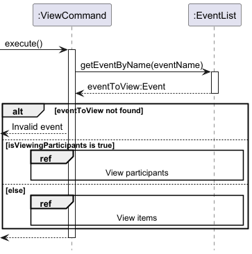
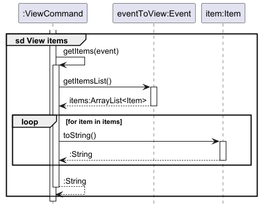
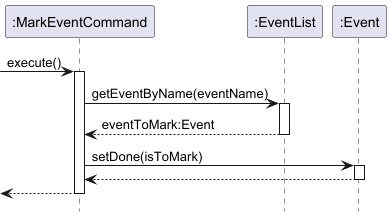
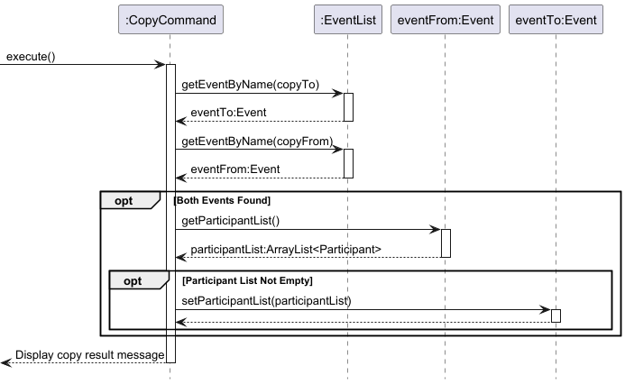

# Developer Guide

## Acknowledgements

{list here sources of all reused/adapted ideas, code, documentation, and third-party libraries -- include links to the original source as well}

## Design

The above **Architecture Diagram** provides the high-level design of the application.

### Main components

The application comprises the following components:

* `Main`, which handles program startup and shutdown, and also interactions between other components.
* `UI`, which handles user input and showing messages to the user.
* `Storage`, which handles the loading and saving of data upon program startup and shutdown.
* `Parser`, which converts user input into commands.
* `Command`, which are executed to modify the data stored in the program.
* `Event`, which stores the program's data.

### Interactions between components

The above **Sequence Diagram** shows how the different components of the system interact with one
another in the scenario when the command `add -e event -t 1200 -v venue` is executed.

### UI component

The `UI` component comprises an Ui class, as shown in the above **Class Diagram**.

The `UI` does the following:

* Take in command input from the user and pass the input to `Main`.
* Show output messages from `Command` to the user after command execution.

### Storage component

The `Storage` component comprises a Storage class, as shown in above **Class Diagram**.

The `Storage` does the following:

* Load events and participants information from a text file and save it to `EventList` list.
* Save events from `EventList` list to a text file

### Command component

The `Command` component and its component classes are shown in the below **Class Diagram**:

The `Command` component does the following:

* Handle the execution of the user command through interactions with `Event`.
* Provides a command output message to `Ui` after the command execution.

The interactions between `Command` and other commands in the system is shown in the following _Sequence Diagram_:

### Event component

The `Event` component and its component classes are shown in the below **Class Diagram**:

The `Event` component does the following:
* Handle the addition, removal and marking of events stored in `EventList`.
* Add, remove and mark participants for a specific `Event` in `EventList`.

## Implementation

This section describes some noteworthy details on how certain features are implemented.

### List feature[TBD]

The `list` feature allows users to view all scheduled events in the system. 
It is implemented in the `ListCommand` class, which extends the base `Command` class and formats the output to display all events. 
Internally, the `list` operation does not modify any data but simply retrieves and displays the information from `EventList`.

The `ListCommand` class performs the following key operations:

* ListCommand#execute() — Generates a formatted message displaying all events in the list.

These operations are accessible through the `Command` and can be invoked when the list command is entered by the user.

#### Feature Implementation

Given below is an example usage scenario and the behavior of the list feature at each step:

1. User Command Input:
The user enters the command `list` to view all scheduled events.

2. Command Recognition:
The `COMMAND_WORD` is set to "list", enabling the system to recognize the command input and invoke `ListCommand`.

3. Execution of ListCommand#execute():
The `execute()` method retrieves each event from `eventList` and appends it to a formatted output message.
It uses the `String.format` method with `LIST_MESSAGE` to include the total number of events in the message header.
Events are appended to `outputMessage` with numbered formatting for readability.

4. Output Generation:
The method stores the generated `outputMessage` in `this.message`, ready for display.

### Add feature

The `add` feature allow users to add events/participants based on relevant flags.
It is implemented in the `AddCommand` class which extends the base `Command` class and parse through the command to retrieve information based off flags.

The above operation is implemented as `AddCommand#execute()`. This overrides the `Command#execute()` operation in `Command`,
and is invoked when the latter operation is called.

The `AddCommand` handles two primary functions:

1. **Add an Event:** When provided with event details, including name, time, venue and priority, it creates and stores a new event in the event list.
2. **Add a Participant:** When provided with participant information, including name, contact number, and email, it attempts to add the participant to an existing event.

#### Feature Implementation

Given below is an example usage scenario for the `add` mechanism, and how it behaves at each step.

1. The user enters the command `add` followed by `-e` or `-p` to indicate adding an event or participant.
2. This step is determined by our `Parser` which parses through the user input to determine if it is adding a participant or event
3. Based on the parsed input, `AddCommand` executes one of the following actions:
   + **Add Event:** Creates a new event in `EventList` with the provided event details
   + **Add Participant:** Locates the event in `EventList` and adds the participant to it
4. If a duplicate event is found, `DuplicateDataException` is thrown.

The interactions between components during the execution of the `add` command are show in the **Sequence Diagram** below:

**Add Event**

**Add Participant**

### Remove feature

The `remove` feature allows users to remove events/participants based on relevant flags.
It is implemented in the `RemoveCommand` class which extends the base `Command` class and parse through the command to retrieve information based off flags.

The above operation is implemented as `RemoveCommand#execute()`. This overrides the `Command#execute()` operation in `Command`,
and is invoked when the latter operation is called.

The `RemoveCommand` handles two primary functions:

1. **Remove an Event:** When given the name of an event, it searches for and deletes it from the event list if it exists.
2. **Remove a Participant:** When provided with a participant’s name and the name of an event, it attempts to remove the specified participant from that event.

#### Feature Implementation

Given below is an example usage scenario for the `remove` mechanism, and how it behaves at each step.

1. The user enters the command `remove` followed by `-e` or `-p` to specify removing an event or participant.
2. This step is determined by our `Parser` which parses through the user input to determine if it is adding a participant or event
3. Based on the parsed input, `RemoveComamnd` executes one of the following actions:
   + **Remove Event:** Remove the specified event from `EventList` using the provided event name
   + **Remove Participant:** Locates the event in `EventList` and deletes the specified participant
4. If the event or participant is not found, `RemoveCommand` sets a failure message.

The interactions between components during the execution of the `remove` command are show in the **Sequence Diagram** below:

**Remove Event**

**Remove Participant**

### View feature

The `view` feature allows users to view the participants or items for a selected event.
The feature comprises `ViewCommand`, which extends `Command`, and has one operation, which shows the user a list of all participants or items for an event.

The above operation is implemented as `ViewCommand#execute()`. This overrides the `Command#execute()` operation in `Command`,  
and is invoked when the latter operation is called.

The output of the operation depends on two variables: 
* `eventName`, the name of the selected event.
* `isViewingParticipants`, which is true if a list of participants is to be shown, and false otherwise.

The `ViewCommand#execute()` operation works as follows:

1. `ViewCommand` gets the `Event` with name `eventName` from `EventList`. If the event is not found, the command's output message will be set to an error message.
2. Depending on the value of `isViewingParticipants`, `ViewCommand` either gets a list of `Participant`s or `Item`s from `Event`.
3. `ViewCommand` constructs an output message of formatted strings that it gets from the `Participant`s or `Item`s in the list.

The interactions between components during the execution of the `view` command are show in the **Sequence Diagrams** below:

The values of `eventName` and `isViewingParticipants` are set by the user through the event and type parameters in the `view` command respectively.

The `Parser` assigns the event parameter directly to `eventName`. Conversely, it sets `isViewingParticipants` to true if the type parameter value is `participant`, 
to false if the type parameter value is `item`, and treats any other value entered as invalid.

### Mark/unmark feature

The `mark/unmark` feature allows users to mark events as done or not done. The feature comprises `MarkEventCommand`, which 
extends `Command`. This class performs one operation, which marks a specified event as done or not done.

The above operation is implemented as `MarkEventCommand#execute()`. This overrides the `Command#execute()` operation in `Command`,
and is invoked when the latter operation is called.

#### Feature implementation

Given below is an example usage scenario for the mark/unmark mechanism, and how it behaves at each step.

1. The user adds an event `Event 1` to the event list. The mark status for `Event 1` is initially `false` or not done.

2. The user enters the command `mark -e Event 1 -s done` to mark `Event 1` as done. `MarkEventCommand` calls `MarkEventCommand#execute`,
in which it gets the event `Event 1` from the event list, and sets its mark status to `true` or done.

3. The user then enters the command `mark -e Event 1 -s undone` to mark `Event 1` as not done. The `MarkEventCommand` again calls `MarkEventCommand#execute`,
in which it gets the event `Event 1` from the event list, and sets its mark status to `false` or not done.

The interactions between components during the execution of the `mark` command are show in the **Sequence Diagram** below:

Upon execution of the command, the output message of `MarkEventCommand` is set to inform the user if the event has been marked done or not done,
or if the operation was unsuccessful (e.g. if the event specified is not present in the event list).

The user determines if an event is to be marked done or not done through the status parameter (indicated by the `-s` flag) in the `mark` command.
The `Parser` then checks this parameter for two values, `done` or `undone`, and constructs the `MarkEventCommand` accordingly.
If the parameter value is `done`, the `MarkEventCommand` will set the event as done, and will do otherwise if the parameter value is `undone`.
Any other values entered for the status parameter will be treated as invalid.

### Copy Feature

The copy feature allows users to copy the list of participants from one event to another. This feature is implemented in the `CopyCommand` class,  which extends `Command`,
The `CopyCommand` copies participants from a source event to a destination event if both events exist in the event list.

The main operations for `copy` feature include:
* Checking if both source and destination events exists in `EventList`
* Verifying that the source event contains a non-empty participant list
* Copying the participant list from the source event to the destination event
* Displaying an appropriate message based on the outcome of the operation

The above operation is implemented as `CopyCommand#execute()`. This overrides the `Command#execute()` operation in `Command`,
and is invoked when the latter operation is called.

#### Feature Implementation

Given below is an example usage scenario and the behaviour of the `copy` feature at each step:
1. The user enters the command `copy EventA > EventB` to copy participants from EventA to EventB. 
2. `CopyCommand` calls `CopyCommand#execute`, where it attempts to get the participant list from EventA, and copy the participant list over to EventB if there are existing participants.
The interactions between components of `CopyCommand#execute` are shown in the **Sequence Diagram** below:

3.  Upon execution of the command, the output message of `CopyCommand` is set to inform the user if the participants list has been copied,
    or if the operation was unsuccessful (e.g. if the participant list that is meant to be copied is empty).

### Sort feature

The `sort` feature allows users to organize events in a chosen order based on different attributes, such as name, time, or priority.
This feature is implemented in the `SortCommand` class, which extends the `Command` base class and utilises a keyword to determine the sorting criterion.

The `SortCommand` supports the following sorting options:
* **By Name:** Alphabetically sorts the events by name
* **By Time:** Orders events bases on scheduled time
* **By Priority:** Organises events by priority level, with the highest priority appearing first

The above operation is implemented as `SortCommand#execute()`. This overrides the `Command#execute()` operation in `Command`,
and is invoked when the latter operation is called.

#### Feature Implementation

The `SortCommand` class is constructed with a specified sorting keyword and performs sorting operations based on this keyword.
Given below is an example usage scenario and the behaviour of the `sort` feature at each step:
1. The user enters the command sort followed by a keyword (name, time, or priority) e.g. `sort -by name` to specify the sorting criterion
2. `SortCommand` calls `SortCommand#execute`, which based on the keyword invokes one of the following 3 methods
    * `sortByName()` - Sort events alphabetically by name
    * `sortByTime()` - Sort events chronologically by time
    * `sortByPriority` - Sort events by priority level
    
    After sorting, a success message is appended to `outputMessage` which indicates the sorting criterion used
3. The final sorted list is then formatted and appended to `outputMessage`,
    which is subsequently stored in `this.message` and displayed to the user.

The interactions between components of `SortCommand#execute` are shown in the **Sequence Diagram** below:

### Filter feature

The `filter` feature allows users to filter events from the event list based on specified criteria. 
This feature is implemented in the `FilterCommand` class, which extends the `Command` base class and uses flags to determine the filtering criteria.

#### Feature Implementation

### Find feature

The `find` feature allows users to locate participants within a specified event by their name.
This feature is implemented in the `FindCommand` class, which extends the `Command` base class. 
The feature provides detailed feedback, informing the user whether the event or participant was found.

The above operation is implemented as `FindCommand#execute()`. This overrides the `Command#execute()` operation in `Command`,
and is invoked when the latter operation is called.

#### Feature Implementation

The `FindCommand` class performs a finding operation within an event of a specified participant. 
Given below is an example usage scenario and the behaviour of the `find` feature at each step:

1. The user enters the command `find -e EVENT -p PARTICIPANT` to find participants in the specified event given a specified name
2. The `FindCommand` searches for the specified event within the eventList by calling `getEventByName(eventName)`, which returns an `Optional<Event>`
3. If the event exists,  the method `findParticipants(personName)` is invoked on the retrieved event to get a list of participants matching `personName`
    * If participants are found, `outputMessage` is appended with a success message followed by a formatted list of found participants
    * Otherwise, if either the event is not found or participants is not found, a corresponding failure message is appended to `outputMessage`
4. The final `outputMessage` is subsequently stored in `this.message` and displayed to the user.

The interactions between components of `FindCommand#execute` are shown in the **Sequence Diagram** below:

## Product scope
### Target user profile
The target user:

* has a need to organise a large number of events
* organises small-scale events, such that he is able to handle all matters on his own
* prefers typing to mouse interactions
* is comfortable using a command-line interface

### Value proposition

The user is able to organise and manage his events more quickly and efficiently than with a mouse/GUI app

## User Stories

| Version | As a ... | I want to ...                                                   | So that I can ...                                                                         |
|---------|----------|-----------------------------------------------------------------|-------------------------------------------------------------------------------------------|
| v1.0    | new user | see the list of commands                                        | know how to format my input                                                               |
| v1.0    | user     | add new events                                                  | manage future events                                                                      |
| v1.0    | user     | remove events from the events list                              | maintain the event list with events that are relevant and current                         |
| v1.0    | user     | list all current events                                         | know which events are currently ongoing                                                   |
| v1.0    | user     | add participants to a specific event                            | ensure all relevant individuals are included in that event's participant list efficiently |
| v1.0    | user     | remove participants who are no longer coming to specific events | efficiently keep the participant list for that event up-to-date and relevant              |
| v1.0    | user     | view the participant list of an event                           | know who is involved                                                                      |
| v2.0    | user     | mark events as completed                                        | easily track all past events                                                              |
| v2.0    | user     | mark participants present                                       | exactly know who signed up but did not attend the event                                   |
| v2.0    | user     | save events info                                                | still access the information if the program terminates                                    |
| v2.0    | user     | filter events by keywords                                       | find relevant information efficiently                                                     |
| v2.0    | user     | edit event details                                              | update latest changes to events                                                           |
| v2.0    | user     | copy participant details across events                          | update events with the same participants efficiently                                      |    
| v2.0    | user     | sort events by certain order (e.g. Priority)                    | visually view events in a certain order                                                   |
| v2.0    | user     | find if a person is in a certain event                          | quickly confirm a participant’s involvement in an event                                             |

## Non-Functional Requirements

* Should work for any **mainstream OS** as long as Java 17 is installed.

## Glossary

* *glossary item* - Definition

## Instructions for manual testing

{Give instructions on how to do a manual product testing e.g., how to load sample data to be used for testing}
