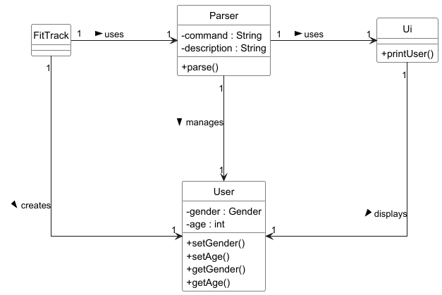
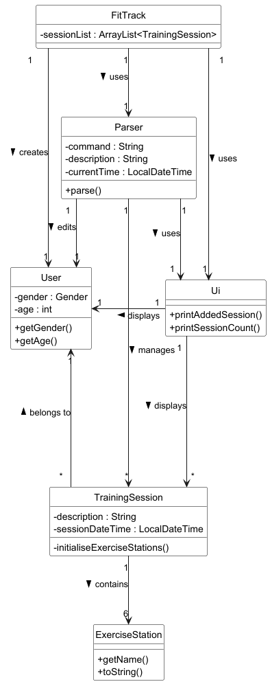
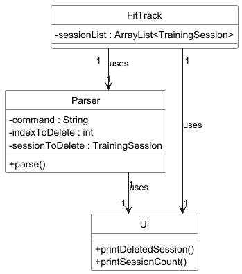

# Developer Guide

## Acknowledgements

{list here sources of all reused/adapted ideas, code, documentation, and third-party libraries -- include links to the original source as well}

## Setting up, getting started
First , **fork** this repo, and clone the fork into your computer.
1. **Configure the JDK**: Follow the guide [se-edu/guides] IDEA: Configuring the JDK to ensure Intellij is configured 
   to use **JDK 17**.
2. **Import the project as a Gradle project**: Follow the guide [se-edu/guides] IDEA: Importing a Gradle project
   to import the project into IDEA.
3. Verify the setup:
   (i) Run the FitTrack.Main and try a few commands like `help`.
   (ii) Run the tests to ensure that all of it pass.

## Design & implementation

## Software Architecture

**FitTrack** is the main class and entry point of the application. It manages high level functionalities by coordinating the following classes:

| Class           | Functionality                                                                                                |
|-----------------|--------------------------------------------------------------------------------------------------------------|
| FitTrackLogger  | Manages logging for the application, ensuring errors and important events are properly recorded              |
| Storage         | Manages saving and loading data from a persistent storage file                                               |
| User            | Records the user’s information, such as age and gender, and provides methods to modify or retrieve this data |
| Parser          | Handles parsing of user input, converting it into commands and actions                                       |
| Ui              | Handles user interaction and CLI output, printing messages and data to the console                           |
| TrainingSession | Represents a single training session, including exercises and metadata (e.g. date and description)           |
| Exercise        | Represents different types of exercises available in the application, like pull-ups or shuttle runs          |

## Features

### Storage

### Set User

### Add Training Session

#### 1. Class Interaction Overview
When the user adds a new training session, an instance of the `TrainingSession` class is created. 
This instance initializes an EnumMap, which instantiates the 6 `ExerciseStation` child classes with 
their initial values.
Below is a class diagram showing the EnumMap after an instance of `TrainingSession` is created.

#### 2. Sequence of Event 

1) **User Inputs Add command**:The User initiates the "add <name of the training session>" command by 
   calling Parser with the input.
2) **Instantiation of TrainingSession**: The Parser creates a new TrainingSession object with the 
   current time, description, and user.
3) **Instantiation of Exercise Stations**: Within TrainingSession class, all 6 subclasses of exercise
   stations are instantiated.
4) **UI Interaction**: The Parser calls Ui.printAddedSession(sessionList), which:
   (i) Begins a UI segment
   (ii) Prints a session message
   (iii) Prints the description of the last added session
   (iv) Calls printSessionCount to show the total count
   (v) Ends the segment.
4) Refer to Section on Edit Exercise and Point Calculation for specific implementation of 
   performance metric and point conversion.

### Delete Training Session

### List Training Sessions

### View Training Session

### Edit Exercise

The **Edit Exercise** feature is managed by the `TrainingSession` class, and is primarily carried out by its 
`editExercise()` function. This feature utilizes the `setPerformance()`and `getReps()` methods from the 
`ExerciseStation` classes to edit the repetitions and timings for the user’s selected 
exercises. Additionally, it calculates the points the user will earn for each exercise based on the updated "rep" or
"timing" values.

#### Step 2: Editing a Training Session

When the user wishes to edit a training session, they specify an `Exercise` Enum, and the reps/timing to be inputted.
These variables are then passed to the`editExercise` function. This function calls the relevant methods to update the 
repetitions or timings and calculates the corresponding points for the specified exercise.

The following sequence diagram illustrates the function calls involved in this process:

Additionally, the state diagram below shows the end state of the `editExercise` function after execution of the command,
`editExercise(Exercise.PULL_UP, 1)` and `editExercise(Exercise.SHUTTLE_RUN, "16.0")`:

### Points Calculation

The **points calculation feature** is a significant part of the `ExerciseStation` system. It allows for the calculation
of user-specific points based on their performance in various exercises (e.g., pull-ups, sit-ups). This process 
involves interaction between the `ExerciseStation` and the `Calculator` classes, ensuring that the correct points are
assigned based on predefined lookup tables.

#### 1. Class Interaction Overview

Each `ExerciseStation` subclass (e.g., `PullUpStation`, `SitUpStation`) has its own implementation of the `getPoints()` 
method. The main responsibility of this method is to invoke the `calculatePoints()` function from the 
respective **calculator** class (e.g., `PullUpCalculator`, `SitUpCalculator`), which holds the points calculation logic.

#### 2.  Sequence of Events:

1. **User Inputs Performance**: The user’s performance (e.g., number of pull-ups) is passed to the
   `setPerformance()` method in the exercise station.

2. **Invoke Points Calculation**: Once the performance is set, the `getPoints()` method is called. 
   This method interacts with the calculator class (e.g., `PullUpCalculator`) to compute the points.

3. **Calculator Logic**: The calculator class uses a lookup table, which maps the user's performance 
   to points based on their age and gender. The points are returned to the exercise station, where they are stored.

## Product scope
### Target user profile

{Describe the target user profile}

### Value proposition

{Describe the value proposition: what problem does it solve?}

## User Stories

Priorities: High (must have) - * * *, Medium (nice to have) - * *, Low (unlikely to have) - *

| Priority | As a ... | I want to ...                          | So that I can ...                                   |
|----------|----------|----------------------------------------|-----------------------------------------------------|
| ***      | new user | see usage instructions                 | refer to them when I forget how to use the app      |
| ***      | user     | add a new training session             | record my NAPFA training progress                   |
| ***      | user     | edit my new training session           | record the reps/time I attained for each exercise   |
| ***      | user     | delete a training session              | remove a session that was added by mistake          |
| ***      | user     | view a list of past training sessions  | track the number of training sessions I have done   |
| ***      | user     | view the details of a training session | have an overview of my performance for that session |
| ***      | user     | store my training sessions             | keep a record of my sessions when the app is closed |
| **       | user     | calculate my NAPFA points per exercise | conveniently view my standing for each station      |
| *        | user     | know my NAPFA achievement level        | know my NAPFA standard at a glance                  |

## Non-Functional Requirements

{Give non-functional requirements}

## Glossary

* *glossary item* - Definition

## Instructions for manual testing

{Give instructions on how to do a manual product testing e.g., how to load sample data to be used for testing}
