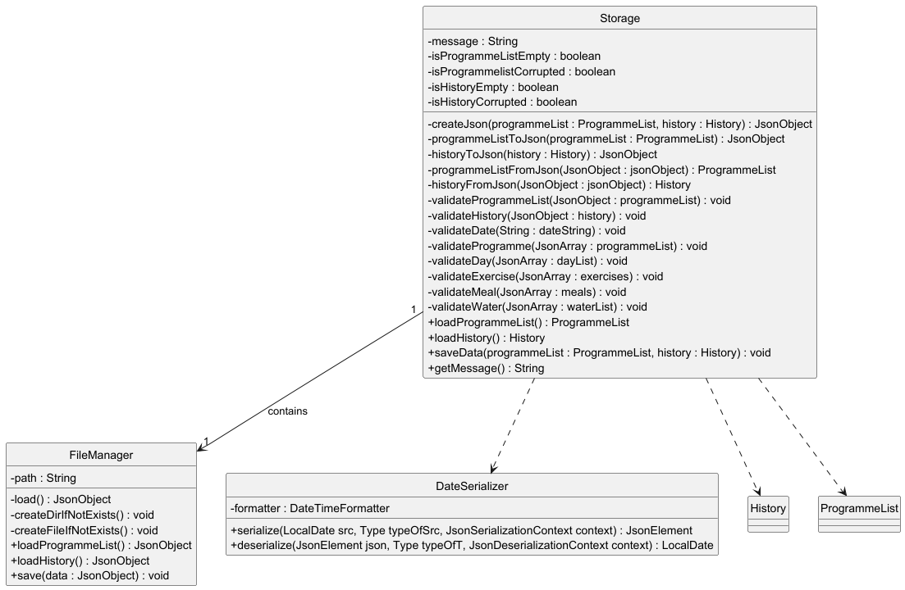
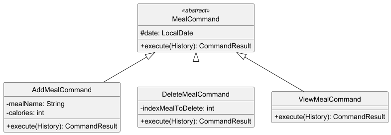

# Developer Guide

## Acknowledgements

We used these third party libraries to develop our application:

- Gson
- Mockito

## Design

### UI Component

### Programme Component

The `ProgrammeList` component,

The `programme` component,

The `day` component,

The `exercise` component,

The `updateExercise` component, 

### Meal Component

The `Meal` component,

- **Represents individual meals with nutritional information:** The `Meal` class encapsulates details about a meal, specifically its name and calorie count. This allows easy tracking of individual meals within a day.
- **Attributes:** Each `Meal` object has two main attributes: `name` (the name of the meal) and `calories` (the calorie content of the meal).
- **Validation:** The class enforces constraints during instantiation, ensuring that the `name` cannot be null or empty and that the calorie count is non-negative, reducing errors in meal tracking.
- **Supports equality checks and hashing:** The `Meal` class overrides `equals()` and `hashCode()` methods to ensure that meals with identical names and calorie counts are considered equal, which is useful for meal comparison and for storing in collections like sets.
- **Detailed representation:** The `toString()` method of `Meal` provides a concise, readable summary of the meal’s details, including the name and calorie count in the format `"[Meal Name] | [Calories] kcal"`. This makes it easy to display meal information in logs, summaries, or user interfaces.

The `MealList` component,

- **Manages a collection of meals:** The `MealList` class provides functionality for managing a list of `Meal` objects, allowing for easy addition, deletion, and retrieval of meals throughout the day.
- **Provides collection-based functionality:** The class includes methods for common operations, such as checking if the list is empty, getting the total number of meals, and adding or deleting meals from the list. Each action is logged for traceability.
- **Supports detailed retrieval and representation:** The `getMeals()` method returns the list of all meals, and the `toString()` method generates a formatted string that lists each meal with its index, making it convenient for displaying meal information in a user interface or summary.
- **Ensures data consistency:** The `MealList` class handles edge cases, such as attempts to delete meals at invalid indexes, by throwing appropriate exceptions. This helps maintain data integrity within the list.
- **Facilitates efficient comparisons and storage:** The class overrides `equals()` and `hashCode()` methods, which enables comparison of two `MealList` objects and allows it to be used in collections, ensuring that meal tracking remains accurate and consistent.

### Water Component

The `Water` component,

**Tracks daily water intake:** The `Water` class allows for recording individual water consumption entries throughout the day, stored in liters. Each entry is logged, providing a detailed trace of daily water consumption.

**Attributes:** The main attribute of the `Water` class is waterList, a list of Float values representing individual water intake entries in liters.

**Validation and error handling:** When adding water entries, the `Water` class enforces that the water amount is positive. Deletion attempts with invalid indexes are handled with exceptions, ensuring safe and predictable usage.

**Supports collection-based functionality:** The `Water` class includes methods for adding and deleting water entries, checking if the list is empty, and retrieving the entire list of entries. Each action is logged, allowing developers to track and troubleshoot any changes to the water intake log.

**User-friendly representation:** The toString() method formats and returns a string representation of all water entries. Each entry is listed with an index, making it easy to display in user interfaces and summaries.

**Efficient storage and retrieval:** The getWaterList() method returns the full list of water intake entries, while the class’s clear and consistent data structure facilitates straightforward water consumption tracking and data retrieval.

### History Component

#### DailyRecord

The `DailyRecord` component,

- **Tracks daily workout, meals, and water intake:** The `DailyRecord` class maintains a log of the day’s activities, meals consumed,
  and water intake. It provides methods to add, update, and retrieve each of these records.
- **Encapsulates multiple data types:** `DailyRecord` works with various objects such as `Day` (for recording the workout programme),
  `MealList` (for managing a list of meals consumed), and `Water` (for tracking daily water intake). These components are stored and managed
  together within a single daily record.
- **Enables modification and deletion:** The class provides methods for adding meals and water to the record, updating the workout for the
  day, and removing items such as meals or water entries. Each modification is logged for traceability.
- **Calculates key daily statistics:** `DailyRecord` is capable of calculating the total calories burned from the recorded `Day` and the
  calories gained from the `MealList`. It can also sum the total water intake for the day.
- **Provides a comprehensive summary:** The class’s `toString()` method generates a detailed summary of the day’s activities, including
  calories burned, meals eaten, water consumed, and the caloric balance, making it easy to retrieve and display all relevant information in a readable format.

### Storage Component

The `Storage` component,

- **Handles the saving and loading of both `ProgrammeList` and `History` data in JSON format:** The `Storage` component is responsible
  for serializing `ProgrammeList` and `History` objects into JSON format and passing them on to `FileManager`, as well as getting the
  data in Json format from `FileManager` and deserializing it into the appropriate objects when needed.
- **Serves as an adapter between `FileManager` and `BuffBuddy` classes:** `Storage` acts as an intermediary, translating between the JSON
  data handled by `FileManager` and the objects in the `BuffBuddy` application, ensuring seamless conversion between formats.
- **Relies on `ProgrammeList` and `History` from the Model component:** Since the `Storage` component is tasked with saving and retrieving
  the `ProgrammeList` and `History` objects, it ensures the data is accurately represented and stored.
- **Utilizes custom serializers:** To properly handle date formats and other specific needs, Storage makes use of custom serializers for
  objects like LocalDate from the `DateSerilazer` class, ensuring that these objects are correctly serialized to and deserialized from JSON.

The `FileManager` component,

- **Manages the saving and loading of data:** The `FileManager` class is responsible for reading data from and writing data to the file
  specified by the user. It ensures that both the `ProgrammeList` and `History` data are stored in JSON format, and retrieves them when needed.
- **Handles file creation and directory management:** Before saving data, `FileManager` checks whether the necessary directories and
  files exist. If they do not, it creates them to ensure data can be stored correctly.
- **Leverages JSON for data structure:** `FileManager` uses `Gson` to serialize and deserialize JSON data, making it easy to work with
  structured data. It also ensures the data is formatted in a readable way using pretty printing for clarity.
- **Performs error handling and logging:** `FileManager` employs detailed logging to track the progress of saving and loading operations.
  If any issues arise during file operations (e.g., missing files, failed directory creation), they are logged, and exceptions are thrown to handle errors gracefully.

### Parser Component

### Command Component

#### Overview

To interact with BuffBuddy, the user's input commands are parsed into discrete `Command` objects that have the sole responsibility of accomplishing that task.

As BuffBuddy contains many commands and thus many types of `Command` subclasses, the following diagram presents a simplified representation of the various `Command` classes:

Each abstract subclass of `Command` represents a generalization of the various commands available to BuffBuddy. In the following sections, each abstract class and their respective purposes will be elaborated on.

#### Programme Commands

`ProgrammeCommand` is an abstract class for all `Command` classes that interact with `ProgrammeList` and its encapsulated data.
The following diagram documents all `ProgrammeCommand` subclasses.

`EditProgrammeCommand` classes are a subset of `ProgrammeCommand` classes that focus specifically on editing the internal `ProgrammeList` data. As this data is concerned only with `ProgrammeList`, `EditCommand#execute()` has been narrowed through method overloading to only take in `ProgrammeList` as a parameter.

#### Meal Commands

`MealCommand` is an abstract class for all `Command` classes that interact with meal-related data within the application. These commands allow users to log, edit, and manage their meal entries, ensuring that their dietary information is accurately tracked and updated. The following diagram documents all `MealCommand` subclasses.

#### Water Commands

`WaterCommand` is an abstract class for all `Command` classes that interact with water-related data within the application. These commands allow users to log, edit, and manage their water intake entries, ensuring that their hydration information is accurately tracked and updated. The following diagram documents all `WaterCommand` subclasses.

#### History Commands

`HistoryCommand` is an abstract class for all `Command` classes that interact with `History` data within the application. These involve viewing weekly summaries, viewing their recorded data and getting their personal bests for each exercise. The following diagram documents all `HistoryCommand` subclasses.

### Common Component

`common` package contains utility classes that are used across the multiple packages.

## Implementation

### Save/Load Feature

The save/load mechanism is handled by three main components: `Storage`, `FileManager`, and `DateSerializer`. `FileManager` manages file interactions, including reading from and writing to JSON data files, while `Storage` handles the conversion between JSON objects and `ProgrammeList`/`History` objects. The `DateSerializer` is used for converting `LocalDate` to/from JSON format.

#### FileManager implements the following key operations:

- **`FileManager#load()`**: Reads the data file into a `JsonObject`.
- **`FileManager#save(JsonObject data)`**: Writes the `JsonObject` containing all data back into the file.
- **`FileManager#createDirIfNotExist()`** and **`FileManager#createFileIfNotExist()`**: Ensure that the necessary directory and file exist before saving.

#### Storage converts JSON data into Java objects:

- **`Storage#loadProgrammeList()`**: Converts the `ProgrammeList` JSON data into a `ProgrammeList` object using `programmeListFromJson()`.
- **`Storage#loadHistory()`**: Converts the `History` JSON data into a `History` object using `historyFromJson()`.
- **`Storage#saveData()`**: Converts `ProgrammeList` and `History` into JSON using `createJSON()`, and passes it to `FileManager#save()`.

#### DateSerializer is responsible for:

- **`DateSerializer#serialize()`**: Converts `LocalDate` into `JsonElement`.
- **`DateSerializer#deserialize()`**: Converts `JsonElement` back into `LocalDate`.

These operations are exposed in the `Model` interface, allowing seamless saving and loading of `ProgrammeList` and `History` data.

### Flow of Operations

Given below is an example usage scenario and how the save/load mechanism behaves at each step.

**Step 1.** The user launches the application for the first time. A `Storage` object is initialized by `BuffyBuddy`, and it attempts to load data from
the file using `FileManager`. If no data file exists, `Storage` initializes an empty `ProgrammeList` and `History`.

**Step 2.** The user interacts with the application by adding programmes or logging workout activities and meals, modifying both the
`ProgrammeList` and `History`. These changes are stored temporarily in memory, but no data is saved to the file at this point.

**Step 3.** When the user chooses to exit the application, `Model#saveData()` is triggered, which in turn calls `Storage#saveData()`.
At this point, `Storage` converts the current `ProgrammeList` and `History` into JSON format using the `createJSON()` method and passes
the `JsonObject` to `FileManager#save()`.

**Step 4.** The `FileManager` saves the updated `JsonObject` to the data file, ensuring that the user's changes are preserved for the
next session. If necessary, `FileManager#createDirIfNotExist()` and `FileManager#createFileIfNotExist()` ensure that the correct directories
and files are in place before saving.

**Step 5.** The next time the user launches the application, `Storage#loadProgrammeList()` and `Storage#loadHistory()` are called, which
load the data from the file via `FileManager#load()`. The loaded data is then converted from JSON back into `ProgrammeList` and `History`
objects, restoring the user's previous session.

The following sequence diagram shows how a load operation for ProgrammeList goes through the Storage component:

The following sequence diagram shows how a save operation goes through the Storage component:

## WeeklySummary Feature

The Weekly Summary feature allows users to view a summary of their workouts for the current week. This functionality is achieved through a combination of several interconnected components, including `WeeklySummaryCommand`, `Parser`, `HistoryCommandFactory`, and `History`. Users can access this feature through the `history wk` command in the UI. The implementation follows a command pattern, combined with the factory pattern for command creation.

### Overview

The following components are crucial to the Weekly Summary feature:

1. **Parser Component**  
   The `Parser` interprets the initial command and directs the flow as follows:

   - **`Parser#parse(String)`**: Accepts the raw input string, splits it into the main command and arguments.
   - **`CommandFactory`**: Generates the appropriate command object based on the parsed input.
   - **`HistoryCommandFactory`**: Handles the creation of history-related commands, including `WeeklySummaryCommand`.

2. **WeeklySummaryCommand Component**  
   The `WeeklySummaryCommand` implements the `Command` interface and performs the following:

   - Extends the abstract `Command` class.
   - Uses the command word `"wk"`.
   - Executes by retrieving the weekly summary from the `History` object.
   - Returns a `CommandResult` that contains the formatted summary for display.

3. **History Component**  
   The `History` class manages workout data and provides:

   - **`getWeeklyWorkoutSummary()`**: Retrieves and formats the workout data for the current week.

### Flow of Operations

The following example illustrates the usage scenario and behavior of the Weekly Summary feature:

1. **Step 1**: The user enters the `"history wk"` command in the UI. The UI reads this command and passes it to the `Parser`.
2. **Step 2**: The `Parser` breaks down the command `"history wk"` into:
   - Main command: `"history"`
   - Subcommand: `"wk"`
3. **Step 3**: The `Parser` uses `CommandFactory`, which recognizes this as a history command and delegates to `HistoryCommandFactory`.
4. **Step 4**: `HistoryCommandFactory` identifies `"wk"` as the `WeeklySummaryCommand` trigger and creates a new `WeeklySummaryCommand` instance.
5. **Step 5**: The `WeeklySummaryCommand` is passed back through the chain to the UI, which then calls its `execute` method.
6. **Step 6**: During execution:
   - `WeeklySummaryCommand` calls `History`'s `getWeeklyWorkoutSummary()`.
   - The summary is formatted and wrapped in a `CommandResult`.
   - The UI displays the result to the user.

### Sequence Diagram

---

### Edit Programme

#### Overview

The **Edit Programme** feature allows for in-depth management of programme structures, supporting operations to add, remove, and update days and exercises within each programme.
Due to the nature of modelling a Workout Programme, a hierarchical data structure is used to represent workout data.

To perform an edit to any aspect of this data, the EditCommand will traverse the hierarchy until it reaches the necessary depth to perform its edit operation.

These operations include:

- Adding or removing Days to the Programme
- Adding or removing Exercises to Days in the Programme
- Updating the details of Exercises in Days in the Programme

#### Sequence Diagram

The overall design that enables this functionality is described generically by the following sequence diagram.

The 'Model' class in the above diagram is a generalization of the various data models that are being interacted with
to perform each specific edit command. For each edit command, the following sequence diagrams
further break down how this interaction works.

##### Add day

##### Add exercise

##### Update exercise

##### Example Usage

Given below is an example usage scenario for 'delete exercise' and how the edit programme functions at each step.

Step 1. The user creates a programme with a given number of Days with their respective Exercises. ProgrammeList will contain a reference to this programme after its creation.

Step 2. The user executes `programme edit /p 1 /d 1 /x 1` to delete the first exercise in the first day of the first programme.

Step 3. After parsing this input, a `DeleteExerciseCommand` (inheriting from the generic `EditProgrammeCommand`) is created and executed.

Step 4. The command first retrieves the chosen Programme with `ProgrammeList#getProgramme()`.

Step 5. The command then retrieves the chosen Day with `Programme#getDay()`.

Step 6. With the Day object, it performs the `Day#deleteExercise()` with the given exercise ID

Step 7. The deleted Exercise object is then returned to the `DeleteExerciseCommand` to display as part of the returned `CommandResult`.

#### Activity Diagram

To summarize, the following activity diagram describes how the overall operation occurs.

---

### Add Meal

#### Feature Implementation

The **Add Meal** feature manages the functionality related to adding meals to a daily record. It interacts with various components such as `History`, `DailyRecord`, and `MealList` to ensure meals are added correctly.

The **Add Meal** command navigates through the following hierarchy:

- **History** → **DailyRecord** → **MealList**
- If a `DailyRecord` does not exist for a given date, it is created before adding the meal.
- Similarly, a new `Meallist` object is created and added to the `DailyRecord` if it doesn't already exist. The meal is then added to the `MealList` object.

These operations include:

- Adding meals to a `MealList` in the `DailyRecord` of a particular date in the `History`.

Given below is an example usage scenario for adding a meal and how the add meal command functions at each step.

#### Example Usage Scenario

**Step 1**: The user starts by adding a meal using the command:

meal add /n [mealName] /c [calories]

- The command is parsed and translated into an `AddMealCommand` object, which contains the necessary details.

**Step 2**: The command retrieves the `DailyRecord` for the specified date from the `History` using `getRecordByDate()`. If no record exists, a new one is created.

**Step 3**: The `AddMealCommand` adds the meal to the `MealList` of the `DailyRecord`. If the mealList already exists, it updates the existing mealList instead.

**Step 4**: The newly added `Meal` object is returned to the `AddMealCommand` to display as part of the `CommandResult`.

The overall design that enables this functionality is described generically by the following sequence diagram.

#### Sequence Diagram for "Add Meal" Command

The diagram shows the interactions among different classes and objects during the execution of the "Add Meal" command.

#### Activity Diagram for "Add Meal" Feature

#### Summary of Feature

The **Add Meal** feature uses a **hierarchical command pattern** to manage meal additions while maintaining good encapsulation and separation of concerns. The chosen design allows easy extensibility and maintainability.

### Create Programme Feature

#### Feature Overview

The "Create Programme" feature enables users to build a structured fitness program with workout days, each containing specific exercises. This feature allows flexible customization, enabling users to plan their fitness goals in detail, including attributes such as the name, sets, reps, weight, and calories for each exercise.

#### Programme Flow

1. **User Input and Command Handling**:

- Upon startup, BuffBuddy welcomes the user and continuously prompts for commands.
- The command input is read, parsed, and handled by `handleCommand`. If the user enters a valid command (e.g., `create`), it is executed, producing a `CommandResult`.

2. **Command Parsing and Execution**:

- `Parser.parse()` analyzes the user’s input to identify the command type and arguments.
- `CommandFactory.createCommand()` determines the specific command (e.g., `CreateCommand`) and forwards it to the relevant command factory (`ProgCommandFactory` for programme-related commands).

3. **Creating a Programme**:

- Within `ProgCommandFactory`, `prepareCreateCommand()` splits the input string by `/d` (indicating separate days) and `/e` (indicating exercises within each day).
- Each **Day** is parsed by `parseDay`, and each **Exercise** is created using `parseExercise`, which extracts details such as name, sets, reps, weight, and calories using flag parsing (`/n`, `/s`, `/r`, `/w`, and `/c` flags).
- The `CreateCommand` is then prepared with the programme name and its associated days.

4. **Inserting and Storing Programmes**:

- The `execute()` method of `CreateCommand` uses `ProgrammeList` to insert a new programme, which is then stored for future access and manipulation.
- `ProgrammeList.insertProgramme()` creates a `Programme` object and adds it to the list, ensuring it is available for subsequent commands (e.g., viewing, editing, or deleting).

5. **Execution Feedback**:

- A successful creation logs the programme details and returns a `CommandResult`, notifying the user of the new programme with its full structure.

This flow allows users to easily create structured workout routines, customizing their fitness journey directly within BuffBuddy.

The overall design that enables this functionality is described generically by the following sequence diagram.

## Documentation, logging, testing, configuration, dev-ops

* [Logging Guide](LoggingGuide.md)
* [Testing Guide](TestingGuide.md)

## Appendix

### Product scope

BuffBuddy is a fitness tracking app that help you track workout, meals, water to aid you in achieving your body goals.

### Target user profile

Gym goers who need a quick way to create, manage and track their workout plans and progress.

### Value proposition

- Users will be able to quickly create, update and view their workout programmes
- Users will be able to track their progress as they progress on their fitness journey
- Users will be able to track water and calorie intake to better track their nutrition

## User Stories

| Version | As a ...               | I want to ...                                           | So that I can ...                                    |
|---------|------------------------|---------------------------------------------------------|------------------------------------------------------|
| v1.0    | fitness enthusiast     | create a new workout plan/routine                       | tailor my workout to fit my needs                    |
| v1.0    | fitness enthusiast     | create a workout entry (input sets, weights, rep, time) | keep track of my progress                            |
| v1.0    | fitness enthusiast     | view my routine when I begin my workout                 | follow my plan more effectively                      |
| v1.0    | fitness enthusiast     | view their logged workout entry for a specific day      | see what they have done previously                   |
| v1.0    | fitness enthusiast     | delete a workout entry                                  | remove mistakenly created logs                       |
| v1.0    | fitness enthusiast     | delete a fitness routine if I no longer use it          | ensure my routines remain relevant and organized     |
| v1.0    | fitness enthusiast     | edit my existing fitness routine                        | further customize my routines after making them      |
| v2.0    | progress tracking user | view a summary of my weekly workout activity            | measure my overall progress                          |
| v2.0    | progress tracking user | track my personal bests for each exercise               | see improvements over time                           |
| v2.0    | nutrition-focused user | track calories burned during my workout                 | align my fitness routine with my dietary goals       |
| v2.0    | nutrition-focused user | add a meal I just ate                                   | track my meals over time                             |
| v2.0    | nutrition-focused user | delete a meal I ate                                     | delete a wrongly inputted meal                       |
| v2.0    | nutrition-focused user | view my meals I ate on a certain date                   | see how much calories I have eaten                   |
| v2.0    | hydration-focused user | add my water intake                                     | track my water intake for each day                   |
| v2.0    | hydration-focused user | view my water intake                                    | see how much water I have consumed across days/week  |
| v2.0    | hydration-focused user | delete a water intake                                   | remove any mistakes made when inputting water intake |

## Non-Functional Requirements

- Java 11 or above installed
- Program built to support only single user

## Glossary

- _exercise_ - Any exercise that can defined by a name, rep, set, weight and calories burned.
- _day_ - A day is a collection of exercises meant to be done in one day
- _programme_ - A programme is a weekly plan of workout days meant to be performed in rotation

## Instructions for manual testing

{Give instructions on how to do a manual product testing e.g., how to load sample data to be used for testing}

