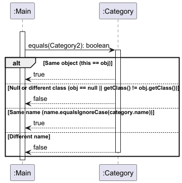
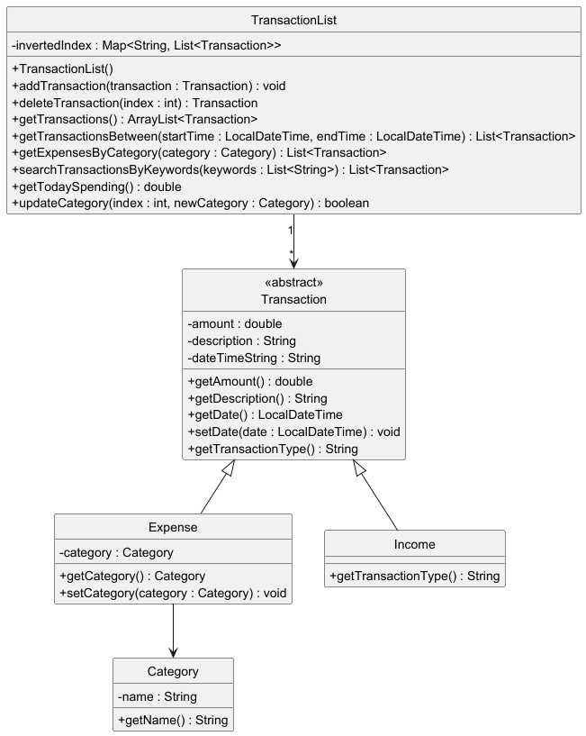
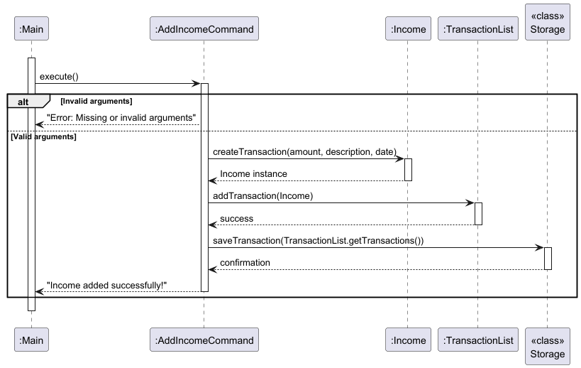

# Developer Guide

## Table of Contents
1. [Acknowledgements](#acknowledgements)
2. [Design & Implementation](#design--implementation)
    - [Category](#category)
    - [TransactionList](#transactionlist)
    - [Command](#command)
    - [AddIncomeCommand](#addincomecommand)
    - [Command Parser](#command-parser)
3. [Product Scope](#product-scope)
    - [Target User Profile](#target-user-profile)
    - [Value Proposition](#value-proposition)
4. [User Stories](#user-stories)
5. [Non-Functional Requirements](#non-functional-requirements)
6. [Glossary](#glossary)
7. [Instructions for Manual Testing](#instructions-for-manual-testing)

## Acknowledgements
- The `Parser` is adapted from [Dan Linh's iP](https://github.com/DanLinhHuynh-Niwashi/ip/tree/master/src/main/java/niwa/parser) code, with changes to get on well with the current project 

## Design & implementation
### Category
The `Category` class encapsulates the name of a category and provides functionality for equality checks, hash code generation, and string representation. It serves as the foundational representation of a category.

#### Class responsibilities
1. **Attribute Encapsulation**: Encapsulates the category name to prevent external modification.
2. **Equality Checks**: Implements equality based on the category name, allowing categories with the same name to be considered equal.
3. **String Representation**: Provides a `toString` method for convenient logging and debugging output.

#### Class attributes
1. **name**:String
   - Description:Represents the category name, set as a read-only attribute.

#### Class main Methods
1. **public Category(String name)**
   - **Parameters**:
     - **`name`**: The category name.
   - **Process**: Initializes the name attribute with the specified value.

2. **public String getName()**
   - **Returns**: The `name` of the Category object.
   - **Process**: Provides access to name attribute.

3. **public boolean equals(Object obj)**
   - **Parameters**:
     - **`obj`**: The object to compare for equality.
   - **Returns**: `true` if `obj` is a Category instance with the same name, `false` otherwise.
   - **Process**: Checks if `obj` is a Category instance and compares its name with the current `Category` object’s name.

4. **public int hashCode()**
   - **Returns**: The hash code based on the name.
   - **Process**: Calculates the hash code for storing `Category` objects in hash-based collections.

5. **public int hashCode()**
   - **Returns**: The formatted description of the category
   - **Process**: Generates a string representation of the `Category` object, useful for logging and debugging.

    

### TransactionList
The `TransactionList` class is responsible for storing user transactions of different types. It also provides various
operations that enable user to add, delete, search by (date/ category/ keywords).


    
#### Class Responsibilities

1. **Storage for transactions**: Keeps an ArrayList of `Transaction` objects.
2. **Amend transactions**: Adding or Deleting `Transaction` objects to or from the ArrayList.
3. **Search Transactions**: Search `Transaction` in the `TransactionList` based on multiple keywords, date range or `category` of `Transaction`.

#### Class attributes
1. **transactions: `ArrayList<Transaction>**
    - Description: A List of `Transaction` objects stored that supports List operations.
2. **InvertedIndex: `Map<String, List<Transaction>>**
    - Description: An inverted index implemented as a map that associates each unique keyword from transaction descriptions with a list of Transaction objects containing that keyword in their descriptions.

#### Class main methods

1. **addTransaction(transaction : Transaction) : void**
    - **Parameters**:
        - `transaction`: The `Transaction` object to be added to the `transactions` list.
    - **Process**:
        - Adds the `transaction` to the `transactions` list.
        - Updates the `invertedIndex` to include the new `transaction` for quick search.
        - Sorts the `transactions` list by date using a custom comparator.

2. **deleteTransaction(index : int) : Transaction**
    - **Parameters**:
        - `index`: The position of the `Transaction` object to be removed.
    - **Process**:
        - Removes the `Transaction` at the specified `index` from `transactions`.
        - Updates the `invertedIndex` to reflect the deletion.
        - Returns the removed `Transaction`.

3. **getTransactions() : ArrayList&lt;Transaction&gt;**
    - **Parameters**: None
    - **Process**:
        - Returns the complete list of `Transaction` objects in `transactions`.

4. **searchTransactionsByKeywords(keywords : List&lt;String&gt;) : List&lt;Transaction&gt;**
    - **Parameters**:
        - `keywords`: A list of keywords to search for within transaction descriptions.
    - **Process**:
        - Looks up each `keyword` in the `invertedIndex` to find matching transactions.
        - Aggregates and counts relevance for each match.
        - Sorts the results by relevance and returns the list of matched transactions.
5. **getExpensesByCategory(category : Category) : List&lt;Transaction&gt;**
    - **Parameters**:
        - `category`: The `Category` to filter expenses by.
    - **Process**:
        - Filters `transactions` to include only `Expense` objects with the specified `category`.
        - Returns the filtered list of expenses.
    

### Command
The `Command` class is an abstract class that provide a common behavior that other commands can share.

#### Class responsibilities
1. **Defining common structure**: It provides common fields that ensure consistency across all concrete command classes that extend Command.
2. **Defining common behavior**: It provides a template for commands by the abstract methods (e.g. `execute()`, etc.), the class enables developers to add new commands by simply extending the base class and implementing the specific behavior for each command.
3. **Defining some reusable methods**: It provides some common methods (e.g. `isArgumentsValid()`, `setArguments()`, `getArguments()`, etc.) across child classes.

#### Class attributes
1. **COMMAND_WORD**: `String`
    - Description: The keyword triggering the command. The inherit classes will override this static variable by their own values.
2. **COMMAND_GUIDE**: `String`
    - Description: Description of the command. The child classes will override this static variable by their own values.
3. **COMMAND_MANDATORY_KEYWORDS**: `String[]`
    - Description: Array storing mandatory argument keywords. The child classes will override this static variable by their own values.
4. **COMMAND_EXTRA_KEYWORDS**: `String[]`
    - Description: Array storing optional argument keywords. The child classes will override this static variable by their own values.
5. **arguments**: `Map<String, String>`
    - Description: A map storing argument strings along with its keyword.

#### Class main methods
1. **execute(): abstract void**
    - **Responsibility**: Act as a template for the child classes.

2. **isArgumentsValid(): boolean**
    - **Returns**: `true` if the `arguments` map contains all the mandatory keywords, `false` otherwise. Can be reused by the child classes.
      
### AddIncomeCommand
The `AddIncomeCommand` class inherits Command class, handles the logic for adding an income transaction to the `TransactionList` by parsing input arguments, creating a new `Income` instance, and updating the transaction list.


#### Class responsibilities

1. **Command parsing and validation**: The class validates required fields (e.g., amount) and parses optional fields (e.g., date).
2. **Transaction creation**: An `Income` transaction is instantiated and initialized with a description, amount, and date.
3. **Transaction storage**: Upon creation, the transaction is saved to the `TransactionList` and persisted using `Storage`.

#### Class attributes
1. **transactions**: `TransactionList`
    - Description: Stores the current list of all transactions.

#### Class main methods

1. **execute()**
    - **Returns**: `List<String>`
    - **Process**:
        1. Validates the input arguments.
        2. Parses `amount` and `date` fields.
        3. Instantiates a new `Income` transaction and adds it to `TransactionList`.
        4. Calls `Storage.saveTransaction()` to persist data.

    

2. **createTransaction(double amount, String description, String date) : Transaction**
    - **Parameters**:
        - `amount`: Amount for the income.
        - `description`: Description for the income.
        - `date`: Date when the income was received.
    - **Returns**: A new `Income` instance.

### Command Parser
The `Parser` class is responsible for interpreting user commands and extracting the associated arguments. It facilitates interaction between the user and the underlying command execution logic.

#### Class responsibilities
1. **Command registration**: Maintain a mapping of command words to their corresponding `Command` objects.
2. **Command parsing**: Convert a command string entered by the user into a `Command` object.
3. **Argument extraction**: Extract and organize the arguments associated with a given command.
   
#### Class attributes
1. **commands: LinkedHashMap&lt;String, Command&gt;**
   - Description: Associates command words (as keys) with their corresponding Command objects (as values).
     
#### Class main methods
1. **registerCommands(Command command): void**
   - **Parameters**:
     - `command`: The `Command` object to be registered.
   - **Process**:
     - Retrieves the `COMMAND_WORD` field from the `Command` object
     - Adds the word and the command to the `commands` map.
    
    
    
2. **parseCommand(String commandPart): Command**
   - **Parameters**: 
     - `commandPart`: A string representing the command word entered by the user.
      
   - **Returns**: The corresponding `Command` object or `null` if the command is not found.
    
   - **Process**: 
     - Retrieves the associated `Command` object from the `commands` map, using the provided commandPart.

    
  
3. **extractArguments(Command command, String argumentString): Map&lt;String, String&gt;**
   - **Parameters**: 
     - `command`: The `Command` object for which arguments are to be extracted.
     - `argumentString`: The string containing the arguments to be parsed.
      
   - **Returns**: A map of argument keys and their corresponding values.
    
   - **Process**: 
     - Initializes an empty map for arguments
     - Retrieves the expected argument keys from the command
     - Invokes `splitCommandRecursively` to populate the arguments map.
  
    
  
4. **splitCommandRecursively(String argumentString, String[] keywords, Map&lt;String, String&gt; arguments, String prevKeyword): void**
   - **Parameters**: 
     - `argumentString`: The string containing the arguments to be split.
     - `keywords`: An array of expected keywords for argument extraction.
     - `arguments`: The map where extracted arguments will be stored.
     - `prevKeyword`: The keyword found in the previous recursive call.
      
   - **Description**: Extracts values associated with keywords and updates the arguments map accordingly.
    
   - **Process**:
     - Base case: No argument left to split: `argumentString.isEmpty()`
     - Find the first keyword in the list that appears in the argumentString
     - If found:
       - Attach the part before the keyword with the previously found keyword and put in to `arguments`.
       - Delete the keyword from the `keywords` list (to not be considered in the next call)
       - Pass the remaining `argumentString` after the keyword to the next recursive call
     - If not found (mean that the last keyword reached):
       - Attach the remaining part with the previously found keyword and put in to `arguments`.

     
   
## Product scope
### Target user profile
#### Demographics:
- Age: 18-25 years old
- Education: College or university students
- Income: Limited or variable income (part-time jobs, allowances, or scholarships)
  
#### Psychographics:
- Tech-Savvy: Comfortable using command-line interfaces and basic programming concepts.
- Motivated to create good spending habit: Aware of personal finance status and developing better money management habits.

### Value proposition
uNivUSaver offers a practical solution for students who want to take control of their finances, avoid over-spending and manage their saving goal.
- Customized budgeting tools: Helps users set up personalized budgets based on their income and expenses, allowing them to see where their money goes and how to optimize it.
- Habit formation: Encourages regular check-ins and tracking of spending habits, helps students develop a consistent routine for managing their finances.
- Limit tracking: Helps users to set specific monthly limit and monitor their progress to avoid over-spending.

## User Stories

| Version | As a...                              | I want to...                                           | So that I can...                                                |
|---------|--------------------------------------|--------------------------------------------------------|-----------------------------------------------------------------|
| v1.0   | new user                              | see usage instructions                                 | refer to them when I forget how to use the application          |
| v1.0   | student                               | input my expenses                                      | keep track of how much I spend daily                            |
| v1.0   | student with part-time job            | input my income into the budget                        | my budget reflects my earnings                                  |
| v1.0   | student                               | create categories for expenses                         | separate my expenses into the respective categories             |
| v1.0   | user                                  | delete any expense                                     | remove any spending that was input wrongly                      |
| v1.0   | user                                  | delete any income                                      | remove any income that was input wrongly                        |
| v1.0   | student with changing spending purposes| delete any category                                    | clean up unecessary categories                                  |
| v1.0   | student who wishes to manage my budget| view my transaction history                            | figure out my spending habits                                   |
| v1.0   | student                               | view my budget amount                                  | know the current state of my budget                             |
| v1.0   | student who wishes to manage spendings| view summary of my spending                            | have an idea of where my money goes in a period of time         |
| v1.0   | student who wishes to manage incomes  | view summary of my incomes                             | have an idea of where my sources of income in a period of time  |
| v1.0   | user                                  | view current category list                             | know the existing categories in my budget                       |
| v1.0   | student with various spending purposes| keep track of my spending in each category             | see how much I spend for each category                          |
| v2.0   | time-constrained student              | see fixed reminders to input daily expenses            | improve accuracy in recording and avoid missing any transactions|
| v2.0   | student that easily overspending      | see fixed reminders of today expenses                  | stop myself from overspending in the rest of the day            |
| v2.0   | student                               | find my expenses and incomes by keywords               | search for old transactions                                     |
| v2.0   | who often changes my mind             | categorize my expenses after creating                  | easily change my expense category                               |

## Non-Functional Requirements

* **Error prevention** - The system must minimize the possibility of user mistakes by implementing robust validation, clear feedback, and safeguards against incorrect actions.
* **Error recovery** - The system must provide a way for user to restart the session on error.
* **Compatibility** - The system must run on modern operating systems (Windows, macOS, Linux) and should be compatible with major terminal emulators and shells such as Bash and Command Prompt.
* **Feedback** - The system must provide real-time feedback for user actions.

## Glossary
* *Transaction* - A record of an income or expense that includes details such as the amount, description, date, and associated category.
* *Income* - Money received by the user. An income transaction is recorded to track the user's earnings.
* *Expense* - Money spent by the user. An expense transaction helps the user monitor their spending habits.
* *Category* - A classification used to group expenses (e.g., "Food", "Transportation", "Entertainment"). Each expense in the system is assigned to a category.
* *Budget* - A spending limit that the user set for each month, that the user can use to track if they're overspending.

## Instructions for manual testing
* Ensure that you have Java 17 or above installed.
* Down the latest version of `uNivUSaver` from [here](https://github.com/AY2425S1-CS2113-W10-4/tp/releases).
* Copy the file to the folder you want the program to stay in, make sure the data files `(*.json)` is in the same folder with the `uNivUSaver.jar` file.
* Open a command terminal, run the following:
```
cd Path/to/directory # Change directory into the folder you put the jar file in
java -jar uNivUSaver.jar # Start the program.
```

* The data files will be read automatically
* Type `help` to view the command list and syntax.
* Refer to [User Guide](https://ay2425s1-cs2113-w10-4.github.io/tp/UserGuide.html) for detailed guide on command syntax.
