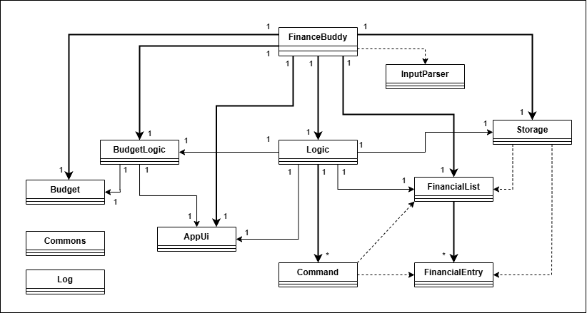
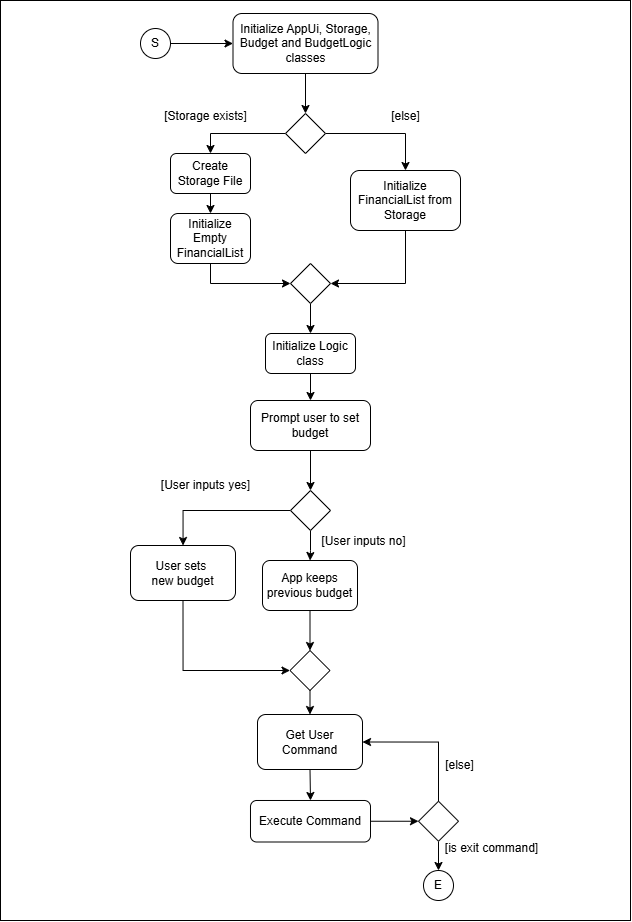
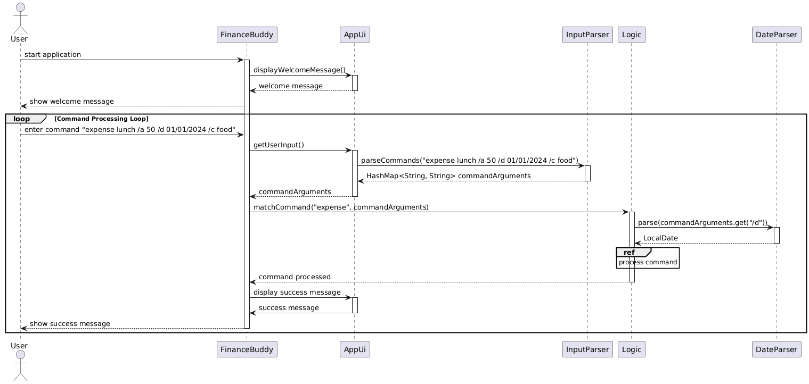
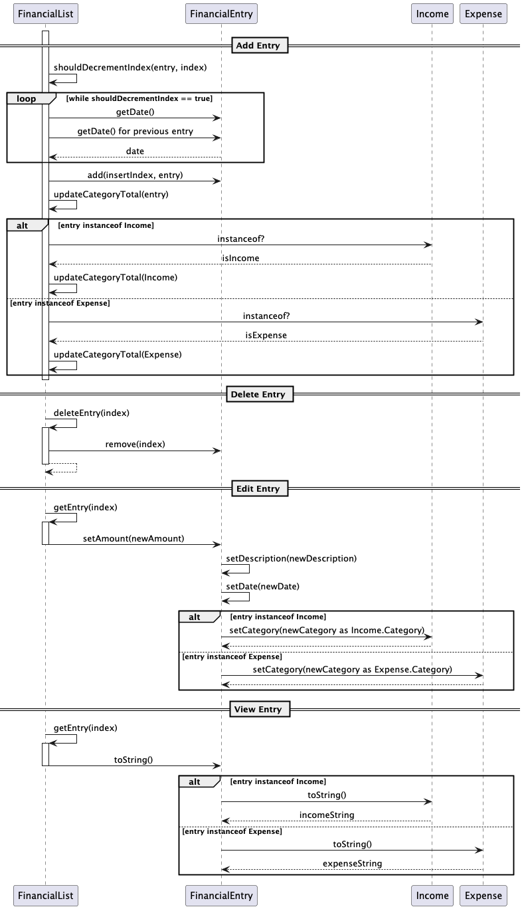
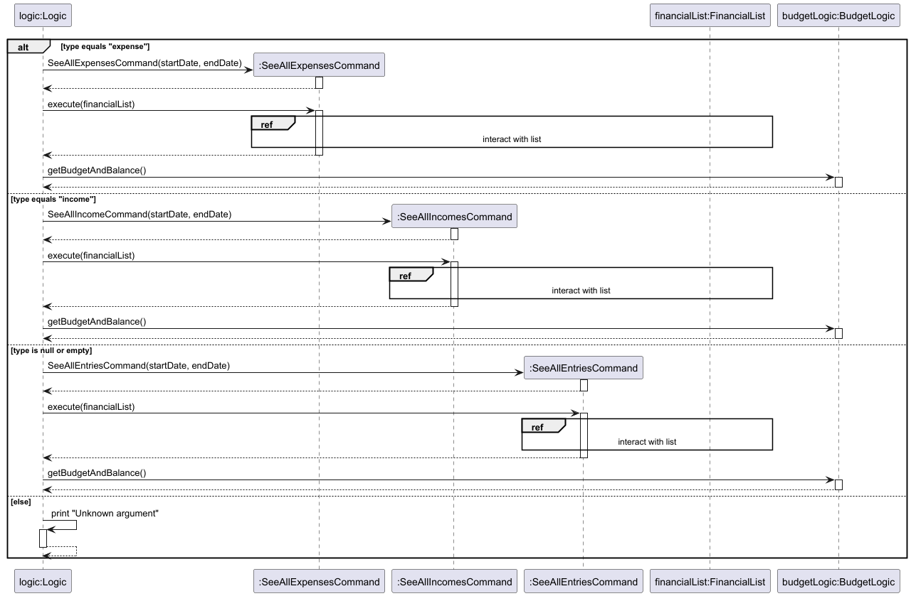
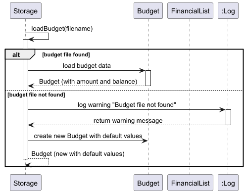
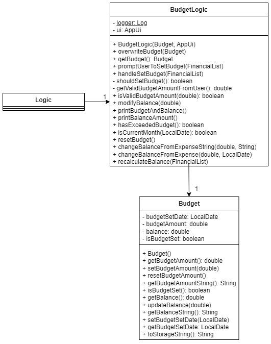
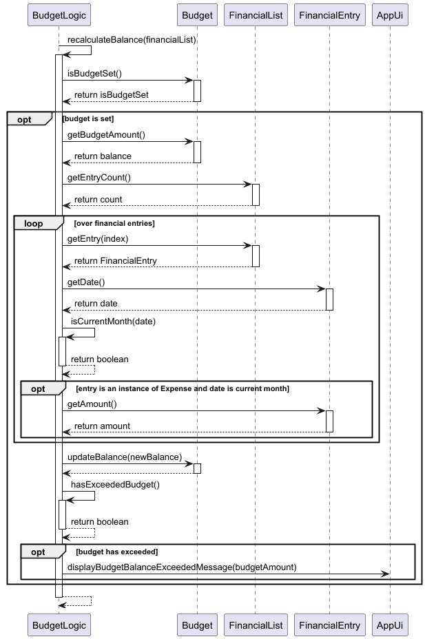

<style>
img
{
    display:block;
    float:none;
    margin-left:auto;
    margin-right:auto;
}
</style>

# Developer Guide

## Table of Contents

- [Developer Guide](#developer-guide)
  - [Table of Contents](#table-of-contents)
  - [Acknowledgements](#acknowledgements)
  - [Design and Implementation](#design-and-implementation)
    - [Ui and Parser](#ui-and-parser)
      - [Ui Component](#ui-component)
      - [Parser Component](#parser-component)
    - [Logic](#logic)
    - [FinancialList and FinancialEntry](#financiallist-and-financialentry)
      - [FinancialList Component](#financiallist-component)
      - [FinancialEntry Component](#financialentry-component)
    - [Commands](#commands)
    - [Adding Entries](#adding-entries)
    - [Deleting Entries](#deleting-entries)
    - [Editing Entries](#editing-entries)
    - [Listing Entries](#listing-entries)
    - [Exceptions and Logging](#exceptions-and-logging)
    - [Storage](#storage)
    - [Budget and BudgetLogic](#budget-and-budgetlogic)
  - [Product scope](#product-scope)
    - [Target user profile:](#target-user-profile)
    - [Value proposition](#value-proposition)
  - [User Stories](#user-stories)
  - [Use Cases](#use-cases)
      - [Use Case: Add an Expense](#use-case-add-an-expense)
      - [Use Case: Edit an Expense](#use-case-edit-an-expense)
      - [Use Case: Delete an Expense](#use-case-delete-an-expense)
      - [Use Case: Add Income](#use-case-add-income)
  - [Non-Functional Requirements](#non-functional-requirements)
  - [Glossary](#glossary)
  - [Instructions for manual testing](#instructions-for-manual-testing)
    - [Manual Testing](#manual-testing)
    - [JUnit Testing](#junit-testing)

## Acknowledgements

Finance Buddy uses the following tools for development:

1. JUnit5 - Used for testing
2. Gradle - Used for build automation

## Design and Implementation

The simplified UML class diagram below provides an overview of the classes and their interactions with each other. 




In the above diagram, Command and FinancialEntry are representative of the subclasses of 
the `Command` and `FinancialEntry` classes, which are elaborated on in their respective sections.

The high-level overview of the program is shown in the diagram below as well.



### Ui and Parser
<ins>Overview</ins>

The Ui component, `AppUi` manages user interactions by displaying messages and receiving input. 

The Parser component, comprising `DateParser` and `InputParser`, handles input parsing to interpret commands and dates 
entered by the user accurately

<ins>Implementation</ins>

**Sequence Diagram**:
This sequence diagram illustrates the flow of how the `AppUi`, `InputParser` and `DateParser` classes work together to 
parse and validate the user's expense input.



#### Ui Component

<ins>Overview</ins>

The `AppUi` class in the Ui component facilitates user interactions, including displaying start up messages, errors, 
and capturing input from users.

<ins>Class Structure</ins>

The `AppUi` constructor initializes the class by creating a `Scanner` object to read user input from the console, 
setting up the necessary components for user interaction.

- **Attributes**:
  - `scanner`: `Scanner` — Reads user input from the console

<ins>Methods</ins>

- **displayBudgetBalanceExceededMessage()**: Warns the user that the budget balance has been exceeded.
- **displayBudgetBalanceMessage(double balance)**: Displays the current budget balance to the user.
- **displayBudgetResetMessage()**: Notifies the user that the budget has been reset.
- **displayBudgetSetMessage(double newBudget)**: Confirms that a new budget has been set to the specified value.
- **displayDeleteAllMessage()**: Outputs a message confirming all entries have been deleted.
- **displayEmptyListMessage()**: Notifies the user that the financial list is empty.
- **displaySetBudgetMessage()**: Outputs a set budget message.
- **displayWelcomeMessage()**: Outputs a startup message.
- **getUserInput()**: Reads input from the user.
- **showErrorMessage(String message)**: Displays a specific error message.
- **showUnknownCommandMessage()**: Notifies the user of an unrecognized command.

<ins>Usage Example</ins>

``` java
AppUi ui = new AppUi();
ui.displayWelcomeMessage();
String userInput = ui.getUserInput();
ui.showUnknownCommandMessage();
```

<ins>Design Considerations</ins>

- **Future Extension**: Additional Ui features such as graphical interfaces or web-based interactions may be added to enhance user experience.

#### Parser Component
<ins>Overview</ins>

The Parser component includes `InputParser` and `DateParser`, which helps the application process user input and dates. `InputParser` turns 
user commands into a clear format and checks for valid arguments, while `DateParser` checks and converts date strings into the correct 
format, using today's date if none is given. They help ensure that commands and dates are handled accurately and smoothly.

<ins>Class Structure</ins>

The `InputParser` class serves as a utility class for parsing user input into commands and arguments.

The `DateParser` class serves as a utility class which provides static methods and attributes for parsing and validating date strings in 
the `dd/MM/yyyy` format.

**Attributes**:
- **Input Parser**
  - `COMMAND`: `String` — Constant key for storing the main command in parsed input.
  - `ARGUMENT`: `String` — Constant key for storing unnamed arguments in parsed input.
  - `VALID_ARGUMENTS`: `Set<String>` — A predefined set of valid argument keys (e.g., `/des`, `/a`, `/d`, etc.).
- **Date Parser**
  - `formatter`: `DateTimeFormatter` — Defines a date format for parsing.

<ins>Implementation Details</ins>

**InputParser**
- The `InputParser` class processes user input by splitting it into a command and arguments, storing them in a `HashMap`. It validates 
  argument keys against a predefined set and ensures each key has an associated value. Helper methods manage appending tokens to argument 
  values, detecting argument keys, and handling errors for invalid or missing inputs. This ensures user commands are properly structured 
  and ready for execution.

<ins>Methods</ins>:

**Input Parser**:
- **parseCommands(String input)**: Parses the user's input string into a command and its arguments, returning a structured `HashMap` format for execution.
- **processArguments(String[] tokens, HashMap<String, String> commandArguments)**: Processes and validates arguments from the input tokens, populating the `commandArguments` map. Throws a `FinanceBuddyException` for invalid or missing arguments.
- **validateArgument(String token)**: Validates an argument token to ensure it is one of the predefined valid arguments. Throws a `FinanceBuddyException` if the argument is invalid.
- **handleNewArgument(HashMap<String, String> commandArguments, String key, StringBuilder value)**: Finalizes an argument-value pair and adds it to the map. Ensures no named argument is left without a value.
- **appendValue(StringBuilder value, String token)**: Appends a token to the current argument value being built, ensuring proper spacing.
- **isArgument(String token)**: Determines if a given token is an argument key (e.g., starts with "/").

**Date Parser**:
- **parse(String dateStr)**: Parses a date string in the format `dd/MM/yyyy` into a `LocalDate` object.
  - If the string is null, the current date is returned.
  - Throws a `FinanceBuddyException` if the string is not in the expected format or if the date is invalid.


<ins>Usage Example</ins>

``` java
HashMap<String, String> commandArgs = InputParser.parseCommands("expense lunch /a 50 /d 12/10/2024 /c food");
        
LocalDate parsedDate = DateParser.parse("12/10/2024");
```

<ins>Design Considerations</ins>

- **Future Extension**: To support more complex commands and argument parsing, the Parser component could introduce additional parsers, such as `CommandParser` and `ArgumentParser`, extending from an abstract base. Supporting alternative date formats in `DateParser` could enhance flexibility, accommodating user input from different locales or formats.

<div style="page-break-after: always;"></div>

### Logic
<ins>Overview</ins>

The Logic component manages core functionalities in the application like adding, editing and deleting financial entries. 
It interacts with `FinancialList`, `AppUi` and `Storage`, and leverages command classes (`AddExpenseCommand`, `AddIncomeCommand`, etc.) to execute operations.

<ins>Class Structure</ins>

The `Logic` constructor initializes the class with key components: a `FinancialList` to manage financial entries, a `Storage` object for 
data persistence, an `AppUi` for user interaction, and a `BudgetLogic` to handle budget-related operations. It ensures these components 
are to facilitate CRUD operations and manage interactions with users and stored data.

- **Attributes**:
  - `financialList`: `FinancialList` — Stores financial entries.
  - `ui`: `AppUi` — Manages user interactions.
  - `storage`: `Storage` — Handles data persistence.
  - `budgetLogic`: `BudgetLogic` — Handles budget-related operations and calculations.
  - `isSameCategory`: `boolean` — Indicates if the category of two entries is the same.
  - `amount`: `double` — Represents the amount for financial operations.

<ins>Implementation</ins>

**Sequence Diagram**:
This sequence diagram illustrates how the `Logic` class works with other classes to execute an edit entry command


<ins>Methods</ins>

- **addExpense(double amount, String description, LocalDate date, Expense.Category category)**: Adds a new `Expense` to `FinancialList` specified or default category.
- **addIncome(double amount, String description, LocalDate date, Income.Category category)**: Adds a new `Income` to `FinancialList` specified or default category.
- **deleteEntry(int index)**: Removes an entry at a given index.
- **deleteRangeByIndex(int startIndex, int endIndex)**: Deletes multiple entries from the `FinancialList` within the specified range, inclusive.
- **editEntry(int index, double amount, String description, String date, Enum<?> category)**: Updates an entry's amount, description, date and category.
- **getCategoryFromInput(HashMap<String, String> commandArguments, FinancialEntry entry)**: Retrieves or parses the category based on command input in `commandArguments` and the type of `entry` (income or expense).
- **handleDeleteAll()**: Deletes all entries in the `FinancialList` and resets balances as necessary.
- **listHelper(HashMap<String, String> commandArguments)**: Lists financial entries filtered by type (e.g., expenses, incomes) and date range based on command arguments.
- **matchCommand(String command, HashMap<String, String> commandArguments)**: Matches a user command to the corresponding action, executes it, and determines if the application should continue running.
- **parseAmount(String amountStr)**: Parses and validates the `amountStr` as a double, throwing a `FinanceBuddyException` for invalid values.
- **parseAmountOrDefault(String amountStr, double defaultAmount)**: Parses `amountStr` as a double, or returns `defaultAmount` if `amountStr` is null.
- **parseCategory(String categoryStr, FinancialEntry entry)**: Determines the category type (Expense or Income) of a financial entry based on the category string and entry type.
- **parseDateOrDefault(String dateStr, LocalDate defaultDate)**: Parses `dateStr` as a date, or returns `defaultDate` if `dateStr` is null.
- **parseExpenseCategory(String categoryStr)**: Parses and returns the `Expense.Category` from a string, defaulting to `UNCATEGORIZED` if invalid.
- **parseExpenseCategoryOrDefault(String categoryStr)**: Parses the expense category from `categoryStr`, or returns a default category if `categoryStr` is null.
- **parseIncomeCategory(String categoryStr)**: Parses and returns the `Income.Category` from a string, defaulting to `UNCATEGORIZED` if invalid.
- **parseIncomeCategoryOrDefault(String categoryStr)**: Parses the income category from `categoryStr`, or returns a default category if `categoryStr` is null.
- **parseIndex(String indexStr)**: Parses and validates an index from `indexStr`, throwing a `FinanceBuddyException` if the index is invalid.
- **printHelpMenu()**: Executes the help command to display the available commands and their usage to the user.
- **setBudget(double newBudget)**: Sets the user's budget to the specified value.
- **updateExpenseBalance(Expense entry, double newAmount, String newDate)**: Updates the balance when an expense entry is edited, based on the old and new amounts and dates of the entry.

<ins>Usage Example</ins>

``` java
FinancialList financialList = new FinancialList();  
AppUi ui = new AppUi();
Storage storage = new Storage();

Logic logic = new Logic(financialList, ui, storage);
logic.addIncome(500.00, "Freelance Project", LocalDate.of(2023, 10, 27));
logic.seeAllEntries();

```

<ins>Design Considerations</ins>

- **Future Extension**: External APIs could be integrated in the future for features like currency conversion or market updates, making Logic an ideal candidate for adaptability.

<div style="page-break-after: always;"></div>

### FinancialList and FinancialEntry
<ins>Overview</ins>

Managing financial entries through two main components:

- **FinancialList**: A centralized data structure that stores and manages entries. It provides CRUD (Create, Read, Update, Delete) operations to handle financial records, such as adding new entries and modifying or retrieving existing ones.
- **FinancialEntry**: An abstract base class representing a generic financial record. Subclasses include `Income` and `Expense`, which inherit shared attributes like `amount`, `description`, and `date`. Each has specific characteristics and categories that distinguish income from expenses.

<ins>Implementation</ins>
- **Class Diagram**: Displays the relationship between `FinancialList`, `FinancialEntry`, `Income`, and `Expense`. It highlights `FinancialList` as the main container managing `FinancialEntry` objects.


- **Sequence Diagram**: Illustrates the process of adding a new entry, from parsing user input to creating and adding the entry to `FinancialList`.



---

#### FinancialList Component
<ins>Overview</ins>

The `FinancialList` component is the primary data structure responsible for managing all financial entries, specifically `Income` and `Expense`. It provides methods to **add**, **edit**, **delete**, and **retrieve** entries, serving as the application’s central entry manager.

<ins>Class Structure</ins>

- **Attributes**:
  - `entries`: `ArrayList<FinancialEntry>` — Stores both `Income` and `Expense` instances.
  - `totalExpenseByCategory`: `Map<Expense.Category, Double>` — Tracks expenses by category.
  - `totalIncomeByCategory`: `Map<Income.Category, Double>` — Tracks income by category.

<ins>Implementation Details</ins>

*Class Diagram*: Show `FinancialList` managing `FinancialEntry` objects (`Income` and `Expense` subclasses).

- **Constructor**: Initializes an empty list of entries to support CRUD operations.
  - **Key Arguments**: None

<ins>Methods</ins>

- **addEntry(FinancialEntry entry)**: Adds a `FinancialEntry` object to `entries` in ascending date order.
- **deleteEntry(int index)**: Removes an entry at the specified index.
- **editEntry(int index, double amount, String description, LocalDate date, Enum<?> category)**: Updates the `amount`, `description`, `date`, and `category` of a specified entry.
- **getEntry(int index)**: Retrieves a `FinancialEntry` at the specified index.
- **getEntryCount()**: Returns the total count of entries in the list.
- **getTotalExpenseByCategory()**: Returns a map of expense categories with their respective totals.
- **getTotalIncomeByCategory()**: Returns a map of income categories with their respective totals.
- **getHighestExpenseCategory()**: Retrieves the highest expense category and its total, with ties resolved alphabetically.
- **getHighestIncomeCategory()**: Retrieves the highest income category and its total, with ties resolved alphabetically.
- **clearCategoryTotals()**: Clears all category totals for both expenses and income.

<ins>Usage Example</ins>

``` java
FinancialList financialList = new FinancialList();
Income income = new Income(500.00, "Freelance Project",
        LocalDate.of(2023, 10, 27), Income.Category.SALARY);
Expense expense = new Expense(50.00, "Groceries", LocalDate.of(2023, 10, 28),
        Expense.Category.FOOD);

// Adding entries
financialList.addEntry(income);
financialList.addEntry(expense);

// Edit an entry
financialList.editEntry(1, 55.00, "Groceries & Snacks", LocalDate.of(2023, 10, 29),
        Expense.Category.FOOD);

// Retrieve an entry
FinancialEntry entry = financialList.getEntry(0);
System.out.println("Description: " + entry.getDescription());
System.out.println("Amount: $" + entry.getAmount());
System.out.println("Date: " + entry.getDate());

// Display total expenses by category
System.out.println("Total Expense by Category: " 
        + financialList.getTotalExpenseByCategory());

// Get and print highest expense category
Map.Entry<Expense.Category, Double> highestExpenseCategory = 
        financialList.getHighestExpenseCategory();
System.out.println("Highest Expense Category: " + highestExpenseCategory.getKey() +
        " with $" + highestExpenseCategory.getValue());
```

<ins>Design Considerations</ins>

- **Future Audit and History Management**: To improve traceability and accountability, `FinancialList` could maintain a history log of changes (e.g., edits, deletions, additions). This could support undo operations or provide users with an audit trail of modifications to their financial entries.
- **Security and Access Control**: Adding access control features to `FinancialList` could protect sensitive data. Methods for role-based access (e.g., view-only, edit permissions) could be introduced, along with data encryption for secure storage and retrieval.

---

#### FinancialEntry Component
<ins>Overview</ins>

`FinancialEntry` is an abstract base class that represents a generic financial record. It defines shared attributes such as `amount`, `description`, and `date`, which are common across both `Income` and `Expense`. `Income` and `Expense` inherit these properties and methods, each adding specific functionality related to its type.

<ins>Class Structure</ins>

- **Attributes**:
  - `amount`: `double` — Represents the monetary value of the entry.
  - `date`: `LocalDate` — The date associated with the transaction.
  - `description`: `String` — A description identifying the entry.
  - `category`: An `Enum` - A value representing either Income.Category or Expense.Category, specifying the type of each entry.

- **Constructor**: Initializes `amount`, `description`, `date`, and subclasses set their specific category.

  - **Key Arguments**:
    - `double amount`: Monetary value for the entry.
    - `String description`: Description or label for the entry.
    - `LocalDate date`: Date of the entry.
    - `Enum<?> category`: Represents the specific category for either income or expense.

<ins>Methods</ins>

- **Core Methods** (inherited by both `Income` and `Expense`):
  - `getAmount()`, `getDescription()`, `getDate()`, `getCategory()`: Accessor methods for each attribute.
  - `setAmount(double newAmount)`, `setDescription(String newDescription)`, `setDate(LocalDate newDate)`, `setCategory(Enum<?> category)`: Mutator methods for updating values.

- **Custom Methods for Income and Expense**:
  - **toString()**:
    - `Income`: Returns formatted string as `[Income] - description $amount (on date) [category]`.
    - `Expense`: Returns formatted string as `[Expense] - description $amount (on date) [category]`.
  - **toStorageString()**:
    - `Income`: Formats as `"I | amount | description | date | category"` for storage.
    - `Expense`: Formats as `"E | amount | description | date | category"` for storage.

<ins>Usage Example</ins>

The following code segment demonstrates the creation of `Income` and `Expense` entries:

``` java
Income income = new Income(500.00, "Freelancåe Project",
        LocalDate.of(2023, 10, 27), Income.Category.SALARY);
Expense expense = new Expense(50.00, "Groceries", LocalDate.of(2023, 10, 28),
        Expense.Category.FOOD);

System.out.println(income.toString());
System.out.println(expense.toString());
```

<ins>Design Considerations</ins>

- **Abstract Base Class**: The design decision to make `FinancialEntry` abstract enables extensibility, allowing for new types of financial records without modifying `FinancialList` or existing subclasses.

<div style="page-break-after: always;"></div>

### Commands

<ins>Overview</ins>

The abstract class `Command` has been implemented to introduce an additional layer
of abstraction between the `Logic` class and command execution,
allowing for separation of handling command keywords and executing commands.

The diagram below shows the inheritance of the `Command` class. The diagram is only meant to show
the hierarchy of classes and have been greatly simplified.


<ins>Constructor</ins>

The `Command` constructor updates the attributes based on the input arguments.

<ins>Methods</ins>

The abstract `Command` class and its related children classes have the following method:

- `execute`: Effect the command based on the corresponding child class.

### Adding Entries

<ins>Overview</ins>

The feature to add entries is facilitated by the abstract class `AddEntryCommand`.
The `AddExpenseCommand` and `AddIncomeCommand` classes extend from the `AddEntryCommand`,
and are used to add expenses and incomes respectively.

<ins>Class Structure</ins>

The `AddEntryCommand` class has the following attributes:
- `amount`: `double` An object representing the amount of money in the transaction.
- `description`: `String` An object representing the description of the transaction.
- `date`: `LocalDate` An object representing the date on which the transaction occurred.

The `AddExpenseCommand` and `AddIncomeCommand` classes inherit all attributes
from the `AddEntryCommand` class and have an additional attribute:
- `category`: `Enum<?>` Specifies the category of the entry. Categories available depend on
whether the entry is an `Expense` or `Income`.

The `AddExpenseCommand` and `AddIncomeCommand` classes have the following method:
- `execute` Adds `Expense` or `Income` to the `financialList`

<ins>Implementation</ins>

The user invokes the command to add entries by entering the following commands:
- `expense DESCRIPTION /a AMOUNT [/d DATE] [/c CATEGORY]` for adding an expense
- `income DESCRIPTION /a AMOUNT [/d DATE] [/c CATEGORY]` for adding an income

This is parsed by `InputParser`, returning a HashMap `commandArguments`, containing the
following arguments:
- `argument`: Represents the description of the entry. This is a compulsory argument.
- `/a`: Represents the amount of money in the transaction. This is a compulsory argument.
- `/d`: Represents the date on which the transaction occurred. If this argument is not used,
  the current date is used. An exception occurs if this argument is used but the value is left blank.
- `/c`: Category of the transaction, defaulting to UNCATEGORIZED if unspecified or invalid.

Below is a simplified sequence diagram of the user adding an income. 
A similar sequence happens when an expense is added.


<div style="page-break-after: always;"></div>

### Deleting Entries

<ins>Overview</ins>

The feature to delete entries is facilitated by the `DeleteCommand`. Both `Income` and `Expense`
entries can be deleted using this class.

<ins>Class Structure</ins>

The `DeleteCommand` class has the following attribute:
- `index`: `int` An integer representing the position of the entry in the financial list that is to be deleted.

The `DeleteCommand` class has the following method:
- `execute` Removes the specified entry from the `FinancialList`.

<ins>Implementation</ins>

The user invokes the command to delete entries by entering the following command:
`delete INDEX`.

This command is parsed by the `InputParser`, returning a HashMap `commandArguments` containing the
following argument:
- `argument`: Represents the index of the entry in the financial list to be deleted.
  This is a compulsory argument.

When executed, the `DeleteCommand` removes the entry at the specified index from the `FinancialList`,
updating the list and storage.

### Editing Entries

<ins>Overview</ins>

The feature to add entries is facilitated by the `EditEntryCommand`. Both `Income` and `Expense`
can be edited using this class.

<ins>Class Structure</ins>

The `EditEntryCommand` class has the following attributes:
- `index`: `int` An object representing the index of the entry in the full financial list.
- `amount`: `double` An object representing the amount of money used in the transaction.
- `description`: `String` An object representing the description of the transaction.
- `date`: `LocalDate` An object representing the date on which the transaction occurred.
- `category`: `Enum<?>` New category of the transaction.

The `EditEntryCommand` class has the following method:
- `execute` Edits the entry according to the arguments inputted.

<ins>Implementation</ins>

The user invokes the command to edit entries by entering the following command:
`edit [INDEX] [/des DESCRIPTION] [/a AMOUNT] [/d DATE] [/c CATEGORY]`.

This is parsed by the InputParser, returning a HashMap `commandArguments`, containing the
following arguments:
- `argument` Represents the index of the entry in the full financial list.
  If no index is provided, the latest entry is edited.
- `/des` Represents the description of the transaction. This is an optional argument.
- `/a` Represents the amount of money used in the transaction. This is an optional argument.
- `/d` Represents the date on which the transaction occurred. This is an optional argument.
- `/c` Represents the category used in the transaction. If an invalid category is provided, the entry will default to UNCATEGORIZED. This is an optional argument.

Below is a simplified sequence diagram of the user editing an entry. Note that the lifeline
of `Expense` should terminate with the cross, but due to the limitations of plantUML, the
lifeline is shown to continue.


<div style="page-break-after: always;"></div>

### Listing Entries
<ins>Overview</ins>

The list entries feature is facilitated by the `SeeAllEntriesCommand` class.
The classes `SeeAllExpensesCommand` and `SeeAllIncomesCommand` extend from `SeeAllEntriesCommand` 
and facilitate listing out expenses and incomes respectively.

<ins>Class Structure</ins>

The `SeeAllEntriesCommand` class has the following key attributes:

- _start_: The starting date from which Financial Entries are to be listed. `null` if there is no starting date.
- _end_: The ending date up to which Financial Entries should be listed. `null` if there is no ending date.

The `SeeAllExpensesCommand` and `SeeAllIncomesCommand` classes inherit these attributes from `SeeAllEntriesCommand`.

The `SeeAllEntriesCommand` class has the following key methods:

- `execute`: Executes the command, listing all entries/expenses/incomes between the start and end date,
calculating the total cashflow/expenditure/income during that interval and retrieving the category with the highest
expenses/income amount during that interval.
- `shouldBeIncluded`: determines if an entry in the Financial list should be listed out.
- `getHighestCategoryInfo`: retrieves the category with the highest expenses/income within the stipulated date range
and the amount of expense/income in that category.

The `SeeAllExpensesCommand` and `SeeAllIncomesCommand` classes inherit all the aforementioned methods, overriding
the following methods:

- `shouldBeIncluded` to further filter out incomes/expenses respectively

<ins>Implementation</ins>

The user invokes the command to list entries by entering the following command:
```list [income|expense] [/from START_DATE] [/to END_DATE]```.

`Logic` invokes the `listHelper` method to create and execute the command to list the financial entries
according to the following logic:


The above diagram details the parsing of the user command by InputParser, which returns a HashMap `commandArgumets`
containing the following optional arguments:
- `argument`: Represents the type of Financial Entries to be printed. Can take 3 possible values:
  - `expense`: List only Expenses
  - `income`: List only Incomes
  - `null`: List both Expenses and Incomes
- `/from`: Represents the starting date from which Financial Entries should be listed. If value is `null`,
  there is no defined starting date.
- `/to`: Represents the ending date by which Financial Entries should be listed. If value is `null`,
  there is no defined ending date.

The start/end dates, currently represented as strings, are parsed by `DateParser` to
obtain the start/end dates represented as `LocalDate`.

The diagram below then depicts the details of the execute command section in the previous diagram,
whereby `ListHelper` creates an instance of the corresponding command class, which then interacts with
the FinancialList to display the relevant entries.



The interaction between the command classes and `financialList` is as follows,
using `SeeAllEntriesCommand` as an example:


`SeeAllExpensesCommand` and `SeeAllIncomesCommand` work in a similar fashion,
but only marks `Expense`s and `Income`s respectively as to be included.

<ins>Usage Examples</ins>

``` java
// Listing all entries in the financial list
SeeAllEntriesCommand seeAllEntriesCommand = new SeeAllEntriesCommand(null, null);
seeAllEntriesCommand.execute(financialList);

// Listing all expenses starting from 12/10/2024 in the financial list
SeeAllExpensesCommand seeAllExpensesCommand = 
        new SeeAllExpensesCommand(DateParser.parse("12/10/2024"), null);
seeAllExpensesCommand.execute(financialList);

// Listing all expenses starting from 12/10/2024 until 24/10/2024 in the financial list
LocalDate startDate = DateParser.parse("12/10/2024");
LocalDate endDate = DateParser.parse("24/10/2024");
SeeAllIncomesCommand seeAllIncomesCommand = 
        new SeeAllIncomesCommand(startDate, endDate);
seeAllIncomesCommand.execute(financialList);
```

<ins>Design Considerations</ins>

Given that the logic for `SeeAllEntriesCommand`, `SeeAllExpensesCommand` and `SeeAllIncomesCommand` are very similar 
with the only difference being the criteria for printing the entries, we made `SeeAllExpensesCommand` and 
`SeeAllIncomesCommand` inherit `SeeAllEntriesCommand` to reduce the amount of duplicated code written.

<div style="page-break-after: always;"></div>

### Exceptions and Logging

<ins>Overview</ins>

An exception class `FinanceBuddyException` is thrown when users use the product wrongly.
Exceptions are caught at the nearest instance that they occur.

Logging is handled by the `Log` class. The `Log` class uses the singleton pattern to prevent
multiple instances of the class.

<ins>Class Structure</ins>

Below is a class diagram of the `Log` class, its associated class `LogHelper`,
and the enumeration `LogLevels`.


<ins>Implementation Details</ins>

The `Log` class has a private constructor to prevent multiple instances of the class.
The `Log` class is instantiated through the `LogHelper` class, and is accessed through the
`getInstance()` method.

The `LogLevels` enumeration is used to indicate the level of a particular log.
- `INFO` Represents informational messages that highlight the progress of the application.
- `WARNING` Denotes potentially harmful situations that are not errors but could lead to
problems, often due to user error.
-  `SEVERE` Indicates a serious failure that might prevent part of the application
from functioning properly.

Logs appear on the command line while running the application. To prevent logs from appearing in
the final `jar` product, the method `isRunningFromJar()` is used to check if the application is
running from a `jar` file. If it is running from a `jar` file, the logging level is set to `OFF`.
Otherwise, the logging level is set to `INFO`.

<ins>Example Usage</ins>

Example usage of `FinanceBuddyException`:
``` java
private double parseAmount(String amountStr) throws FinanceBuddyException {
  try {
    return Double.parseDouble(amountStr);
  } catch (NumberFormatException e) {
    throw new FinanceBuddyException("Invalid amount.");
  } catch (NullPointerException e) {
    throw new FinanceBuddyException("Invalid argument.");
  }
}
```

The exception messages from `FinanceBuddyException` can be displayed using the following code example:
``` java
try {
  ...
} catch (FinanceBuddyException e) {
  System.out.println(e.getMessage());
}
```

The `Log` class can be used in other classes using the following code example:
``` java
private static final Log logger = Log.getInstance();
```

Logging can then be done by invoking `logger.log()`. For example:
``` java
logger.log(LogLevels.INFO, "Expense added successfully.");
logger.log(LogLevels.WARNING, "Invalid index inputted.");
logger.log(LogLevels.SEVERE, "FinancialList is null.", exception);
```

<div style="page-break-after: always;"></div>

### Storage

<ins>Overview</ins>

The `Storage` class has been implemented to manage reading and writing financial data (both expenses and incomes) 
and budget data to and from storage files within the Finance Buddy application. 
This class creates necessary directories and files if they do not exist, parses data into `Expense` and `Income` objects, 
and stores and retrieves budget information to maintain data consistency across application sessions.

<ins>Class Structure</ins>

 - **Attributes**:
   - `FINANCIAL_LIST_FILE_PATH`: `String` constant storing the path to the file where financial transaction data is saved. 
      Default path: `"data/FinancialList.txt"`.
   - `BUDGET_FILE_PATH`: `String` constant storing the path to the file where budget data is saved. 
      Default path: `"data/Budget.txt"`.
   - `logger`: `Log` instance for logging information and errors for debugging and tracking purposes.

<ins>Implementation Details</ins>

The `Storage` class contains functions for retrieving, updating, and loading data. Key details include:

- **update(FinancialList theList, BudgetLogic budgetLogic)**: 
  This method is called whenever the financial list or budget needs to be saved. 
  It updates the storage files with up-to-date information from the `FinancialList` and `BudgetLogic` instances. 
  If the storage files do not exist, it generates them. 
  - The storage format of `Expense` and `Income` entries, generated by `toStorageString()`, differs from their CLI display format (`toString()`). 

  **Example Storage Formats**:
  For an `Income` entry with a description "Lunch," amount "10.90," date "25/10/2024," and category `FOOD`:
  - `toString()` method returns: `[Income] - Lunch $10.90 (on 25/10/2024) [FOOD]`
  - `toStorageString()` method returns: `I ¦¦ 10.90 ¦¦ Lunch ¦¦ 25/10/2024 ¦¦ FOOD`

  For an `Expense` entry with a description "Transport," amount "5.00," date "25/10/2024," and category `TRANSPORT`:
  - `toString()` method returns: `[Expense] - Transport $5.00 (on 25/10/2024) [TRANSPORT]`
  - `toStorageString()` method returns: `E ¦¦ 5.00 ¦¦ Transport ¦¦ 25/10/2024 ¦¦ TRANSPORT`

The figure below show how the program load FinantialList from the files:

The figure below show how the program load Budget from the files:


<ins>Methods</ins>

 - **getStorageFile()**: 
  Ensures the financial transaction storage file and its parent directories exist. If not, they are created. Returns the file handle to the storage file.
 - **getBudgetFile()**: 
  Ensures the budget storage file and its parent directories exist. If not, they are created. Returns the file handle to the budget file.
 - **update(FinancialList theList, BudgetLogic budgetLogic)**: 
  Writes the current entries in `FinancialList` to the storage file and updates the budget data in `BudgetLogic` to the budget file. Logs the number of entries saved or any encountered exceptions.
 - **checkParameters(double amount, String description, DateTimeFormatter formatter, LocalDate date)**: 
  Validates financial entry parameters, ensuring they are non-negative, within limits, and the date is not in the future. Throws `FinanceBuddyException` for invalid values.
 - **parseExpense(String[] tokens)**: 
  Parses an array of strings representing an `Expense` entry. Throws exceptions if any values (amount, date, category) are invalid, which are logged as warnings.
 - **parseIncome(String[] tokens)**: 
  Parses an array of strings representing an `Income` entry. Similar to `parseExpense`, handles exceptions and logs warnings for invalid values.
 - **loadBudgetFromFile(FinancialList theList, BudgetLogic budgetLogic)**: 
  Reads budget data from the budget file, validates it, and updates the `BudgetLogic` object. If any values are invalid, defaults are set, and warnings are logged.
 - **loadTransactionsFromFile()**: 
  Loads `Expense` and `Income` entries from the financial transaction storage file into a `FinancialList`. Logs warnings for invalid or unrecognized formats and the count of successfully loaded entries.
 - **loadFromFile(BudgetLogic budgetLogic)**: 
  High-level method that loads both transactions and budget data, returning a populated `FinancialList`. Catches exceptions to ensure a new `FinancialList` is returned even if loading fails.

<ins>Usage Example</ins>

``` java
// Instantiate the Storage class and provide the file paths for financial data/budget
Storage storage = new Storage();

// Load financial and budget data from the files
BudgetLogic budgetLogic = new BudgetLogic();
FinancialList financialList = storage.loadFromFile(budgetLogic);

// Example of updating financial data and budget to the files
financialList.addEntry(new Expense(10.0, "Transport", LocalDate.now(),
        Expense.Category.TRANSPORT));
budgetLogic.setBudgetAmount(1000.0);
storage.update(financialList, budgetLogic);
```
<ins>Design Considerations</ins>

 - **Data Persistence**: Storage supports retention of records after application closure, aligning with needs for long-term financial tracking.
 - **Scalability**: Future improvements to Storage could incorporate encryption or remote storage options, enhancing data security and flexibility.

<div style="page-break-after: always;"></div>

### Budget and BudgetLogic

<ins>Overview</ins>

The `Budget` class serves as a representation of a user's budget in the application.
It keeps track of the budget amount, remaining balance,
the status of whether the budget has been set, and the date when the budget was last set.

The `BudgetLogic` class serves as an intermediate class between the `Logic` and `Budget` class.
The `BudgetLogic` class handles the logic directly related to the `Budget` class, including
setting the budget, modifying the remaining balance when `Expense` is added, deleted or edited. It also
recalculates the remaining balance, and prompts the user when the budget is exceeded.

<ins>Class Structure</ins>

The class diagram below shows the structure of `Budget` and `BudgetLogic`. The `Logic` class
has been greatly simplified to simply show the association between these classes.



The constructor of the `Budget` class
- Sets `budgetAmount` and `balance` to 0
- Sets `isBudgetSet` to false
- Sets `budgetSetDate` to null

<ins>Methods</ins>

The `Budget` class has the following methods:
- `getBudgetAmount()`: `double` Returns the value of `budgetAmount`
- `setBudgetAmount(double)`
  - Sets the value of `budgetAmount` and `balance` to the provided value
  - Sets `isBudgetSet` to true
  - Sets `budgetSetDate` to the current date of the machine
- `resetBudgetAmount()` Similar to the constructor,
  - Sets `budgetAmount` and `balance` to 0
  - Sets `isBudgetSet` to false
  - Sets `budgetSetDate` to null
- `getBudgetAmountString()`: `String` Returns a `String` format of `budgetAmount`
- `isBudgetSet()`: `boolean` Returns the value of `isBudgetSet`
- `getBalance()`: `double` Returns the value of `balance`
- `updateBalance(double)` Sets the value of `balance` to the provided value, rounded to 2 decimal places
- `getBalanceString()`: `String` Returns a `String` format of `balance`
- `setBudgetSetDate(LocalDate)` Sets `budgetSetDate` to the date provided,
specifically for `Storage` class
- `getBudgetSetDate()`: `LocalDate` Returns `budgetSetDate`
- `toStorageString`: `String` Converts the budget attributes to a formatted `String`
  specifically for the `Storage` class

The `BudgetLogic` class has the following methods:
- `overwriteBudget(Budget)` Replaces `budget` with a new instance of `Budget` class
- `getBudget()`: `Budget` Returns `budget`
- `promptUserToSetBudget(FinancialList)` Decides whether to prompt user to set a new budget
  - If no budget has been set, or budget was set in a previous month, user is prompted to set a new budget
  - If budget was set in a previous month and user does not wish to set a new budget, `budgetAmount` is retained
- `handleSetBudget(FinancialList)`
  - Handles the user input of whether to set a budget, and of the budget amount
  - Rejects inputs that are not "yes" or "no" when asking user whether to set a budget
  - Rejects non-number inputs, or numbers smaller than 0.01 when asking user for budget amount
- `shouldSetBudget()`: `boolean`
  - Constantly prompts user for a "yes" or "no" input
  - Returns `true` if "yes" is inputted, `false` if "no" is inputted
- `getValidBudgetAmountFromUser()`: `double`
  - Constantly prompts user for a budget amount
  - Returns the value inputted
- `isValidBudgetAmount(double)`: `boolean` Returns `true` if the amount is within 0.01 to 9999999.00,
otherwise return `false`
- `modifyBalance(double)` Deducts the remaining balance of the budget by the provided value
- `printBudgetAndBalance()` Displays budget amount and remaining balance
- `printBalanceAmount()` Displays the remaining balance if budget has been set
- `hasExceededBudget()`: `boolean` Returns true if remaining balance is 0 or less
- `isCurrentMonth(LocalDate)`: `boolean` Returns true if the date provided is in the
same year and month as the current date
- `changeBalanceFromExpenseString(double, String)` and `changeBalanceFromExpense(double, LocalDate)`
  - Both methods achieve the same result, but `changeBalanceFromExpenseString(double, String)`
  first parses the date in `String` into `LocalDate`
  - Modifies remaining balance if the `Expense` happened in the current month
  - Displays message to warn user if budget has been exceeded
- `recalculateBalance(FinancialList)` Resets the remaining balance to the budget amount,
then scans through the whole `FinancialList` and deducts the remaining balance accordingly

<ins>Implementation Details</ins>

The sequence diagrams below show 3 main methods of `BudgetLogic` class.

The `promptUserSetBudget()` method is invoked by the `FinanceBuddy` main class.
The sequence diagram shows an example of the method being called by the `Logic` class.


The `recalculateBudget()` method is called by other methods in the `BudgetLogic` class,
and by the `Logic` class.



The `changeBalanceFromExpense()` method is called by the `Logic` class.


<ins>Design Considerations</ins>

Given that the `Budget` class has a significant enough number of attributes and methods,
the `BudgetLogic` class was created to specifically handle the logic related to `Budget`.

<div style="page-break-after: always;"></div>

## Product scope

### Target user profile:
- University student who wants to manage their limited finances
- busy with academics and CCAs, wants to manage finances quickly
- prefer desktop apps over other types
- can type fast
- prefers typing to mouse interactions
- is reasonably comfortable using CLI apps

### Value proposition
Finance Buddy allows our target user profile to keep track of their income/expenditures
faster than a typical mouse/GUI driven app

<div style="page-break-after: always;"></div>

## User Stories

| Version | As a ...                       | I want to ...                                                             | So that I can ...                                              |
|---------|--------------------------------|---------------------------------------------------------------------------|----------------------------------------------------------------|
| v1.0    | new user                       | see usage instructions                                                    | remember how to use the app in case I forget the commands      |
| v1.0    | user                           | record my daily expenses                                                  | keep track on how much I spend and what I spend on             |
| v1.0    | user                           | delete my logging records                                                 | remove a wrong record                                          |
| v1.0    | user                           | edit my logs                                                              | edit a wrong record                                            |
| v1.0    | user                           | see my cash flows                                                         | have an overview of my cash flow                               |
| v2.0    | user                           | view my expenditure over a certain period                                 | see how much money I spent recently                            |
| v2.0    | user                           | keep a log of my data                                                     | retain memory of past transactions in previous runs of the app |
| v2.0    | user                           | set a monthly budget for myself                                           | ensure that I am saving enough money                           |
| v2.0    | user                           | be alerted when I exceed my allocated budget                              | know when I spend too much money                               |
| v2.0    | user                           | categorise my spendings                                                   | know my spending across different areas                        |
| v2.0    | user                           | view my expenditure over different categories                             | see where I spend the most                                     |
| v2.0    | busy user                      | log my finances in the shortest possible time                             | have more time for other activities                            |
| v2.1    | busy user                      | edit/delete my last added/edited entry without needing to enter its index | save time undoing mistakes made when logging entries           |

<div style="page-break-after: always;"></div>

## Use Cases

#### Use Case: Add an Expense

**Main Success Scenario (MSS)**

1. User requests to add an expense.
2. FinanceBuddy prompts the user to enter the description, amount, and date (optional).
3. User enters the required information.
4. FinanceBuddy saves the expense entry.

**Use case ends.**

**Extensions**

- 2a. User cancels the operation.
    - 2a1. FinanceBuddy aborts the addition of the expense.
    - **Use case ends.**

- 3a. The input format is invalid.
    - 3a1. FinanceBuddy shows an error message.
    - 3a2. FinanceBuddy prompts the user to re-enter the information.
    - **Use case resumes at step 2.**

#### Use Case: Edit an Expense

**MSS**

1. User requests to list all expenses.
2. FinanceBuddy shows a list of expenses.
3. User requests to edit a specific expense.
4. FinanceBuddy prompts the user to enter new values for the description, amount, and date (optional).
5. User enters the updated information.
6. FinanceBuddy updates the selected expense entry.

**Use case ends.**

**Extensions**

- 2a. The list is empty.
    - **Use case ends.**

- 3a. The given index is invalid.
    - 3a1. FinanceBuddy shows an error message.
    - **Use case resumes at step 2.**

- 4a. The input format is invalid.
    - 4a1. FinanceBuddy shows an error message.
    - 4a2. FinanceBuddy prompts the user to re-enter the information.
    - **Use case resumes at step 4.**

#### Use Case: Delete an Expense

**MSS**

1. User requests to list all expenses.
2. FinanceBuddy shows a list of expenses.
3. User requests to delete a specific expense.
4. FinanceBuddy deletes the selected expense entry.

**Use case ends.**

**Extensions**

- 2a. The list is empty.
    - **Use case ends.**

- 3a. The given index is invalid.
    - 3a1. FinanceBuddy shows an error message.
    - **Use case resumes at step 2.**

#### Use Case: Add Income

**MSS**

1. User requests to add income.
2. FinanceBuddy prompts the user to enter the description, amount, and date (optional).
3. User enters the required information.
4. FinanceBuddy saves the income entry.

**Use case ends.**

**Extensions**

- 2a. User cancels the operation.
    - 2a1. FinanceBuddy aborts the addition of the income.
    - **Use case ends.**

- 3a. The input format is invalid.
    - 3a1. FinanceBuddy shows an error message.
    - 3a2. FinanceBuddy prompts the user to re-enter the information.
    - **Use case resumes at step 2.**

## Non-Functional Requirements

 - Technical Requirements: Any mainstream OS, i.e. Windows, macOS or Linux, with Java 11 installed. Instructions for downloading Java 11 can be found [here](https://www.oracle.com/sg/java/technologies/javase/jdk11-archive-downloads.html).
 - Project Scope Constraints: The application should only be used for tracking. It is not meant to be involved in any form of monetary transaction.
 - Project Scope Constraints: Data storage is only to be performed locally.
 - Quality Requirements: The application should be able to be used effectively by a novice with little experience with CLIs.

<div style="page-break-after: always;"></div>

## Glossary

- **FinancialEntry**: Refers to the base class for financial entries, encompassing common attributes such as description, amount, date, and category, which collectively define a financial transaction.

- **Description**: A brief text that provides context or details about the financial transaction, such as the nature or purpose of the expense or income.

- **Amount**: A numeric value representing the monetary value of the transaction. The amount must be greater than or equal to zero, with precision up to two decimal places.

- **Date**: Represents the date of the financial entry, recorded in the format `dd/MM/yyyy`, indicating the day, month, and year when the transaction occurred.

- **Category**: A classification that groups similar types of expenses or incomes, such as "Food," "Transport," or "Salary," to help users organize their finances.

- **Expense**: A subclass of `FinancialEntry` that represents a financial outflow or expenditure made by the user, categorized by specific types of spending.

- **Income**: A subclass of `FinancialEntry` that represents a financial inflow or income received by the user, categorized by specific types of revenue.

- **FinancialList**: A class responsible for storing and managing all `FinancialEntry` records, including both expenses and incomes, enabling organization and manipulation of financial data.

- **Budget**: A user-defined monetary limit, typically set monthly, to manage or restrict the total expenditure within a given period.

- **Command**: An instruction input by the user, parsed and executed by the application to perform actions such as adding, deleting, or editing financial entries.

- **Parser**: A component responsible for interpreting user commands and date formats, translating them into structured data that the application can process.

- **Storage**: A component that handles data persistence by saving and retrieving financial data and budget information to and from storage files, ensuring data retention across sessions.

- **CLI (Command Line Interface)**: A text-based user interface allowing users to interact with the application by typing commands rather than using graphical elements like buttons or icons.

- **Logger**: A component that records significant events or errors that occur during application execution, aiding in debugging and tracking application behavior.

## Instructions for manual testing

### Manual Testing

View the [User Guide](UserGuide.md) for the list of UI commands and their related use case and expected outcomes.

### JUnit Testing

JUnit tests are written in the subdirectory `test` and serve to test the key methods part of the application.
