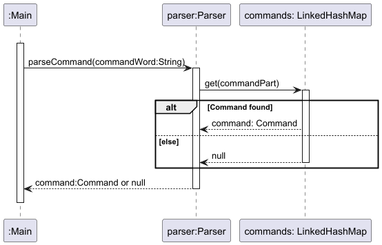

# Developer Guide

## Acknowledgements
- The `Parser` is adapted from [Dan Linh's iP](https://github.com/DanLinhHuynh-Niwashi/ip/tree/master/src/main/java/niwa/parser) code, with changes to get on well with the current project 

## Design & implementation
### Command Parser
The `Parser` class is responsible for interpreting user commands and extracting the associated arguments. It facilitates interaction between the user and the underlying command execution logic.
#### Class responsibilities
1. **Command registration**: Maintain a mapping of command words to their corresponding `Command` objects.
2. **Command parsing**: Convert a command string entered by the user into a `Command` object.
3. **Argument extraction**: Extract and organize the arguments associated with a given command.
#### Class attributes
1. **commands: LinkedHashMap<String, Command>**
  - Description: Associates command words (as keys) with their corresponding Command objects (as values).
#### Class main methods
1. **registerCommands(Command command): void**
  - **Parameters**:
    - `command`: The `Command` object to be registered.
  - **Process**:
    - Retrieves the `COMMAND_WORD` field from the `Command` object
    - Adds the word and the command to the `commands` map.
    
    
    
2. **parseCommand(String commandPart): Command**
  - **Parameters**: 
    - `commandPart`: A string representing the command word entered by the user.
  - **Returns**: The corresponding `Command` object or `null` if the command is not found.
  - **Process**: 
    - Retrieves the associated `Command` object from the `commands` map, using the provided commandPart.

  
  
3. **extractArguments(Command command, String argumentString): Map<String, String>**
  - **Parameters**: 
    - `command`: The `Command` object for which arguments are to be extracted.
    - `argumentString`: The string containing the arguments to be parsed.
  - **Returns**: A map of argument keys and their corresponding values.
  - **Process**: 
    - Initializes an empty map for arguments
    - Retrieves the expected argument keys from the command
    - Invokes `splitCommandRecursively` to populate the arguments map.
  
  
  
4. **splitCommandRecursively(String argumentString, String[] keywords, Map<String, String> arguments, String prevKeyword): void**
  - **Parameters**: 
    - `argumentString`: The string containing the arguments to be split.
    - `keywords`: An array of expected keywords for argument extraction.
    - `arguments`: The map where extracted arguments will be stored.
    - `prevKeyword`: The keyword found in the previous recursive call.
  - **Description**: Extracts values associated with keywords and updates the arguments map accordingly.
  - **Process**:
    - Base case: No argument left to split: `argumentString.isEmpty()`
    - Find the first keyword in the list that appears in the argumentString
    - If found:
      - Attach the part before the keyword with the previously found keyword and put in to `arguments`.
      - Delete the keyword from the `keywords` list (to not be considered in the next call)
      - Pass the remaining `argumentString` after the keyword to the next recursive call
    - If not found (mean that the last keyword reached):
      - Attach the remaining part with the previously found keyword and put in to `arguments`.

### Category
The `Category` class encapsulates the name of a category and provides functionality for equality checks, hash code generation, and string representation. It serves as the foundational representation of a category.

#### Class Responsibilities
1. **Attribute Encapsulation**: Encapsulates the category name to prevent external modification.
2. **Equality Checks**: Implements equality based on the category name, allowing categories with the same name to be considered equal.
3. **String Representation**: Provides a `toString` method for convenient logging and debugging output.

#### Class attributes
1. **name**:String
   - Description:Represents the category name, set as a read-only attribute.

#### Class Main Methods
1. **public Category(String name)**
   - **Parameters**:
     - **`name`**: The category name.
   - **Process**: Initializes the name attribute with the specified value.

2. **public String getName()**
   - **Returns**: The `name` of the Category object.
   - **Process**: Provides access to name attribute.

3. **public boolean equals(Object obj)**
   - **Parameters**:
     - **`obj`**: The object to compare for equality.
   - **Returns**: `true` if `obj` is a Category instance with the same name, `false` otherwise.
   - **Process**: Checks if `obj` is a Category instance and compares its name with the current `Category` object’s name.

4. **public int hashCode()**
   - **Returns**: The hash code based on the name.
   - **Process**: Calculates the hash code for storing `Category` objects in hash-based collections.

5. **public int hashCode()**
   - **Returns**: The formatted description of the category
   - **Process**: Generates a string representation of the `Category` object, useful for logging and debugging.

### TransactionList
The `TransactionList` class is responsible for storing user transactions of different types. It also provides various
operations that enable user to add, delete, search by (date/ category/ keywords).

#### Class Responsibilities

1. **Storage for transactions**: Keeps an ArrayList of `Transaction` objects.
2. **Amend transactions**: Adding or Deleting `Transaction` objects to or from the ArrayList.
3. **Search Transactions**: Search `Transaction` in the `TransactionList` based on multiple keywords, date range or `category` of `Transaction`.

#### Class attributes
1. **transactions: `ArrayList<Transaction>`**
    - Description: A List of `Transaction` objects stored that supports List operations.
2. **InvertedIndex: `Map<String, List<Transaction>>`**
    - Description: An inverted index implemented as a map that associates each unique keyword from transaction descriptions with a list of Transaction objects containing that keyword in their descriptions.

Here’s the description for each method in the format you provided:

#### Class main methods

1. **addTransaction(transaction : Transaction) : void**
    - **Parameters**:
        - `transaction`: The `Transaction` object to be added to the `transactions` list.
    - **Process**:
        - Adds the `transaction` to the `transactions` list.
        - Updates the `invertedIndex` to include the new `transaction` for quick search.
        - Sorts the `transactions` list by date using a custom comparator.

2. **deleteTransaction(index : int) : Transaction**
    - **Parameters**:
        - `index`: The position of the `Transaction` object to be removed.
    - **Process**:
        - Removes the `Transaction` at the specified `index` from `transactions`.
        - Updates the `invertedIndex` to reflect the deletion.
        - Returns the removed `Transaction`.

3. **getTransactions() : ArrayList<Transaction>**
    - **Parameters**: None
    - **Process**:
        - Returns the complete list of `Transaction` objects in `transactions`.

4. **searchTransactionsByKeywords(keywords : List<String>) : List<Transaction>**
    - **Parameters**:
        - `keywords`: A list of keywords to search for within transaction descriptions.
    - **Process**:
        - Looks up each `keyword` in the `invertedIndex` to find matching transactions.
        - Aggregates and counts relevance for each match.
        - Sorts the results by relevance and returns the list of matched transactions.

5. **getExpensesByCategory(category : Category) : List<Transaction>**
    - **Parameters**:
        - `category`: The `Category` to filter expenses by.
    - **Process**:
        - Filters `transactions` to include only `Expense` objects with the specified `category`.
        - Returns the filtered list of expenses.

## Product scope
### Target user profile

{Describe the target user profile}

### Value proposition

{Describe the value proposition: what problem does it solve?}

## User Stories

|Version| As a ... | I want to ... | So that I can ...|
|--------|----------|---------------|------------------|
|v1.0|new user|see usage instructions|refer to them when I forget how to use the application|
|v2.0|user|find a to-do item by name|locate a to-do without having to go through the entire list|

## Non-Functional Requirements

{Give non-functional requirements}

## Glossary

* *glossary item* - Definition

## Instructions for manual testing

{Give instructions on how to do a manual product testing e.g., how to load sample data to be used for testing}
