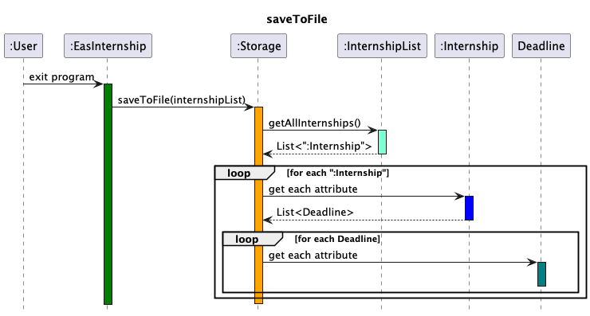
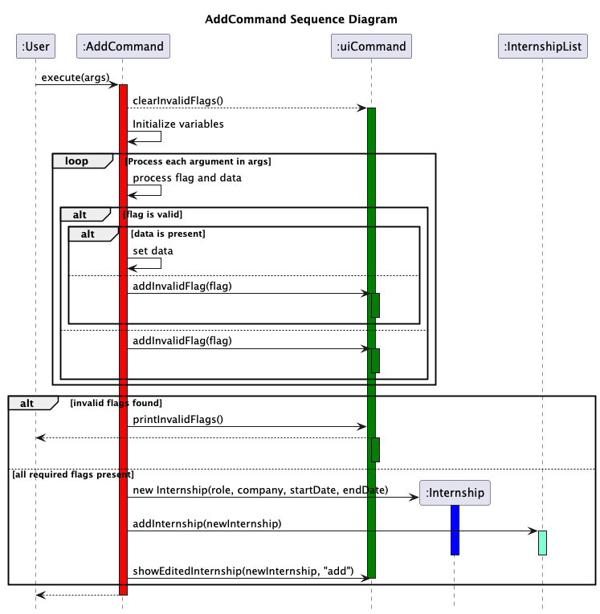
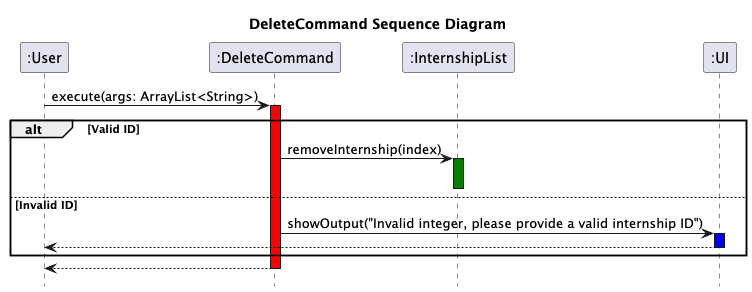

# Developer Guide

## Acknowledgements

{list here sources of all reused/adapted ideas, code, documentation, and third-party libraries -- include links to the original source as well}

## Design & implementation

{Describe the design and implementation of the product. Use UML diagrams and short code snippets where applicable.}

### EasInternship (main class)

1. [Design](#design)
   1. [Architecture](#architecture)
   2. [UI Component](#ui-component)
   3. [Logic Component](#logic-component)
   4. [Model Component](#model-component)
   5. [Storage Component](#storage-component)
2. [Implementation](#implementation)
   1. [Parsing Input](#parsing-input)
   2. [Command Execution](#command-execution)
   3. [Task Management](#task-management) 
   4. [AddCommand Implementation](#addcommand-implementation)
   5. [DeleteCommand Implementation](#deletecommand-implementation)
   6. [SortCommand Implementation](#sortcommand-implementation)
   7. [UpdateCommand Implementation](#updatecommand-implementation)

---

## 1. Design

### 1.1 Architecture
The architecture of EasInternship is designed to follow the MVC (Model-View-Controller) pattern to facilitate separation of concerns, modularity, and maintainability.

- **View (UI)**: Responsible for interacting with the user by displaying output and reading input.
- **Controller (Command and Parser)**: Responsible for parsing user input and invoking the appropriate commands.
- **Model (InternshipList)**: Manages the state of the application, including the list of internships and tasks.
- **Storage**: Responsible for loading and saving data from and to the disk.

---

### 1.2 UI Component

The UI component is responsible for displaying information to the user and reading input. It interacts with the user by printing messages and prompts, and retrieves commands for the rest of the application to process.

### 1.3 Logic Component

The logic component is handled by the `Parser` and `Command` classes. The `Parser` interprets the user's input and returns a command object, which is then executed to perform the desired operation.

### 1.4 Model Component

The model component includes the `Internship`, `InternshipList`, `Deadline` and `DeadlineList` classes.

`Internship`: Represents the individual internship entries.

`InternshipList`: Manages a collection of Internship objects, providing methods for adding, retrieving, updating, sorting and removing internships.

`Deadline`: Represents each individual deadline associated with an internship, holding data specific to that deadline (description, date).

Each `Internship` object contains a `Deadline` list, and has methods to add, retrieve or remove deadlines associated with that internship.

This is represented with the class diagram below:

### 1.5 Storage Component

The storage component is responsible for saving the current state of the `InternshipList` to a file and loading it back when the application is restarted. This ensures that users' progress is preserved between sessions.
The data from the internshipList is saved into a .txt file.

There are two main functions, `loadFromFile` and `saveFromFile`.

The following sequence diagrams depict how the Storage Functions work.

## 2. Implementation

### 2.1 Parsing Input

The `Parser` class is responsible for parsing the input strings provided by the user. It breaks down the input into individual components like the command and its accompanying arguments. After parsing, it returns a `Command` object.

### 2.2 Command Execution

The `Command` class and its subclasses handle the execution of specific commands. Once a command is parsed, it is executed with the required arguments, and the result is displayed to the user.

### 2.3 Task Management

The `InternshipList` class handles adding, removing, and retrieving internships from the list. It interacts with both the UI and the storage components to ensure that updates are reflected in the user interface and persisted to disk.

---

### Overview

The `EasInternship` class serves as the entry point of the application. It manages the application's main loop, where the user is continually prompted for input, and commands are processed in response. The class is responsible for initializing the UI, loading saved data, and handling user input until the user chooses to exit the program.

### Key Responsibilities

- **Initialization**: Initializes the necessary components for the application, such as the `Ui`, `InternshipList`, and `Parser` classes. It also loads any saved data from the storage into the `InternshipList`.
- **Main Loop**: Continuously prompts the user for input. The input is parsed by the `Parser`, and the corresponding `Command` is executed. If the user enters the exit command, the loop terminates.
- **Command Processing**: After parsing the user input, the corresponding `Command` object is executed. The application catches and displays any errors that occur during command execution.
- **Saving State**: Upon exiting, the current state of the `InternshipList` is saved to a file to ensure persistence across sessions.

### Flow of Execution

1. **Welcome Message**: The `Ui` class displays a welcome message to the user.
2. **Load Data**: The `Storage` class loads any saved internships into the `InternshipList`.
3. **Input Loop**: The application enters a loop, prompting the user for input.
4. **Command Parsing**: The `Parser` interprets the input and returns the appropriate `Command`.
5. **Command Execution**: The command is executed, and the `InternshipList` is updated accordingly.
6. **Exit Flow**: If the user enters the exit command, the `InternshipList` is saved, and the application displays a goodbye message.

### Methods

- `public static void main(String[] args)`: The entry point of the application. It handles initialization, the main user input loop, and command execution.

### Error Handling

If the user inputs an unknown command or a command fails during execution, the `Ui` class displays an appropriate error message. This ensures that the application can continue running despite errors in user input.

---

### AddCommand Implementation

#### Overview:
The `AddCommand` class is responsible for adding internship listings to the Internship List. It extends the `Command` class, providing the add functionality as part of the command execution framework.

#### Design:
- The `AddCommand` class processes user input to determine what fields to add to the new internship listing.
- If no arguments or invalid arguments are given, it prompts the user with an error message indicating which fields are erroneous.

#### Key Methods:
- `execute(ArrayList<String> args)`: Handles addition logic based on the inputs provided. If the user provides an appropriate "role" and "company", the internship is added to the listing. Otherwise, the user is prompted with which fields are missing. The user also can input start and end dates of the internship during the addition.
- **`getUsage()`**: Returns a string showing the correct usage of the `add` command and the expected input.

#### Example Usage Scenario:
- The user enters `add -role Software Engineer -company Google`, and the execute method adds the internship to the InternshipList The start and end dates are defaulted to 01/01.

- The user enters `add -role Software Engineer -company Facebook -from 10/24 -to 06/25`, and the execute method adds the internship with the specified dates to the InternshipList.

- The user enters `add -role Software Engineer`. The execute method detects that no company has been specified and adds `company` to the list of invalid flags. uiCommand is then called and prints an error statement of all invalid flags detected.

#### Sequence Diagram:

The following sequence diagram shows how the `AddCommand` is executed:

### DeleteCommand Implementation

#### Overview: 
The `DeleteCommand` class is responsible for deleting internship listings from the Internship List. It extends the `Command` class, providing the delete functionality as part of the command execution framework.

#### Design:
- The `DeleteCommand` class processes user input to determine which `Internship` to remove from the `InternshipList`.
- If no arguments or invalid arguments are given, it prompts the user with an error message indicating which fields are erroneous.

#### Key Methods:
- `execute(ArrayList<String> args)` : Handles deletion logic based on the inputs provided. If the user provides an appropriate `internshipID`, the `Internship` is deleted from the `InternshipList`. Otherwise, if an inappropriate or no `internshipID` is specified, the user is prompted that the `internshipID` is invalid.

- `getUsage()`: Returns a string showing the correct usage of the `delete` command and the expected input.

#### Example Usage Scenario:
- The user enters `delete 1`. The execute method removes the `Internship` from the `InternshipList` if the `internshipID` is valid.
- The user enters `delete -1`. The execute method detects that the `internshipID` is invalid. uiCommand is called and prints an output `Invalid integer, please provide a valid internship ID`.

#### Sequence Diagram
The following sequence diagram shows how the `DeleteCommand` is executed:

### SortCommand Implementation

#### Overview:
The `SortCommand` class is responsible for sorting the internship listings based on different criteria such as the internship role, skills and status (alphabetically) , the application deadline (by start and end dates). It extends the `Command` class, providing the sorting functionality as part of the command execution framework.

#### Design:
- The `SortCommand` class processes user input to determine which sorting method to apply (e.g., role or deadline).
- If no arguments or invalid arguments are given, it defaults to listing internships by ID.

#### Key Methods:
- **`execute(ArrayList<String> args)`**: Handles sorting logic based on the first argument provided. The valid sort options include:
   - `"alphabet"`: Sorts internships by role alphabetically.
   - `"duration"`: Sorts internships by duration (start and end dates).
   - `"deadline"`: Sorts internships by deadline.
   - `"skills"`: Sorts internships by the first skill in the skills list alphabetically.
   - `"status"`: Sorts internships by status alphabetically.
- If the user provides an invalid sort option, the command returns an error and defaults to listing internships by ID.
- **`getUsage()`**: Returns a string showing the correct usage of the `sort` command, including valid options like "alphabet", "deadline", "duration", "skills", and "status".

#### Example Usage Scenario:
1. The user enters `sort alphabet`, and the `execute` method sorts the internships by role.
2. The user enters `sort deadline`, and the internships are sorted by their start and end dates.
3. The user enters `sort skills`, and the internships are sorted by the first skill alphabetically.
4. The user enters `sort status`, and the internships are sorted by their status alphabetically.
5. If the user enters an invalid sort option, the command returns an error and lists the internships by ID.

#### Sequence Diagram:
The following sequence diagram shows how the `SortCommand` is executed:

### UpdateCommand Implementation

#### Overview
The `UpdateCommand` class is responsible for updating the fields of an internship. It extends the `Command` class, providing an updating functionality as part of the command execution framework.

#### Design
- The `UpdateCommand` class processes the user input to determine which internship and which field to update.
- If the internship ID is not valid, it will print a message accordingly.
- If the field is not valid, it will print a message indicating the erroneous field.
- If the value provided with the field is not valid, it will also print a message indicating the erroneous value.

#### Key Methods
- `execute(ArrayList<String> args)`: Handles the logic to find the internship entry and determine which field to update. The valid fields include:
  - `status`: Updates the status of the internship.
  - `skills`: Adds skills to the relevant field of the internship
  - `role`: Updates the role of the internship
  - `company`: Updates the company of the internship
  - `from`: Updates the start date of the internship
  - `to`: Updates the end date of the internship
  - `deadlines`: Updates the deadlines of the internship
- `isValidValue(String[] words)`: Checks if there was a new value provided for the selected field.
- `updateOneField(String[] words, int internshipIndex)`: Called within `execute(args)` to call the appropriate method to update the field.
- `getUsage()`: Returns a string showing the correct usage of the `update` command.

#### Example Usage Scenario:

### Product scope
### Target user profile

{Describe the target user profile}

### Value proposition

{Describe the value proposition: what problem does it solve?}

## User Stories

|Version| As a ... | I want to ... | So that I can ...|
|--------|----------|---------------|------------------|
|v1.0|new user|see usage instructions|refer to them when I forget how to use the application|
|v2.0|user|find a to-do item by name|locate a to-do without having to go through the entire list|

## Non-Functional Requirements

{Give non-functional requirements}

## Glossary

* *glossary item* - Definition

## Instructions for manual testing

{Give instructions on how to do a manual product testing e.g., how to load sample data to be used for testing}
