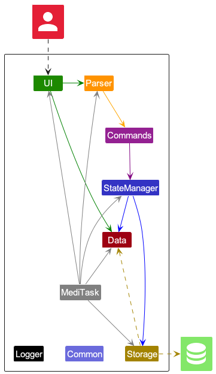
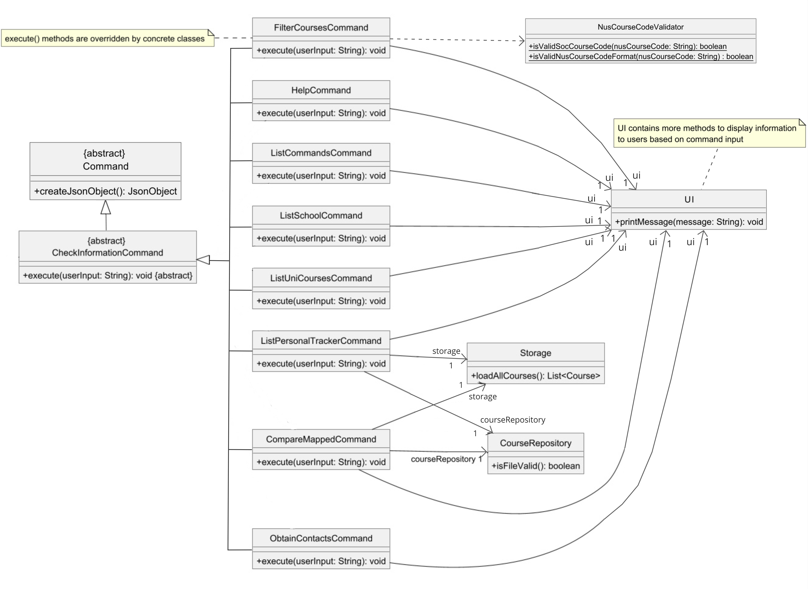
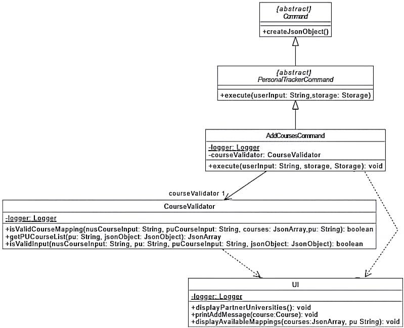
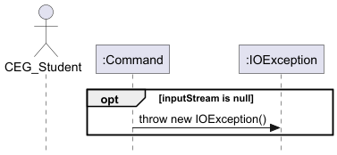
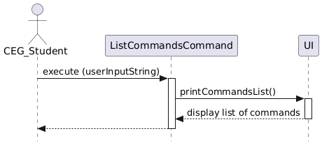
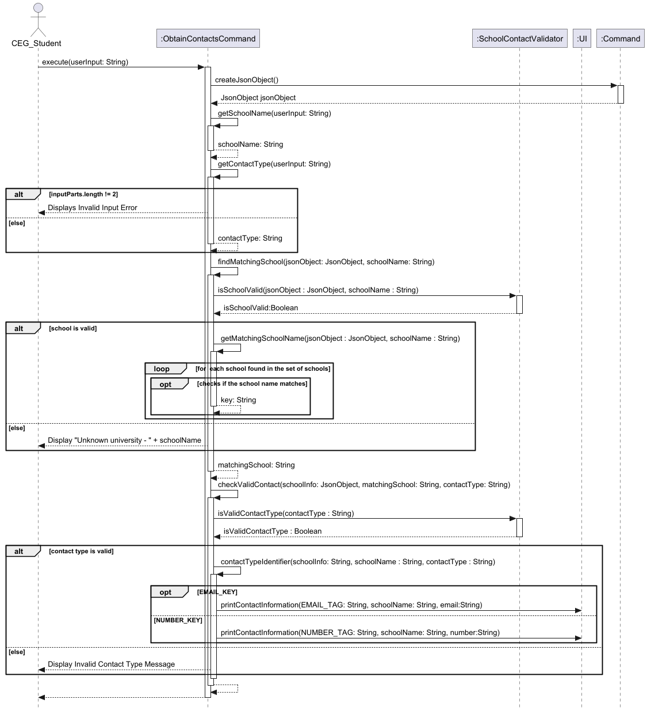
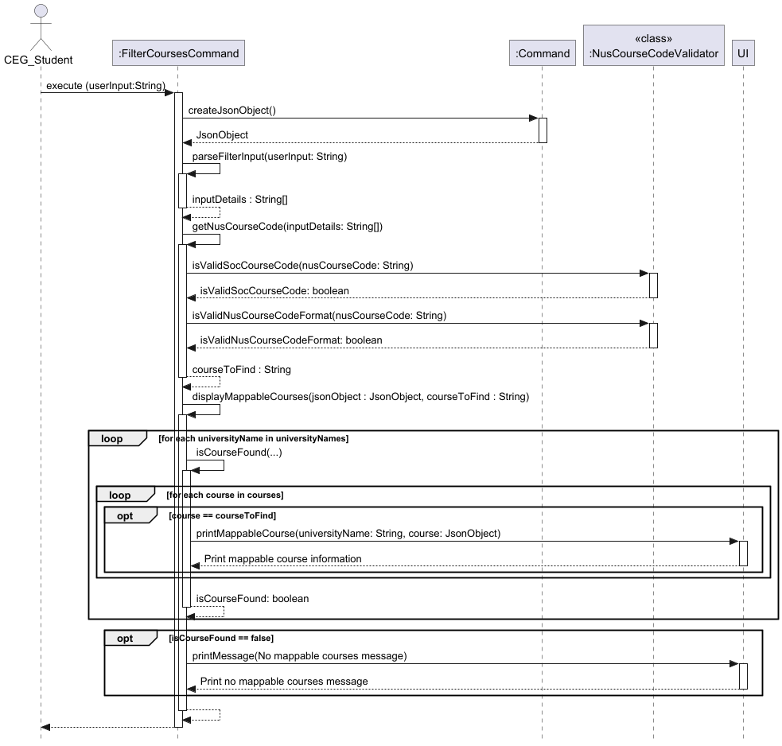
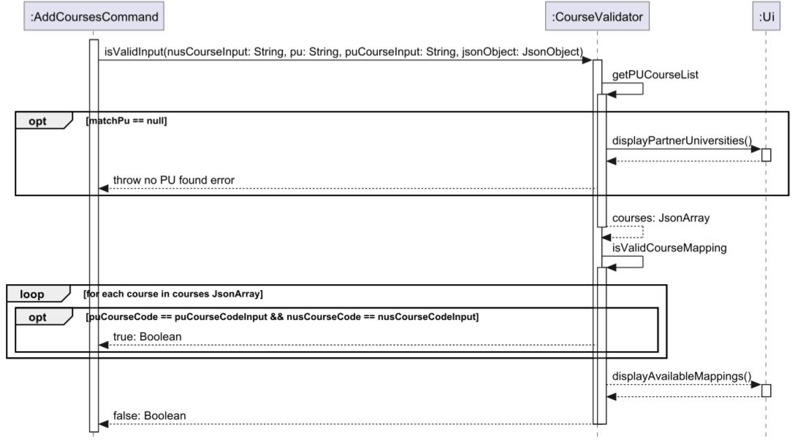
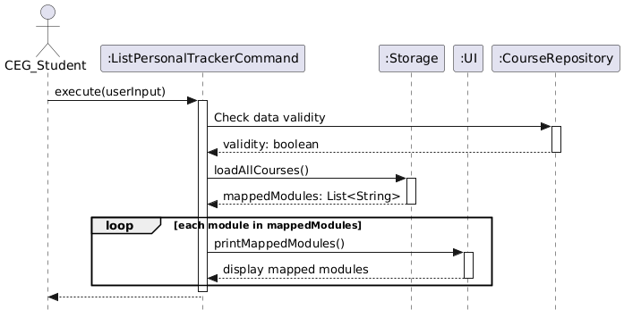
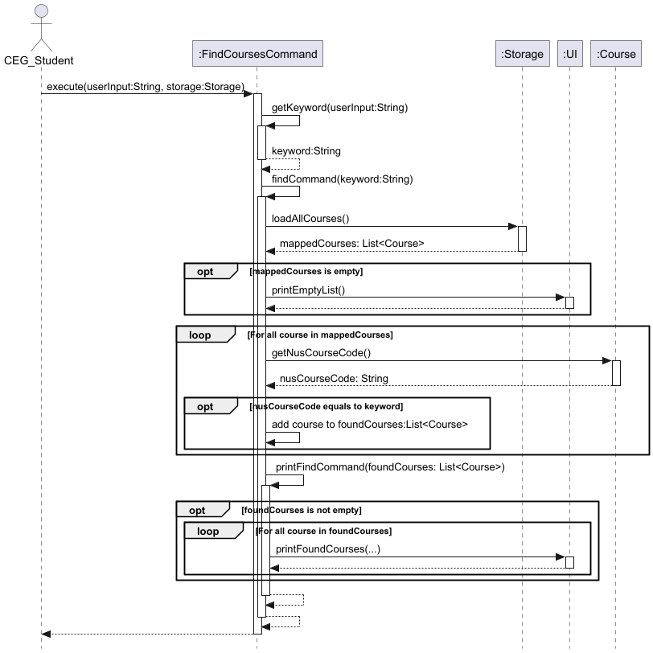

# Developer Guide

- [Acknowledgements](#acknowledgements)
  - [Data source](#data-source)
  - [Third Party Library Used](#third-party-library-used)
- [Design](#design)
  - [Architecture](#architecture)
  - [Class Diagrams](#class-diagrams)
    - [Command Structure](#command-structure)
    - [Parser Class](#parser-class-diagram)
    - [Course Validator Class](#coursevalidator-class-diagram)
    - [Storage Class](#storage-class-diagram)
- [Implementation](#implementation)
  - [General JSON file reading process](#general-json-file-reading-process)
  - [List Commands](#1-list-commands-command)
  - [Help Command](#2-help-command)
  - [List Schools Command](#3-list-schools-command)
  - [List Courses Command](#4-list-university-courses-command)
  - [Obtain Command](#5-obtain-partner-university-email-and-contact-number-command)
  - [Filter Command](#6-filter-courses-command)
  - [Add Command](#7-add-courses-command)
  - [Delete Command](#8-delete-courses-command)
  - [List Mapped Command](#9-listpersonaltrackercommand)
  - [Compare Command](#10-compare-mapped-command)
  - [Find Command](#11-find-course-mapping-command)
- [Product scope](#product-scope)
  - [Target user profile](#target-user-profile)
  - [Value proposition](#value-proposition)
- [User stories](#user-stories)
- [Non-functional requirements](#non-functional-requirements)
- [Glossary](#glossary)
- [Manual testing](#instructions-for-manual-testing)

## Acknowledgements

### Data source
* Adapted from NUS EduRec, data was collected manually as a collective effort from the team.

### Third Party Library Used

#### 'org.glassfish:javax.json:1.1.4'
* [Link to official website](https://mvnrepository.com/artifact/org.glassfish/javax.json/1.1.4)

#### 'javax.json:javax.json-api:1.1.4'
* [Link to official website](https://mvnrepository.com/artifact/javax.json/javax.json-api/1.1.4)

## Design

### Architecture

The **Architecture Diagram** given above explains the high-level design of the App.

Given below is a quick overview of main components and how they interact with each other.

**Main components of the architecture**

`ExchangeCourseMapper` class (referred to as `Main` in diagram) is responsible for the app launch and shut down.
* At app launch, it initializes the other components in the correct sequence, and connects them up with each other.
* At shut down, it shuts down the other components and invokes cleanup methods where necessary.

The bulk of the app’s work is done by the following four components:

`UI`: The UI of the App.

`Parser`: The command executor and logic checker.

`Command`: Details and implementation of various commands/features of the app.

`Storage`: Reads data from, and writes data to, `mylist.json`.

**How the architecture components interact with each other**

Only some of the commands will need all 4 main components for example the Delete course command:

The Sequence Diagram below shows how the components interact with each other for the scenario 
where the user issues the command `delete 1`.

The `UI`, `Parser` and `Storage` components (also shown in the diagram above),
* defines its API in a class with the same name as the Package

The `Command` component,
* defines its API in an `abstract` class with the same name as the Component.
* further splits them into `CheckInformationCommand` and `PersonalTrackerCommand` as child classes
* further split them into the various commands

For example, the `Command` component defines its API in the `Command.java` abstract class and extends its functionality using the 
`PersonalTrackerCommand.java` and `CheckInformationCommand` class. Other components such as `ListSchoolsCommand` and `DeleteCoursesCommand`  
interact with a given component through its interface rather than the concrete class 
(reason: to prevent outside component’s being coupled to the implementation of a component), as illustrated in the (partial) class diagram below.

**The sections below give more details of the components and any additional components.**

### Class Diagrams

#### Command Structure:

The abstract command classes for our two main features, `CheckInformationCommand` and `PersonalTrackerCommand`.
must inherit from the abstract `Command` class, which has the method to read the Json file containing course 
information. Each child class has the abstract `execute` method, to be implemented by their concrete child classes,
specific to the command functionality.

**Addition of new command features**

When adding new command classes, developers should make sure that the concrete class inherits from either the
`CheckInformationCommand` or `PersonalTrackerCommand` classes, depending on the new command's functionality.
The new command class should also have an implementation of the `execute` method, and uses the `UI` class to
print messages on the CLI interface.

`CheckInformationCommands` list out information from the JSON file containing course mapping information, or from the
user's Personal Tracker.

Possible `CheckInformationCommands` are:
1. `ListCommandsCommand`
2. `HelpCommand`
3. `ListSchoolsCommand`
4. `ListUniCoursesCommand`
5. `ObtainContactsCommand`
6. `FilterCoursesCommand`
7. `ListPersonalTrackerCommand`
8. `CompareMappedCommand`

The above list of Command classes are concrete classes, and must implement the abstract 
`execute(userInput)` method.

`PersonalTrackerCommands` are commands that can modify the user's saved mapping plans from the Personal Tracker,
as well as access the list of saved mappings.

Possible `CheckInformationCommands` are:
1. `AddCoursesCommand`
2. `DeleteCoursesCommand`
3. `FindCoursesCommand`

The above list of Command classes are concrete classes, and must implement the abstract
`execute(userInput, storage)` method.

#### Parser class diagram:
The Parser class is responsible for handling and interpreting user input in the application. It reads user commands,
processes them by splitting the input into command keywords and parameters, and then directs the flow of control to the
appropriate command classes to execute the specified actions.

As `ExchangeCourseMapper` is mainly split into two main parts; Check Information and Personal Tracker. We decided to
split the `Parser` class diagram into the two parts respectively to increase readability and neatness.

This class diagram represents the parsing of commands in Check Information. The multiplicities dependencies of the 
command are 0 or 1 because the dependency is only formed when the command is called, else, it will be zero.

This class diagram represents the parsing of commands in Personal Tracker. The `Parser` class has associations with the
`UI` class and `Storage` class and dependencies with the commands in Personal Tracker.

#### CourseValidator Class Diagram: 

#### Storage Class Diagram:

**Storage System Overview**

The storage system is structured to manage the persistence and integrity of course data for the application. 
It consists of the following key components:

1. **Storage Class**: The main interface for adding, deleting, retrieving, and loading courses. It interacts with 
   `CourseRepository` for data persistence, ensuring all course-related actions are directed to the appropriate storage 
   location.

2. **CourseRepository**: Acts as an intermediary layer, managing data access and defining the file path 
   (`MYLIST_FILE_PATH`) for `myList.json`. It provides similar methods as `Storage` to add, delete, and retrieve course 
   data, facilitating structured data storage.

3. **FileHandler**: Responsible for file operations such as initializing, reading, writing, and appending to files. 
   This class abstracts file manipulation, ensuring the storage system can perform reliable file operations without 
   directly managing file-specific details.

4. **DataIntegrityChecker**: Ensures the integrity of the stored data by validating file structure and content. It 
   provides methods for validating the entire file or individual lines, helping maintain consistent data formatting 
   and correctness.

5. **CourseValidator**: Validates course inputs to check if they meet predefined criteria before being stored. This 
   ensures that only valid data is added to the repository, reducing the likelihood of errors in the data storage.

6. **UI**: Responsible for providing feedback to the user regarding any invalid entries or formats, enhancing user 
   experience by notifying them of issues in a clear and informative way.

Each component is designed to separate concerns, with `Storage` focusing on high-level operations, `CourseRepository` 
on data organization, `FileHandler` on file I/O, and `DataIntegrityChecker` on data validation. This modular design 
allows for maintainability, testability, and scalability in managing persistent course data.

## Implementation

### General JSON file reading process

For commands that read through our data source file which contains university data, the process will be done in the 
`Command` class via a `createJsonObject()` method, 
where an `IOException` message will be displayed if reading fails. 

### 1. List Commands Command

#### Overview:
The `ListCommandsCommand` provides users with a comprehensive list of all available commands in the CLI. This is particularly useful for new users or those unfamiliar with specific command formats.

#### How the feature is implemented:
* The `ListCommandsCommand` class extends the `CheckInformationCommand` superclass and overrides the `execute` method.
* In the `execute` method, `printCommandList` from the UI class is called.
* A detailed list of commands with brief descriptions is printed to the CLI , providing users with command syntax and expected usage.
* The command list is formatted for readability with each command on a new line, and `LINE_SEPARATOR` is used before and after the list to create a visually distinct section in the CLI.
* Logging is implemented to track the start and completion of the command, facilitating debugging and traceability.

#### Why it is implemented that way:
* **Ease of Use**: Displaying all available commands in one place helps users quickly identify what actions are possible within the application.
* **Logging**: Logging the start and end of execution helps developers track usage patterns and troubleshoot issues if the command is not functioning as expected.

#### Alternatives considered:
* **Dynamic Command List**: Considered dynamically generating the command list from all command classes in the codebase to avoid manually updating this list, but opted for simplicity to prevent added complexity.
* **Help Command Integration**: Considered integrating `ListCommandsCommand` with the `HelpCommand` to provide a one-stop command for help-related requests, but separating them ensures clarity and keeps each command focused.

#### Sequence Diagram:

### 2. Help Command

#### Overview
This command provides users with detailed explanations of each feature and the ways to use them.
This allows users to navigate this program easily and effectively.

#### How the feature is implemented:
* The `HelpCommand` class extends the `CheckInformationCommand` class where it overrides
  the execute method for custom behaviour.
* First, the user input is passed into the `getCommand()` method which extracts and processes the
  command. It does so by using `switch` statements to determine if the input matches one of the valid commands.
* If it does, it returns the command, if it does not, an `IllegalArgumentException` exception will be thrown to handle
  invalid commands
* Then, the `printHelp()` method will be called to display the detailed help messages for the specific command.
  Another `switch` statement is used here to map each command to its corresponding help message.
* Assertions and logging are implemented for error handling.

#### Why it is implemented that way:
- **Separation of Concerns:** Each method has a single responsibility. For example, `getCommand()` parses and
  validates the input to extract a specific command and `printHelp()` prints the relevant help message for the
  parsed command.
- **Switch Statement:** The use of `switch` statement is an efficient way to match valid commands.
  `switch` statements are also clearer and easier to read.

#### Alternative Implementation considered:
- The use of `if-else` statement
  - However, since the condition is a single variable and not complex conditions, it will be cleaner and clearer to use
    `switch` statements

#### Sequence Diagram:
- Represents when `execute()` method is called
  

### 3. List Schools Command

#### Overview:
This command is responsible for displaying and retrieving the full list of universities
from our data source file which contains university data. It helps the users to identify the possible choices in Oceania.

#### How the feature is implemented:
* The `ListSchoolCommand` class extends the `CheckInformationCommand` class where it overrides the `execute` method for
  custom behaviour.
* The command first reads a JSON file to obtain the names via `createJsonObject()` method from the
  superclass.
* The `displaySchoolList()` method will iterate over the keys of the database which contains the University
  names, upon acquiring the keys, they will be printed over the CLI.
* There are also exceptions, assertions and logging in place for error handling.
* Line Separator is used to ensure readability and ease of use for users.

#### Sequence Diagram:

### 4. List University Courses Command

#### Overview

This command is responsible for listing out all the mappable partner university’s (PU) courses and NUS courses.
This allows users to plan their course mapping as it lists out all the possible courses they can map in a specified
partner university.

#### How the feature is implemented:
* The `ListUniCoursesCommand` class extends the `CheckInformationCommand` class where it overrides the execute method
  for custom behaviour.
* The command first reads a JSON file to obtain the JsonObject containing the names of all the partner universities.
* The getPuName method then parses and extracts the PU name from the input (with the format of `list courses [PU_NAME]`).
* Next, the extracted PU name is passed into the `getUniCourses()` method which will search for the specified PU in the
  JsonObject with `findUniversityName()`.
* If the university is not found, an exception `UnknownUniversityException` will be thrown.
* If the PU is found, the `listCourses()` will be called. Then `getUniversityObject()` and `getCourseArray()` methods
  will be called to get the JsonObject containing the PU and the JsonArray containing the list of courses it offers.
* The two object will be passed into `iterateCourses()` method to iterate through the JsonArray `courseArray` which
  contains the list of courses.
* It then prints out the course details such as PU course code and NUS course code by calling the
  `printListUniCoursesCommand` method in the UI class.
* Assertions and logging are used for error handling.

#### Why it is implemented this why:
- **Separation of Concerns:** Each responsibility is separated into smaller, well-defined methods
  For example, `getPuName()` focuses on extracting the university name from user input and `findUniversityName()`
  focuses on searching the university in the data set.

#### Sequence Diagram:

### 5. Obtain Partner University Email and Contact Number Command

#### Overview:
The command is responsible to retrieve the email contact and contact number data for a specified partner
university. It helps users to reach out to the partner universities for any enquiries about programs or
exchange opportunities.

#### How the feature is implemented:
* The `ObtainContactsCommand` class extends the `CheckInformationCommand` class where it overrides the `execute()` method for
  custom behaviour.
* The command first reads a JSON file to obtain the names via `createJsonObject()` method from the
  superclass.
* The `getSchoolName()` and `getContactType()` methods are used to parse the user input, extracting the requested
  university name and contact type (email or phone number).
* After parsing, the `findMatchingSchool()` method identifies the correct university entry within the JSON data.
* During this time, the `isSchoolValid()` method inside the `SchoolContactValidator` class is used to check if the school 
  name exists.
* If school exists, the `checkValidContact()` method checks the validity of the contact type through a 
  handler `isValidContactType()` in `SchoolContactValidator` class.
* The `contactTypeIdentifier()` method then checks retrieves the contact type and displays the contact information via the 
  `printContactInformation()` in the `UI` class.
* There are also exceptions, assertions and logging in place for error handling.

#### Why it is implemented that way:
* The `execute` method is essential and unique to every command class so inheritance was used.
* Validating the contact and school name is crucial and a separate class (`SchoolContactValidator`) is used to handle
  the validity of each input category.
* Every method in the class remains maintainable and has one responsibility this allows easy debugging and
  refactoring.
* By using inheritance, new command classes can easily extend the functionality of existing ones
  which reducing redundancy in the code
* Logging and assertions helps the team of developers to follow through the command execution.

#### Alternatives considered:
* Split the contacts into 2 different class for obtaining email and number for better separation of concerns
* Reading of the data source file which contains university data was tricky and other libraries were considered.
* Considered placing all the class methods inside the `execute` method but kept SLAP in mind to ensure
  readability.

#### Sequence Diagram:

### 6. Filter Courses Command

#### Overview:
This command is responsible for displaying and retrieving the full list of mappable courses from the partner
universities to a user specified NUS course from our data source file which contains university data. It helps the users to identify whether
that NUS course is suitable to be mapped overseas in Oceania.

#### How the feature is implemented:
* The `FilterCoursesCommand` class extends `Command` class where it overrides the `execute` method for
  custom behaviour.
* The command first reads a JSON file to obtain the names via `createJsonObject()` method from the
  superclass.
* The `parseFilterCommand` method then separates input, which parses the user input to extract the details in the input,
  still of `String` type.
* The `getNusCourseCode` method then extract out the user specified NUS course code from the parsed input, checking
  if the course code is a School of Computing course or follows the format of a NUS course code, using the methods
  `isValidSocCourseCode` and `isValidNusCourseCodeFormat` methods in the `NusCourseValidator` class.
* The NUS course code is then passed into the `displayMappableCourses()` method along with teh Json object. The method
  will iterate over the keys of the database which contains the University names, then obtain the array `courses`
  stored in the "courses" field. The `courses` array is then iterated over, for each course,
  if the value in the "nus_course_code" is equals to the NUS course code passed into the method, the university name and
  "pu_course_code" value of the course will be printed to the CLI.
* There are also assertions and logging in place for error handling.
* Line Separator is used to ensure readability and ease of use for users.

#### Why it is implemented that way:
- **Single Responsibility Principle:** The methods to check in the user's input for the NUS course code is extracted
  into the `NusCourseCodeValidator` class, separate from the methods used in the `FilterCoursesCommand` clas, which
  are mainly for the logic behind the filtering of courses.

#### Sequence Diagram:

### 7. Add Courses Command

#### Overview:
This command is responsible for adding users' desired course mapping into the `myList.json` file.
Additionally, each course mapping is checked against the current course mapping found in
our data source file which contains university data, ensuring that the course mapping is accurate and is limited to Oceania
universities. This command hence helps the users to keep track of their course mapping process.

#### How the feature is implemented:
* The `AddCoursesCommand` class extends `Command` class where it overrides the `execute` method for
  custom behaviour.
* The command first reads a JSON file to obtain the names via `createJsonObject()` method from the
  superclass.
* The `trimString` method then removes the `add` command and checks whether the user gave any input after the command.
  The method would return the user's input without the command.
* This input is then passed into the `parseAddCommand()` method to obtain the relevant information: NUS course code,
  name of partner university and partner university course code.
* Along with the JSON Object created from the `createJSONObject()` method, the information extracted from the
  `parseAddCommand()` method would be passed to the `isValidInput()` method to verify the user's course mapping.
* In the `isValidInput()` method, the `getPUCourseList()` method is called to verify the user's partner university is
  included in the dataset. An exception is thrown if the university is not found in the dataset.
* Afterward, the `isValidCourseMapping` checks whether the NUS course code and PU course code are compatible for
  course mapping.
* If both checks above are passed, the course mapping would be added to the `myList.json` file.
* Throughout the code, exceptions, assertions and logging are in place for better error handling.
* Line Separator is used to ensure readability and ease of use for users.

#### Why is it implemented this way
- The code is separated into distinct methods that addresses a separate concern, achieving Separation of concerns principle (SoC). This help achieve better modularity and readability. 
- Each method includes numerous exception handlers to cover as many potential errors and edge cases as possible. 

#### Alternatives Considered
- Initially, one way to validate a course mapping is by adding all course mappings to a hashmap. This allows indexing to locate the relevant course mapping. However, this approach may lead to unnecessary repetition since each course mapping is already stored in the JSON file.
- At first, each course mapping is stored as a formatted string. However, this format makes it challenging to check course mappings and implement methods that require accessing course mappings from storage.

#### Sequence Diagram:

Sequence Diagram for AddCourseCommand

Sequence Diagram of Course Validator (extracted out of AddCourseCommand sequence diagram)

### 8. Delete Courses Command

#### Overview:
This command is responsible for deleting users' existing course mapping plan from the `myList.json` file.
This helps the users to keep track of their most recent course mapping plans, and to keep the `myList.json` file organised.

#### How the feature is implemented:
* The `DeleteCoursesCommand` class extends `Command` class where it overrides the `execute` method for
  custom behaviour.
* When `execute` is called, the command first passes the user's input into the `parseDeleteCommand` method, which parses
  the user input to extract the list index, still of `String` type, of the course mapping plan
  they would like to delete.
* The parsed input is then passed into the `getListIndex` method. The list index is then converted to an `int` using the 
  `Integer` class. If a valid list index format has been given by the user, the list index is returned.
* The list index, along with the Storage object, is passed into the `deleteCourse` method, which calls the `getCourse` 
  method from the Storage object, and accesses the line in the `myList.json` file as specified by the list index to 
  obtain information of the course to delete, then deletes the course using the `deleteCourse` method from the 
  Storage object.
* Lastly, the UI object's `printDeleteMessage` is called to inform the user of the course plan which is deleted.
* Throughout the code, exceptions, assertions and logging are in place for better error handling.
* Line Separator is used to ensure readability and ease of use for users.

#### Why It Is Implemented This Way:
- **Ease of deletion:** This command ensures that maintaining the Personal Tracker is quick and fast, and is 
  complemented by the `list mapped` command, which shows the index of the saved course mapping plans.
- **User-Friendly Output:** The user is notified of the course mapping plan that was deleted, making sure that they have
  deleted the correct plan.

#### Sequence Diagram:

### 9. ListPersonalTrackerCommand

#### Overview:
The `ListPersonalTrackerCommand` is responsible for listing all the mapped modules stored in the user’s personal tracker. 
This command retrieves all stored courses from `myList.json` via the Storage class and displays them in an indexed list format on the CLI.

#### How the Feature is Implemented:
- The `ListPersonalTrackerCommand` class extends `CheckInformationCommand` and overrides the `execute` method to define custom behavior.
- The constructor accepts a `Storage` object to access stored course mappings.
- **Execution Flow in `execute` Method:**
  - Checks the data integrity of `myList.json` using `courseRepository.isFileValid` and `courseRepository.hasDuplicateEntries`. If the data integrity fails, the command exits without further execution.
  - Calls `loadAllCourses` from the Storage class to retrieve the list of mapped modules.
  - If the list is empty, a message is displayed to inform the user that no modules have been mapped.
  - If there are mapped modules, it logs that modules will be displayed and then:
    - Prints a header and a line separator.
    - Iterates through `mappedModules`, printing each course with an index for readability by calling `printMappedModules` from the IU class.
    - Prints a closing line separator.

#### Why It Is Implemented This Way:
- **Single Responsibility:** This command is focused on a single responsibility—displaying the list of mapped 
modules—making it easy to maintain and test.
- **User-Friendly Output:** By indexing the output and adding line separators, the command ensures a clean and 
readable output format for users.

#### Alternative Implementations Considered:
- **Direct Output from Storage:** An alternative could have been to let the Storage class directly output the list. 
However, separating the command logic maintains a cleaner architecture and allows more flexibility in 
how the data is displayed.
- **Skipping Indexing:** Displaying the list without indexing was considered, but indexing improves readability, 
especially if the list of modules is long.

#### Sequence Diagram:

### 10. Compare Mapped Command

#### Overview
The `CompareMappedCommand` is responsible for comparing course mappings between two specified partner universities.
This command aids users in identifying common course mappings across the selected universities, as well as highlighting
unique course mappings specific to each university.

#### How the Feature is Implemented
The `CompareMappedCommand` class extends `CheckInformationCommand` and overrides the `execute` method to define its custom behavior. 
Below is an outline of the execution flow:

- Checks the data integrity of `myList.json` using `courseRepository.isFileValid` and `courseRepository.hasDuplicateEntries`. If the data integrity fails, the command exits without further execution.
- The command splits the user input based on the delimiter `pu/` to retrieve the names of the two universities specified by the user.
  - If fewer than two universities are specified, the `printInvalidInputFormat` method in the `UI` class is called to inform the user of incorrect input format.
- The command calls `isValidUniversity` to check if the input is a valid university. Otherwise, it will print an error message with the wrong university name and a suggestion.
- The command loads all course mappings from the `myList.json` file through the `Storage` class.
- It verifies that the loaded list is not `null` through assertions.
- The `filterModulesByUniversity` method takes the list of all modules and filters out only those associated with the specified university.
- Logging is used to track this filtering process.
- The `extractCourseCodes` method extracts the unique course codes for each university, enabling the subsequent comparison.
- The `getCommonCourseCodes` method calculates the intersection of course codes between the two universities, identifying courses available in both.
- The `getUniqueCourseCodes` method identifies unique courses by excluding the common course codes for each university.
- The `displayComparisonResults` method provides output for the comparison:
  - Common mappings are displayed first, showing courses available in both universities.
  - Unique mappings are shown next, detailing courses specific to each university.
- The output format is controlled through methods in the `UI` class for better readability and user experience.

#### Why it is Implemented this Way
- **Separation of Concerns**: Methods are organized by function, with each handling a specific part of the comparison logic. This promotes code readability and maintainability.

#### Alternatives Considered
- **Combined Filtering and Extraction**: Initially, filtering and course code extraction were considered for a single method, but separating them simplified the debugging process and enhanced the code structure.
- **Display Inline in `execute`**: Displaying results directly in the `execute` method was an option. However, using dedicated methods (e.g., `displayComparisonResults`) improved readability and made testing individual components easier.

#### Sequence Diagram:

### 11. Find course mapping command

#### Overview
This command is responsible for the searching of a particular NUS course in the personalised tracker. This allows users
to check and plan course mappings for that specified course.

#### How the feature is implemented:
* The `FindCoursesCommand` class extends the `CheckInformationCommand` class where it overrides the execute method for
  custom behaviour specific to this class.
* The input from the user is first parsed through the `getKeyword()` method to extract out the keyword(NUS course code)
  to search within the personalised tracker. If there is no keyword, an `IllegalArgumentException` will be thrown.
* Then the keyword will be passed to the `findCommand()` method.
* In the `findCommand` method, the mappings in the tracker are retrieved through
  `List<Course> mappedCourses = storage.loadAllCourses()`. If the tracker is empty, a message indicating empty tracker
  will be printed.
* Next, `matchKeyword()` will be called, and it iterates the mappedCourses in the tracker to search for mappings that
  match the keyword and adds them into a `List<Course> foundCourses`.
* Lastly, `printFindCommand` will iterate and print the course mappings inside mappedCourses through
  `printFoundCourses()` in `UI` class. If mappedCourses is empty, an IllegalArgumentException is thrown.

#### Why it is implemented this way:
* **Separation of concerns:** Helper methods were used to isolate specific tasks within the command, making each
  method focused and easier to manage. The `UI` class handles displaying messages to the user, which keeps
  `FindCoursesCommand` focused solely on search logic, without managing user interactions directly.

## Product scope
### Target user profile

* CEG students keen to go for SEP and need a clear and organised UI to see course mappings
* CEG students who want to plan their schools and courses to take 
* Can type fast 
* Prefers typing to mouse interactions 
* Is reasonably comfortable using CLI apps

### Value proposition

* CEG students can manage SEP planning faster than a typical mouse/GUI driven app (EduRec)
* CEG students can use ExchangeCourseMapper to expedite their for course mapping process by listing universities 
  and specific courses with their subject codes
* CEG students can easily filter by either NUS-coded modules or partner universities (PU) to quickly identify relevant course options.
* CEG students can easily load and save the saved courses in a data file for safekeeping
* The CLI interface provides an efficient experience for users focused on planning their SEP with precision.

## User Stories

| Version | As a ...    | I want to ...                                           | So that I can ...                                              |
|---------|-------------|---------------------------------------------------------|----------------------------------------------------------------|
| v1.0    | CEG student | see the possible Oceania Universities for CEG students  | see all my possible choices in those regions                   |
| v1.0    | CEG student | search for NUS courses to map                           | search for related courses in PUs                              |
| v1.0    | CEG student | key in the school I want to go for exchange             | view the available course offered by the school                |
| v1.0    | CEG student | want to see a list of commands                          | know what to do to go to access the features                   |
| v2.0    | CEG student | obtain the email address of the partner universities    | send an email should I have any queries                        |
| v2.0    | CEG student | obtain the contact number of the partner universities   | call the number should I have any urgent queries               |
| v2.0    | CEG student | add a course mapping plan for a PU                      | keep track of my courses for a specific PU                     |
| v2.0    | CEG student | list out the mapped courses by calling the list command | I can track all the courses I have mapped to the different PUs |
| v2.0    | CEG student | delete a course mapping plan for a PU                   | keep my list of saved plans organised                          |
| v2.0    | CEG student | ask for help when I am in doubt                         | know what are the possible actions                             |
| v2.0    | CEG student | compare different mapping plans for each PU             | find the university best fit for my academic schedule          |
| v2.0    | CEG student | search for course mappings in my personalised tracker   | check if I have mappings for that course                       |

## Non-Functional Requirements

1. Access to a computer with Java 17 installed and an IDE that supports Java programming.
2. A CEG student with above average typing speed for regular English text (i.e. not code, not system admin commands) 
   should be able to accomplish most of the tasks faster using commands than using the mouse.
3. A CEG student should be able to maintain long term usage without a noticeable sluggishness in performance for typical usage.
4. CEG student who is interested in planning SEP course mapping to universities in Oceania.

## Glossary
* Mainstream OS: Windows, Linux, Unix, macOS
* CEG: Computer Engineering
* PU: Partner University
* CLI: Command Line Interface
* SEP: Student Exchange Programme

## Instructions for manual testing
> [NOTE!]
>These instructions only provide a starting point for testers to work on;
testers are expected to do more *exploratory* testing.

### 1. Start ExchangeCourseMapper
1. Follow the instructions in our [User Guide Quick Start](UserGuide.md#quick-start)
2. Expected: Welcome message on the terminal, prompting for the user's input

### 2. Test Cases
#### 2.1 Start State
* 2.1.1. Introduction to ExchangeCourseMapper
   * Test Case: `commands`  
   * Expected: Prints out the summarised list of possible commands in ExchangeCourseMapper.
* 2.1.2. More details for each command listed by the `commands` command
  * Test Case: `help add`  
  * Expected: Prints out the function of the add function and the valid command format.

#### 2.2 Obtain names of Partner Universities in Oceania
* 2.2.1 List all Partner Universities (PUs) in Oceania
  * Prerequisites: None
  * Test Case: `list schools`  
  * Expected: List of names of PUs in Oceania.

#### 2.3 Find mappable courses in a specific PU in Oceania
> [NOTE!]
> SCHOOL_NAME is not case-sensitive, but must be the same as the name listed by the `list schools` command,
> word for word!

* 2.3.1 See all mappable courses from a valid PU
  * Prerequisites: None
  * Test Case: `list courses The University of Western Australia`  
  * Expected: List of mappable courses, with information of the PU course code and name to the matching
    NUS course code and name.

* 2.3.2 See all mappable courses from an invalid PU
  * Prerequisites: None
  * Test Case: `list courses tokyo university`  
  * Expected: Error message stating that input is an unknown university to ExchangeCourseMapper.

#### 2.4 Obtain admin information of PUs in Oceania

* 2.4.1 Obtain valid PU's email
  * Prerequisites: None
  * Test Case: `obtain The University of Melbourne /email`
  * Expected: Prints out email of The University of Melbourne.

* 2.4.3 Obtain valid PU's email
  * Prerequisites: None
  * Test Case: `obtain The University of Melbourne /number`
  * Expected: Prints out email The University of Melbourne.

* 2.4.2 Obtain invalid PU's email or number
  * Prerequisites: None
  * Test Case: `obtain tokyo university /email` or `obtain tokyo university /number`
  * Expected: Error message stating that input is an unknown university in the program.

#### 2.5 Filter and obtain mappable courses for a specific NUS SoC course code
* 2.5.1 Filter using a valid SoC course code with possible mappings
  * Prerequisites: None
  * Test Case: `filter cs3241` 
  * Expected: Prints out all the courses offered by the PUs that can be mapped to cs3241.

* 2.5.3 Filter using a non-SoC course code
  * Prerequisites: None
  * Test Case: `filter gess1010` 
  * Expected: Prints out error message stating that filter only works for CS/CG/BT/IS/EE courses.

* 2.5.3 Filter using a wrongly formatted NUS course code
  * Prerequisites: None
  * Test Case: `filter eeeeeeeeeee` 
  * Expected: Prints out error message to guide users on the format of the NUS course code to input with the command.

#### 2.6 Add course mapping plans into Personal Tracker
* 2.6.1 Add course mappings with the correct format and valid mapping
  * Prerequisites: None
  * Test case: `add CS2040 /pu The university of western australia /coursepu CITS2200`
  * Expected: Prints out a confirmation message indicating success

* 2.6.2 Add course mapping with incorrect format
  * Prerequisites: None
  * Test case 1: `add invalid format`
  * Test case 2: `add cs2040 /pu invalid uni`
  * Test case 3: `add cs2040 /pu the university of western australia`
  * Expected: Prints out error message indicating to provide all valid parts

* 2.6.3 Add course mappings with invalid NUS course code/ PU course code
  * Prerequisites: None
  * Test case 1: `add CS1231 /pu the university of western australia /coursepu CITS2200`
  * Test case 2: `add CS2040 /pu the university of western australia /coursepu CITS1111`
  * Expected: Prints out error message and a list of mappable courses offered by the PU in the format of `NUS COURSE | PU COURSE`

* 2.6.4 Add course mappings with invalid partner university (PU) name
  * Prerequisites: None
  * Test case: `add CS2040 /pu the university of australia /coursepu CITS2200`
  * Expected: Prints out error message and a list of partner universities

#### 2.7 Delete course mapping plans into Personal Tracker
* 2.7.1 Delete course mapping plan with valid task number
  * Prerequisites: at least one course mapping plan in tracker
  * Test case: `delete 1`
  * Expected: Prints a confirmation message indicating a success in deletion of the course mapping

* 2.7.2 Delete course mapping plan with invalid task number
  * Prerequisites: only one course mapping plan in tracker
  * Test case: `delete 100`
  * Expected: Prints out error message indicating to provide valid index and a prompt to list out the available mappings
    in personal tracker

#### 2.8 Listing out all saved course mapping plans in Personal Tracker
##### Non-corrupted data file
* 2.8.1 Listing an empty data file
  * Prerequisites: None
  * Test Case: `list mapped` 
  * Expected: Prints out message that the user has not saved any course mapping plans yet.

* 2.8.2 Listing a non-empty data file
  * Prerequisites: At least one saved course mapping plan saved in myList.json
  * Test Case: `list mapped` 
  * Expected: Prints out list of saved course mapping plans, each containing information on: NUS course code,
    Partner University's name and the course that it offers which is mappable to the NUS course code.

##### Corrupted data file
* 2.8.3 Listing a non-empty data file
  * Prerequisites: At least one saved course mapping plan saved in myList.json, then remove any of the information
    (NUS course code, Partner University's name or the course that it offers which is mappable to the NUS course code)
    one line.
  * Test Case: `list mapped` 
  * Expected: Prints out an error message notifying user which line in myList.json is corrupted.
  * Please revert back to the file original stage (prior to  corruption) before continuing on with the manual testing. 

#### 2.9 Compare saved course mapping plans between universities
##### Non-corrupted data file
* 2.9.1 Comparing with an empty data file
  * Prerequisites: None
  * Test Case: `compare pu/the university of melbourne pu/the university of western australia` 
  * Expected: Prints out message that there are no unique mappings currently saved for each given PU.

* 2.9.2 Comparing with a non-empty data file
  * Prerequisites: At least one saved course mapping plan saved in myList.json, for either The University of Melbourne 
    or The University of Western Australia.
  * Test Case: `compare pu/the university of melbourne pu/the university of western australia` 
  * Expected: Prints out message that the unique mappings currently saved for each given PU.

##### Corrupted data file
* 2.9.3 Listing a non-empty data file
  * Prerequisites: At least one saved course mapping plan saved in myList.json, then remove any of the information
    (NUS course code, Partner University's name or the course that it offers which is mappable to the NUS course code)
    one line.
  * Test Case: `compare pu/the university of melbourne pu/the university of western australia` 
  * Expected: Prints out an error message notifying user which line in myList.json is corrupted.
  * Please revert back to the file original stage (prior to  corruption) before continuing on with the manual testing.

#### 2.10 Find course mappings in Personal Tracker
* 2.10.1 Find course mapping plan with NUS course that is in the personal tracker
  * Prerequisites: This course mapping saved `CS2040 | The university of western australia | CITS2200`*
  * Test case: `find cs2040`
  * Expected: Prints out the course mappings in the format of *

* 2.10.2 Find course mapping plan when the personal tracker is empty
  * Prerequisites: No course mapping plan in the tracker
  * Test case: `find cs2040`
  * Expected: Prints out error message indicating the list is empty and to ensure there are course mappings in the list

* 2.10.3 Find course mapping with invalid keywords  
  * Prerequisites: At least one course mapping plan in the tracker
  * Test case: `find cs`
  * Expected: Prints out an error message indicating no match found
  * Note that invalid keywords can mean a NUS course not in the tracker too

* 2.10.4 Find course with no keyword
  * Prerequisites: None
  * Test case: `find`
  * Expected: Prints out an error message indicating keyword is empty