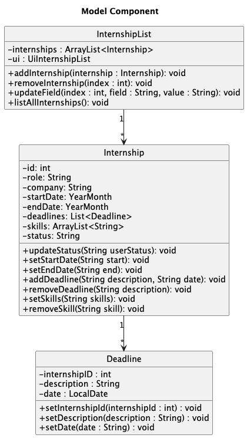
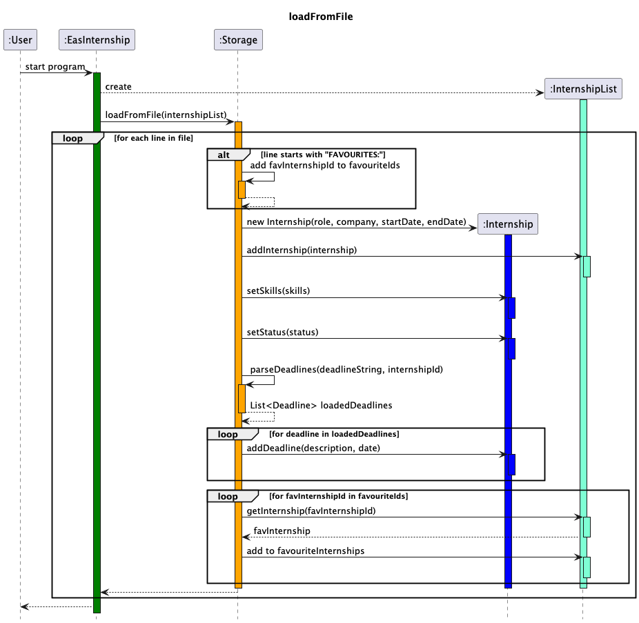
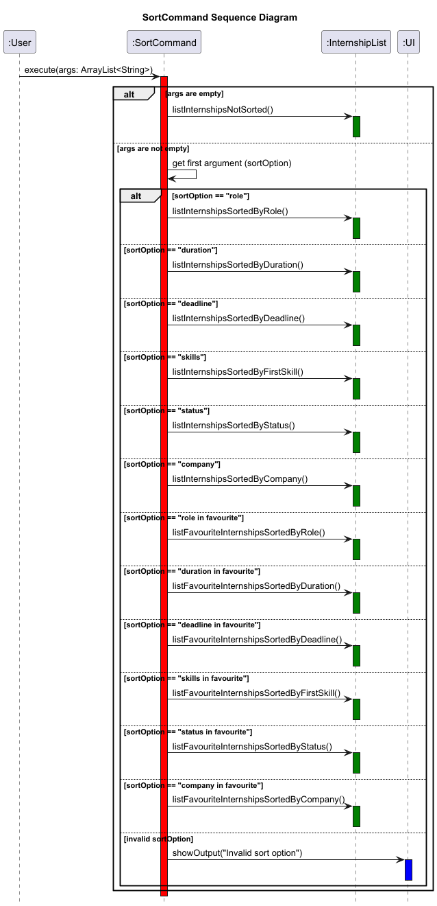
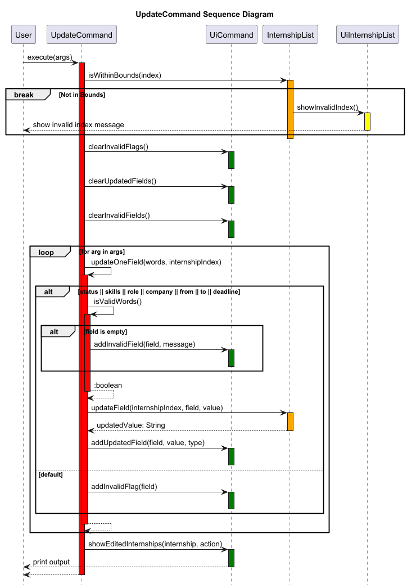
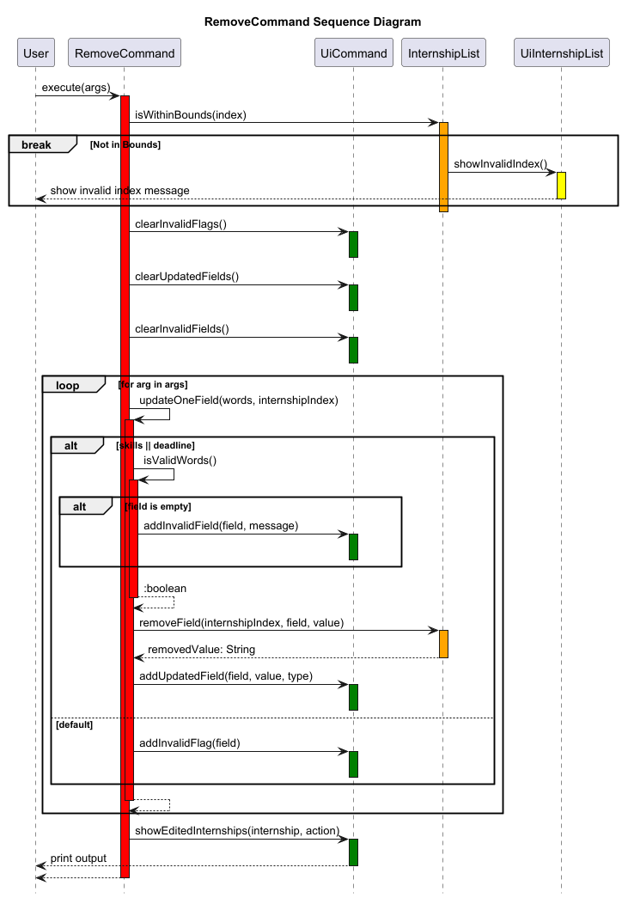

# Developer Guide

## Acknowledgements

{list here sources of all reused/adapted ideas, code, documentation, and third-party libraries -- include links to the original source as well}

## Design & implementation

1. [Design](#1-design)
    1. [Architecture](#11-architecture)
    2. [UI Component](#12-UI-component)
    3. [Logic Component](#13-logic-component)
    4. [Model Component](#14-model-component)
    5. [Storage Component](#15-storage-component)
2. [Implementation](#2-implementation)
    1. [Parsing Input](#21-parsing-input)
    2. [Command Execution](#22-command-execution)
    3. [Task Management](#23-task-management)
    4. [AddCommand Implementation](#addcommand-implementation)
    5. [DeleteCommand Implementation](#deletecommand-implementation)
    6. [SortCommand Implementation](#sortcommand-implementation)
    7. [UpdateCommand Implementation](#updatecommand-implementation)
    8. [RemoveCommand Implementation](#removecommand-implementation)
---

## About the Product
1. [Product Scope](#Product-Scope)
   1. [Target User Profile](#Target-user-profile)
   2. [Value Proposition](#Value-proposition)
2. [User Stories](#User-Stories)
3. [Non-Functional Requirements](#Non-Functional-Requirements)
4. [Glossary](#Glossary)
5. [Instructions for Manual Testing](#Instructions-for-manual-testing)

---
## 1. Design

### 1.1 Architecture
The architecture of EasInternship is designed to follow the MVC (Model-View-Controller) pattern to facilitate separation of concerns, modularity, and maintainability.

- **View (UI)**: Responsible for interacting with the user by displaying output and reading input.
- **Controller (Command and Parser)**: Responsible for parsing user input and invoking the appropriate commands.
- **Model (InternshipList)**: Manages the state of the application, including the list of internships and tasks.
- **Storage**: Responsible for loading and saving data from and to the disk.

#### Overview

The `EasInternship` class serves as the entry point of the application. It manages the application's main loop, where the user is continually prompted for input, and commands are processed in response. The class is responsible for initializing the UI, loading saved data, and handling user input until the user chooses to exit the program.

#### Key Responsibilities

- **Initialization**: Initializes the necessary components for the application, such as the `Ui`, `InternshipList`, and `Parser` classes. It also loads any saved data from the storage into the `InternshipList`.
- **Main Loop**: Continuously prompts the user for input. The input is parsed by the `Parser`, and the corresponding `Command` is executed. If the user enters the exit command, the loop terminates.
- **Command Processing**: After parsing the user input, the corresponding `Command` object is executed. The application catches and displays any errors that occur during command execution.
- **Saving State**: Upon exiting, the current state of the `InternshipList` is saved to a file to ensure persistence across sessions.

---

### 1.2 UI Component

The UI component is responsible for displaying information to the user and reading input. It interacts with the user by printing messages and prompts, and retrieves commands for the rest of the application to process.

### 1.3 Logic Component

The logic component is handled by the `Parser` and `Command` classes. The `Parser` interprets the user's input and returns a command object, which is then executed to perform the desired operation.

### 1.4 Model Component

The model component includes the `Internship`, `InternshipList`, `Deadline` and `DeadlineList` classes.

`Internship`: Represents the individual internship entries.

`InternshipList`: Manages a collection of Internship objects, providing methods for adding, retrieving, updating, sorting and removing internships.

`Deadline`: Represents each individual deadline associated with an internship, holding data specific to that deadline (description, date).

Each `Internship` object contains a `Deadline` list, and has methods to add, retrieve or remove deadlines associated with that internship.

This is represented with the class diagram below:

### 1.5 Storage Component

The storage component is responsible for saving the current state of the `InternshipList` to a file and loading it back when the application is restarted. This ensures that users' progress is preserved between sessions.
The data from the internshipList is saved into a .txt file.

There are two main functions, `loadFromFile` and `saveFromFile`.

The following sequence diagrams depict how the Storage Functions work.

## 2. Implementation

### 2.1 Parsing Input

The `Parser` class is responsible for parsing the input strings provided by the user. It breaks down the input into individual components like the command and its accompanying arguments. After parsing, it returns a `Command` object.

### 2.2 Command Execution

The `Command` class and its subclasses handle the execution of specific commands. Once a command is parsed, it is executed with the required arguments, and the result is displayed to the user.

### 2.3 Task Management

The `InternshipList` class handles adding, removing, and retrieving internships from the list. It interacts with both the UI and the storage components to ensure that updates are reflected in the user interface and persisted to disk.

---

### Flow of Execution

1. **Welcome Message**: The `Ui` class displays a welcome message to the user.
2. **Load Data**: The `Storage` class loads any saved internships into the `InternshipList`.
3. **Input Loop**: The application enters a loop, prompting the user for input.
4. **Command Parsing**: The `Parser` interprets the input and returns the appropriate `Command`.
5. **Command Execution**: The command is executed, and the `InternshipList` is updated accordingly.
6. **Exit Flow**: If the user enters the exit command, the `InternshipList` is saved, and the application displays a goodbye message.

### Methods

- `public static void main(String[] args)`: The entry point of the application. It handles initialization, the main user input loop, and command execution.

### Error Handling

If the user inputs an unknown command or a command fails during execution, the `Ui` class displays an appropriate error message. This ensures that the application can continue running despite errors in user input.

---

### AddCommand Implementation

#### Overview:
The `AddCommand` class is responsible for adding internship listings to the Internship List. It extends the `Command` class, providing the add functionality as part of the command execution framework.

#### Design:
- The `AddCommand` class processes user input to determine what fields to add to the new internship listing.
- If no arguments or invalid arguments are given, it prompts the user with an error message indicating which fields are erroneous.

#### Key Methods:
- `execute(ArrayList<String> args)`: Handles addition logic based on the inputs provided. If the user provides an appropriate "role" and "company", the internship is added to the listing. Otherwise, the user is prompted with which fields are missing. The user also can input start and end dates of the internship during the addition.
- **`getUsage()`**: Returns a string showing the correct usage of the `add` command and the expected input.

#### Example Usage Scenario:
- The user enters `add -role Software Engineer -company Google`, and the execute method adds the internship to the InternshipList The start and end dates are defaulted to 01/01.

- The user enters `add -role Software Engineer -company Facebook -from 10/24 -to 06/25`, and the execute method adds the internship with the specified dates to the InternshipList.

- The user enters `add -role Software Engineer`. The execute method detects that no company has been specified and adds `company` to the list of invalid flags. uiCommand is then called and prints an error statement of all invalid flags detected.

#### Sequence Diagram:

The following sequence diagram shows how the `AddCommand` is executed:

### DeleteCommand Implementation

#### Overview: 
The `DeleteCommand` class is responsible for deleting internship listings from the Internship List. It extends the `Command` class, providing the delete functionality as part of the command execution framework.

#### Design:
- The `DeleteCommand` class processes user input to determine which `Internship` to remove from the `InternshipList`.
- If no arguments or invalid arguments are given, it prompts the user with an error message indicating which fields are erroneous.

#### Key Methods:
- `execute(ArrayList<String> args)` : Handles deletion logic based on the inputs provided. If the user provides an appropriate `internshipID`, the `Internship` is deleted from the `InternshipList`. Otherwise, if an inappropriate or no `internshipID` is specified, the user is prompted that the `internshipID` is invalid.

- `getUsage()`: Returns a string showing the correct usage of the `delete` command and the expected input.

#### Example Usage Scenario:
- The user enters `delete 1`. The execute method removes the `Internship` from the `InternshipList` if the `internshipID` is valid.
- The user enters `delete -1`. The execute method detects that the `internshipID` is invalid. uiCommand is called and prints an output `Invalid integer, please provide a valid internship ID`.

#### Sequence Diagram
The following sequence diagram shows how the `DeleteCommand` is executed:

### SortCommand Implementation

#### Overview:
The `SortCommand` class is responsible for sorting the internship listings based on different criteria such as the internship role, skills and status (alphabetically) , the application deadline (by start and end dates). It extends the `Command` class, providing the sorting functionality as part of the command execution framework.

#### Design:
- The `SortCommand` class processes user input to determine which sorting method to apply (e.g., role or deadline).
- If no arguments or invalid arguments are given, it defaults to listing internships by ID.

#### Key Methods:
- **`execute(ArrayList<String> args)`**: Handles sorting logic based on the first argument provided. The valid sort options include:
   - `"role"`: Sorts internships by role alphabetically.
   - `"duration"`: Sorts internships by duration (start and end dates).
   - `"deadline"`: Sorts internships by deadline.
   - `"skills"`: Sorts internships by the first skill in the skills list alphabetically.
   - `"status"`: Sorts internships by status alphabetically.
   - `"company"`: Sorts internships by company alphabetically.
   - `"role in favourite"`: Sorts internships in favourite by role alphabetically.
   - `"duration in favourite"`: Sorts internships in favourite by duration (start and end dates).
   - `"deadline in favourite"`: Sorts internships in favourite by deadline.
   - `"skills in favourite"`: Sorts internships in favourite by the first skill in the skills list alphabetically.
   - `"status in favourite"`: Sorts internships in favourite by status alphabetically.
   - `"company in favourite"`: Sorts internships in favourite by company alphabetically.
- If the user provides an invalid sort option, the command returns an error and defaults to listing internships by ID.
- **`getUsage()`**: Returns a string showing the correct usage of the `sort` command, including valid options like "alphabet", "deadline", "duration", "skills", and "status".

#### Example Usage Scenario:
1. The user enters `sort role`, and the `execute` method sorts the internships by role alphabetically.
2. The user enters `sort duration`, and the internships are sorted by their start and end dates.
3. The user enters `sort skills`, and the internships are sorted by the first skill alphabetically.
4. The user enters `sort status`, and the internships are sorted by their status alphabetically.
5. The user enters `sort deadline`, and the internships are sorted by each of their earliest deadline.
6. The user enters `sort company`, and the internships are sorted by their company alphabetically.
7. The user enters `sort role in favourite`, and the `execute` method sorts the internships in favourite by role.
8. The user enters `sort duration  in favourite`, and the internships in favourite are sorted by their start and end dates.
9. The user enters `sort skills in favourite`, and the internships in favourite are sorted by the first skill alphabetically.
10. The user enters `sort status in favourite`, and the internships in favourite are sorted by their status alphabetically.
11. The user enters `sort deadline in favourite`, and the internships in favourite are sorted by each of their earliest deadline.
12. The user enters `sort company in favourite`, and the internships in favourite are sorted by their company alphabetically.
13. If the user enters an invalid sort option, the command returns an error and lists the internships by ID.

#### Sequence Diagram:
The following sequence diagram shows how the `SortCommand` is executed:

### Filter Command Implementation

#### Overview:

The FilterCommand class is responsible for filtering internship listings in the InternshipList based on various criteria. It extends the Command class, providing the filter functionality as part of the command execution framework.

#### Design:

The FilterCommand class processes user input to determine which fields to filter by (e.g., role, company, start date, end date and/or favourite status) and then filters the internships based on the respective fields.

Role and Company: Filters internships by checking the equality of the given role or company name against each internship's role or company name

Start Date (-from) and End Date (-to): Filters internships by checking if the internship's duration is within the time interval specified by the start and end dates. if no -to flag is provided, all internships whose start date is greater than or equal to the given start date is listed. If no -from flag is provided, all internships whose end date is lesser than or equal to the given end date is listed.

Favourite: Filters internships based on whether or not they are marked as a favourite (true or false).

If an invalid flag, empty or invalid fields are provided, it prompts the user with an error message indicating which flags/fields are missing or erroneous.

#### Key Methods:

execute(ArrayList<String> args): Handles filtering logic based on the arguments provided. The command allows the user to filter internships by different criteria such as role, company, start date, end date and/or favourite status. If the arguments are invalid or missing, the user is notified accordingly.

getUsage(): Returns a string showing the correct usage of the filter command and the expected inputs.

#### Example Usage Scenario:

The user enters `filter -role Software Engineer`, and the execute method filters the internships to only those with the role of "Software Engineer"

The user enters `filter -company Google`, and the execute method filters internships from "Google"

The user enters `filter -favourite true`, and the execute method filters internships that have been marked as favourites

The user enters `filter -from 06/24`, and the execute method filters internships starting from June 2024

The user enters `filter -role Software Engineer -from 02/24 -to 08/24`, the execute method filters internships whose duration is within the period of 02/24 to 08/24 and which has the role of "Software Engineer"

The user enters `filter -favourite false -company Huawei`, the execute method filters internships from "Huawei" and which have not been marked as favourite by the user

#### Sequence Diagram
The following sequence diagram shows how the `FilterCommand` is executed:

### UpdateCommand Implementation

#### Overview
The `UpdateCommand` class is responsible for updating the fields of an internship. It extends the `Command` class, providing an updating functionality as part of the command execution framework.

#### Design
- The `UpdateCommand` class processes the user input to determine which internship and which field to update.
- If the internship ID is not valid, it will print a message accordingly.
- If the field is not valid, it will print a message indicating the erroneous field.
- If the value provided with the field is not valid, it will also print a message indicating the erroneous value.

#### Key Methods
- `execute(ArrayList<String> args)`: Handles the logic to find the internship entry and determine which field to update. The valid fields include:
  - `status`: Updates the status of the internship.
  - `skills`: Adds skills to the relevant field of the internship
  - `role`: Updates the role of the internship
  - `company`: Updates the company of the internship
  - `from`: Updates the start date of the internship
  - `to`: Updates the end date of the internship
  - `deadlines`: Updates the deadlines of the internship
- `isValidValue(String[] words)`: Checks if there was a new value provided for the selected field.
- `updateOneField(String[] words, int internshipIndex)`: Called within `execute(args)` to invoke the appropriate method to update the field.
- `getUsage()`: Returns a string showing the correct usage of the `update` command.

#### Example Usage Scenario:
- The user enters `update 2 -status Application Completed`, and the `execute` method finds the internship with ID `2` and updates its `status` to `Application Completed`.
- The user enters `update 4 -status Application Completed`, if `4` is not a valid ID, the `execute` method will print a message to show the ID is out of bounds.
- The user enters `update 2 -skills`, no value is given after the `-skills` flag, the `isValidValue` method returns false and prints a message to indicate the need for a value.
- The user enters `update 2 -from Tomorrow`, `Tomorrow` is not a valid date, the `execute` method prints message to indicate it is an invalid value.

#### Sequence Diagram
The following sequence diagram shows how the `UpdateCommand` is executed:

### RemoveCommand Implementation

#### Overview
The `RemoveCommand` class is responsible for removing the values within fields of an internship entry. It extends the `UpdateCommand` class, providing a removing functionality to the execution framework.

#### Design
- The `RemoveCommand` class process the user input to determine which internship and which field to empty.
- If the internship ID is not valid, it will print a message accordingly.
- If the field is not valid, it will print a message indicating the erroneous field, including fields that cannot be emptied.
- If the valid provided does not exist in the field, it will also print a message indicating the erroneous value

#### Key Methods
- `execute(ArrayList<String> args)`: Handles the logic to find the internship entry (same as `UpdateCommand`) and determine which field to update. The valid fields include:
  - `skills`: Removes the specific value from the skills field of the internship
  - `deadline`: Removes the specified deadline from the internship.
- `isValidValue(String[] words)`: Checks if there is a value provided to search and remove from the selected field.
- `updateOneField(String[] words, int internshipIndex)`: Called within `execute(args)` to invoke the appropriate method to remove the value from the field.
- `getUsage()`: Returns a string showing the correct usage of the `remove` command.

#### Example Usage Scenario:
- The user enters `remove 2 -skills Python`, the `execute` method finds the internship with ID `2` and removes `Python` from its list of `skills`.
- The user enters `remove 4 -skills Python`, if `4` is not a valid ID, the `execute` method will print a message to show the ID is out of bounds.
- The user enters `remove 2 -skills`, no value is given after the `-skills` flag, the `isValidValue` method returns false and prints a message to indicate the need for a value.
- The user enters `remove 2 -skills Accounting`, if `Accounting` is not listed in `skills`, the `execute` method prints a message to indicate the value cannot be found.

#### Sequence Diagram
The following sequence diagram shows how the `RemoveCommand` is executed:

## Product scope
### Target user profile

The target user profile for EasInternship includes:
    
- Students or Internship Applicants who want to track and organize their internship applications across multiple companies
- Users comfortable with Command Line Interface
- Internship Applicants who want to keep track of their application deadlines
- Students who want a lightweight, distraction-free way to manage their internship application process.
- Applicants seeking to track the status of each application, from submission to interview stages.

For example, John is a Computer Engineering Junior with the following characteristics
- Command Line Expertise: With a few years of command line usage under his belt throughout his years as a student, John is well-equipped with the technical skills necessary to use EasInternship.
- Applying for summer internships: John is regularly applying for internships in the coming summer and believes in the importance of ensuring he is on track with all his applications.
- Juggling Tight Schedule: As someone with many different tasks on hand, John needs his information readily available.

These traits make John a suitable candidate to use EasInternship.

### Value proposition

This product helps users streamline the process of tracking and managing their internship applications by allowing them to:

- **Store Important Internship Information**: Users can input and store key details such as the role, company, duration, required skills, application deadlines, and any additional notes regarding each internship.

- **Track Application Status**: Users can keep track of the current status of their applications (e.g., not applied, applied, interview scheduled, offer received) and update it as the application progresses.

- **Edit and Manage Internships**: Users can edit saved internships, modify application statuses, update deadlines, or remove outdated internships from their list.

- **Filter Internships by Key Criteria**: Users can filter tracked internships by relevant criteria such as required skills, application status, or upcoming deadlines, helping them find specific applications.

- **Sort Internships by Key Criteria**: Users can sort tracked internships by relevant criteria such as required skills, application status, or upcoming deadlines, helping them prioritize applications.

- **Monitor Deadlines Easily**: Users can stay on top of their internship deadlines by sorting or flagging applications with approaching deadlines, ensuring that no important opportunity is missed.

## User Stories

| Version | As a ...             | I want to ...                                  | So that I can ...                                      |
|---------|----------------------|------------------------------------------------|--------------------------------------------------------|
| v1.0    | new user              | see usage instructions                         | refer to them when I forget how to use the application  |
| v1.0    | user                  | add an internship with all relevant details    | store information about the internships I’m applying to |
| v1.0    | user                  | edit the details of an internship              | update information when I receive new details           |
| v1.0    | user                  | delete an internship                           | remove outdated or irrelevant internships from my list  |
| v1.0    | user                  | track the status of an internship              | know what stage my application is in                   |
| v1.0    | user                  | sort internships by duration                   | focus on internships where I need to take action        |
| v1.0    | user                  | sort internships by deadlines                  | prioritize internships with approaching deadlines       |
| v1.0    | user                  | update the status of my internship application | keep track of my progress in the application process    |
| v2.0    | user                  | receive alerts about upcoming deadlines        | ensure I don't miss important deadlines                 |
| v2.0    | user                  | sort internships by required skills            | focus on internships that match my skill set            |

## Non-Functional Requirements

1. Usability: The command-line interface should be intuitive and easy to use, even for non-technical users.
2. Reliability: The application should not lose any user data during normal operation or unexpected shutdowns.
3. Compatibility: The application should run on common operating systems (Windows, macOS, Linux).
4. Maintainability: The code should be well-documented and follow clean code principles for easy future enhancements.
5. Portability: User data should be easily exportable and importable for backup purposes or switching devices.
6. Performance: The application should respond to all user commands without negatively noticable delay.
7. Scalability: The application should handle an extensive number of internship entries (e.g., 100+ entries) without a noticeable decrease in performance.
8. Data Persistence: All data should be automatically saved to a file, allowing users to resume their progress upon reopening the application.

## Glossary

* *Internship* - The position of a student or trainee who works in an organisation, with associated role, company, duration and deadline information.
*  *InternshipList* - A collection of Internships added by the user.
*  *Deadline* - The date which an event is scheduled for.
*  *Parser* - The component responsible for interpreting user commands and executing the appropriate actions.
*  *Storage* - The component responsible for saving and loading the user's data to and from a file. 

## Instructions for manual testing

1. **Installation and Setup:**
   - Ensure Java Runtime Environment (JRE) is installed on your system.
   - Ensure Java Version 17.0. Run `java -version` in a terminal to verify.
   - Download the EasInternship application JAR file.
   - Open a terminal or command prompt and navigate to the directory containing the JAR file.

2. **Running the Application:**
   - Execute the command: java -jar EasInternship.jar
   - Verify that the application starts and displays a welcome message.

3. **Testing Basic Commands:**
   - Enter the `help` command and verify that usage instructions are displayed.
   - Test the `exit` command to ensure the application exits properly.

4. **Adding an Internship:**
   - Enter the command `add -role {role name} -company {company name}` eg. `add -role Software Engineer Intern -company Google`
   - Verify that the internship has been added successfully.

   
5. **Updating an Internship:**
  - Enter the command `update {ID} {-field} {updated information}` eg. `update 1 -skills python`.
  - Verify that the internship has been updated successfully.

// rahul fill up pls
6. **Adding an Internship to favourites:**
    - Enter the command `mark {ID}` eg 

7. **Displaying InternshipList**
   - Enter the command `list` to show the most updated `InternshipList`.

8. **Sorting the InternshipList**
   - Enter the command `sort {-field}` eg. `sort deadline`.
   - Verify that the list displayed is sorted according to the entered field.

9. **Filtering the InternshipList**
   - Enter the command `filter {-field} {field data}` eg. `filter -company Google`.
   - Verify that the filtered list all contain the specified field data.

10. Removing an Internship
   - Enter the command `delete {ID}` eg. `delete 1`
   - Verify that the internship has been deleted successfully.
   - Enter `list` to verify the `Internship` is no longer in the `InternshipList`.
