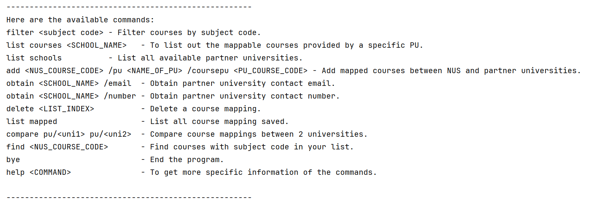

# User Guide

## Introduction

Introducing ExchangeCourseMapper, the perfect assistant in your planning for your SEP in Oceania!

Using ExchangeCourseMapper, you can search and plan your course mapping by listing the universities of interest, 
along with the specific courses and subject codes offered by each school. You can quickly filter by NUS-coded modules 
or by partner universities (PU) when you want to view the relevant options. For any course mappings you are interested in,
you can save it in the Personal Tracker provided by ExchangeCourseMapper!

- [Quick Start](#quick-start)
- [Features](#features)
    - [List all commands: `commands`](#list-all-commands-commands)
    - [Help Command: `help`](#help-command-help)
    - [List out all the possible schools from the options: `list schools`](#list-out-all-the-possible-schools-from-the-options-list-schools)
    - [List courses provided by the partner university: `list courses`](#list-courses-provided-by-the-partner-university-list-courses)
    - [Obtain contacts from the list of universities: `obtain`](#obtain-contacts-from-the-list-of-universities-obtain)
    - [Filter possible mappings: `filter`](#filter-possible-mappings-filter)
    - [Add a course mapping: `add`](#add-a-course-mapping-add)
    - [Delete course mapping plans from Personal Tracker: `delete`](#delete-course-mapping-plans-from-personal-tracker-delete)
    - [List Personal Tracker courses: `list mapped`](#list-personal-tracker-courses-list-mapped)
    - [Compare mapped courses between two universities: `compare`](#compare-mapped-courses-between-two-universities-compare)
    - [Find courses in personalised tracker `find`](#find-courses-in-personalised-tracker-find)
- [FAQ](#faq)
- [Command Summary](#command-summary)

## Quick Start

1. Ensure that you have Java 17 or above installed.
2. Download the latest version of `ExchangeCourseMapper` from [here](https://github.com/AY2425S1-CS2113-W10-2/tp/releases/).
3. Download the JAR file and save it on your computer.
4. Copy the absolute path of where the jar file is saved.
5. In Terminal, run java -jar /path/to/ExchangeCourseMapper.jar
6. Time to start your planning!

## Features 

> **NOTE:** Your stored course mapping is located in the `myList.json` file, found in the `data` folder at the 
> same file path where you executed the JAR file.
> 
> **NOTE:** The `myList.json` file will only be created after you have executed the JAR file at least once.
> A new file will be created after every execution if no `myList.json` file is found in the `data` folder at the
> same file path where you executed the JAR file.
>
> **NOTE:** Ensure that all the commands given are placed in **one line**. 
> Do not separate the command into multiple lines in the terminal.
> 
> **NOTE:** For all command flags, ensure that your input is placed a single space after the flag.
> 
> **NOTE:** If the file is **corrupted**, please restore it to its **original state** before proceeding with the program.
> 
>You may try one of the following:
>- Remove the corrupted line (delete one course mapping).
>- Remove any empty lines in the file.
>- Ensure the file has one empty line at the end of the list of courses for a new course to be added.
>
> **This list is non-exhaustive.**
> 
> **TIP:** You may use the partner universities' **official abbreviation** instead of typing the full name into the CLI, 
> as shown in the chart below:
> - The University of Melbourne - unimelb
> - The Australian National University - anu
> - Victoria University of Wellington - wgtn
> - The University of Western Australia - uwa

### List all commands: `commands`
Displays a list of all available commands, along with a brief description of each.

Format: `commands`

Example of usage: commands

Expected output:




### Help Command: `help`
This feature allows users to ask for help when unsure of how the commands work or how to use the commands.
It provides users with a detailed explanation of what the command does and the format to utilise the command.

Format:
`help [COMMAND]`
* Users can use the commands feature to list out all the available commands

Example of usage:
* help filter

Expected outcome:
```
The filter function allows users to input a NUS course that they want to map
and get a list of the mappable courses that includes NUS courses in the format of:
Partner University: [PU_NAME]
Partner University Course Code: [PU_COURSE_CODE]
The format to use this feature is shown below:
filter [NUS_COURSE_CODE]
For example, filter cs2040
-----------------------------------------------------
```

### List out all the possible schools from the options: `list schools`
List out the name of each school CEG students could possibly go for their SEP in Oceania.

Their abbreviated names will also be displayed. 

Format: `list schools`

Expected Output:
```
-----------------------------------------------------
The University of Melbourne (unimelb)
The Australian National University (anu)
Victoria University of Wellington (wgtn)
The University of Western Australia (uwa)
-----------------------------------------------------
```


### List courses provided by the partner university: `list courses`
This feature allows users to list out the available mappable course that are provided by a specific partner university.

The information that would be listed out are:
- PU course code and PU course name
- NUS course code and NUS course name

Format:
`list courses [PARTNER_UNIVERISTY_NAME]`

The available partner universities are:
* The University of Western Australia (uwa)
* The University of Melbourne (unimelb)
* The Australian National University (anu)
* Victoria University of Wellington (wgtn)

Abbreviation of the universities name can be used.

Example of usage:
* list courses victoria university of wellington
* list courses wgtn

Expected output:
```
COMP102: Introduction to Computer Program Design
CS1010J: Programming Methodology
-----------------------------------------------------
COMP103: Introduction to Data Structures and Algorithms
CS2040: Data Structures and Algorithms
-----------------------------------------------------
INFO151: Databases
CS2102: Database Systems
-----------------------------------------------------
SWEN221: Software Development
CS2103: Software Engineering
-----------------------------------------------------
NWEN301: Operating Systems Design
CS2106: Introduction to Operating Systems
-----------------------------------------------------
NWEN405: Security Engineering
CS2107: Introduction to Information Security
-----------------------------------------------------
NWEN303: Concurrent Programming
CS3211: Parallel and Concurrent Programming
-----------------------------------------------------
COMP361: Design and Analysis of Algorithms
CS3230: Design and Analysis of Algorithms
-----------------------------------------------------
MATH324: Coding and Cryptography
CS3236: Introduction to Information Theory
-----------------------------------------------------
SWEN303: User Interface Design
CS3240: Interaction Design
-----------------------------------------------------
MDDN241: 3D Modelling and Animation II
CS3242: 3D Modeling and Animation
-----------------------------------------------------
SWEN421: Formal Software Engineering
CS4211: Formal Methods for Software Engineering
-----------------------------------------------------
CYBR371: System and Network Security
CS5231: Systems Security
-----------------------------------------------------
This is the end of the list.
```
* Note that the output would be a list of mappable courses of the format above.


### Obtain contacts from the list of universities: `obtain`
Obtain the contact details (email or number) of the university of interest from the list of schools available.

Format: `obtain PARTNER_UNIVERSITY_NAME /CONTACT_TYPE`

* The `PARTNER_UNIVERSITY_NAME` is the name of the partner university from the list of schools.
* The `CONTACT_TYPE` is the type of contact either number or email

The available partner universities are:
* The University of Western Australia (uwa)
* The University of Melbourne (unimelb)
* The Australian National University (anu)
* Victoria University of Wellington (wgtn)

Abbreviation of the universities name may be used.

Example: `obtain victoria university of wellington /number`

Expected Output:
```
Phone number for Victoria University of Wellington: +64 4 472 1000
```

Example: `obtain the university of western australia /email`

Expected Output:
```
Email for The University of Western Australia: uwa-albany@uwa.edu.au
```

Example: `obtain anu /number`

Expected Output:
```
Phone number for The Australian National University: +61 2 6125 7257
```

Example: `obtain unimelb /email`

Expected Output:
```
Email for The University of Melbourne: unimelb-support@unimelb.edu.au
```


### Filter possible mappings: `filter`
Filters out all possible PU courses that can be mapped to a user specified NUS course.

Format: `filter NUS_COURSE_CODE`

* The `NUS_COURSE_CODE` is in NUS course code format.

Example: `filter cs3241`

Expected Output:

```
-----------------------------------------------------
Filter results for cs3241:
-----------------------------------------------------
Partner University: The University of Melbourne
Partner University Course Code: COMP30019
-----------------------------------------------------
Partner University: The Australian National University
Partner University Course Code: COMP4610
-----------------------------------------------------
-----------------------------------------------------
End of filter results
-----------------------------------------------------
```

Example: `filter ee2026`

Output:

```
-----------------------------------------------------
Filter results for ee2026:
-----------------------------------------------------
-----------------------------------------------------
No mappable courses found for the given course code.
-----------------------------------------------------
```

### Add a course mapping: `add`
Adds a new course mapping into `myList.json` file for storage. Course mapping is subjected to validation
to ensure that the course mapping is valid and that the university provided is an Oceania university.

Format: `add NUS_COURSE_CODE /pu PARTNER_UNIVERSITY_NAME /coursepu PU_COURSE_CODE`

* All 3 parameters `NUS_COURSE_CODE`, `PARTNER_UNIVERISTY_NAME` and `PU_COURSE_CODE` are case-insensitive.
* Do not add punctuation to the above three parameters.
* Do not switch the order of parameters. Keyword `/pu` must come before `/coursepu` keyword.
* For `PARTNER_UNIVERSITY_NAME`, indicate the partner university's full name or their respective official abbreviation.

Example of usage (lowercase):

`add cs2102 /pu the university of melbourne /coursepu info20003`

Expected output:


Example of usage (normal case):

`add CS3244 /pu The Australian National University /coursepu COMP3670`

Expected output:


Example of usage (using partner university abbreviations):

`add cs2102 /pu unimelb /coursepu info20003`

Expected output:


### Delete course mapping plans from Personal Tracker: `delete`
Delete a course mapping plan that was initially saved into the Personal Tracker.

Format: `delete LIST_INDEX`

* The `LIST_INDEX` is the integer list index of the course mapping plan to be deleted.

Example: `delete 1` when there are plans stored in the Personal Tracker.

Expected Output:


### List Personal Tracker courses: `list mapped`
Lists all the courses saved in your Personal Tracker.

Format: `list mapped`

Example of usage:
```
list mapped
```

Expected output for empty list or file not in the correct directory:
```
No modules mapped yet or you may have changed the file/directory name.
Please start adding courses and check that the file/directory has not been changed.
```
Expected output with course mappings:
```
Mapped Modules:
-----------------------------------------------------
1. cs2102 | the university of melbourne | info20003
2. cs3244 | the australian national university | comp3670
-----------------------------------------------------
```
**Inputs for the above test case**:
The `myList.json` file should have entries such as:
```
cs2102 | the university of melbourne | info20003
cs3244 | the australian national university | comp3670
```

### Compare mapped courses between two universities: `compare`
Compares the mapped courses between two partner universities saved in `myList.json` file.
It lists common and unique mappings between the two universities.

**Format**: `compare pu/UNIVERSITY_1 pu/UNIVERSITY_2`

**Inputs**:
- `UNIVERSITY_1` and `UNIVERSITY_2` must be the full names of universities listed in `myList.json`.
- Ensure that both universities have course mappings saved; otherwise, the output will indicate an empty list.

**Example of usage**:

```
compare pu/the university of melbourne pu/victoria university of wellington
```

**Expected output when there are no mapped courses or empty list**:
```
Comparison Results for the university of melbourne and victoria university of wellington:
Common Mappings:
-----------------------------------------------------
No common mappings found.
-----------------------------------------------------

Unique Mappings - the university of melbourne:
-----------------------------------------------------
No unique mappings for the university of melbourne.
-----------------------------------------------------

Unique Mappings - victoria university of wellington:
-----------------------------------------------------
No unique mappings for victoria university of wellington.
-----------------------------------------------------
```

**Expected output when universities have course mappings**:
```
Comparison Results for the university of melbourne and the australian national university:
Common Mappings:
-----------------------------------------------------
cs3244 | the university of melbourne | comp30027
cs3244 | the australian national university | comp3670
-----------------------------------------------------

Unique Mappings - the university of melbourne:
-----------------------------------------------------
cs2102 | the university of melbourne | INFO20003
-----------------------------------------------------

Unique Mappings - the australian national university:
-----------------------------------------------------
No unique mappings for the australian national university.
-----------------------------------------------------
```

**Inputs for the above test case**:
The `myList.json` file should have entries such as:
```
cs3244 | the university of melbourne | comp30027
cs3244 | the australian national university | comp3670
cs2102 | the university of melbourne | info20003
```

### Find courses in personalised tracker: `find`
This feature allows users to search for NUS courses in their course mappings.

Format: `find [NUS_COURSE_CODE]`
* Note that this feature is searching within the personalised tracker

Example: `find cs2040`

Expected output:
```
cs2040 | the university of western australia | cits2200
-----------------------------------------------------
```
* Please note that you will only get this output if you have this mapping in your personalised tracker.

## FAQ

**Q**: Are the commands case-sensitive?

**A**: No they are not.

**Q**: Can I `filter` multiple courses at the same time?

**A**: No, you are only allowed to filter one course at a time. 

**Q**: Can I `list courses` multiple schools at the same time?

**A**: No, you are only allowed to list out all available course mappings by one partner university at a time. 

**Q**: Can I `add` multiple courses and/or multiple schools at the same time?

**A**: No you cannot, you are only allowed to add one course mapping to one partner university at one time. 

**Q**: Can I `add` schools not in the list of schools and/or add courses not in the list?

**A**: No you cannot, you are only allowed to add partner universities in Oceania. 

**Q**: Can I `add` a course mapping to a particular partner university that is not in the database?

**A**: No you cannot, you are only allowed to add course mappings in our list to ensure the course mapping is valid. 

**Q**: Can I `obtain` multiple schools/contact types at the same time?

**A**: No, you are only allowed to obtain the contact information of one partner university at a time. 

**Q**: Can I `obtain` contacts of schools not in the list?

**A**: No, you are only allowed to obtain contact information of the schools within our list.

**Q**: Can I `delete` multiple indices at the same time?

**A**: No, you can only delete one course mapping (one index) at a time. 

**Q**: Can I `find` multiple courses at the same time?

**A**: No, you can only find one course at a time.

**Q**: Can I `compare` multiple schools at the same time?

**A**: No, you can only compare 2 schools at a time.


## Command Summary

| Action           | Format                                                                           |
|------------------|----------------------------------------------------------------------------------|
| **Commands**     | `commands`                                                                       |
| **Help**         | `help [COMMAND]`                                                                 |
| **List Schools** | `list schools`                                                                   |
| **List courses** | `list courses [PARTNER_UNIVERISTY_NAME]`                                         |
| **Obtain**       | `obtain [PARTNER_UNIVERSITY_NAME] /[CONTACT_TYPE]`                               |
| **Filter**       | `filter [NUS_COURSE_CODE]`                                                       |
| **Add**          | `add [NUS_COURSE_CODE] /pu [PARTNER_UNIVERSITY_NAME] /coursepu [PU_COURSE_CODE]` |
| **Delete**       | `delete [LIST_INDEX]`                                                            |
| **List Mapped**  | `list mapped`                                                                    |
| **Compare**      | `compare pu/ [PARTNER_UNIVERISTY_NAME_1] pu/ [PARTNER_UNIVERISTY_NAME_2]`        |
| **Find**         | `find [NUS_COURSE_CODE]`                                                         |
| **Bye**          | `bye`                                                                            |

