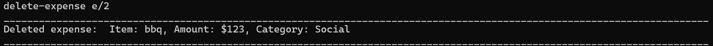
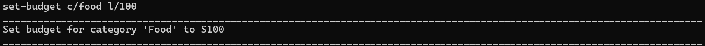
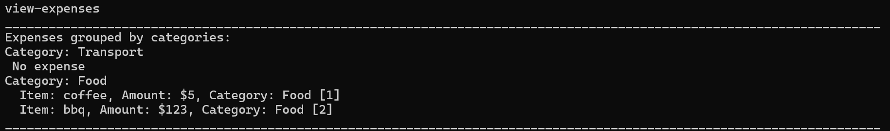
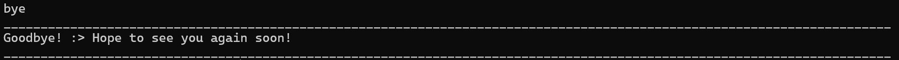

# User Guide

## Introduction

SpendSwift is a simple budgeting tool designed for budget-conscious users. With intuitive text commands, you can effortlessly track expenses and manage your finances without the complexity of traditional tools.

## Quick Start

1. Ensure that you have Java 17 or above installed on your computer.
2. Download the latest tp.jar file.
3. Copy the file to the folder you want to use as the home folder for your Task Manager.
4. Open a command terminal, cd into the folder where you placed the jar file, and run the following command to start the application: `java -jar tp.jar`
5. The application will start, and any existing tasks will be loaded from the file spendswift.txt. If this file doesn't exist, it will be created automatically when tasks are saved after exiting the program properly.
6. Type commands below the outputs and press Enter to execute them.

For details on all available commands, refer to the Features section below.

## Features
### Command Format Notes
1. Commands are case-insensitive: Command words can be typed in any combination of upper or lower case.

   Example: `add-expense` and `ADD-EXPENSE` are both valid.
2. Words in UPPER_CASE are parameters to be supplied by the user.

   Example: In `add n/NAME`, `NAME` is a parameter, which can be used as `add n/Udon`.

3. All parameters are required unless specified: Every parameter must be supplied unless marked optional using square brackets `[ ]`.

   Example: In `add-expense n/NAME a/AMOUNT [c/CATEGORY]`, `add-expense n/Coffee a/5.50` is valid because `c/CATEGORY` is optional, while `add-expense` with no parameters will fail.

4. Order of parameters: Parameters can be provided in any order.

   Example: `add-expense n/Coffee a/5.50 c/Food` is equivalent to `add-expense a/5.50 n/Coffee c/Food`.

5. Extraneous parameters for commands that do not take in parameters (such as `view-expenses` and `bye`) will be ignored.

   Example: If the command specifies `view-expenses 123`, it will be interpreted as `list`.

6. Avoid using command prefixes (e.g., n/, a/, c/, etc.) within parameter values, as they may interfere with parsing. 

    Example: `add-expense n/Coffee 2023/02/12 a/5.50 c/Food` is valid, but `n/Coffee a/s/a/a/a/ a/5.50 c/Food` is not, 
as `a/` is used within the `NAME` parameter, causing confusion with the `a/AMOUNT` prefix.

### Add an Expense: add-expense
This command allows you to record a new expense.

Format:
`add-expense n/NAME a/AMOUNT [c/CATEGORY]`

- `NAME`

  - The name of the expense.
  - This parameter is required.

- `AMOUNT`

  - The monetary value of the expense.
  - This input must be an integer or a double.
  - This parameter is required.
  - When the input is an integer, the input would be saved as an integer.
  - When the input is a double, the input would be saved to 2 decimal places. 
  If the input has more than 2 decimal places, it would be rounded off to the nearest 2 decimal places.

- `CATEGORY`

  - The category under which the expense will be recorded.
  - The category is case-insensitive. It can be typed in any combination of upper or lower case.
  - If the category has not be created, this command will automatically create the category.
  - This parameter is optional. If not provided, the category will be set to `Uncategorized`.

Example:

### Delete an Expense: delete-expense
This command removes an existing expense from the record.

Format:
`delete-expense e/INDEX`

- `INDEX`
  - The index number of the expense, as shown in the expense list.
  - The index refers to the index number shown in the displayed person list.
  - The index must be a positive integer 1, 2, 3, ...
  - This parameter is required.

Example:

### Add a Category: add-category
Create a new category under which expenses can be categorised.

Format:
`add-category CATEGORY`

- `CATEGORY`
  - The name of the new category.
  - This parameter is required. 
  - The category is case-insensitive. It can be typed in any combination of upper or lower case.

Example:

### Tag an Expense to a Category: tag-expense
Assign or change the category of an existing expense.

Format:
`tag-expense e/INDEX c/CATEGORY`

- `INDEX`
  - The index number of the expense, as shown in the expense list.
  - The index refers to the index number shown in the displayed person list.
  - The index must be a positive integer 1, 2, 3, ...
  - This parameter is required.

- `CATEGORY`
  - The name of the category to assign the expense to.
  - The category is case-insensitive. It can be typed in any combination of upper or lower case.
  - This must be an existing category.
  - This parameter is required.

Example:

### Add Budget Limit to a Category: set-budget
Set a maximum spending limit for a category for the current month.

Format:
`set-budget c/CATEGORY l/LIMIT`

- `CATEGORY`
  - The name of the category to set the budget for.
  - The category is case-insensitive. It can be typed in any combination of upper or lower case.
  - This must be an existing category.
  - This parameter is required.

- `LIMIT`
  - The maximum spending limit for this category in the current month.
  - This input must be an integer or a double.
  - This parameter is required.
  - When the input is an integer, the input would be saved as an integer.
  - When the input is a double, the input would be saved to 2 decimal places.
    If the input has more than 2 decimal places, it would be rounded off to the nearest 2 decimal places.

Example:

### View All Expenses: view-expenses
Displays all expenses recorded, grouped by its categories.

Format:
`view-expenses`

- No parameters are required.
- Displays a list of all recorded expenses, showing the name, amount, category, and its index.

Example output:

### View Budget for Each Category: view-budget
View the total expenses for each category in the current month and how much remains before the budget limit is reached.

Format:
`view-budget`

- No parameters are required.
- Displays a summary of spending and remaining budget for all categories with a budget limit.

Example output:

### Set Regular Monthly Reset of Budget: toggle-reset
Automatically resets the budget for each category at the start of a new month when turned on.

Format:
`toggle-reset`

- No parameters are required.
- It would automatically switch to the other setting. 
  - If automatic budget reset is off, `toggle-reset` would turn it on, vice versa.

Example output:

### Help
Provides a summary of available commands and their functionalities.
It serves as a quick reference for users to understand how to use different features and commands in the system.

Format:
`help`

Example output:

### Exiting the program: bye
Exits the program, and saves the data for that session. 
If the data file has yet to be created, this command would also create the data file.

Format:

## FAQ

**Q**: How do I transfer my data to another computer? 
**A**: Copy the `spendswift.txt` file from your SpendSwift home folder to the same folder on your new computer. 
Ensure the tp.jar file is also in the same folder. When you start the application on the new computer, 
it will load your saved expenses and categories from `spendswift.txt`.

**Q**: What happens if I enter an invalid command or make a typo?  
**A**: SpendSwift will display an error message if it doesn't recognize the command. 
Double-check the command format and ensure all required parameters are included. 
You can type `help` to see the correct command syntax and available options.

**Q**: Can I update or change an expense’s details after adding it?  
**A**: Currently, SpendSwift doesn't support direct editing of expenses. 
To make changes, delete the existing expense using `delete-expense` and add a new one with the updated details.

**Q**: What if I forget to set a category when adding an expense?  
**A**: If no category is provided, the expense will be set to "Uncategorized" by default. 
You can later assign it to a specific category using `tag-expense`.

**Q**: How are expenses rounded off if I enter an amount with more than two decimal places?  
**A**: SpendSwift automatically rounds amounts to two decimal places. 
For example, if you enter an amount of 5.678, it will be saved as 5.68.

**Q**: How do I check if my budgets reset automatically each month?  
**A**: Use the `toggle-reset` command to switch the automatic monthly budget reset on or off. 
If the feature is currently off, typing the command will turn it on, and vice versa.

## Command Summary
- Add expense `add-expense n/NAME a/AMOUNT [c/CATEGORY]`
- Delete expense `delete-expense e/INDEX`
- Add category `add-category CATEGORY`
- Tag expense to category `tag-expense e/INDEX c/CATEGORY`
- View expenses `view-expenses`
- Set budget `set-budget c/CATEGORY l/LIMIT`
- View budget `view-budget`
- On/Off automatic budget reset `toggle-reset`
- Exit `bye`
