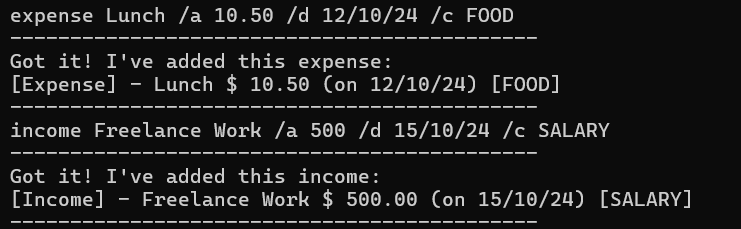

# Finance Buddy User Guide

## Contents
- [Finance Buddy User Guide](#finance-buddy-user-guide)
  - [Contents](#contents)
  - [Introduction](#introduction)
  - [Quick Start](#quick-start)
  - [Features](#features)
    - [Help](#help)
    - [Add Transaction](#add-transaction)
    - [Edit Transaction](#edit-transaction)
    - [Delete Transaction](#delete-transaction)
    - [List Entries](#list-entries)
      - [List by Type](#list-by-type)
      - [List by Date](#list-by-date)
    - [Set/Edit Budget](#setedit-budget)
    - [Saving Data](#saving-data)
  - [Command Summary](#command-summary)

## Introduction

Finance Buddy is a command-line interface application that allows university students
to log their daily expenditures to help manage their budgets.

Users can add, delete and edit income and expenditure logs into the app, as well as
list out all their logged transactions. Users are also able to set a monthly budget
for themselves in the app, and the app will notify them if
they have exceeded, or are close to exceeding their budget.

The current progress of the logging will be saved after each successful command.
Progress is restored when FinanceBuddy is started up each time.

## Quick Start

1. Ensure that Java 17 or above is installed.
2. Download the latest version of `FinanceBuddy` [here](https://github.com/AY2425S1-CS2113-W14-3/tp/releases).
3. Download the `.jar` file and save it on the computer.
4. In the directory where the jar file is saved, open Terminal.
5. In Terminal, run `java -jar [filename].jar`.
6. Happy logging!

## Features

### Help

Lists out the full list of usable commands.

**Format**: `help`

**Output**:

### Add Transaction

The `Add Transaction` command allows you to add either an income or expense entry to your financial list. You can specify details like a description, amount, date, and category for better tracking.

**Format**:
- **For Expense**: `expense DESCRIPTION /a AMOUNT [/d DATE] [/c CATEGORY]`
- **For Income**: `income DESCRIPTION /a AMOUNT [/d DATE] [/c CATEGORY]`

**Parameter Details**:
- `DESCRIPTION`: A brief label describing the transaction (e.g., "Lunch" or "Freelance Work").
- `AMOUNT`: The transaction amount. This should be a positive value.
  - Note: The app does not allow transactions to have an amount greater than $9999999.00.
- `DATE` (optional): Date of the transaction in `dd/MM/yy` format. If omitted, today’s date is used.
  - Note: The app does not allow transactions to be entered with a date later than the system date.
- `CATEGORY` (optional): Specifies a category for the transaction, aiding in detailed financial tracking. If omitted, it defaults to `UNCATEGORIZED`.

**Category Options**:
- **Expense**: Categories include `FOOD`, `TRANSPORT`, `ENTERTAINMENT`, `UTILITIES`, `OTHERS`, and `UNCATEGORIZED`.
- **Income**: Categories include `SALARY`, `INVESTMENT`, `GIFT`, `OTHERS`, and `UNCATEGORIZED`.

**Examples Usage**:

Examples Without Optional Parameters (Date and Category omitted): 

### Edit Transaction
Edits an existing transaction in your financial list.

**Format**: `edit INDEX [/des DESCRIPTION] [/a AMOUNT] [/d DATE] [/c CATEGORY]`

 - Edits the transaction at the specified `INDEX`. `INDEX` refers to the index number shown in the displayed financial list. 
  `INDEX` must be a positive integer.
 - `DESCRIPTION` shouldn't be blank. And DO NOT USE `¦¦` in `DESCRIPTION` cause it serve as the seperator token in storage file.
 - `DATE` should follow `DD/MM/YY` format and cannot be after the system date.
 - `AMOUNT` must be a positive number with a maximum value of $9999999.00. If it's a floating-point number, it will be rounded to two decimal places.
 - `CATEGORY` should be one of the categories allowed in Expenses/Incomes.

**Example Usages**:

 
Edits the description of the 1st entry to be breakfast.
  

 
Edits the description and amount of the 2nd entry to be lunch and 20 respectively.
  

 
Edits the description and date of the 3rd entry to be dinner and 11/09/2024 respectively.
  

 
Edits the description, amount, and date of the 4th entry to be breakfast, 5 and 12/09/2024 respectively.
  

 
Edits the category of the 5th entry to be FOOD.

### Delete Transaction

The `Delete Transaction` command removes a specific entry from your financial list. This command uses the entry’s index to identify and delete it from the list.

**Format**: `delete INDEX`

**Parameter Details**:
- `INDEX`: The position of the transaction in the financial list, as displayed by the `list` command. Using an invalid index will produce an error.

#### Example Usage

 
Deletes the transaction at index 5 and 2 respectively in the financial list.

### List Transactions

Lists out transactions in your financial list in ascending order of date for your perusal. Transactions can be 
filtered by type (income/expense) or restricted to a stipulated period. The app will display the total
cashflow/expenditure/income during the stipulated period depending on the transaction type selected to be listed,
as well as the category with the highest total expenditure/income.

**Format:** `list [expense|income] [/from START_DATE] [/to END_DATE]`

 

#### List by Type

User can command app to list out only expenses, only incomes or both expenses and incomes.

**Example Usage:**

 
Lists out all expenses and incomes. 
Displays total cashflow (income - expenditure), and shows categories with the highest total expenditure and income respectively.

  

 
Lists out all expenses. Displays total expenditure, and shows category with highest total expenditure.

  

 
Lists out all incomes. Displays total income, and shows category with highest total income.

 

#### List by Date

User can command app to only list out transactions starting from a certain date using the `/from` flag, 
and/or up to a certain date using the `/to` flag.

Total cashflow/expenditure/income displayed will be restricted to the range of dates entered by the user.
Category with highest expenditure/income displayed will also be based on the entered date range.

**Example Usage:**

 
Lists out all expenses and incomes with date equal to or after 03/10/24.
Displays total cashflow (income - expenditure) during that period, and shows
categories with the highest total expenditure and income during that period respectively.

  

 
Lists out all expenses with dates before or equal to 03/10/24.
Displays total expenditure + category with highest total expenditure during that period.

  

 
Lists out all incomes with dates between 03/10/24 and 10/10/24 inclusive.
Displays total income + category with highest total income during that period.

 

#### Viewing budget

If a budget has been set by the user, the user's set monthly budget as well as his/her balance
(budget - total expenditure that month) will be displayed when the `list` command is executed.

**Example Usage:**

### Set/Edit Budget

User can set a monthly budget when app is initialized and budget is not set, or by using the budget command.
If the user has already set a budget, the app will prompt the user to ask if they would like to modify their budget at start up.

Budget command can be used to set budget if `no` is keyed in for the initial prompt. 
The command can also be used to edit budget after initial budget is set.

After budget is set by user, adding, deleting or editing expenses will show the budget and remaining balance for the month.
The budget amount and balance will also be viewable by the user under the list command.

**Format**: `budget`

**Example Usage**:

 
Initial budget setting option.

 

 
Budget modification option to change budget amount.

### Saving Data
Your Financial List will be stored in to `data/FinancialList.txt`, while your budget is stored in `data/Budget.txt`.
FinanceBuddy will automatically update the files whenever your list or budget been modified through FinanceBuddy.
When you start the FinanceBuddy program, it will check if the `data/FinancialList.txt` and `data/Budget.txt` exist.
If do, it'll try to load the transactions and budget in the file row by row.
Please do not modify these files manually, otherwise the transactions or the budget with incorrect format will not be loaded.

## Command Summary

| **Command**                   | **Usage**                                                                                  |
|-------------------------------|---------------------------------------------------------------------------------------------|
| **Help**                      | `help`                                                                                     |
| **List All Transactions**     | `list`                                                                                      |
| **List Income Transactions**  | `list income`                                                                               |
| **List Expense Transactions** | `list expense`                                                                              |
| **List Transactions by Date** | `list [/from START_DATE] [/to END_DATE]`                                                    |
| **Add Expense**               | `expense DESCRIPTION /a AMOUNT`                                                             |
| **Add Expense with Date**     | `expense DESCRIPTION /a AMOUNT /d DATE`                                                     |
| **Add Expense with Category** | `expense DESCRIPTION /a AMOUNT /c CATEGORY`                                                 |
| **Add Expense with Date and Category** | `expense DESCRIPTION /a AMOUNT /d DATE /c CATEGORY`                                |
| **Add Income**                | `income DESCRIPTION /a AMOUNT`                                                              |
| **Add Income with Date**      | `income DESCRIPTION /a AMOUNT /d DATE`                                                      |
| **Add Income with Category**  | `income DESCRIPTION /a AMOUNT /c CATEGORY`                                                  |
| **Add Income with Date and Category**  | `income DESCRIPTION /a AMOUNT /d DATE /c CATEGORY`                                 |
| **Edit Entry**                | `edit INDEX`                                                                               |
| **Edit Entry Description**    | `edit INDEX /des DESCRIPTION`                                                               |
| **Edit Entry Amount**         | `edit INDEX /a AMOUNT`                                                                      |
| **Edit Entry Date**           | `edit INDEX /d DATE`                                                                       |
| **Edit Entry Category**       | `edit INDEX /c CATEGORY`                                                                    |
| **Edit Entry with All Fields**| `edit INDEX /des DESCRIPTION /a AMOUNT /d DATE /c CATEGORY`                                 |
| **Delete Entry**              | `delete INDEX`                                                                             |
| **Set Budget**                | `budget`                                                                                   |
| **Exit Program**              | `exit`                                                                                     |

**Defined Categories**:

| **Category Type**  | **Categories**                                  |
|--------------------|-------------------------------------------------|
| **Expense**        | FOOD, TRANSPORT, ENTERTAINMENT, UTILITIES, OTHER, UNCATEGORIZED |
| **Income**         | SALARY, INVESTMENT, GIFT, OTHER, UNCATEGORIZED  |

