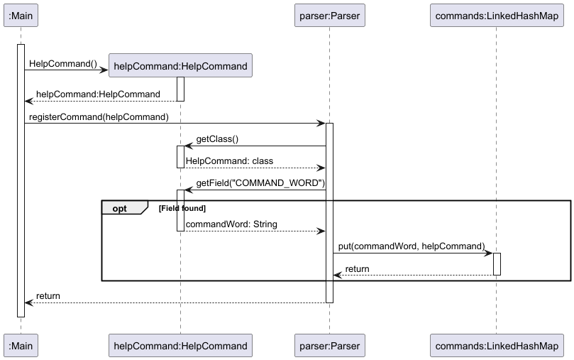
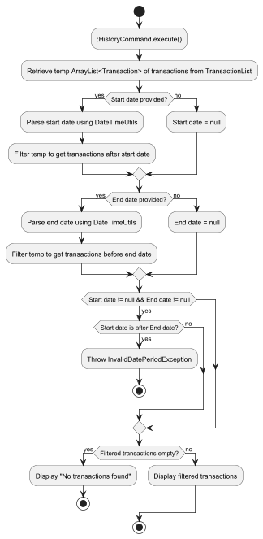

# Huynh Le Dan Linh - Project Portfolio Page

## Project Overview: uNivUSaver

uNivUSaver is a CLI-based software designed to help students develop better money management habits, aiming to prevent users from running out of money before the end of the month. It is written in Java.

### Summary of Contributions

#### Code contributed
* **Code contributed**: [RepoSense link](https://nus-cs2113-ay2425s1.github.io/tp-dashboard/?search=DanLinhHuynh&sort=groupTitle&sortWithin=title&timeframe=commit&mergegroup=&groupSelect=groupByRepos&breakdown=true&checkedFileTypes=docs~functional-code~test-code~other&since=2024-09-20)

#### MILESTONE 1.0
* **New component**: Added an abstract Command class to provide a template for commands and test [PR#26](https://github.com/AY2425S1-CS2113-W10-4/tp/pull/26).
* **New component**: Added the command parser and test to parse the input command [PR#28](https://github.com/AY2425S1-CS2113-W10-4/tp/pull/28).
* **New component**: Added the main class [PR#29](https://github.com/AY2425S1-CS2113-W10-4/tp/pull/29).
* **New feature**: Added `help` command and test [PR#30](https://github.com/AY2425S1-CS2113-W10-4/tp/pull/30).
* **New feature**: Added `view-category` command and test [PR#36](https://github.com/AY2425S1-CS2113-W10-4/tp/pull/36).
* **New component**: Added DateTime utilities [PR#38](https://github.com/AY2425S1-CS2113-W10-4/tp/pull/38).
* **New feature**: Added `view-expense` command and test [PR#48](https://github.com/AY2425S1-CS2113-W10-4/tp/pull/48).
* **New feature**: Added `view-income` command and test [PR#49](https://github.com/AY2425S1-CS2113-W10-4/tp/pull/49).
* **New feature**: Added `history` command and test [PR#50](https://github.com/AY2425S1-CS2113-W10-4/tp/pull/50).
* **New feature**: Added `bye` command and test [PR#52](https://github.com/AY2425S1-CS2113-W10-4/tp/pull/52).
* **Testing**:  Added system test [PR#53](https://github.com/AY2425S1-CS2113-W10-4/tp/pull/53).

#### MILESTONE 2.0  
* **Code quality**: Refactoring code (split nested commands into different functions and classes [PR#81](https://github.com/AY2425S1-CS2113-W10-4/tp/pull/81), [PR#82](https://github.com/AY2425S1-CS2113-W10-4/tp/pull/82).
* **New component**: Added messages utilities to provide standard, static messages to respond to different events [PR#113](https://github.com/AY2425S1-CS2113-W10-4/tp/pull/113).
* **Code quality**: Added custom exception classes for better debugging and exception handling [PR#130](https://github.com/AY2425S1-CS2113-W10-4/tp/pull/130).
* **Enhancement for existing features**: Added follow-up question for delete category [PR#126](https://github.com/AY2425S1-CS2113-W10-4/tp/pull/126).
* **Enhancement for existing features**: Update search command for partial match [PR#154](https://github.com/AY2425S1-CS2113-W10-4/tp/pull/154).
* **Testing**:  Updated system test [PR#139](https://github.com/AY2425S1-CS2113-W10-4/tp/pull/139).

#### MILESTONE 2.1
* **Debug**: Fixed indexing bugs of TransactionList to reduce confusion [PR#203](https://github.com/AY2425S1-CS2113-W10-4/tp/pull/203).
* **Enhancement for existing features**: Handle invalid start date - end date period of viewing history [PR#203](https://github.com/AY2425S1-CS2113-W10-4/tp/pull/203).  
  
#### Documentation
* **User Guide**:
  * Added brief documentation for all the features in v1.0 [PR#71](https://github.com/AY2425S1-CS2113-W10-4/tp/pull/71).
  * Added menu for User Guide and formatting [PR#95](https://github.com/AY2425S1-CS2113-W10-4/tp/pull/95), [PR#151](https://github.com/AY2425S1-CS2113-W10-4/tp/pull/151).
 
* **Developer Guide**:
  * Added implementation details of the `Parser`, `Command`,  `ViewHistory`, `Transaction` class [PR#82](https://github.com/AY2425S1-CS2113-W10-4/tp/pull/82), [PR#135](https://github.com/AY2425S1-CS2113-W10-4/tp/pull/135), [PR#224](https://github.com/AY2425S1-CS2113-W10-4/tp/pull/224).

#### Contributions to Team-based Tasks
* Set up GitHub team organization and repository.
* Maintained the issue tracker.
* Managed releases [v1.0](https://github.com/AY2425S1-CS2113-W10-4/tp/releases/tag/v1.0), [v2.0](https://github.com/AY2425S1-CS2113-W10-4/tp/releases/tag/v2.0).
* Documented Target user, Glossary, NFR and Manual test guide for DG [PR#114](https://github.com/AY2425S1-CS2113-W10-4/tp/pull/114), [PR#137](https://github.com/AY2425S1-CS2113-W10-4/tp/pull/137).

#### Community
* **Review/Mentoring Contributions**:
  * Added PR reviews: [PR#34](https://github.com/AY2425S1-CS2113-W10-4/tp/pull/34), [PR#51](https://github.com/AY2425S1-CS2113-W10-4/tp/pull/51), [PR#56](https://github.com/AY2425S1-CS2113-W10-4/tp/pull/56), [PR#57](https://github.com/AY2425S1-CS2113-W10-4/tp/pull/57), [PR#62](https://github.com/AY2425S1-CS2113-W10-4/tp/pull/62), [PR#67](https://github.com/AY2425S1-CS2113-W10-4/tp/pull/67), [PR#68](https://github.com/AY2425S1-CS2113-W10-4/tp/pull/34), [PR#94](https://github.com/AY2425S1-CS2113-W10-4/tp/pull/94)
* **Contributions Beyond the Project Team**:
  * Shared tip post on forum: [Link](https://github.com/nus-cs2113-AY2425S1/forum/issues/4)

### Contributions to the Developer Guide (Extracts)
* Added DG and diagrams for Command Parser

* Added DG and diagrams for ViewHistoryCommand

