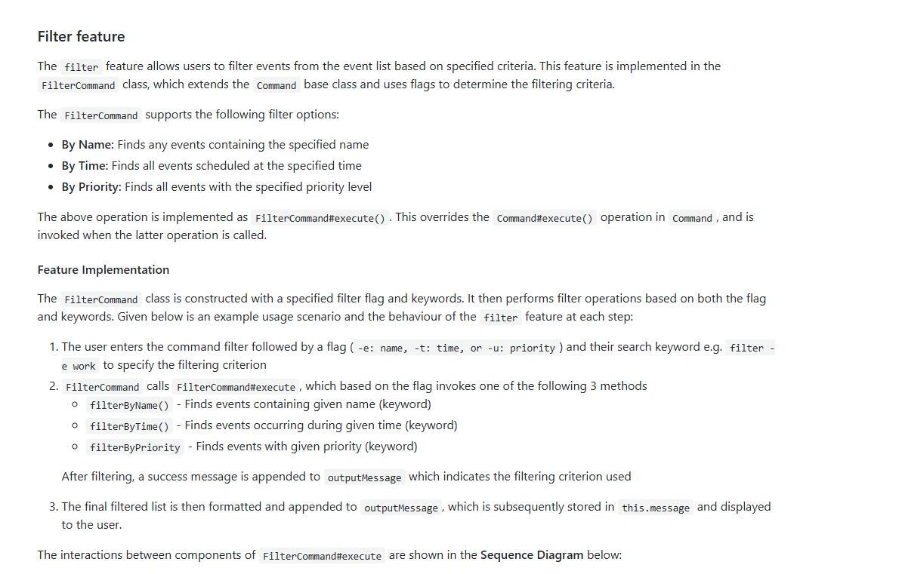
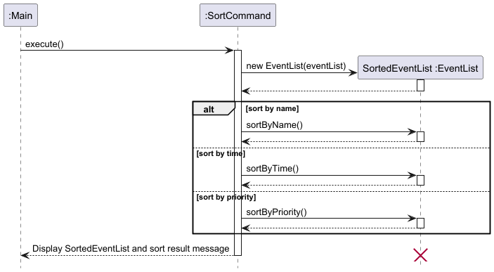
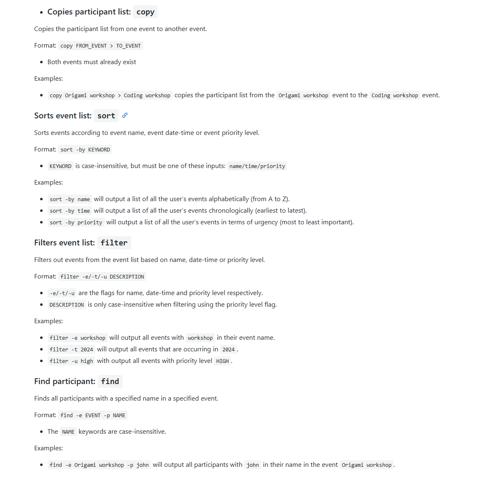

# Lim Tze Kang - Project Portfolio Page

## Overview
EventManagerCLI is a desktop CLI application meant for managing small-scale events organised by one person. It is written in Java, and has around 4kLoC.

## Summary of Contributions
* **New feature**: Added a participant list to each event and the ability to add and remove participants from said list. (PR [#53](https://github.com/AY2425S1-CS2113-W13-3/tp/pull/53), [#54](https://github.com/AY2425S1-CS2113-W13-3/tp/pull/54))
  * What it does: allows the user to add or remove participants from specific events.
  * Justification: This feature improves the product significantly as it allows the user to account for new people coming to their event or for people pulling out from their event.
  * Highlights: This feature required the modification of multiple existing classes, and significant changes had to be made in several areas (like in the command parsing) to enable this feature. It is essential for the application and was used and built upon by others as additional commands were implemented.

* **New feature**: Added the ability to copy participant lists from one event to another. (PR [#116](https://github.com/AY2425S1-CS2113-W13-3/tp/pull/116))
  * What it does: allows the user to duplicate participant lists in different events.
  * Justification: This feature improves the product significantly as it allows the user to quickly replicate similar/overlapping participant lists without having to manually re-enter each participant's information for each event.
  * Highlights: This feature required the creation of a new command class and significant changes had to be made in several areas (like for the command parsing) to enable this feature.

* **New feature**: Added the ability to search for specific participants in an event. (PR [#115](https://github.com/AY2425S1-CS2113-W13-3/tp/pull/115))
  * What it does: allows the user to find specific participants that are coming to their event.
  * Justification: This feature improves the product significantly as it allows the user to easily track a specific person's attendance or to find out his contact details.
  * Highlights: This feature required the creation of a new command class, new methods in existing classes and significant changes in other areas (like in the command parsing) to enable this feature.

* **New feature**: Added priority attribute to events. (PR [#110](https://github.com/AY2425S1-CS2113-W13-3/tp/pull/110))
  * What it does: allows the user to set the importance of their events.
  * Justification: This feature improves the product significantly as it allows the user to account for which events are more important or urgent.
  * Highlights: This feature required the creation of a new enumeration class and significant changes had to be made in several areas (like in the command parsing) to enable this feature. It was later used and built upon by others as additional commands were implemented.

* **New feature**: Added the ability to filter a list of events according to priority. (PR [#112](https://github.com/AY2425S1-CS2113-W13-3/tp/pull/112))
  * What it does: allows the user to look for events based on how important the event is.
  * Justification: This feature improves the product significantly as it allows the user to quickly find events that match their interests, saving them the time and effort of looking through a complete list.
  * Highlights: This feature required the creation of a new command class, new methods in existing classes and significant changes in other areas (like in the command parsing) to enable this feature. It was later built upon by others as additional filter functionalities were added.

* **Enhancements to existing features**:
  * Added parse methods for `Add`, `Remove`, `Filter`, `Find` and `Copy` commands.  (PR [#53](https://github.com/AY2425S1-CS2113-W13-3/tp/pull/53), [#54](https://github.com/AY2425S1-CS2113-W13-3/tp/pull/54), [#112](https://github.com/AY2425S1-CS2113-W13-3/tp/pull/112), [#115](https://github.com/AY2425S1-CS2113-W13-3/tp/pull/115), [#116](https://github.com/AY2425S1-CS2113-W13-3/tp/pull/116))
  * Added functionality to `sort` command so events can be sorted by priority. (PR [#110](https://github.com/AY2425S1-CS2113-W13-3/tp/pull/110))

* **Team-Based Tasks**:
  * General Code Enhancements: Update all functional code and tests cases etc after implementation of new priority attribute to event classes. (PR [#110](https://github.com/AY2425S1-CS2113-W13-3/tp/pull/110))
  * Bug Fixing (PR [#172](https://github.com/AY2425S1-CS2113-W13-3/tp/pull/172), [#234](https://github.com/AY2425S1-CS2113-W13-3/tp/pull/234), [#241](https://github.com/AY2425S1-CS2113-W13-3/tp/pull/241), [#247](https://github.com/AY2425S1-CS2113-W13-3/tp/pull/247))

* **Code contributed**: [RepoSense link](https://nus-cs2113-ay2425s1.github.io/tp-dashboard/?search=LTK&sort=groupTitle&sortWithin=title&timeframe=commit&mergegroup=&groupSelect=groupByRepos&breakdown=true&checkedFileTypes=docs~functional-code~test-code~other&since=2024-09-20&tabOpen=true&tabType=authorship&tabAuthor=LTK-1606&tabRepo=AY2425S1-CS2113-W13-3%2Ftp%5Bmaster%5D&authorshipIsMergeGroup=false&authorshipFileTypes=docs~functional-code~test-code&authorshipIsBinaryFileTypeChecked=false&authorshipIsIgnoredFilesChecked=false)

* **Project management**:
  * Managed release `v1.0` (1 release) on GitHub

* **Documentation**
  * User Guide
    * Added documentation for `copy`, `sort`, `filter` and `find` commands. (PR [#126](https://github.com/AY2425S1-CS2113-W13-3/tp/pull/126))
  * Developer Guide
    * Added implementation details for `filter` feature. (PR [#142](https://github.com/AY2425S1-CS2113-W13-3/tp/pull/142))
    * Created sequence diagrams for `copy`, `sort`, `filter` and `find` features. (PR [#129](https://github.com/AY2425S1-CS2113-W13-3/tp/pull/129))
 
     
* **Community**
  * PRs reviewed (with non-trivial review comments): [#156](https://github.com/AY2425S1-CS2113-W13-3/tp/pull/156), [#158](https://github.com/AY2425S1-CS2113-W13-3/tp/pull/158), [#249](https://github.com/AY2425S1-CS2113-W13-3/tp/pull/249), [#250](https://github.com/AY2425S1-CS2113-W13-3/tp/pull/250)
  * Helped teammate update PR to resolve merge conflicts and pass CI checks (PR [#118](https://github.com/AY2425S1-CS2113-W13-3/tp/pull/118), [#127](https://github.com/AY2425S1-CS2113-W13-3/tp/pull/127))

## Extracts

### Developer Guide

### User Guide

